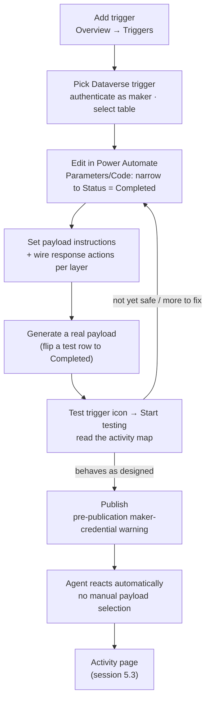

# Build & Deploy: The Return Follow-Up Trigger

Taking 5.1's design on paper into the actual trigger builder — configuring it, testing it while it still can't act on its own, and finding out exactly what changes the moment you hit Publish.


5.1 designed a trigger. It has never once fired. Nothing in Copilot Studio's autonomous-agent tooling reacts to anything until you take one specific, one-way action — and this session is about everything that happens before and after you take it.


## Where 5.1 left off

Northwind wants an agent that notices a return marked **Completed** in Dataverse and follows up without a person remembering to check. 5.1 designed the whole thing on paper: a Dataverse row-change trigger scoped to that one status transition, a payload instruction kept narrow rather than folded into the agent's general instructions, and three response actions sorted into three decision-boundary layers — sending a satisfaction survey with no confirmation, drafting a goodwill discount code that needs a human's sign-off, and never letting the agent touch the original return record at all.

None of that has been built yet. A design is a set of decisions about what _should_ happen; it isn't wired to anything that can act. This session closes that gap — and in closing it, runs into a handful of things the design phase couldn't have surfaced, because they only exist in the builder itself.

## Part 1 — Adding the trigger

Microsoft's own build guide for event triggers lays out a fixed sequence, worth following in order rather than jumping ahead:



### Open the Triggers section

On the agent's **Overview** page, go to **Triggers** and select **Add trigger**.



### Pick the Dataverse trigger

From the available trigger library, choose the Dataverse trigger — documented as **"When a row is added, modified or deleted."** This is the same connector-backed trigger infrastructure 5.1 named, now as an actual list of choices instead of a paragraph describing it.



### Authenticate

Provide connection details if asked. This step only ever uses **the agent maker's own credentials** — there's no option to authenticate as anyone else, which is 5.1's authentication limitation showing up as a concrete screen rather than an abstract warning. Select **Next**.



### Select the table

Point the trigger at Northwind's Returns table. This is the one parameter Copilot Studio's own trigger picker actually exposes for this trigger type: **which table's changes activate it** — not which column, not which value. That gap matters enough to its own callout below.



### Set the payload and instructions

The default payload is **"use content from Body"** — the whole changed row, unfiltered. Replace the instruction with the narrow one 5.1 designed: _a return just completed; here is the order ID and the customer's contact info_, leaving what to actually do about it to the agent's general instructions.



### Wire the response actions

Define which topics or actions the agent should call once the trigger fires, and give it instructions for choosing between them. This is where 5.1's three decision-boundary layers get built, not just described — see Part 2 below.




**Worth slowing down for.** The trigger picker's one configurable parameter is the table. There's no field anywhere in that flow for "only when the Status column changes to Completed." Microsoft's own documentation is explicit that finer configuration happens somewhere else entirely: select the trigger's **⋯** menu, choose **Edit in Power Automate**, and the **Parameters** and **Code** tabs there are where trigger conditions actually live — the same place Power Automate has always put them, one layer beneath the Copilot Studio surface. Skip this step and the trigger does exactly what it looks like it does in the picker: it fires on _every_ change to _any_ row in Returns, not just a status flip to Completed — the opposite of the narrow, input-validated trigger 5.1's guardrails called for.


## Part 2 — Wiring three decision-boundary layers into one response

5.1 sorted three actions into three layers on paper. Built, each layer takes a genuinely different shape — none of them look like "the same topic, gated differently":

| Action                                           | Layer         | What actually gets built                                                                                                                                                                                           |
| ------------------------------------------------ | ------------- | ------------------------------------------------------------------------------------------------------------------------------------------------------------------------------------------------------------------ |
| Send a satisfaction survey                       | AI harness    | A topic the trigger's instructions call directly. No approval step, no pause — the same shape as any topic a conversational turn would call.                                                                       |
| Issue a goodwill discount on a negative response | Hybrid        | An agent flow using 4.2's Request information/Approval action, with **Asynchronous response** turned on so the flow can sit open waiting for a reviewer's decision without timing out the run.                     |
| Delete or modify the original return record      | Deterministic | Not a topic, not a flow, not anything the trigger's instructions can reach. The guardrail here isn't a check inside a built action — it's the absence of an action to check. Nothing was built that could do this. |

That last row is worth sitting with. Every other guardrail in this course — least-privilege scoping, input validation, an approval gate — is a control wrapped _around_ a capability that exists. This one is different: the safest version of "the agent can never delete the return record" isn't a well-guarded delete action, it's no delete action at all. 5.1 called this "not even exposed to the planner"; building it just means never building it.

## Part 3 — Testing a trigger that still can't act on its own

Here's the fact that testing an autonomous agent runs into immediately: **until you publish, the agent does not react to anything automatically.** A completed return sitting in Dataverse right now, with the trigger fully built, changes nothing by itself. Testing has to manually stand in for the event that will eventually fire it.



### Generate a real payload

Run the actual triggering event once — flip a test return's status to Completed in Dataverse, the same way you'd assign yourself a Planner task to test a Planner trigger.



### Open the test trigger tool

On the Overview page, select the **Test trigger** icon beside the trigger. It lists recent instances of the event — including the one just generated.



### Start testing

Choose that instance and select **Start testing**. This manually hands the agent the payload it would otherwise only receive after publish.



### Read the activity map

The map icon at the top of the test pane shows exactly how the agent reacted: which topic or flow it called, in what order, for that one payload. This is the same activity-trace idea Groups 2–4 used for conversational topics, applied to a payload instead of a typed message.



Test every layer this way before moving on — including the hybrid one. A test run that reaches the Request information/Approval step should actually sit there waiting, the same way it will in production, so the async pause gets exercised, not just the survey-sending path that happens to finish quickly.

## Part 4 — Publishing

Publishing does two things at once for an agent with event triggers, and only one of them is the general "make my changes live" behavior every agent shares. Publishing updates the agent on every connected channel simultaneously, and existing conversations aren't disrupted — the new version only applies to new sessions, and Teams or Omnichannel users may not see it for up to an hour. None of that is specific to triggers.

What _is_ specific to triggers is the warning Copilot Studio shows before that publish completes: event triggers authenticate with the agent maker's own credentials, which means anyone able to message the published agent could reach whatever those credentials can reach — the exact consequence 5.1 named in the abstract, now the literal text standing between you and the Publish button.

Click through it, and the switch flips. The agent reacts automatically from then on, every time the trigger condition is met, with no one selecting a payload instance by hand. Every one of those automatic reactions gets a step-by-step record on the agent's **Activity** page — the page 5.3 is entirely about learning to read.

## Build, test, publish — the full pipeline

## What's still open

Everything built and tested this session; nothing observed in production yet. The trigger has fired exactly as many times as this session manually told it to, via the test pane. What happens over real days and weeks — how often it actually fires, whether the hybrid approval step gets answered promptly, whether the survey topic behaves the same way at 3am as it did in a manual test — is 5.3's monitoring and governance job, not this one's.


**Key takeaway.** A trigger that passes every manual test still isn't autonomous — Publish is the one-way switch that turns "I can make this fire" into "this fires without me," and the pre-publication warning exists because that switch is exactly as safe as the decision boundaries built around it, no safer.


## Check your retrieval



You've picked the Dataverse trigger and selected the Returns table. Can you also restrict it in that same screen to fire only when Status changes to Completed?



**No — the trigger picker only lets you choose the table; column-level filtering requires Edit in Power Automate's Parameters/Code tabs.** Copilot Studio's own trigger picker exposes exactly one parameter for the Dataverse row-change trigger: which table. Narrowing it to a specific column value change means using the trigger's Edit in Power Automate option.





You've built and thoroughly tested the trigger using the Test trigger icon. A real return is marked Completed in Dataverse right now, before you've clicked Publish. What happens?



**Nothing — until the agent is published, it doesn't react to real events automatically.** Only a manually selected payload instance in the test pane triggers a response before that point; a real, unrelated event happening in Dataverse does nothing on its own.





Northwind's build never wires a delete-or-modify action to the return-follow-up trigger at all. Which guardrail does this represent, and why build it this way instead of adding a delete action with an approval gate?



**The deterministic layer, implemented as the absence of a reachable action.** The safest version of "never delete this" is nothing built that could — an approval gate still means the AI decided to ask, which is a weaker guarantee than an action that was never wired in at all.





What does Copilot Studio's pre-publication warning for an agent with event triggers specifically call out?



**That event triggers authenticate only with the maker's own credentials, so anyone who can message the published agent could reach whatever those credentials can reach.** This is 5.1's maker-credentials limitation, now encountered as a concrete pre-publish checkpoint.



## Reflection

Your trigger passed every manual test before you published it. A return completes for real at 11:58pm, three days later. What, specifically, changed about the agent's behavior between "tested" and "published" that makes that automatic follow-up possible — and what from this session would you still want checked before trusting it happened correctly?


**ONE REASONABLE ANSWER** Before publish, nothing links a real Dataverse change to the agent at all — the connection only existed through you, manually selecting a payload instance in the test pane. Publish is what makes the trigger listen for real events instead of ones you hand-pick. That's the whole behavior change; nothing about the trigger's logic, payload, or response actions is different post-publish from what was tested. What you'd still want checked isn't whether it fired — it's whether it did the _right_ thing at 11:58pm with no one watching: did the hybrid approval step actually pause and wait rather than silently skip, did the survey topic reach the correct customer contact, and does the Activity page (5.3) show a clean run or a quiet failure. Testing proves the design works when you're driving it. Only the activity log proves it worked when you weren't.


## Read next

[Add an event trigger](https://learn.microsoft.com/en-us/microsoft-copilot-studio/authoring-trigger-event) — the step-by-step build, test, and publish procedure this session is built on. Also verified this session: [Key concepts: publish and deploy your agent](https://learn.microsoft.com/en-us/microsoft-copilot-studio/publication-fundamentals-publish-channels). Reused from 5.1, not re-fetched: [Event triggers overview](https://learn.microsoft.com/en-us/microsoft-copilot-studio/authoring-triggers-about) and 4.2's Request information/Approval + Asynchronous response mechanics.
