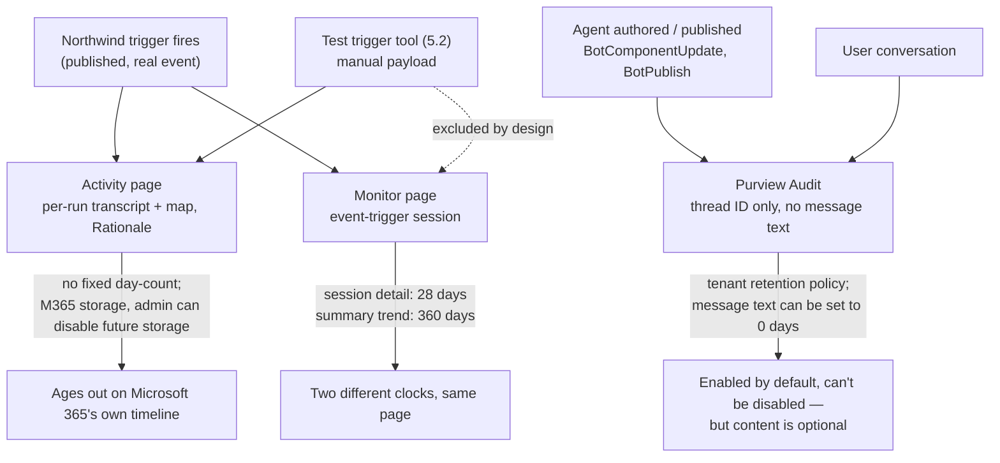

# Monitoring and Governing Autonomy

5.2 published a trigger that acts without anyone in the room. This session is about finding out what it actually did — and discovering that "audit logging and monitoring," the guardrail category 5.1 named and moved past, is really three separate tools, on three separate clocks, answering three separate questions.


5.1 listed four guardrail categories: least privilege, input validation, hard-coded fail-safes, and audit logging and monitoring. The first three got built into the Northwind trigger in 5.2. The fourth got a name and nothing else. It's time to cash that one in — and it turns out to be the least single-purpose of the four.


## Two different questions, and why one tool can't answer both

"Monitor the agent" sounds like one job. It splits into two the moment the trigger actually fires for real. Sometimes you want to know exactly what happened in _one_ run — which action fired, what the payload said, whether the hybrid approval step actually paused. Other times you want to know how the agent has been doing _overall_ — how often it fires, what fraction of runs finish clean, whether satisfaction is trending down. Those aren't the same question asked at different zoom levels. They're answered by different pages, built on different data, kept for different lengths of time.

A third question sits outside both: not "what did the agent do" but "who changed the agent, and is there a compliance-grade record of that." That one lives somewhere else entirely — outside Copilot Studio, in Microsoft Purview.

## Part 1 — The Activity page: reading one run

The Activity page is Copilot Studio's real-time record of individual runs. Its own stated purpose: review the interactions and decisions an agent made during an activity, find where its behavior didn't match your goals, see how long it took, and find error details.

Every row in the activity list carries: **Name** (the user interacting with the agent — or, when nothing prompted it, literally `Automated`), **Channel**, **Date**, **Completed steps**, **Last step**, and **Status** (successful, failed, or in progress). Two view modes exist: **Transcript + Map** (the default, showing the conversation or payload alongside a visual activity map) and a map-only view for just the decision flow.

Four kinds of activity feed this list, and the fourth is the one Group 5 has been building toward: test-chat interactions, agents published to Teams/Microsoft 365 Copilot, agents published to SharePoint, and — the one that matters here — **activity that started from an autonomous trigger**.

Apply it to Northwind: the moment a real return flips to Completed in Dataverse and the published trigger fires on its own, that run lands in the Activity list with **Name: Automated** — nobody typed anything, so there's no user name to show. Open Transcript + Map, and instead of a person's message you see the trigger payload itself: the order ID and contact info 5.1 designed the payload instructions around. Click into the hybrid discount flow's node and you get inputs and outputs, an option to edit the configuration, and — for a completed knowledge or connector node specifically — an AI-generated **Rationale** explaining why the agent chose that tool.


**Worth slowing down for.** Two limits on what the Activity page can show you, not just how to read it. First: **"Generative orchestration activities within a topic don't appear in the activity map."** The map traces which topics and actions ran and in what order — it doesn't open up what a generative-orchestration decision did _inside_ one of those steps. Second: viewing historical activity requires a Microsoft Exchange license and an inbox, because the data is stored using Microsoft 365 services — services Azure's own data terms and commitments don't govern. An admin can stop future storage entirely through the Power Platform admin center's data-movement setting. Unlike the Monitor page below, the docs don't quote a fixed number of days the Activity page keeps a run visible — it depends on how long that Microsoft 365 storage holds it, and on whether an admin has turned future storage off.


## Part 2 — The Monitor page: reading the pattern

Open the agent and select **Monitor** on the top menu to get "comprehensive data for your agent, from an overview of key metrics to in-depth usage analytics." Where the Activity page is one run at a time, Monitor is the aggregate: active users, topic outcomes (`Escalated`, `Resolved`, `Abandoned`), satisfaction score trends, and an AI-generated summary of engagement and sentiment. All timestamps are UTC.

Monitor also has its own definition of a "session" — and it's not one definition, but two, because Northwind's agent now runs both kinds. A **conversational session** tracks a specific user's ongoing interaction and times out after 30 minutes of inactivity (3 minutes for telephony, after an explicit End Conversation event); in classic mode it's associated with the last custom topic a user triggered. An **event-trigger session** — the kind 5.2's build produces — tracks from the moment the agent receives a trigger payload through whatever actions it runs in response. Because Northwind's agent has both conversational topics from earlier groups and the new event trigger, its Monitor page shows a **hybrid view**: the Overview and Effectiveness sections display conversational and autonomous metrics side by side rather than picking one.


**Worth slowing down for.** Monitor runs on _two different clocks at once_, not one. Aggregate summary metrics — the counts, the trend lines, the satisfaction scores — are available for up to **360 days**. But the moment you try to drill into a specific session's detail or transcript from Monitor, that window shrinks to the **last 28 days** only. A three-month-old spike in failed event-trigger sessions will still show up as a bump on the trend line; the actual transcript explaining what went wrong in any one of those old sessions won't. And none of it includes anything you ran through 5.2's Test trigger tool — **"the Monitor page doesn't show analytics for activity you complete when you test your agent."** Every test run from last session is invisible here by design; the Activity page is the only place those still live.


One more real gap between a trigger failing and a trigger merely running badly: **"if a trigger fails and the agent doesn't receive a trigger payload, an analytics session can't begin."** A run that never started doesn't show up as a failed session in Monitor — it doesn't show up at all, which looks identical to "nothing happened," not "something went wrong."

## Part 3 — Outside the agent: Microsoft Purview audit logs

The Activity and Monitor pages both live inside Copilot Studio and both answer "what did the agent do." Auditing lives in Microsoft Purview and answers a different question: who changed this agent, and is there a durable, compliance-grade record of it. Sign in to [purview.microsoft.com](https://purview.microsoft.com/) as a tenant admin, open **Solutions → Audit**, and filter for Copilot Studio activity.

Two categories of event get logged. Authoring events cover changes to the agent itself — `BotCreate`, `BotDelete`, component create/update/delete, environment-variable changes, and, notably, `BotUpdateOperation-BotPublish`: the exact moment 5.2 clicked through the pre-publication warning and made the trigger live is its own permanent audit entry. Usage is covered by a single event, `CopilotInteraction`, logged whenever a user interacts with the agent.


**Worth slowing down for.** "Administrative activities for Copilot Studio are enabled by default on all tenants. You can't disable activity collection." That's a stronger guarantee than either Copilot Studio page above — an admin can turn off future Activity-page storage, and Monitor already excludes test runs by design, but the authoring audit trail itself is not optional. What _is_ optional, and easy to assume otherwise, is the content: "the audit logs in the Audit solution don't include the full text or transcript of the interactions between a user and the agent, only the transcript thread ID." Reading message text back out requires a separate solution, Data Security Posture Management (DSPM) for AI — and an admin can independently zero out retention of message text entirely via a Data Lifecycle Management policy set to 0 days. A `CopilotInteraction` row proves an interaction happened. It doesn't, by itself, prove what was said.


### A same-word trap, flagged rather than smoothed over

Searching current docs for "activity" in Copilot Studio turns up a second, newer feature: **activity trace**, a chain-of-thought view for agents built on what Microsoft calls the **GitHub Copilot harness**, currently in Preview, billed through Copilot Credits. It is a genuinely different feature — its own node types (User message, Agent response, Knowledge, Ran action, Tool, Connector, Flow, Skill, Error), its own docs path, its own harness. This course's agents run on the harness Group 1 covered — the one whose third decision-boundary layer 5.1 corrected from "AI orchestrator" to "AI harness." That's now two unrelated things both called a "harness" in Microsoft's current documentation, plus a differently-named "activity trace" feature that has nothing to do with the "activity map" this session is about. None of this course's builds use the GitHub Copilot harness or its trace view — every "Activity page" reference above is the classic one, and it's worth keeping those apart on purpose the next time either term shows up in Microsoft's docs.

## Which tool answers which question

| Question                                      | Activity page                                       | Monitor page                              | Purview audit                                               |
| --------------------------------------------- | --------------------------------------------------- | ----------------------------------------- | ----------------------------------------------------------- |
| What exactly happened in one run?             | Yes — full transcript + map, per run                | No — aggregate only                       | No — not even message text                                  |
| How is the agent trending over time?          | No — one run at a time                              | Yes — up to 360 days summary              | No                                                          |
| Who changed or published the agent, and when? | No                                                  | No                                        | Yes — permanent, can't be disabled                          |
| Includes manual test-panel runs?              | Yes                                                 | No — explicitly excluded                  | Not documented either way — not asserted here               |
| Retention                                     | Governed by M365 storage; no fixed day-count quoted | 360 days summary / 28 days session detail | Set by tenant retention policy — message text can be 0 days |

## Worked example — reading Northwind's first real firing



### Find the run

Open the Activity page and look for the entry with **Name: Automated** and a recent Date — that's the trigger firing on its own, not a test run you started by hand.



### Read the transcript

Switch to Transcript + Map. In place of a typed message, the transcript shows the trigger payload — order ID and customer contact — exactly as 5.1 scoped the payload instructions to carry.



### Check the hybrid layer specifically

Click into the discount flow's node. Confirm the Request information/Approval step actually shows as completed, not skipped, and read the Rationale if the node's status is Completed — it's the model's own explanation for why it called that flow.



### Confirm it registered as a session

Switch to Monitor and look for a new event-trigger session in the hybrid Overview/Effectiveness view. If it's missing entirely — not failed, just absent — that's the "trigger never delivered a payload" case, not a bad run.



### Note the clock you're on

This per-run transcript is only guaranteed for as long as Activity's own storage holds it, and Monitor's own session-level detail ages out after 28 days regardless. If this run matters months from now, the aggregate trend on Monitor is what survives — the transcript you just read might not.



## Three lenses, three clocks

## Closing Group 5

5.1 designed three decision-boundary layers on paper. 5.2 built each into a genuinely different shape — including the deterministic layer, built as no action at all rather than a guarded one. This session closes the loop by pointing every one of this course's monitoring tools at that build and asking what they can actually confirm. The honest answer: quite a lot about what the agent _did_, and nothing about what it was never capable of doing. An unbuilt delete action doesn't show up as a blocked attempt in the Activity page, a failed session in Monitor, or a denied operation in Purview — it just never appears, which looks exactly like nothing having been attempted. Proof that the deterministic guardrail holds still has to come from the build record itself, not from watching the agent run.


**Key takeaway.** "Audit logging and monitoring" was never one guardrail — it's the Activity page for one run, the Monitor page for the trend, and Purview for who touched the agent and when, each on its own clock, and none of the three can prove a capability was never built. That has to be true from the design itself.


## Check your retrieval



Northwind's return-follow-up trigger fires for real for the first time, with no human involved. What appears in the Activity page's Name column for that run, and why?



**Automated** — the activity list shows this whenever the activity doesn't involve a user prompting it, such as an agent acting on its own.





Which statement about Monitor page data retention is accurate?



**Aggregate summary metrics are available for up to 360 days, but drilling into session detail and transcript information is limited to the last 28 days.** Monitor runs on two clocks, not one — a narrower window than the page's own headline number suggests.





The Northwind trigger appears to fail silently — a return is marked Completed, but no event-trigger session shows up in Monitor at all, not even as a failure. What does the documentation say is the most likely explanation?



**If a trigger fails and the agent never receives a trigger payload, an analytics session can't begin at all.** The absence looks identical to "nothing happened," not to a recorded failure.





A compliance reviewer finds a CopilotInteraction entry in the Microsoft Purview Audit log for a specific Northwind conversation. Can they read what the customer actually said from that log entry?



**No — the Audit log entry includes only the transcript thread ID, not the message text.** Reading the actual content requires a separate solution (DSPM for AI) or the Activity page, while its data still exists.



## Reflection

5.1 named "audit logging and monitoring" as a single guardrail category. This session found three separate systems instead, each answering a different question on a different clock. If your goal is to prove that the deterministic guardrail from 5.2 — no delete-or-modify action ever wired to the trigger — was never bypassed, which of the three tools actually proves that, and which of them can't?


**ONE REASONABLE ANSWER** None of them can prove it directly, and that's the point. The Activity page would show a delete action firing if one existed and ran — it can't show the absence of an action that was never built, because there's no node to click into. Monitor would show a failed or unusual session if a delete attempt had been blocked — it has nothing to aggregate when no such attempt is even possible. Purview would log a component change if the delete action were later added to the agent's build — it has no event for "this capability continues not to exist." All three tools answer "what happened," and "it never happened because it was never built" doesn't produce an event in any observation system; it only shows up by reading the build itself, the way 5.2's own record of what was and wasn't wired in is the actual evidence. Monitoring proves behavior. It doesn't prove capability limits — those still have to be verified at the design and build layer, not the observation layer.


## Read next

[Review agent activity](https://learn.microsoft.com/en-us/microsoft-copilot-studio/authoring-review-activity) — the full Activity page reference this session is built on. Also verified this session: [Analytics overview (Monitor)](https://learn.microsoft.com/en-us/microsoft-copilot-studio/analytics-overview), [Admin logging for Copilot Studio](https://learn.microsoft.com/en-us/microsoft-copilot-studio/admin-logging-copilot-studio), and, to confirm the same-word trap above is a genuinely different feature, [Use the activity trace to debug your agent](https://learn.microsoft.com/en-us/microsoft-copilot-studio/agents-experience/authoring-activity-trace).
