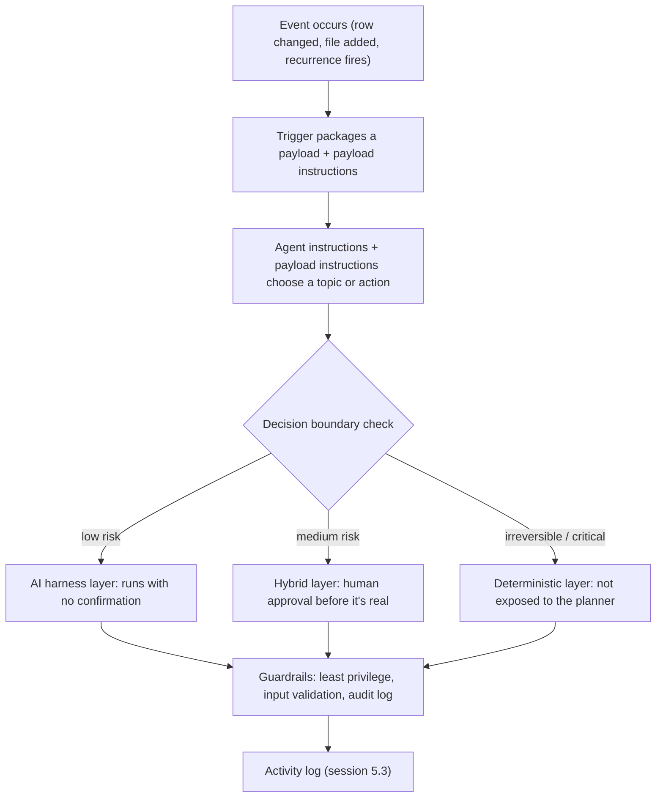

# Triggers, Boundaries, and Guardrails

Every lesson in Groups 1 through 4 has been about an agent that waits. It waits for a user to type something, then picks a topic, or asks a knowledge source, or calls a tool, and answers. No message, no action. That's the whole shape of it.


**Session 5.1 of Group 5 - Agentic Behavior: Autonomous Agents.** First session, opening the group. 5.2 builds and publishes what this session designs; 5.3 monitors it once it's live.


This session breaks that shape. An autonomous agent in Copilot Studio doesn't wait for a person to start the conversation. It starts itself, in response to something happening somewhere else: a row changing in Dataverse, a file landing in OneDrive, a clock ticking over to 9 AM on a Monday. This is the pivot the mission has been pointing at since session 1.1. An agent that only answers questions is, in your own words, a library. An agent that notices something happened and does something about it, on its own, at 2 AM, with nobody asking, is closer to a skill being exercised than a fact being recited.

Copilot Studio doesn't hand you that capability and walk away, though. Every autonomous trigger you build forces you to answer three questions: what starts it, what is it actually allowed to do, and how do you find out if it did something wrong. Those are this session's three parts: triggers, decision boundaries, and guardrails.

## Part 1 - What starts an autonomous agent

A conversational agent is started by a topic trigger: a user types something that matches a trigger phrase, or the generative planner matches their intent to a topic's description. An event trigger works differently. It's tied to an event external to the agent entirely. Something happens in a connected system, a connector notices, and it hands the agent a _trigger payload_: a package of information about what happened, plus instructions for what to do about it.

The mechanics are the same for every event trigger, no matter which system raised the event:

1. An event occurs - a row is added to a Dataverse table, a file appears in OneDrive, a recurrence schedule fires.
2. The trigger packages that event into a payload and sends it to the agent as a message.
3. The agent, using its instructions plus whatever instructions rode along in the payload, decides which topic or action to call in response.

Copilot Studio ships with a library of these triggers, built on the same connector infrastructure that session 4.1 covered for tools. A few examples: a row added, modified, or deleted in a Dataverse table; an item created in SharePoint; a file created in OneDrive; a task completed in Planner. And one trigger isn't tied to any external system at all: **Recurrence**, which fires purely on a schedule you set (every 15 minutes, every Monday at 9 AM, the first Friday of the month).

What actually shows up in that payload matters more than it looks at first glance. Every trigger has a _default_ payload; for the Dataverse row trigger, it's literally "use the content from Body." But you can add your own instructions to it, and those instructions can be far more specific than anything you'd want to write into the agent's general instructions. That matters because most real agents end up with more than one trigger attached, each meaning something different. Try to handle all of that in the agent's general instructions and you end up with one long, tangled paragraph trying to cover every trigger's logic at once, and the agent has a harder time telling which part applies to which event.

The documentation's own example makes the split concrete. Say you're building an agent that watches a Dataverse table for new account rows and flags duplicates.

| Approach                                     | What it says                                                                                                                                                                                                             |
| -------------------------------------------- | ------------------------------------------------------------------------------------------------------------------------------------------------------------------------------------------------------------------------ |
| All in agent instructions                    | "When a new row is added, check if it's a duplicate account. If there's a duplicate, create a to-do task to investigate, and include details about the changes and duplicates."                                          |
| Split between payload and agent instructions | Trigger payload: "Look for duplicate account names in the same Dataverse table." Agent instructions: "If there's a duplicate, create a to-do task to investigate, and include details about the changes and duplicates." |

Both produce the same behavior for this one trigger. The second version is the one that scales. Add a second trigger with a completely different job, and its own payload carries its own specific instructions, while the agent's general instructions stay about what to do with a result, not about parsing every event type that could show up.


**Worth slowing down for.** Event triggers can only authenticate using the agent maker's own credentials - the credentials you, the author, used when you connected the trigger. There's no concept of "the end user's credentials" for an event trigger, because there's no end user in the loop when the trigger fires. Practically, every action or topic your autonomous agent calls has to work with maker authentication and no user prompt involved - if an action is configured to ask a user to sign in, and there's no user present because a trigger fired at 2 AM, the agent simply can't continue. And the flip side, stated directly in Microsoft's own guidance: because the agent is always acting with the maker's permissions, anyone who can interact with a published agent that has event triggers attached can potentially reach whatever the maker's credentials can reach. That's exactly why decision boundaries and guardrails (the next two parts) aren't optional add-ons for autonomous agents. They're what stands between convenient automation and everyone who can message this agent having the maker's access.


There's a second cost worth knowing before you get trigger-happy: event triggers count as billed messages. A recurrence trigger firing every 10 minutes sends a trigger payload, a message, every 10 minutes, all day, whether or not anything interesting happened. Fire triggers too often and you can hit service quota limits on top of the credit cost. Neither of those is a reason to avoid triggers. It's a reason to make the recurrence interval and the trigger's filter conditions as tight as the scenario actually needs, not as loose as would technically work.

## Part 2 - What it's allowed to do: decision boundaries

Handing an agent the ability to act on its own raises the obvious next question: act on its own to do _what_, exactly? Copilot Studio's own guidance for production-grade agents is blunt about this: don't leave every decision to the AI. It describes three layers of control that sit between "the AI improvises" and "nothing happens without a human." Part of designing an autonomous agent is deciding, action by action, which layer each one belongs in.

| Layer              | What it means                                                                                                         | Where it belongs                                                                                                           |
| ------------------ | --------------------------------------------------------------------------------------------------------------------- | -------------------------------------------------------------------------------------------------------------------------- |
| Deterministic      | A strictly authored topic or flow runs exactly the same way every time. No room for the planner to reinterpret it.    | Mission-critical or irreversible actions - processing a payment, deleting a record. Often not even exposed to the planner. |
| Hybrid (intercept) | The AI does the work, but a checkpoint sits in the path - a manager's approval, an escalation past a value threshold. | Medium-risk work: let the model do the heavy lifting, then put a human in front of the consequence before it's real.       |
| AI harness         | Fully generative. The planner is bound by whatever policies you've set, but doesn't stop to ask permission.           | Lower-risk work - most Q\&A, lookups, and simple multistep requests.                                                       |


Session 1.2 first introduced this three-layer model and recorded the third layer as the "AI orchestrator layer." Re-checking the primary source live for this session shows Microsoft's current text calls it the **AI harness layer** - same layer, corrected term used from here on. See the glossary for the full correction note.


None of this happens on its own. You enforce it with the same building blocks you already know: a confirmation node in a topic, an approval step built with 4.2's Request Information/Approval action, or simply which actions you choose to expose to the planner at all versus which ones you wrap behind a deterministic topic. The guidance frames the actual design task as one question, asked separately for every action and topic an autonomous agent might reach: can this run with zero confirmation, does it need the user (or whoever's on the other end of the trigger) to confirm in the moment, or does it need an approval workflow before it's real? Asking and answering that question for each action is what a decision boundary actually is.

## Part 3 - How you make sure it stays inside the lines: guardrails

Decision boundaries decide _what_ an agent is allowed to reach for. Guardrails are the practical, mostly security-shaped controls that make sure it doesn't reach further than that, and that you'd find out if it tried.

* **Least-privileged access.** Give the agent only the permissions the job needs. If it only needs to read a table, don't also grant it write access. Narrowing the blast radius is the whole point, and it costs you nothing the agent was actually going to use anyway.
* **Input validation and authenticity.** A trigger fires because something happened, but "something happened" is only trustworthy if you've checked it's real. If an agent reacts to incoming email, verify the sender or look for specific expected content, otherwise an attacker only needs to spoof an email to spoof a trigger.
* **Robust guardrails and fail-safes.** Put hard limits directly into the agent's instructions, something like "only send an email after checking a knowledge source," rather than trusting the model to infer that limit on its own every time.
* **Audit logging and monitoring.** Keep a record of every trigger received, every decision made, and every action taken. This is what makes it possible to notice, and explain, when something's gone wrong, and it leads straight into session 5.3's monitoring tools.

Put together with Part 1's authentication limitation, the whole session turns out to be one argument rather than three separate topics. Triggers decide what can start the agent with nobody watching. Decision boundaries decide how much of what happens next needs a human before it's real. Guardrails are what confirm, after the fact, that the first two actually held.

## Worked example - designing (not yet building) a Northwind return follow-up

Session 5.2 will build this. This session designs it, which is the actual point: get the trigger, the boundaries, and the guardrails right on paper before there's a live agent capable of acting on a bad design.

**The scenario:** Northwind wants an agent that notices when a return is marked complete in its order system and follows up automatically, instead of a human remembering to check.

**The trigger:** a Dataverse row-change trigger, watching the Returns table for a status change to "Completed." The payload instruction stays narrow and specific - "a return just completed; here is the order ID and the customer's contact info" - rather than folding that logic into the agent's general instructions, for the same reason the duplicate-account example did it that way in Part 1.

**The decision boundaries, action by action:**

| Action the agent could take                                       | Layer                                        | Why                                                                                                                                  |
| ----------------------------------------------------------------- | -------------------------------------------- | ------------------------------------------------------------------------------------------------------------------------------------ |
| Send a satisfaction survey to the customer                        | AI harness - no confirmation                 | Low stakes, easily reversible (it's an email) - exactly the kind of routine follow-up autonomy exists for                            |
| Issue a goodwill discount code if the survey response is negative | Hybrid - drafted, then human-approved        | Real cost to the business; a wrong call has a dollar value attached                                                                  |
| Delete or modify the original return record                       | Deterministic - never exposed to the planner | Irreversible change to a system of record - not a decision an autonomous trigger should ever be one bad instruction away from making |

**The guardrails:** the trigger fires only on the specific status transition, not on every row change - the input-validation half of Part 3, applied directly. The survey-sending action is scoped to read the customer's contact field and nothing else in the row - least-privileged access. And every run - trigger received, survey sent or discount drafted, human approval given or withheld - lands in the activity log, exactly what session 5.3 will teach you to actually read.

## What's still open

Two things this session deliberately leaves alone, because they belong to the next two sessions instead of this one:

* **How you actually build and publish this trigger.** The connector authentication flow, the payload editor, testing a trigger before it's live. That's 5.2's job.
* **How you'd know, a week later, whether this trigger is doing what you designed it to do.** Success rates, which triggers fire and how often, tool and knowledge-source usage inside a triggered run. That's 5.3's job, and it uses the Monitor page and the activity map, both of which get their first real mention here and their full treatment there.

## Check your retrieval



An agent's Recurrence trigger checks a table every 10 minutes, all day. What's true about this, according to the session?



**It sends a billed trigger payload every 10 minutes whether or not anything changed.** Event trigger activity counts as billed messages. A 10-minute recurrence fires a payload - a message - every 10 minutes all day, regardless of whether anything interesting happened, which is also how it can run into quota limits if set too aggressively.





A return-approval refund is drafted by the agent but requires a manager's sign-off above a dollar threshold before it sends. Which decision-boundary layer is this?



**The hybrid (intercept) layer.** This is exactly that shape: the AI does the drafting work, but a checkpoint - a manager's approval, an escalation past a threshold - sits between the draft and the real-world effect.





Why can't an autonomous agent's trigger-driven action stop mid-run to ask a user to sign in?



**Event triggers can only authenticate with the agent maker's own credentials - there's no end user in the loop when a trigger fires.** If an action is configured to prompt a user for sign-in and no user is present, the agent can't continue. This is also why anyone who can message a triggered agent can potentially reach whatever the maker's credentials can reach.





In the Northwind worked example, why does deleting or modifying the original return record sit in the deterministic layer, never exposed to the planner?



**Because it's an irreversible change to a system of record - not a decision an autonomous trigger should be one bad instruction away from making.** The deterministic layer is reserved for mission-critical or irreversible actions; excluding it from the planner's reach entirely is a stronger control than gating it behind approval, because approval still means the AI decided to ask - here, the AI never gets to decide at all.



Your Northwind return-follow-up trigger works perfectly in testing. Three months later, someone asks: "how do we know it hasn't gone rogue?" What in this session already answers that, and what doesn't it answer?


**ONE REASONABLE ANSWER** Guardrails answer the "has it gone rogue" question at the level of design: least-privileged access means even a misfiring agent can only reach the customer's contact field, not the rest of the row; the audit log means every trigger firing and every action taken is recorded somewhere. What this session doesn't answer is how you'd actually go look at that log and notice a problem before someone has to ask - that's the gap session 5.3 closes, with the Monitor page's run outcomes and trigger-use breakdowns, and the activity map's ability to open one specific run and see exactly which action fired and why.


Single best primary source to read next: [**Design autonomous agent capabilities**](https://learn.microsoft.com/microsoft-copilot-studio/guidance/autonomous-agents) - the page this session is built on, covering the best-practices and security-guardrails lists in full.


**Key takeaway:** an autonomous trigger is only as safe as the decision boundary around the action it calls - the trigger decides when the agent wakes up, but the boundary decides how much damage a bad wake-up can do.


***

**Primary sources verified this session**

1. [Design autonomous agent capabilities](https://learn.microsoft.com/microsoft-copilot-studio/guidance/autonomous-agents) - best practices for implementation, security considerations and guardrails
2. [Event trigger overview](https://learn.microsoft.com/en-us/microsoft-copilot-studio/authoring-triggers-about) - how event triggers work, the trigger workflow, payload vs. agent instructions, authentication and data-protection limitations, billing and quota
3. [Apply generative orchestration capabilities](https://learn.microsoft.com/microsoft-copilot-studio/guidance/generative-orchestration) - re-fetched live this session for the "Control layers and decision boundaries" section; confirmed the three-layer model's current naming (AI harness layer) against 1.2's recorded term (AI orchestrator layer) - see the correction note above
