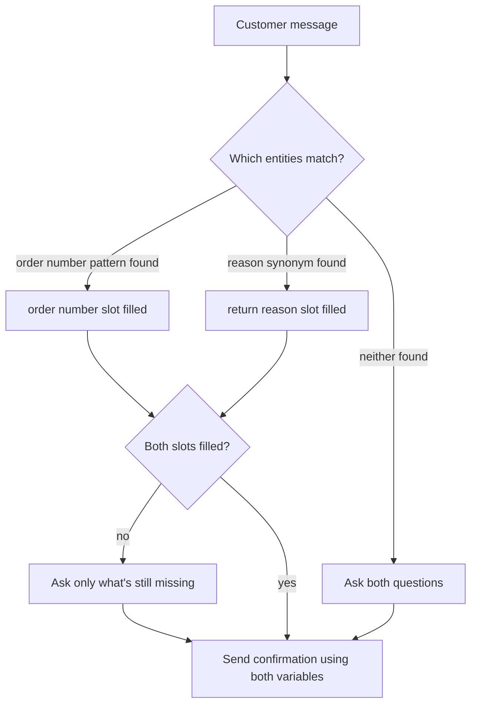

# Entities and Variables


**Group 2 · Session 2.2** of the Copilot Studio course. Full plan on the [Mission](https://dyns.ntd.asia/power-dynamics/artificial-intelligence/study-copilot-studio/mission) page. Follows [Topics & the Authoring Canvas](https://dyns.ntd.asia/power-dynamics/artificial-intelligence/study-copilot-studio/core-agent-building-blocks/topics-and-the-authoring-canvas).


Last session you built the Returns & Exchanges topic for Northwind Outfitters — trigger phrases, a Message node, a Question node, and the on/off switch that keeps a system topic from hijacking it. Right now, that Question node just captures whatever the customer types as raw text. Today it gets smarter.

Topics decide _where_ a conversation goes. This session is about what happens once it gets there — how an agent picks a real piece of information out of a sentence and holds onto it.

## What an entity actually is

An **entity** is a unit of information that represents a real-world thing — a phone number, a city, a person's name, an amount of money. When a customer types something, Copilot Studio's language model doesn't just route the sentence to a topic; it also scans the sentence for entities and pulls out anything it recognizes.

Take the documentation's own example: a Question node is set up to collect the `Money` entity, and a customer answers "It costs 1000 dollars." The agent doesn't store the string "It costs 1000 dollars" — it recognizes that phrase as a monetary value and saves `1000` as a number.

Copilot Studio ships with a long list of **prebuilt entities** for the information every agent runs into — age, city, color, country, date and time, email, money, person name, phone number, and more. Each one maps to a specific variable type when it's captured:

<table><thead><tr><th width="223">Entity</th><th width="511">Becomes a variable of type</th></tr></thead><tbody><tr><td>Money</td><td><code>Number</code></td></tr><tr><td>Date and time</td><td><code>DateTime</code></td></tr><tr><td>Person name</td><td><code>String</code></td></tr><tr><td>Boolean</td><td><code>Boolean</code></td></tr><tr><td>Custom entity</td><td><code>Choice</code></td></tr></tbody></table>


**Worth flagging:** Microsoft's own reference page for this table has two tabs — Web app and Teams plan — and they don't agree. In the current, standard-harness web app, Money becomes a `Number` and Date and time becomes a real `DateTime`. In the older Teams-plan experience, most of these — including Money and Date and time — come back as plain `String`. That's not a documentation error, it's two different products. AB-620 and everything in this course targets the web app experience, so that's the table to remember. If a variable is stubbornly a string when you expected a number, check which experience you're actually authoring in.


## Custom entities: teaching the agent your own vocabulary

Prebuilt entities cover the general case. They've never heard of Northwind Outfitters' return reasons or its order-number format, because those are yours to define.

<table><thead><tr><th width="180">Entity type</th><th>Use it for</th><th>Northwind example</th></tr></thead><tbody><tr><td><mark style="color:blue;"><strong>Closed list</strong></mark></td><td>A small, stable set of values — each one can carry synonyms, and the whole entity can turn on Smart matching</td><td><code>Return reason</code> — Wrong size, Changed my mind, Item damaged, Wrong item shipped</td></tr><tr><td><mark style="color:$warning;"><strong>Regular expression</strong></mark></td><td>Data that always follows one fixed pattern</td><td><code>Order number</code> — <code>NW-[0-9]{6}</code></td></tr></tbody></table>

Each value in a closed list can carry **synonyms** — "doesn't fit" and "too small" both resolve to `Wrong size`. Turn on **Smart matching** and the agent's language model will also fuzzy-match things you didn't think to list, correcting typos and near-misses the way it already matches "softball" to "baseball" in Microsoft's own example. Regex entities, by contrast, use .NET regular expression syntax (JavaScript syntax on the newer NLU+ engine) and are exact — a pattern either matches or it doesn't.

## Slot filling: where the recognized value actually goes

**Slot filling** is the mechanic that connects the two halves of this lesson: an entity gets recognized in what the customer typed, and its value gets placed into a variable — a named slot the rest of the topic can read from. The interesting part is _when_ it happens.

It doesn't wait for you to ask. If a customer's first message already contains the answer to a question three steps down the flow, Copilot Studio fills that slot immediately and skips the question entirely. Microsoft's own example: a customer orders "3 large blue t-shirts," and in one sentence the agent has already resolved quantity, color, and item type — the only thing left to ask about is size.

```
Customer: I want to return order NW-100923, it doesn't fit
Northwind agent: [order number slot filled → NW-100923]
                 [return reason slot filled → Wrong size, via synonym "doesn't fit"]
                 Got it — I can see order NW-100923 is eligible for a size exchange.
                 Want a different size, or a refund?
```

Neither Question node had to run. The regex entity caught the order number on sight; the closed-list entity's synonym list caught "doesn't fit" and mapped it straight to `Wrong size`. If a customer had only mentioned the order number, the agent would proactively fill that one slot and still ask the return-reason question — proactive slot filling fills in whatever it can and only asks about what's left.



## Worked example — wiring the return-reason entity into Northwind's topic

Here's the build, step by step — this is exactly what to click through in your own agent to reproduce the demo above.



### Create the entity

Settings → Entities → Add an entity → New entity → Closed list. Name it `Return reason`.



### Add values and synonyms

Four list items — Wrong size, Changed my mind, Item damaged, Wrong item shipped — each with two or three synonyms a real customer would actually type.



### Turn on Smart matching

Catches the misspellings and near-misses you didn't think to add as synonyms — "damagd," "dosnt fit," that kind of thing.



### Add the Question node

In the Returns & Exchanges topic: Add node → Ask a question → "Why are you returning it?" → under Identify, pick your new `Return reason` entity.



### Rename the variable

Copilot Studio auto-names it something generic. Rename it to `Topic.ReturnReason` so it reads clearly everywhere else you reference it.



### Test it

Open the test panel, type a message that mentions both the order number and a reason synonym in one line, and watch the Variables → Test tab fill both slots before either question fires.



## Variable types, and where a variable is allowed to live

Every variable has a **base type**, fixed the first time you assign it a value — assign a number first, and a later attempt to shove a string into it fails. Copilot Studio works with eight base types: String, Boolean, Number, Table, Record, DateTime, Choice, and Blank (a placeholder for "no value yet"). You've already met most of them above without naming them — `Money` comes in as Number, a closed-list entity comes in as Choice.

Type is one axis. **Scope** is the other, and it's the part that matters once an agent has more than one topic. By default, every variable you create is a **topic variable** — visible only inside the topic where it was born. `Topic.ReturnReason` from the worked example above literally cannot be read from any other topic, unless you do something about it.

### Promoting a variable to global scope

Say Northwind's Welcome topic already asks for the customer's name. You don't want the Returns & Exchanges topic asking again three minutes later. Open the variable's properties panel and switch its usage to **Global (any topic can access)** — Copilot Studio renames it with a `Global.` prefix on the spot, so `customerName` becomes `Global.customerName`, and now every topic in the agent can read it.


**The part people miss:** a global variable's value persists only for the length of one session — it resets when the Reset Conversation system topic runs, which is exactly what fires when a customer types "start over." And if a topic references a global variable before it's ever been set, Copilot Studio doesn't error out — it quietly jumps to wherever that variable is first defined (even in a different topic), fills it in, then returns you to where you were. You never have to hand-wire that handoff yourself.


Two other scopes exist worth knowing by name, even though you won't touch them much this session: **system variables** (built into every agent — things like `User.DisplayName` or `Activity.Text`) and **environment variables** (defined in Power Platform, read-only inside Copilot Studio, mainly used for moving an agent between environments without hard-coding values). Both get their own airtime in Group 7, when ALM and environments become the point rather than a footnote.

## Check your retrieval

Answer before you expand each one.



Northwind wants to recognize four fixed return reasons customers might type. Which entity type fits?

* Closed list entity
* Regular expression entity
* Open list entity



**Closed list entity.** It's exactly for small, stable sets of values — plus you get synonyms and Smart matching for free. Regex is for pattern-shaped data like order numbers; open list entities pull their values from an external source at runtime, which is overkill for four fixed reasons.





True or false: slot filling only happens after a Question node explicitly asks for that piece of information.

* True
* False



**False.** That's the entire point of _proactive_ slot filling. If the entity is recognizable anywhere in an earlier message, Copilot Studio fills the slot immediately and simply skips the question when it would otherwise have been asked.





A Question node collects the prebuilt Money entity, in the standard web app experience. What base type does the resulting variable get?

* Number
* String
* Record



**Number**, in the current web app experience — "$100," "a hundred dollars," and "100 dollars" all resolve to the number 100. (The older Teams-plan experience stores it as a String instead.)





The customer's name is captured once in the Welcome topic, and you want every other topic to read it without asking again. What's the move?

* Copy the variable's value into a new variable in each topic that needs it
* Add a Set variable value node in every topic
* Change the variable's scope to Global in its Variable properties panel



**Change the variable's scope to Global.** Copilot Studio prefixes it `Global.` automatically, and from then on any topic in the agent can read (and any topic can set) that same variable for the rest of the session.



## Reflection

<details>

<summary>Northwind's Returns topic still asks for order number and return reason as two separate questions, always in that order. A customer opens with: "I want to return NW-100923, the shoes don't fit." What does proactive slot filling let the agent skip — and what has to be true on the entity side for that to actually work?</summary>


**ONE REASONABLE ANSWER**\
Both questions get skipped, not just one. The regex entity `NW-[0-9]{6}` matches "NW-100923" on sight — no ambiguity there, it either matches the pattern or it doesn't. The return-reason entity is the one doing real work: "don't fit" isn't one of the four typed-in values, so it only resolves to `Wrong size` if that exact phrase (or something close enough for Smart matching to bridge) was added as a synonym. If you'd only listed "doesn't fit" as a synonym and the customer typed "don't fit," Smart matching's fuzzy logic is what closes that gap — without it, the reason slot stays empty and the agent still asks the question, even though a human reading the sentence would say the answer was right there.

The practical lesson: proactive slot filling is only as generous as your synonym list (plus Smart matching) makes it. A closed-list entity with no synonyms behaves almost like a strict regex — it'll only skip the question for the exact strings you typed in.


</details>

## Read next

Everything in today's session, applied: [Implement slot-filling best practices](https://learn.microsoft.com/microsoft-copilot-studio/guidance/slot-filling-best-practices) — when synonyms actually help, why regex beats Number entities for ambiguous multi-quantity input ("2 towels and 1 pillow to room 101"), and when to reach for Dataverse instead of a closed list once a dataset gets too big to hand-type.


**Key takeaway:** Entities give your agent a vocabulary for real-world things; slot filling is what turns a word the customer actually typed into a value sitting in a variable your topic can act on — and scope decides how far that value is allowed to travel.


## Sources

* [Use entities and slot filling in agents — Microsoft Learn](https://learn.microsoft.com/microsoft-copilot-studio/advanced-entities-slot-filling)
* [Variables overview — Microsoft Learn](https://learn.microsoft.com/microsoft-copilot-studio/authoring-variables-about)
* [Work with variables — Microsoft Learn](https://learn.microsoft.com/microsoft-copilot-studio/authoring-variables)
* [Work with global variables — Microsoft Learn](https://learn.microsoft.com/microsoft-copilot-studio/authoring-variables-bot)
* [Implement slot-filling best practices — Microsoft Learn](https://learn.microsoft.com/microsoft-copilot-studio/guidance/slot-filling-best-practices)
