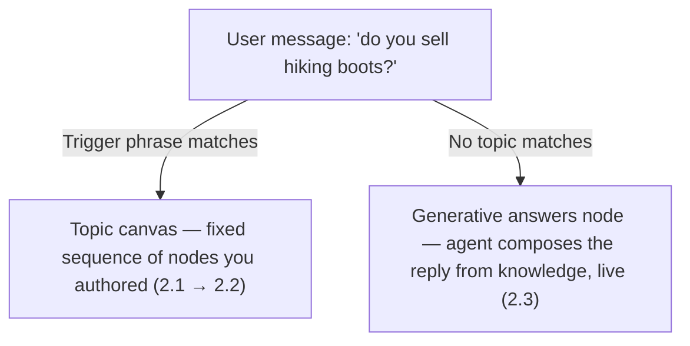

# Generative Answers and Instructions


**Group 2: Core Agent Building Blocks · Session 2.3 of 4** — builds on Topics & the Authoring Canvas and Entities and Variables.


Sessions 2.1 and 2.2 taught the agent to follow fixed paths. This one teaches it to write its own sentences — and shows you what you now have to control instead.

## The pivot this session is about

Deterministic: same input, same path. Generative: same input, the answer can vary.

## Two different things share this session

Session 1.2 already introduced generative orchestration — the runtime deciding which tool, topic, or knowledge source to call for a given message. This session is about the two concrete places that idea becomes something you actually write: a node you drop on the canvas, and a block of instructions you write once for the whole agent. They're related but not the same feature, so this lesson keeps them separate rather than blurring them into one "AI stuff" bucket.

## The generative answers node

A generative answers node lets a topic answer a question by searching knowledge sources and composing a reply, instead of walking a scripted branch.

> "By using a generative answers node, your agent can respond to users based on knowledge sources at the topic level." — [Add a generative answers node](https://learn.microsoft.com/en-us/microsoft-copilot-studio/nlu-boost-node)

Two behaviors matter more than the button-click mechanics:

* **It's the built-in fallback.** When no topic's trigger phrases match a message, generative answers is what tries to answer it — "this behavior is known as generative answers as a fallback."
* **A node's sources override the agent's.** If you configure specific knowledge sources on the node itself, those _replace_ the agent-level sources for that node — they don't add to them. Microsoft's guidance: "For the best results, configure your generative answers nodes with specific knowledge sources."



### Open the topic

Any topic that should answer from knowledge instead of a fixed script.



### Add node → Advanced → Generative answers

A node labeled **Create generative answers** appears on the canvas.



### Open Properties (⋯)

Turn on **Search only selected sources** if you want this node scoped to specific sources rather than everything the agent knows.




**Read before you trust it.** The FAQ is blunt: "Responses generated by the generative answers capability aren't always perfect and can contain mistakes." Answers aren't deterministic either — "repeating semantically (near) identical questions might yield varying answers, even in new chats" — and "the system doesn't perform an accuracy check." If the source document is wrong, the agent can repeat that wrong information with full confidence. There's also a content-moderation dial per node, from Lowest to Highest (default High) — looser catches more questions, stricter blocks more, including some good answers.


**Northwind, applied:** the returns-policy question is a good fit for a scoped generative answers node — turn on **Search only selected sources** and point it at just the returns-policy document, rather than letting it search everything the agent knows. (How to actually connect a SharePoint doc or file as a knowledge source is Group 3's job — this session only covers that the node exists and how it decides what to search.)

## Agent instructions

Instructions are the one piece of natural-language configuration that sits above every topic, tool, and knowledge source you've built.

> Instructions let the agent "decide what resources (tools, knowledge, topics, or other agents) to call to address a user query or autonomous trigger," "fill inputs for any tool based on the available context," and "generate a response to the end user." — [Write agent instructions](https://learn.microsoft.com/en-us/microsoft-copilot-studio/authoring-instructions)

You write them on the agent's **Overview** page, under **Instructions → Edit** — plain text, with one piece of real syntax: type `/` to reference a specific tool, topic, agent, variable, or Power Fx expression by name.


**The rule that trips people up.** "An agent can't act on instructions to use tools, knowledge sources, other agents, or topics it doesn't have." Writing `/Order_Status` into instructions does nothing if that tool was never added to the agent. Instructions steer what's already configured — they don't configure anything themselves.


Microsoft's guidance for generative orchestration adds real editorial advice, not just syntax:

* **Don't restate the obvious.** "You don't need to define the available tools or knowledge sources in the instructions, since this information is already available to the agent." Spend the words on the ambiguous cases instead — e.g. `When the user has provided details of their preferred laptop, create a purchase order using /Purchase Order.`
* **Name things exactly.** Use the tool's real name after the slash — "slight differences in naming can negatively affect results."
* **Structure around three things:** constraints (what the agent may talk about — `Only respond to requests to provide information about educational, legal, wellness, wellbeing, health, dental care, and newborn benefits for employees and dependents.`), response format (`Always give responses about order status in a table format.`), and guidance for filling tool inputs.
* **Keep it short.** "Keep agent instructions as simple and as short as possible" and use them "for summarization and conversational flow, not for system-level behaviors" — fallback messages and Adaptive Card formatting belong in topic configuration, not prose instructions.
* **Never touch citations.** "Don't modify, override, or interfere with the system-defined citation format or behavior," down to avoiding the words "citation" or "reference" in your instructions.

> "The system treats agent instructions similar to code. The wrong code might break your system." — [Configure high-quality instructions for generative orchestration](https://learn.microsoft.com/en-us/microsoft-copilot-studio/guidance/generative-mode-guidance)

**Northwind, applied:** a single instruction line — `When the user has provided an order number, look up its status using /Order_Status before answering.` — tells the runtime which tool resolves ambiguity between "check my order" (needs a number first) and "what's your return policy" (doesn't need any tool at all, the generative answers node handles it).

## Where the two meet

Neither piece replaces the other. Instructions steer which resource gets called — a topic, a tool, or a generative answers node — for an ambiguous message. The generative answers node is one of the resources that can get called, and once it's running, it does its own search-and-compose over whatever sources it's scoped to.

<table><thead><tr><th width="132">Layer</th><th width="137">Scope</th><th width="409">What it decides</th><th>Taught</th></tr></thead><tbody><tr><td><mark style="color:blue;">Generative orchestration</mark></td><td>Whole agent</td><td>Which tool / topic / knowledge source to call at all</td><td>1.2</td></tr><tr><td><mark style="color:orange;">Agent instructions</mark></td><td>Whole agent</td><td>How to break ties when the right call is ambiguous</td><td>2.3</td></tr><tr><td><mark style="color:purple;">Generative answers node</mark></td><td>One topic</td><td>How to answer from a scoped set of knowledge sources</td><td>2.3</td></tr></tbody></table>

## Check your retrieval



A generative answers node has its own sources configured. What happens if none of them return an answer?

1. It automatically falls back to the agent-level knowledge sources.
2. It does not fall back — "Search only selected sources" doesn't fall back to agent-level sources.
3. It falls back to a live web search regardless of settings.



**Option 2.** The node-level sources _replace_ the agent-level ones when "Search only selected sources" is on — there's no automatic fallback if they come up empty.





What's the correct way to reference a specific tool inside agent instructions?

1. Describe it in plain English so the agent infers which tool you mean.
2. List every tool the agent has, so nothing is ambiguous.
3. Type `/` followed by the tool's exact name.



**Option 3.** Instructions use a slash-reference to the exact resource name — and you shouldn't restate the full tool list, since the agent already has that.





Can agent instructions make the agent use a knowledge source it was never given?

1. No — an agent can't act on instructions to use tools or knowledge sources it doesn't have.
2. Yes, if the instruction is specific enough about what to search for.
3. Yes, but only for public websites.



**Option 1.** Instructions steer existing capability, they don't grant new capability. The source has to be configured first.





Per the FAQ, what does Copilot Studio do to check that a generative answer is factually accurate before showing it to a user?

1. It cross-checks the answer against a second knowledge source.
2. Nothing — "the system doesn't perform an accuracy check."
3. It flags low-confidence answers for human review before sending.



**Option 2.** There's no accuracy check. If your source document is wrong, the agent can present that error with total confidence — which is why source curation matters more than it feels like it should.



## Reflect

Northwind's agent already has an <code>/Order_Status</code> tool and a generative answers node scoped to the FAQ document. A customer types "where's my stuff." Nothing in your topics has that exact trigger phrase. Walk through what the runtime actually does with that message, in order — before checking the answer below.


**ONE REASONABLE ANSWER** No topic's trigger phrases match "where's my stuff," so generative orchestration doesn't have a clean deterministic path — this is exactly the ambiguous case instructions exist for. If you wrote an instruction like `When the user asks about an order without giving a number, ask for the order number, then use /Order_Status`, the runtime uses that to decide: ask for the number rather than guessing. Without that instruction, orchestration is more likely to fall through to the generative answers node — which would try to answer from the FAQ document, and an FAQ document almost certainly doesn't contain this specific customer's order status. That's the practical cost of skipping instructions: an ambiguous message lands on the wrong resource, not on no resource at all.


## Key takeaway

Generative answers and instructions both trade a fixed decision tree for language the agent composes on the fly — which means your job shifts from designing paths to designing grounding and guardrails: what sources a node can see, and where instructions should break a tie instead of letting the runtime guess.

## Read next

[Configure high-quality instructions for generative orchestration](https://learn.microsoft.com/en-us/microsoft-copilot-studio/guidance/generative-mode-guidance) — the full best-practices guide this lesson's instruction-writing advice was drawn from.

## Sources verified this session

* [Add a generative answers node](https://learn.microsoft.com/en-us/microsoft-copilot-studio/nlu-boost-node) — Microsoft Learn, last updated 2026-07-21
* [FAQ for generative answers](https://learn.microsoft.com/en-us/microsoft-copilot-studio/faqs-generative-answers) — Microsoft Learn
* [Write agent instructions](https://learn.microsoft.com/en-us/microsoft-copilot-studio/authoring-instructions) — Microsoft Learn, last updated 2026-08-03
* [Configure high-quality instructions for generative orchestration](https://learn.microsoft.com/en-us/microsoft-copilot-studio/guidance/generative-mode-guidance) — Microsoft Learn
