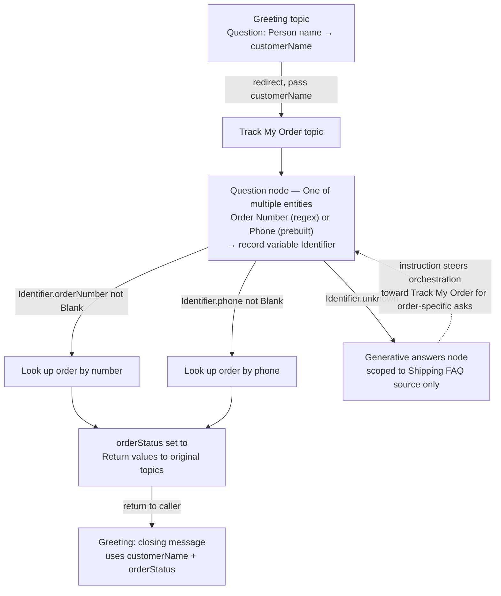

# Review & Retrieval


**Session 2.4** — last session in Group 2, Core Agent Building Blocks. No new paradigm this time: three pieces Sessions 2.1–2.3 deliberately skipped get folded in now that there's a real build to hang them on.


2.1 gave you topics. 2.2 gave you entities and variables. 2.3 gave you generative answers and instructions. None of that was tested against the others until now — this session forces all four into one small, real build.

## Three things we skipped on purpose

Each of these lives in the same Microsoft Learn pages already used for 2.2 and 2.3 — they just weren't the day's topic yet.

**Passing variables between topics.** When one topic redirects to another, a topic variable can be marked **Receive values from other topics**. The redirecting topic then feeds it a value on the Redirect node, and the destination topic's Question node never fires — the user isn't asked something the agent already knows. The reverse works too: a variable marked **Return values to original topics** carries a value collected deep in one topic back out to whichever topic called it. Microsoft's own framing: this "reduces the need for global variables" — cross-topic data flow without promoting everything to agent-wide scope.

**One of multiple entities.** A single Question node can watch for up to five different entity types at once — an order number _or_ a phone number _or_ "I don't know." Whichever one the customer's message matches gets captured into a _record_-type variable, with one sub-field per possible entity (`Identifier.orderNumber`, `Identifier.phone`, `Identifier.unknown`). The catch: if a message contains two of the configured entities at once, the agent keeps only the **first one in the node's configured list** — not the first one the customer said. Order the list deliberately.

**Open list (dynamic inline) entities.** A closed list entity (2.2) is a fixed, hand-typed set of values baked into the agent. An open list entity instead reads its valid values from a _table_ variable at runtime — an Excel file, a database, a Dataverse lookup, or a Power Fx expression can populate it. Change the table's contents and the agent recognizes a different set of values immediately, with no republish. Tables are capped at 100 entries and support a synonym schema (`DisplayName` + `Synonyms`), the same idea as a closed list's synonyms.

## The build: Northwind's "Track My Order"

One small topic chain, using every Group 2 concept at once — the retail spine from the mission, not three separate toy exercises.



### Greeting collects a name, then hands off

The **Greeting** topic (2.1) asks for the customer's name using the prebuilt **Person name** entity (2.2), stores it as `customerName`, then redirects to **Track My Order** — passing `customerName` along (2.4: pass variables between topics).



### One question, two possible answers

**Track My Order**'s Question node is set to **One of multiple entities** (2.4): a custom **Order Number** regex entity (2.2) listed first, a prebuilt **Phone Number** entity listed second. The response lands in a record variable, `Identifier`.



### Branch on what came back

A **Condition** node (2.1) checks `Identifier.orderNumber` and `Identifier.phone` with **is not Blank** — Microsoft's own recommended pattern for this node type — and branches to an order lookup either way.



### Fall back to generative answers, scoped tight

If neither resolves (`Identifier.unknown`), the path falls to a **generative answers node** (2.3) scoped, via node-level source override, to only the "Shipping FAQ" knowledge source — so a customer asking "what's your return window?" gets an answer, but the node never invents an order status it can't look up.



### One instruction line keeps orchestration honest

An agent instruction (2.3) steers which of the two paths gets used first:

```
If the customer's message is about a specific order, use /Track My Order.
Only use generative answers for general shipping policy questions.
```

The instruction doesn't grant either path new capability — per 2.3's grounding rule, it just steers which existing capability orchestration reaches for first.



### The answer travels back

Once the order status is found, `orderStatus` is marked **Return values to original topics** (2.4), so **Greeting** can close with a personalized message combining `customerName` and the returned `orderStatus` — without **Greeting** ever needing its own copy of the lookup logic.



Elsewhere in the same agent, a "what do you sell" topic uses an **open list entity** (2.4) backed by a table variable of Northwind's current categories — Hiking, Camping, Cycling, Footwear — so a seasonal catalog change never requires touching the topic itself.



## Two features that sound alike, aren't

Both live in the same Microsoft Learn article on entities and slot filling, and both produce a structured variable instead of a single value — easy to conflate.

| Feature           | One of multiple entities                                            | Accept multiple values for an entity                                         |
| ----------------- | ------------------------------------------------------------------- | ---------------------------------------------------------------------------- |
| What varies       | Entity _type_ — different kinds of information                      | Entity _count_ — many instances of the same kind                             |
| Example utterance | "My card number is 123456789"                                       | "I have visas for India, Germany, and Japan"                                 |
| Result variable   | _Record_ — one field per possible entity type                       | _Table_ — a list of same-type values                                         |
| Ambiguity rule    | Two matches in one message → only the first-listed entity type wins | All matching values are extracted and kept                                   |
| Node limit        | Up to 5 entity types per node                                       | Not fixed in the docs — governed by the practical size of the resulting list |

## Check your retrieval



A Question node is configured for "one of multiple entities" with, in this order: Library Card Number, Phone Number, "I don't know." A customer says: "My phone number is 777 555-1212 and my card number is 123456789." What does the agent capture?

* a) The phone number, because it's mentioned first in the sentence
* b) The card number, because it's first in the node's configured list
* c) Both values, in a table
* d) Neither — it reprompts for clarification



**b) The card number, because it's first in the node's configured list.** Per Microsoft's own example with this exact scenario, the agent identifies only the first entity in the _configured_ list when a message matches more than one — sentence order doesn't matter, list order does.





True or false: to pass a variable's value from one topic to another, you must first promote it to a Global variable.

* a) True
* b) False



**b) False.** A topic-scoped variable marked "Receive values from other topics" or "Return values to original topics," combined with a Redirect node's input/output mapping, moves values between topics directly. Microsoft frames this as reducing the need for global variables, not requiring them.





Northwind's product catalog changes seasonally and you don't want to republish the agent every time it does. Closed list or open list entity — and why?

* a) Closed list — it's simpler to manage
* b) Open list — its values populate at runtime from an external source



**b) Open list.** Open list (dynamic inline) entities read their valid values from a table variable at runtime — an Excel file, database, or Dataverse connection — so the recognized set can change without touching the entity definition. A closed list's values are hand-typed and fixed until someone edits the agent.





In the Northwind build, Track My Order and the generative answers fallback both already work independently. Why does the one-line agent instruction still matter?

* a) It grants the generative answers node access to order data
* b) It tells orchestration which existing path to prefer for order-specific questions



**b) It tells orchestration which existing path to prefer.** Per 2.3's grounding rule, an instruction can't hand a node capability it doesn't have — the generative answers node still can't check order status even with the instruction in place. What the instruction actually does is steer orchestration's choice between two paths that both already exist.



<details>

<summary>Reflection: why does a "one of multiple entities" node always resolve to exactly one value, even when it's watching for up to five entity types at once?</summary>


**ONE REASONABLE ANSWER** The node exists to answer "which one piece of information did the customer give me" — a disambiguation problem, not a collection problem. If the real need is "how many values of the same type did the customer give," that's a different, purpose-built feature — accepting multiple values for a single entity, which returns a table instead of a record. Reaching for "one of multiple entities" to collect a list would technically compile, but it's the wrong tool: it would only ever keep the first-listed type it found, silently dropping the rest.


</details>


**Key takeaway:** the four Group 2 sessions were never separate skills — they're one vocabulary for describing a single conversation turn, and this session is the first time you had to spell a whole sentence with it.


## Read next

The single best next read: [Work with variables — Pass variables between topics](https://learn.microsoft.com/microsoft-copilot-studio/authoring-variables#pass-variables-between-topics). It's the page this session's central mechanic came from, and it has the worked Greeting/Talk-to-Customer example this lesson's build is modeled on.

## Sources verified this session

1. [Work with variables — Pass variables between topics](https://learn.microsoft.com/microsoft-copilot-studio/authoring-variables#pass-variables-between-topics)
2. [Work with variables — Return values to original topics](https://learn.microsoft.com/microsoft-copilot-studio/authoring-variables#return-values-to-original-topics)
3. [Use entities and slot filling in agents — Accept one of multiple entities](https://learn.microsoft.com/microsoft-copilot-studio/advanced-entities-slot-filling#accept-one-of-multiple-entities-at-a-conversation-turn)
4. [Use entities and slot filling in agents — Use open list entities](https://learn.microsoft.com/microsoft-copilot-studio/advanced-entities-slot-filling#use-open-list-entities)
5. [Use entities and slot filling in agents — Accept multiple values for an entity](https://learn.microsoft.com/microsoft-copilot-studio/advanced-entities-slot-filling#accept-multiple-values-for-an-entity-at-a-conversation-turn)


**Open documentation note, flagged rather than smoothed over:** the restriction "you can't pass variables based on entities of type Date and time, Duration, or Multiple choice options, or a custom entity, between topics" appears under the _Teams-plan_ tab of the pass/return-variables page, in both directions. The _web app_ tab's walkthrough (the experience this course targets) doesn't restate that limitation, but doesn't contradict it either — treated here as an unresolved cross-experience gap, the same pattern already logged for 2.2's prebuilt-entity type-mapping split, not asserted either way.

