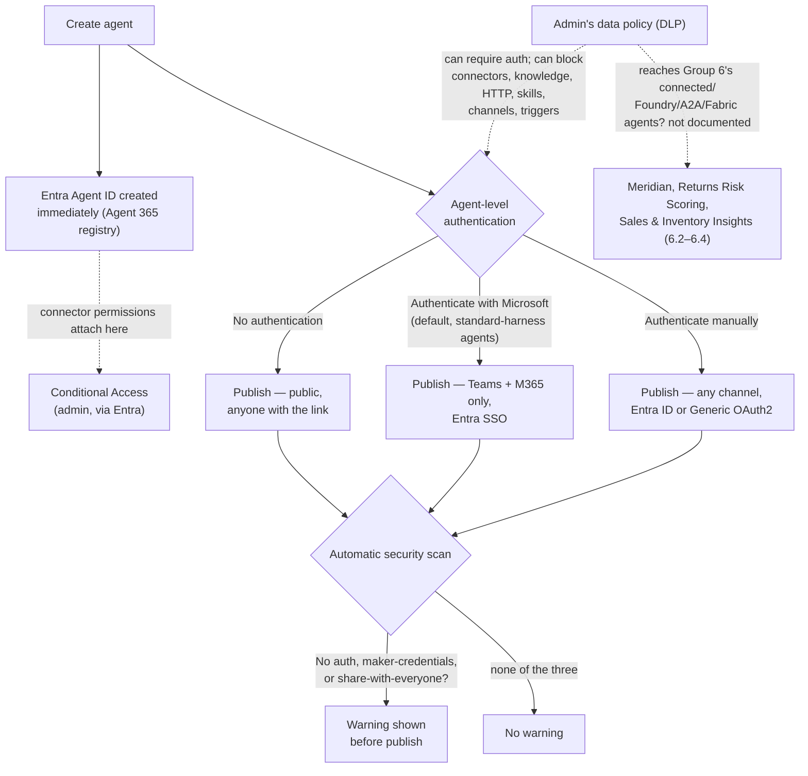

# Identity and Security


**Session 7.1** · Group 7 — Enterprise Integration & Governance · opens the group


## Identity and Security: Authentication, Agent Identity, and Data Policies

6.5 closed Group 6 by naming a risk it couldn't resolve: Meridian Freight sits inside Northwind's orchestrator, but Northwind doesn't own or host it, so the privilege-escalation question isn't "will a subagent overreach" — it's "what happens to Northwind's own conversation once it's sitting on someone else's server." This session is where the actual levers for that question live: who's allowed to talk to an agent at all, what identity the agent itself carries once it exists, and what an admin can wall off before any of it gets a chance to matter.


Three separate questions, three separate systems: **who can start a conversation** (agent-level authentication), **what is this agent, to Microsoft Entra** (agent identity), and **what is this agent never allowed to touch, regardless of who's asking** (data loss prevention policies). None of the three substitutes for either of the other two.


### Who's allowed to talk to the agent

Every Copilot Studio agent has one agent-level authentication setting, configured under **Settings → Security → Authentication**. There are three options, and picking one is a bigger decision than it looks — it decides which channels the agent can even be published to, not just how sign-in feels. \[1]

| Option                          | What it means                                                                                                                                                              | Channels                                                     | Sharing control                                                                                                                                                     |
| ------------------------------- | -------------------------------------------------------------------------------------------------------------------------------------------------------------------------- | ------------------------------------------------------------ | ------------------------------------------------------------------------------------------------------------------------------------------------------------------- |
| **No authentication**           | No sign-in required. The agent can only access public information — no restricted data.                                                                                    | Any channel a link can reach                                 | None — anyone with the link can chat. Can't restrict to specific org users.                                                                                         |
| **Authenticate with Microsoft** | Automatic Entra ID SSO — no manual setup. Users already signed in to a Microsoft client aren't prompted again.                                                             | Teams + Microsoft 365 only (plus native/custom app channels) | Always signed in, so "Require users to sign in" is on and can't be turned off — agent sharing controls who in the org can chat.                                     |
| **Authenticate manually**       | Maker configures the identity provider explicitly: Entra ID V2 (federated credentials, certificates, or client secrets), classic Entra ID, or any Generic OAuth2 provider. | Any channel, including non-Microsoft ones                    | With Entra ID: agent sharing controls org access. With Generic OAuth2: any signed-in user can chat, but you can't restrict to specific org members through sharing. |

Only **Authenticate manually** exposes `User.AccessToken` and `User.IsLoggedIn` as topic variables — **Authenticate with Microsoft** gives you `User.ID` and `User.DisplayName` only. If a topic needs an actual token to call a downstream service on the user's behalf, manual authentication is the only one of the three that provides it. \[1]


**Same product, two different defaults.** The documentation states plainly that "classic chatbots are configured by default to _not_ require authentication" \[1] — but a separate page, written for admins configuring data policies, says just as plainly that "when you create a new agent, the **Authenticate with Microsoft** authentication option is on by default." \[4] Both are true at once, because they describe two different agent types built on the same platform: the newer, standard-harness agent this course has used since 1.1 defaults to **Authenticate with Microsoft**; the older classic-chatbot type defaults to **No authentication**. If you inherit an older bot and it's letting anyone chat, that isn't a misconfiguration — it's the type's own original default.


### The scan that catches you loosening the defaults

Copilot Studio runs an automatic security scan before every publish. It doesn't evaluate everything about an agent — it watches for exactly three specific moves away from a secure default, and warns the maker when it sees one: \[2]

* **Authentication set to No authentication** — the default is Authenticate with Microsoft; switching away from it is what triggers the warning, not using No authentication on a bot whose type already defaults to it.
* **Credentials to use set to Maker-provided credentials**, on a connector or flow — the default is end-user credentials. This is the exact setting 4.1 taught as a maker-vs-user-credentials choice for connector tools; the scan is watching that same toggle.
* **Sharing the agent with everyone in the organization** — the default is shared with no one.

The scan is narrow on purpose: it's a maker-facing nudge on three specific, well-understood risk levers, not a general security audit. Everything past those three settings is covered by the other two systems in this session, not by the scan.

### Every agent already has an identity, before you configure anything

The moment you create a Copilot Studio agent, Microsoft Entra creates an **Agent ID** for it — no app registration, no manual SDK setup. That identity is what makes the agent visible in the Agent 365 registry and targetable by Entra governance tools. \[3]

**Two things that are easy to get backwards:**

* **Creation timing:** the Agent ID is created _at agent-creation time_, not at publish. Publishing makes the agent reachable to users; the identity already existed before that, from the moment the agent itself was created.
* **The blueprint is shared, the Agent ID isn't:** a pro-code agent gets its own individual blueprint. Every Copilot Studio app-based agent in a tenant — Northwind's orchestrator, Billing, Product-Support, all of them — shares one common blueprint, while each still gets its own distinct Agent ID. That shared-blueprint model is what lets DLP policies and advanced connector policies apply automatically across every Copilot Studio agent in the tenant without per-agent blueprint setup.

Once an agent is published, Copilot Studio attaches API permissions to its Agent ID for each Power Platform connector the agent uses. Admins can review those permissions in the Entra admin center and target the Agent ID directly with [Conditional Access policies](https://learn.microsoft.com/en-us/entra/identity/conditional-access/overview) — the same governance surface used for human user accounts, now reachable for an agent. \[3]

This means every one of Northwind's five agents from Group 6 already has its own Agent ID sitting in the tenant, whether or not anyone in 6.1 through 6.5 ever opened the Entra admin center to look. Identity provisioning isn't something Group 6 skipped — it happened automatically, in the background, on every one of those agents the moment each was created.



#### Go to Settings → Security → Authentication

On the agent you want to configure.



#### Select Authenticate manually, then a service provider

For an Entra ID-backed setup: **Microsoft Entra ID V2 with federated credentials** is the recommended option — it uses short-lived OpenID Connect tokens instead of a stored secret, aligning with Zero Trust. \[1]



#### Supply the Client ID and save

Copilot Studio returns a federated credential issuer and value — copy both into the app registration's **Certificates & secrets → Federated credentials** in the Azure portal, under **Other issuer**.



#### Publish

Authentication changes take effect only after publish — the same publish-gates-everything rule 5.2 hit with the trigger build.



### Walling off data before an agent can touch it

Authentication and identity answer "who's this, and who let them in." Data loss prevention (DLP) answers a different question entirely: regardless of who's asking, what is this agent never allowed to reach at all. Admins configure DLP as **data policies** in the Power Platform admin center, applied to an environment, environment group, or the whole tenant. \[4]

Every Copilot Studio connector gets classified into one of three data groups — **Business**, **Non-business**, or **Blocked** — and connectors in the same policy have to share a data group, since data can't move between connectors sitting in different groups. Connectors introduced after 2019 default into the Non-business group if nobody explicitly classifies them, and many organizations block that group outright — which is why a newer connector can turn up unexpectedly blocked in a tenant that never touched it on purpose. \[4]

A data policy can enforce, in real time, with an error shown to the maker or the end user on violation: \[4]

* Requiring user authentication (blocking the "No authentication" path outright, tenant-wide)
* Blocking specific knowledge sources (SharePoint/OneDrive, public websites, uploaded documents)
* Blocking Power Platform connectors used as tools (4.1)
* Blocking HTTP requests (4.3's Send HTTP Request node)
* Blocking skills
* Blocking publication to specific channels
* Blocking event triggers (5.1's autonomous trigger mechanism)


**Does DLP reach what Group 6 built? Not documented either way.** That seven-item list is specific, and every item on it is a mechanism from Groups 1 through 5 of this course — connectors, knowledge, HTTP, skills, channels, triggers. None of it is phrased as "block a connected agent," "block a Foundry connection," or "block an A2A endpoint." Group 6's five connection types — the exact mechanism behind Meridian Freight, the exact thing 6.5 flagged as carrying Northwind's own conversation history outside its walls — don't appear on the documented list of what a data policy can gate. That's not the same as DLP being unable to touch them; it's that this session's primary source doesn't say one way or the other, the same shape of gap 6.5 hit re-checking the Activity page for multi-agent handoffs. Whether an admin can specifically wall off Meridian's A2A connection, or Returns Risk Scoring's Foundry connection, with a data policy is an open question for a future governance-focused session — not one this lesson is going to resolve by assuming the obvious answer is yes.


### Applying it to Northwind

Northwind's support agent talks to retail customers on a public website — not Northwind employees signed in with a work Entra account. That rules out **Authenticate with Microsoft** immediately: it only unlocks the Teams + Microsoft 365 channel, and a retail customer browsing Northwind's site has no Entra ID identity to authenticate with in the first place. The realistic choice is **Authenticate manually** with a Generic OAuth2 provider tied to Northwind's own customer-account system — letting a signed-in customer's `User.AccessToken` scope an order lookup to their own orders only, the same "restrict to what this specific user should see" job 4.1's end-user-credentials setting does one layer down, at the tool level rather than the whole agent.

| Layer                      | Question it answers                                                                         | Where it's set                                             | Session            |
| -------------------------- | ------------------------------------------------------------------------------------------- | ---------------------------------------------------------- | ------------------ |
| Agent-level authentication | Can this person start a conversation with the agent at all?                                 | Settings → Security → Authentication                       | 7.1 (this session) |
| Tool-level authentication  | Once they're talking to the agent, whose credentials does _this specific tool call_ run as? | Per-tool Details tab, Agent author vs. User authentication | 4.1                |

They're easy to conflate because both use the word "authentication," but they gate two completely different moments — one at the front door, one at each individual tool call once someone's already inside.

### The full picture


**Key takeaway.** Authentication decides who gets in, agent identity decides what the platform can see and govern once the agent exists, and a data policy decides what's off-limits no matter who's asking — three separate systems, and this session's own research found that the third one's documented reach doesn't yet say whether it covers the agent-to-agent connections Group 6 spent five sessions building.


### Check your retrieval



Northwind wants its public support agent to let a signed-in customer's tool calls carry an access token so an order-lookup tool can scope results to that customer only. Which agent-level authentication option makes that token available as a topic variable?

* No authentication
* Authenticate with Microsoft
* Authenticate manually
* None of the three expose an access token



**Authenticate manually.** Only this option exposes `User.AccessToken` and `User.IsLoggedIn` as topic variables. Authenticate with Microsoft only provides `User.ID` and `User.DisplayName`; No authentication provides no user identity at all.





A maker inherits an older classic chatbot that turns out to require no sign-in at all. Is this a misconfiguration?

* Yes — every Copilot Studio agent defaults to requiring authentication
* No — classic chatbots default to No authentication, while the newer standard-harness agent type defaults to Authenticate with Microsoft
* Yes — No authentication is never a valid default for any agent type
* It can't be determined without checking the security scan



**No.** Two genuinely different defaults exist side by side in the same product: classic chatbots default to No authentication, while agents built on the newer standard harness (the type this course has used since 1.1) default to Authenticate with Microsoft.





When is a Copilot Studio agent's Entra Agent ID actually created?

* At publish time, when the agent becomes reachable to users
* At agent-creation time — before any authentication setting is even configured
* Only after an admin manually registers the agent in Entra
* Only once the agent uses its first Power Platform connector



**At agent-creation time.** Identity provisioning happens at agent-creation time, not publish. Publishing makes the agent available to users, but its Entra Agent ID already exists by then — created automatically the moment the agent itself was created.





This session's own research on data policies (DLP) found a gap. What is it?

* DLP policies can't be applied to more than one environment at a time
* The documented list of what a data policy can block doesn't include "block a connected/Foundry/A2A/Fabric agent connection," so whether DLP reaches Group 6's five connection types isn't confirmed either way
* DLP policies only apply to classic chatbots, never to standard-harness agents
* There is no gap — the documentation explicitly confirms DLP blocks all five of Group 6's connection types



**The second option.** The seven documented common use cases for a data policy are all mechanisms from Groups 1–5 of this course. None of them is phrased as gating an agent-to-agent connection, so whether a data policy can wall off Meridian Freight's A2A link or the Foundry/Fabric connections is an open question this session flags rather than assumes.



### Reflection

Northwind's support agent is meant to serve external retail customers, but the platform's own secure default for a new agent is "Authenticate with Microsoft" — an option that only works for users with a Microsoft Entra identity. Why would a platform default to a setting that doesn't fit its own flagship customer-support scenario?


**ONE REASONABLE ANSWER** The default isn't chosen for any one scenario — it's chosen to be safe by default across every scenario, and "safe" means "requires sign-in" more than it means "fits this specific audience." Authenticate with Microsoft is the option that requires the least manual setup while still turning authentication on, which makes it the safest thing to hand a maker who hasn't thought about identity yet. It's on the maker to notice, during design, that their actual audience (retail customers, not Microsoft-authenticated staff) doesn't match that default's assumptions, and to move deliberately to Authenticate manually — the same "secure by default, maker's job to fit it to the real scenario" shape the automatic security scan uses for its other two flagged settings.


**Read next:** [Key concepts: Copilot Studio security and governance](https://learn.microsoft.com/microsoft-copilot-studio/security-and-governance) — the synthesizing overview that ties authentication, DLP, Agent 365, and audit logging into one map; several of its named controls (Customer Lockbox, Conditional Access via Agent 365, environment routing) are threads this session only opened.

1. [Configure user authentication in Copilot Studio](https://learn.microsoft.com/microsoft-copilot-studio/configuration-end-user-authentication) — the three agent-level authentication options, their channel and variable differences, the classic-chatbot default, and the manual-authentication field reference.
2. [Automatic security scan in Copilot Studio](https://learn.microsoft.com/microsoft-copilot-studio/security-scan) — the three specific settings the pre-publish scan watches for.
3. [Agent identity integration for Copilot Studio](https://learn.microsoft.com/en-us/microsoft-agent-365/builder/identity) — Entra Agent ID creation timing, the shared-blueprint model, and connector-permission attachment.
4. [Configure data policies for agents](https://learn.microsoft.com/microsoft-copilot-studio/admin-data-loss-prevention) — data groups, the seven common data-policy use cases, and real-time enforcement; also the source for the "Authenticate with Microsoft is on by default for new agents" fact used in this session's default-mismatch callout.
5. [Key concepts: Copilot Studio security and governance](https://learn.microsoft.com/microsoft-copilot-studio/security-and-governance) — the synthesizing overview referenced for Conditional Access via Agent 365 and Customer Lockbox scope, and named above as the next read.
