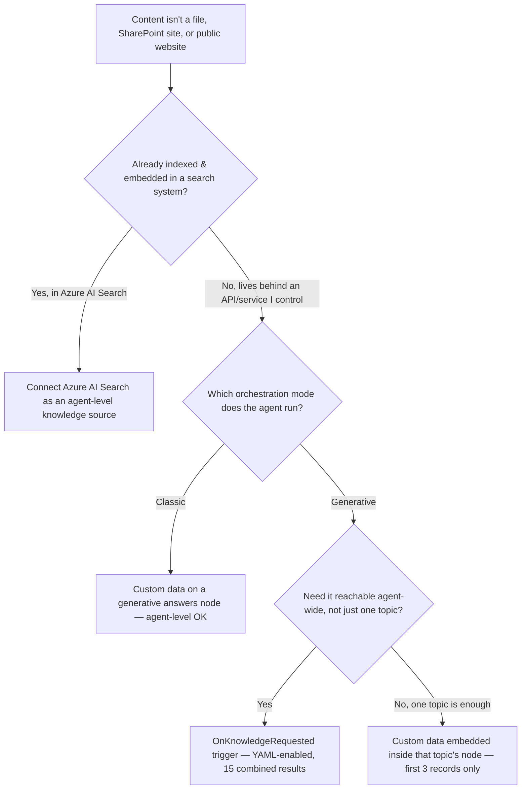

# Azure AI Search & Custom Knowledge Sources

3.1 and 3.2 both assumed your content already lives somewhere Copilot Studio knows how to read — a file, a SharePoint site, a public page. This session is about what happens when it doesn't: an index you already built yourself, or a proprietary API nobody ever wired up as a "source."


**Where this sits:** the third and last session in Group 3 — Knowledge & Grounding. 3.1 covered the built-in source types and their access models. 3.2 covered what happens to a query once it reaches one of those sources. This session closes the group with the sources that don't fit either built-in model at all.


Northwind Outfitters already has a working knowledge setup from the last two sessions: a public FAQ, a SharePoint returns policy, an uploaded PDF or two. That covers most of a support agent's job. It doesn't cover two things the engineering team mentions on a call: the product catalog already lives in a tuned Azure AI Search index that powers the website's own search bar, and the return-merchandise system exposes a proprietary lookup API that was never built to be a "file" or a "site" at all.

## Azure AI Search: connecting an index you already built

If the catalog is already indexed and embedded in Azure AI Search, re-uploading it as files would just duplicate the work, and it would go stale the moment the real index updates. Copilot Studio can point at that index directly, but only through a proper connection. Microsoft is explicit about this:


"You must add Azure AI Search through a formal data connection. Don't manually configure an endpoint and API key."


The path is Overview → **Add knowledge** → Featured → Azure AI Search (or the same option from inside a generative answers node), where you create the connection with access key, client certificate, a service principal, or Entra ID integrated auth, then point it at one vector index. One connection, one index — that's a hard limit, not a starting default.

**Why it has to be a vector index:** Copilot Studio needs to embed the user's question the same way your documents were embedded, or the similarity search is comparing apples to nonsense. Microsoft's recommended path is Azure AI Search's own **Import and vectorize data** feature with integrated vectorization, which lets "the system … use the same embedded model used to vectorize the data to also vectorize the incoming prompt at runtime" — so you're not hand-writing a function to keep the two sides of that comparison in sync. Semantic ranker is supported too, but it's configured on the Azure AI Search side first; Copilot Studio doesn't set it up for you.

Citations resolve in a fixed order: if your index has a `metadata_storage_path` field, that becomes the citation. If it doesn't, Copilot Studio falls back to whichever field holds a complete URL. Notice what's absent from that sentence — there's no permission check. Microsoft's own guidance frames it as the admin's job to "ensure that the users of your agent have the necessary permissions to access the data sources the citations point to," not something the platform verifies at query time. That's the same access-model line 3.1 drew between SharePoint's full integration (checks the signed-in user on every query) and public websites or uploaded files (doesn't check who's asking). Azure AI Search sits on the second side of that line.

The index can also sit behind a private endpoint, provided Virtual Network support is turned on for the Power Platform environment first — an environment-level prerequisite, not a per-agent toggle. And one rough edge worth knowing before you hit it: a misconfigured connection can get stuck in a broken state that Copilot Studio currently has no UI to delete. The fix is resetting the agent's external access or deleting and recreating the agent, then re-adding with Entra ID auth rather than an API key.


**A documentation quirk, flagged rather than smoothed over:** Microsoft's own knowledge-sources summary table lists public website, documents, SharePoint, Dataverse, and "enterprise data using connectors" — Azure AI Search doesn't appear as a row in that table, even though it has its own dedicated setup page and a Featured entry in Add Knowledge. That's a gap in the docs as fetched today, not a signal the feature is unsupported.


## Two different doors for content behind your own API

The RMA lookup is a different problem. It's not an index you can point Azure AI Search at. It's a live API that returns whatever the returns team's backend decides to return. Copilot Studio has two separate mechanisms for this, and they're easy to conflate because they end up shaped almost identically. Getting them backwards is the kind of mistake you'd only discover after shipping, when generative orchestration quietly refuses to use the thing you configured.

### Custom data on a generative answers node (classic)

The older mechanism lives on a generative answers node's Properties pane, under **Classic data**. You feed it a table of records shaped as `Content` (required), `ContentLocation` (optional, a URL), and `Title` (optional). Microsoft's own phrasing for what happens next is a little rough around the edges — "Agent answers are generated from Content and include the link to the data source in ContentLocation. If a Title, is it used for the citation" — but the mechanics are plain: content in, citation out. The catch is the cap. Only the first three records in that table are ever used. If the RMA lookup can return twenty matching cases, seventeen of them are invisible to the model no matter how relevant they are.

### Custom knowledge sources via OnKnowledgeRequested (newer)

The second mechanism is a topic built on a trigger called `OnKnowledgeRequested`, and Microsoft doesn't make it easy to find: it "is not visible in the UI by default and currently must be enabled via a YAML edit," by naming a topic exactly that. Once it's wired up, it fires right before the orchestrator queries knowledge sources, hands you the search phrase, and lets you write results into `System.SearchResults` — usually via a Power Fx `ForAll` expression producing the same `Content` / `ContentLocation` / `Title` shape as the classic mechanism. The cap here is fifteen, but it's a combined ceiling across every custom-knowledge topic that fires in a turn, not fifteen per topic: ten results from one topic and eight from another still only surface the best fifteen together.


**The gate that actually decides which one you use.** Microsoft states the two mechanisms' orchestration support in almost mirror-image language. On custom data: "Generative orchestration doesn't support custom data or Bing Custom Search as knowledge sources. To use those knowledge sources, you must embed them inside a generative answers node in a topic." Classic orchestration, by contrast, can use custom data straight from the agent level. On `OnKnowledgeRequested`, the opposite: generative orchestration's own custom-triggers documentation lists it as explicitly supported, described as letting an agent "intercept the moment the orchestrator is about to search the knowledge sources." If your agent runs generative orchestration — which by 3.3 in this course, yours does — the hidden YAML trigger is your agent-wide option; the classic Custom data field only reaches you inside whichever single topic's generative answers node you put it in.


| Path                  | Where content lives                  | Result cap                           | Generative orchestration, agent-wide?    |
| --------------------- | ------------------------------------ | ------------------------------------ | ---------------------------------------- |
| Azure AI Search       | Already indexed & embedded elsewhere | Whatever the retrieval query returns | Yes — added at agent level               |
| Custom data (classic) | Any API, pasted in as a table        | First 3 records                      | No — topic-level only                    |
| OnKnowledgeRequested  | Any API, wired via YAML              | 15 combined across topics            | Yes — but topic-based, hidden by default |

## Deciding which door to use

## Worked example: Northwind, both doors at once

Catalog: already a tuned Azure AI Search index → connect it directly as an agent-level knowledge source, citation resolved from `metadata_storage_path`, no re-upload, no staleness. RMA lookup: a proprietary API with no existing index → since the support agent runs generative orchestration, the classic Custom data field on a single topic's node isn't reachable agent-wide, so the team enables `OnKnowledgeRequested`, writes the RMA response into `System.SearchResults` as `Content`/`ContentLocation`/`Title`, and accepts that it shares a 15-result ceiling with every other custom-knowledge topic in the agent.

## Check your retrieval



Northwind's catalog already lives in a tuned Azure AI Search index. What citation does Copilot Studio use if the index has a `metadata_storage_path` field?

a) That field, always first

b) Whichever field has a complete URL, ignoring metadata\_storage\_path



**a.** `metadata_storage_path` is checked first; the full-URL-field fallback only applies when that field is absent.





Northwind's RMA lookup returns 20 matching cases through a Custom data field on a generative answers node. How many does the agent actually see?

a) All 20

b) The first 3 records only



**b.** Custom data on a generative answers node has its own, stricter cap: only the first three records in the table are used. The 15-result combined cap belongs to `OnKnowledgeRequested`, a different mechanism.





The support agent runs generative orchestration and needs the RMA lookup reachable from any topic, not just one. Which mechanism actually supports that?

a) Custom data on a generative answers node, added at the agent level

b) The OnKnowledgeRequested trigger



**b.** Generative orchestration explicitly excludes Custom data as an agent-level source — it only works embedded in one topic's node. OnKnowledgeRequested is the one Microsoft's own generative-orchestration docs list as supported.





Someone asks whether Azure AI Search citations are as safe to trust as SharePoint's full-integration citations. What's true?

a) Yes — Azure AI Search re-checks the signed-in user's permissions on every query, same as SharePoint full integration

b) No — Azure AI Search doesn't check who's asking; it's the admin's job to make sure the index doesn't expose anything a user shouldn't see



**b.** Azure AI Search lands on the same side of the access-model line as public websites and uploaded files from 3.1: no per-query permission check. Only SharePoint's full-integration option does that.



## Reflection

If Northwind adds a second Azure AI Search connection for their internal knowledge-base articles, what breaks first?


**ONE REASONABLE ANSWER**

Nothing breaks from having two connections — the one-index-per-connection limit is per connection, not per agent. What actually needs attention is citation resolution: if the new index doesn't have a `metadata_storage_path` field and its "full URL" field happens to be something like an internal ticket-system link rather than a customer-facing article URL, the agent will happily cite a link a customer can't open. That's worth checking before this goes live, not after a customer clicks a broken link.



**Key takeaway:** Azure AI Search, Custom data, and OnKnowledgeRequested aren't three ways to do the same thing — they're gated by where your content already lives and which orchestration mode your agent runs, and generative orchestration only leaves you two of the three doors open.


## Group 3, looking back

Three sessions ago, "knowledge source" meant picking a source type and clicking add. By the end of 3.1 that had already split into an access-model question. 3.2 showed that a correctly configured source can still produce silence, because citation is the part of the pipeline that actually decides whether an answer ships. This session adds the last piece: sources don't have to come from Microsoft's own connector list at all, provided you're willing to match the shape (`Content`/`ContentLocation`/`Title`) that's been quietly the same contract since 3.2 first introduced citations. Group 3 is done. Group 4, Tools & Actions, is next, and per the sizing engine's standing rule, it gets its own sizing pass before 4.1 starts.

## Read next

The single best next read: [Connect to custom knowledge sources](https://learn.microsoft.com/en-us/microsoft-copilot-studio/guidance/custom-knowledge-sources) — the primary source for the `OnKnowledgeRequested` mechanism, the newer, hidden path, and the one that actually works under generative orchestration.

***

**Primary sources verified this session**

1. [learn.microsoft.com/microsoft-copilot-studio/knowledge-azure-ai-search](https://learn.microsoft.com/en-us/microsoft-copilot-studio/knowledge-azure-ai-search) — Add Azure AI Search as a knowledge source (setup, vectorization, citation resolution, VNet, limitations)
2. [learn.microsoft.com/microsoft-copilot-studio/guidance/custom-knowledge-sources](https://learn.microsoft.com/en-us/microsoft-copilot-studio/guidance/custom-knowledge-sources) — Connect to custom knowledge sources (OnKnowledgeRequested, schema, 15-result cap)
3. [learn.microsoft.com/microsoft-copilot-studio/nlu-generative-answers-custom-data](https://learn.microsoft.com/en-us/microsoft-copilot-studio/nlu-generative-answers-custom-data) — Use a custom data source for generative answers nodes (classic mechanism, 3-record cap)
4. [learn.microsoft.com/microsoft-copilot-studio/knowledge-copilot-studio](https://learn.microsoft.com/en-us/microsoft-copilot-studio/knowledge-copilot-studio) — Knowledge sources summary (orchestration-support gate for custom data)
5. [learn.microsoft.com/microsoft-copilot-studio/guidance/generative-orchestration](https://learn.microsoft.com/en-us/microsoft-copilot-studio/guidance/generative-orchestration) — Apply generative orchestration capabilities (custom-triggers table confirming OnKnowledgeRequested support)
