# Grounding Mechanics and Citations

3.1 was about which source type to add. This one is about what the agent actually does with it the moment a user asks a question — and why a source you configured correctly can still produce no answer at all.


**Where this sits:** the second of three sessions in Group 3 — Knowledge & Grounding. 3.1 covered public websites, SharePoint, and uploaded files. 3.3 covers Azure AI Search and custom knowledge APIs. This one sits between them: how grounding, citation, and the "allow ungrounded responses" setting behave at answer time, on any of the sources 3.1 already taught you to configure.


## Retrieval and generation are two different jobs

The instinct is to think of a generative answer as one step: ask a question, get an answer. Copilot Studio actually splits it into two — **retrieval augmented generation**, in Microsoft's own term for it. One step goes and finds candidate content in your knowledge sources. A separate step turns that content into a sentence a person can read. Keeping these apart is what makes citation possible at all: the system can point at exactly which retrieved chunk a sentence came from, because it never blurred retrieval and wording into a single opaque step.

For public-website sources specifically, Microsoft documents three checks that run on retrieved results before they're allowed to become an answer: a **grounding check**, a **provenance check**, and a **semantic similarity cross-check** against the user's actual question. Content is checked twice more on top of that — once on the way in, once on the way out — for anything that trips the platform's harm and safety filters. None of this is exposed as a setting you can tune; it's the fixed pipeline every generative answer runs through before you ever see a response.

```mermaid
flowchart TD
    A[User question] --> B[Retrieve candidate content<br/>from knowledge sources]
    B --> C{Grounding, provenance &<br/>semantic similarity checks}
    C -->|Passes, citation present| D[Answer shown<br/>with in-text citation]
    C -->|Correct content, no citation| E{Allow ungrounded<br/>responses is ON?}
    C -->|Nothing relevant found| E
    E -->|Yes| F[Answer from general knowledge<br/>&#40;no citation guaranteed&#41;]
    E -->|No| G[Answer withheld —<br/>fallback topic triggers]
```

Everything below this section is really commentary on that one diagram: what determines which branch a real conversation takes, and which settings you actually control.

## Allow ungrounded responses — the setting that decides the right-hand branch

**Allow ungrounded responses** lives in the agent's **Generative AI** settings, under Knowledge, and it only exists when [generative orchestration](https://learn.microsoft.com/microsoft-copilot-studio/advanced-generative-actions) is turned on. What it controls is narrower than the name suggests.

**Turned on:** the agent may answer from the model's general knowledge even in a turn where it called no knowledge source and no tool at all. Useful for an agent that should still be conversational outside its documented scope — but it means "the agent didn't find anything in your FAQ" and "the agent made something up" become the same response to a user, with no distinguishing signal.

**Turned off:** any response generated in a turn where the agent used no knowledge source and no tool gets blocked outright, and the fallback topic fires instead. This is stricter than "never use general knowledge" — the model can still blend general knowledge into an answer that _did_ call a source, since the block only fires on turns with zero source or tool use.

Microsoft's own example of the failure mode this setting causes when off: a customer asks about the return policy and gets a correctly grounded, cited answer. They immediately follow up — "does that apply to sale items too?" The agent may decide it already has enough context from the first turn to answer without searching again. No source call this turn means the response gets blocked, even though the underlying answer would have been correct.

## Why a correct answer still gets withheld

With ungrounded responses off, there's a second, quieter failure mode: the model finds the right answer in a knowledge source, but the generated response doesn't carry an in-text citation to it. When that happens, the agent withholds the answer and responds as though it found nothing — not as though it found something it can't show you. Because whether a citation gets attached isn't fully deterministic, this is intermittent by nature: ask the identical question twice and the second attempt can succeed where the first didn't.

Microsoft documents three concrete levers against this, in order of how much control they hand you:

* **Add citation instructions.** Tell the agent directly, in its instructions: "Always include an in-text citation to the source document for every statement." This is the cheapest fix and the first one to try.
* **Don't fight your own citations.** An instruction like "respond only in JSON," or anything telling the model to drop references, can suppress the exact citation markers the grounding check is looking for. Keep instructions concise and don't ask for a rigid format that has no room for a citation.
* **For custom data sources specifically:** include a `ContentLocation` (URL) field and a `Title` field on the data you feed a generative answers node. Without them, there's nothing for the model to cite even if it wanted to.

## Official sources — skipping verification, at a real cost

Every knowledge source above still goes through the grounding, provenance, and similarity checks. **Official sources** is the one way to skip that: mark a source you already trust completely — three dots on the **Knowledge** page, **Official source**, **Yes** — and the agent uses it directly, without running verification on it. Responses drawing on an official source open with a distinctive marker so the user knows this content wasn't independently checked, it was pre-trusted.


**The catch:** official sources are **not compatible with generative orchestration**. If you want this feature, the agent has to run **classic orchestration** instead — which also means giving up generative orchestration's other behaviors (multi-intent recognition, the 25-source dynamic filtering, and the more generous per-source limits generative mode allows).


In practice this makes official sources a deliberate trade, not a free upgrade: you're choosing "skip verification on my most-trusted source" over "let the agent reason across multiple tools and topics in one turn." Most agents built for genuinely open-ended, multi-tool conversations will stay on generative orchestration and lean on citation instructions instead.

## Citations aren't the same on every channel

A citation that renders cleanly in the Copilot Studio test pane doesn't necessarily arrive the same way in every channel you publish to.

**Microsoft Teams' limits:**

* At most **20 citations** per response — anything past the 20th is dropped, not queued or summarized.
* Each citation's title is capped around **80 characters**; each snippet around **480 characters**. Longer ones get shortened.

There's a second, easier-to-miss gap: if you customize a generative answer's response — clearing the default **Message** node and rendering the text through a variable or an Adaptive Card instead — Teams stops adding citations automatically. Standard, non-customized generative answers still get citations for free. A customized one needs the wiring done by hand: set **Save LLM response** to **Complete** in the node's Advanced settings, then add a `SendActivity` node that reads both the text and a `citationEntities` field back out of the saved response.

## Classic vs. generative: the search-limit table, explained

3.1 mentioned this split without unpacking it. Now that you know citations and grounding checks run underneath both modes, here's what actually changes between them.

<table><thead><tr><th width="215.46484375">Knowledge source type</th><th width="215.45703125">Classic orchestration limit</th><th>Generative orchestration limit</th></tr></thead><tbody><tr><td>Public website</td><td>4 URLs</td><td>25 websites</td></tr><tr><td>SharePoint</td><td>4 URLs</td><td>25 URLs</td></tr><tr><td>Dataverse</td><td>2 sources, 15 tables each</td><td>Unlimited</td></tr><tr><td>Uploaded files</td><td>Unlimited</td><td>All uploaded documents (exempt from the 25-source cap)</td></tr><tr><td>Bing Custom Search</td><td>2 configuration IDs</td><td>Not supported directly</td></tr><tr><td>Custom data sources</td><td>3</td><td>Not supported directly</td></tr><tr><td>Azure OpenAI Service connection</td><td>5</td><td>Not supported directly</td></tr></tbody></table>

The pattern: generative orchestration is more generous everywhere it applies at all, but it flatly doesn't support Bing Custom Search, Azure OpenAI connections, or custom data as agent-level knowledge sources. The workaround for all three is the same — embed them inside a **generative answers node** on a specific topic, where they run under classic rules regardless of the agent's overall orchestration mode. That's also why a generative-orchestration agent can still hit the four-URL public-website limit and be confused about it: a node-level generative answers node uses classic orchestration internally, even when the agent around it is set to generative.

## Worked example: the Northwind follow-up question

Northwind Outfitters' support agent has the shipping-and-returns FAQ from 3.1 registered as a public website source, generative orchestration on, and **Allow ungrounded responses** off — the stricter, more defensible default for a retailer that doesn't want its agent inventing return policy.

> **Customer:** What's the return policy for online orders?
>
> **Agent:** Our return policy allows returns within 30 days of purchase, for all items including sale items. _(retrieved and cited from the FAQ)_
>
> **Customer:** Does that apply to sale items too?
>
> **Agent:** _(blocked — the agent judged it already had enough context from the previous turn and didn't call the knowledge source again this turn, so the no-source-or-tool block fires)_

Nothing is broken here — this is the documented, intended behavior of **Allow ungrounded responses: off**. The fix isn't a bug report; it's a design decision. Northwind's options: turn the setting on and accept that some answers might drift from the FAQ's actual wording on genuine follow-ups, or add an explicit citation instruction telling the agent to re-ground and re-cite on every turn that touches policy, even a follow-up. For a retailer whose return policy has real legal weight, the second option — stricter instructions, not a looser setting — is the one that keeps the agent's answers traceable to an actual source.

## Check your retrieval



Allow ungrounded responses is off. In a single turn, the agent answers a question by blending content from a knowledge source with some of the model's own general knowledge. Is this response blocked?

a) Yes — any use of general knowledge is blocked when the setting is off&#x20;

b) No — the block only fires when the turn used no knowledge source or tool at all



**b.** Turning the setting off doesn't guarantee the agent never uses general knowledge — the model can still blend it with retrieved content. It only blocks responses from a turn where no knowledge source or tool was called at all.





The model retrieves the exact right answer from a knowledge source, but the generated text doesn't include an in-text citation. With ungrounded responses off, what does the agent do?

a) Shows the answer anyway, without a citation&#x20;

b) Withholds the answer and responds as though it found nothing



**b.** No citation means the agent treats it the same as "no relevant information found" — even though the content it retrieved was correct. Asking again can produce a different result, since citation generation isn't fully deterministic.





You want to mark your most-trusted knowledge source as an official source so the agent skips verification on it. What do you have to give up to do that?

a) Nothing — official sources work in any orchestration mode&#x20;

b) Generative orchestration — official sources require classic orchestration



**b.** Official sources are explicitly incompatible with generative orchestration. Using the feature means switching the agent to classic orchestration, which also changes its per-source limits and gives up generative orchestration's multi-intent behavior.





You customize a generative answers node's response by clearing the Message node and rendering the answer through an Adaptive Card. Your agent runs in Microsoft Teams. What happens to citations?

a) Teams renders them automatically, the same as an uncustomized answer&#x20;

b) They don't render — you have to wire them back in by hand



**b.** Teams only auto-adds citations to non-customized generative answers. A customized response needs Save LLM response set to Complete and a SendActivity node reading a citationEntities field to get citations back.



## Reflection

Reflection: why withhold a correct-but-uncited answer instead of just showing it without the citation?


**ONE REASONABLE ANSWER**&#x20;

A citation is the only thing separating "the agent found this in your actual documentation" from "the model produced text that happens to be right this time." Showing an uncited answer trains users to trust responses they can't verify — fine occasionally, corrosive at scale in a support agent people rely on for policy questions. Withholding is the more conservative failure: it costs an occasional "I don't have that information" on a genuinely correct answer, in exchange for never presenting unverifiable text as if it were sourced. For a retailer's return-policy agent specifically, that trade favors withholding — an annoyed customer who has to ask again costs less than one who acted on a policy the agent never actually verified.



**Key takeaway:** a knowledge source configured correctly can still produce no answer — citation, not retrieval, is usually the actual bottleneck, and it's the one you can influence directly through instructions.


## Read next

The single best next read: [Citations aren't rendered for customized answers](https://learn.microsoft.com/microsoft-copilot-studio/publication-add-bot-to-microsoft-teams#citations-arent-rendered-for-customized-answers), in the Teams publishing guide. It's the most concrete, code-level version of the "citations aren't automatic once you customize" problem this session only sketched — worth reading in full before you ever clear a Message node in a generative answers topic.

***

**Primary sources verified this session**

1. [learn.microsoft.com/microsoft-copilot-studio/knowledge-copilot-studio](https://learn.microsoft.com/microsoft-copilot-studio/knowledge-copilot-studio) — Knowledge sources summary (agent settings, official sources, classic/generative search limits)
2. [learn.microsoft.com/microsoft-copilot-studio/guidance/generative-ai-public-websites](https://learn.microsoft.com/microsoft-copilot-studio/guidance/generative-ai-public-websites) — Use public websites to improve generative answers (grounding/provenance/similarity checks, RAG)
3. [learn.microsoft.com/microsoft-copilot-studio/publication-add-bot-to-microsoft-teams](https://learn.microsoft.com/microsoft-copilot-studio/publication-add-bot-to-microsoft-teams) — Connect and configure an agent for Teams and Microsoft 365 (customized-answer citation wiring)

The Northwind follow-up-question example above adapts Microsoft's own return-policy example from the knowledge-copilot-studio page (originally generic) to the course's running Northwind Outfitters scenario; the behavior described is verbatim from that source, only the retailer name is invented.
