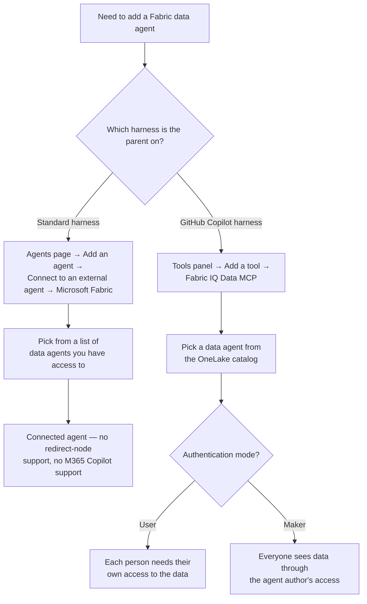

# Agent2Agent Protocol and Fabric Data Agents

6.2 and 6.3 covered agent types with one clear, settled way in: a picker for another Copilot Studio agent, a form for a Foundry agent. This session closes out 6.1's six-type list with two mechanisms that are each unsettled in their own way — one because it's an open, multi-vendor protocol with none of Copilot Studio's own opinions baked in, the other because it turns out to have two completely different integration paths depending on which harness is asking.


A2A doesn't ask "is this agent published in my environment" the way 6.2's connected agent did — it asks for an endpoint URL and tries to read the agent's own self-description off the wire. And Fabric data agents, which this course has been citing as one of the standard harness's six addable "other agent" types since 6.1, turn out to have a second, entirely separate integration path that isn't an agent connection at all — it's a tool, and it only exists for a different harness.


## What the A2A protocol actually is

The Agent2Agent (A2A) protocol was originally developed by Google and donated to the Linux Foundation, where it's now governed by a Technical Steering Committee with representatives from AWS, Cisco, IBM Research, Microsoft, Salesforce, SAP, and ServiceNow, under the Apache 2.0 license \[1]. It's an open standard for agent-to-agent communication — a "common language" so agents built on different frameworks (LangGraph, CrewAI, Semantic Kernel, or anything else) can delegate tasks to each other without exposing their internal memory, tools, or reasoning \[1].

Microsoft's own framing draws the same protocol-family line 6.1 drew for MCP, just in the other direction: A2A is explicitly "complementary to MCP" — MCP standardizes how an agent calls a _tool_, A2A standardizes how one agent calls _another agent_ \[2]. Group 4 taught MCP as a tool-level integration; A2A is the agent-level counterpart to that same protocol family, and Copilot Studio treats it accordingly — as one of the six addable "other agent" types, not a tool.

| Feature                         | A2A protocol | Plain HTTP connector |
| ------------------------------- | ------------ | -------------------- |
| Designed for agent workflows    | Yes          | No                   |
| Supports multiturn interactions | Yes          | No                   |
| Rich contextual metadata        | Yes          | Limited              |
| Interoperable across frameworks | Yes          | Varies               |

Use an A2A connection specifically when the other agent already speaks the protocol, is built on an external framework, is hosted outside Copilot Studio, and carries its own domain-specific reasoning. For a plain API, Microsoft's own guidance still points to a custom connector or HTTP tool (Group 4); for an MCP server, an MCP tool connection; for a Microsoft 365 Agents SDK agent, the Activity Protocol path 6.2 already covered \[2]. A2A is the answer only when the other side is a genuine agent, already speaking A2A.

## Connecting an agent over A2A



### Add agent → A2A agent

From the parent's Agents page, select **Add agent**, then **A2A agent** \[2].



### Enter the endpoint URL — not the card URL

This must be the agent's message-communication endpoint, not the URL of its agent card. Get this wrong and the connection has nothing to talk to, even if the card itself is reachable \[2].



### Let the agent card populate the form — or fill it by hand

If a valid agent card exists at the standard `.well-known` location (the endpoint plus `/.well-known/agent.json`), Copilot Studio reads the name and description straight off it. If nothing populates, the card may be missing, misplaced, or unreachable — check the endpoint first, then enter a name and description by hand, written the same way 6.1 taught: specific enough that the parent can tell when to route here \[2].



### Choose the authentication method

None, API key (header or query parameter), or OAuth 2.0 (client ID, client secret, authorization URL, token URL, refresh URL) — matched to however the target A2A agent is actually configured \[2].



### Save, connect, and configure

Select an existing connection or create a new one, then **Add and configure**. Because A2A connections run on the same custom-connector infrastructure as Group 4's connectors, this same flow works for an A2A agent hosted on-premises or inside a virtual network, not just a public endpoint \[2].




**Every A2A turn carries the full conversation, automatically.** 6.2 taught a connected Copilot Studio agent's **Pass conversation history to this agent** checkbox as an opt-in choice — clear it, and the connected agent gets only the explicit task. A2A doesn't offer that choice. Every message payload includes a `contextId`, message IDs, locale, and the full chat history — not just the latest turn — plus whatever content parts (text, tool calls, other metadata) the exchange carries \[2]. An A2A agent's own logic decides what to do with that history; Copilot Studio doesn't gate it the way it gates a connected agent's.


## Fabric data agents: one name, two integration paths

6.1's addable-agent-types list has named Fabric data agents (preview) since the start of Group 6, alongside A2A and Foundry, as one of the six standard-harness types \[3]. That's still accurate — but researching this session surfaced something the earlier sessions' list didn't anticipate: as of this fetch, there are now two genuinely different ways to add a Fabric data agent to a Copilot Studio agent, and which one is even available depends on the parent's harness, not on maker preference.

The newer of the two documentation pages says it plainly: "This article covers the tool-based experience. In earlier releases, you added a Fabric data agent from the Agents category as a connected agent." \[4] That sentence is doing a lot of work — it's confirming that the connected-agent mechanism this course's Group 6 list has assumed since 6.1 is the _older_ of two paths, and that a newer, structurally different one now exists for a different harness.

### Standard harness — a connected agent (this course's path)

For the standard harness this course has used throughout, Fabric data agents still work the way 6.1's list implied: as a connected agent, added from the Agents page \[3].

1. Agents page → **Add an agent** → under **Connect to an external agent**, select **Microsoft Fabric**.
2. Pick an existing connection to Fabric, or create a new one.
3. Select **Next**, then choose the desired agent from the Fabric data agents you have access to.
4. Adjust the description so it's specific enough not to overlap other tools or agents — the same "sharpen it" discipline 6.1 through 6.3 have each applied.

That's the entire documented flow for this path — five steps' worth in the earlier, four-step page and barely more in the newer walkthrough \[3]. It reuses the exact "Add an agent → Connect to an external agent" entry point A2A and Foundry both use.

### GitHub Copilot harness — a tool, not an agent

For an agent built on the GitHub Copilot harness, Fabric data agents aren't reached from the Agents page at all. They're added from the **Tools** panel, as a tool called **Fabric IQ Data MCP** — connected once via a Fabric connection, then configured per data agent with its own description and one of two authentication modes: **User** (each person needs their own access to the data agent and its data sources) or **Maker** (everyone sees data through the agent author's access) \[4]. That User/Maker split is the same distinction 4.1 taught as end-user credentials versus maker-provided credentials for connectors — same idea, reapplied to a completely different kind of tool. Multiple Fabric data agents can be added this way, each as its own tool with its own description and authentication mode, sitting alongside whatever other tools and knowledge sources the agent already has \[4].


**A fourth harness-shaped fork — but a different kind than 5.3, 6.1, or 6.3's.** This is the fourth time this course has hit a capability that splits along harness lines: 5.3's Activity page versus the GitHub-Copilot-harness "activity trace," 6.1's MCP-is-a-tool-not-an-agent boundary, 6.3's two same-titled `authoring-add-other-agents` pages. The first three were documentation traps — the same or adjacent capability described inconsistently, or two pages competing for one title. This one is different in kind: Fabric data agents genuinely work differently by harness. One harness gets an agent-level connection with a description and nothing else to configure; the other gets a tool with per-data-agent authentication modes. Neither documentation page is wrong about the other's harness — they're each accurately describing a real, separate mechanism.


## What the standard-harness path can't do

Two limitations apply specifically to the connected-agent (standard-harness) path this course uses, both already on record from 6.2's own source but not yet explained until a Fabric agent was actually on the table: Fabric data agents can't currently be reached through the **Redirect to an agent** topic node, and they don't function when the main agent is deployed to Microsoft 365 Copilot \[3]. The redirect gap means a Fabric data agent can only be invoked the way a connected agent normally is — left to the orchestrator's own routing — never explicitly redirected to mid-topic the way 6.2's redirect node can reach a child or connected Copilot Studio agent.

## A2A agent vs. Fabric data agent, standard harness

| Aspect                         | A2A agent                                                           | Fabric data agent (standard harness)                                                 |
| ------------------------------ | ------------------------------------------------------------------- | ------------------------------------------------------------------------------------ |
| What you supply                | An endpoint URL plus an auth method — the agent card fills the rest | A Fabric connection, then pick from a list of data agents you already have access to |
| Governing standard             | An open, multi-vendor protocol (Linux Foundation)                   | A Microsoft-specific integration, no external protocol                               |
| Conversation history           | Always sent — no opt-out                                            | Not documented as a separate toggle at all                                           |
| Redirect-from-topic support    | Not called out as unsupported                                       | Explicitly unsupported                                                               |
| Works in Microsoft 365 Copilot | Not called out as unsupported                                       | Explicitly unsupported                                                               |
| On a different harness         | Standard-harness feature only, as documented                        | A different mechanism entirely — a tool, on GitHub Copilot harness                   |

## Northwind: two more connections

6.2 gave Northwind two connected Copilot Studio agents (Billing, Product-Support); 6.3 added a Foundry-hosted Returns Risk Scoring agent. This session adds one of each remaining type — an A2A agent Northwind doesn't own, and a Fabric data agent over Northwind's own analytics.



### A2A: connect a carrier's own tracking agent

Northwind's shipping partner, Meridian Freight, already exposes an A2A-compliant agent for real-time carrier tracking — detail Northwind's own order-status lookup (2.4, 4.5) doesn't have, since that only reads Northwind's own order records. Add agent → A2A agent → Meridian's public endpoint URL → API key authentication (Meridian issues one per integration) → save and test with a real tracking number.



### Fabric: connect a Sales & Inventory Insights data agent

Northwind's ops team already maintains a published Fabric data agent over its sales and inventory warehouse. Add an agent → Connect to an external agent → Microsoft Fabric → the existing Fabric connection → select _Sales & Inventory Insights_ → description: "answers analytical questions about order volume, sales trends, and inventory levels — not individual order status, which the order-status tool already handles."



### Write non-overlapping descriptions against everything else

Meridian's description is scoped to carrier-side tracking detail specifically; the Fabric agent's is scoped to aggregate analytics specifically — neither should be able to answer the other's questions, and neither overlaps 4.5's order-status REST tool, which answers "where is order #1042," not "how many orders shipped last week" or "what's Meridian's current transit estimate."



### Test both, including a boundary case

Ask the Fabric agent a single-order tracking question and confirm it declines or defers rather than guessing from aggregate data; ask Meridian's A2A agent an inventory question and confirm the same in reverse — 6.1's domain-mismatch testing, applied to two mechanisms that have never been tested against each other before.



## Which harness, which mechanism


**Key takeaway.** A2A and Fabric data agents are the two entries on 6.1's list with the least Copilot-Studio-specific structure behind them — one because it's governed by an outside standards body and asks for nothing but an endpoint and an auth method, the other because "Fabric data agent" turns out to name two structurally different mechanisms depending on which harness is asking. Neither gap is a documentation mistake to resolve; both are real seams in how far Copilot Studio's own rules reach.


## Check your retrieval



What does Copilot Studio try to read from an A2A agent's endpoint URL plus `/.well-known/agent.json`?

* Its authentication credentials
* Its name and description, to auto-populate the connection form
* A list of every tool the agent has access to
* The agent's full conversation history



**Its name and description, to auto-populate the connection form.** If a valid agent card exists at the standard `.well-known` location, Copilot Studio automatically pulls the agent's name and description from it and populates the connection form.





Unlike a connected Copilot Studio agent's "Pass conversation history to this agent" checkbox, what does an A2A connection do with chat history?

* It never sends chat history, only the current message
* It sends chat history only if the target agent explicitly requests it
* It always sends the full chat history as part of every message payload, with no opt-out
* It sends a summary of the chat history, not the full text



**It always sends the full chat history as part of every message payload, with no opt-out.** A2A message payloads include the full chat history, not just the latest turn, as part of the protocol's standard metadata — there's no equivalent opt-out toggle to 6.2's connected-agent checkbox.





For an agent on the GitHub Copilot harness, how is a Fabric data agent added?

* The same way as the standard harness — as a connected agent from the Agents page
* As a tool called Fabric IQ Data MCP, added from the Tools panel
* It can't be added to a GitHub Copilot harness agent at all
* Only through the Microsoft 365 Agents SDK



**As a tool called Fabric IQ Data MCP, added from the Tools panel.** On the GitHub Copilot harness, a Fabric data agent is added as a tool (Fabric IQ Data MCP) from the Tools panel, not as a connected agent from the Agents page — a structurally different mechanism from the standard-harness path.





Which two things does the standard-harness Fabric data agent connection NOT support, as documented?

* Custom descriptions and multiple data agents per parent
* The Redirect to an agent topic node, and deployment to Microsoft 365 Copilot
* Authentication modes and connection reuse
* Testing in the Preview tab and publishing to Teams



**The Redirect to an agent topic node, and deployment to Microsoft 365 Copilot.** A Fabric data agent connected the standard-harness way can't currently be reached through the Redirect to an agent topic node, and doesn't function when the main agent is deployed to Microsoft 365 Copilot.



## Reflection

A2A sends an external agent the full chat history on every turn, with no opt-out toggle like 6.2's connected-agent setting. Northwind is about to connect Meridian's carrier-tracking agent over A2A. What's actually at stake in that difference, and would you connect it anyway?


**ONE REASONABLE ANSWER** Meridian's agent — a third party outside Northwind's own environment — receives the customer's entire conversation history on every tracking query, not just the tracking number, unlike a connected Copilot Studio agent where history-sharing is a deliberate, revocable choice. That's a real data-sharing decision, not a technical footnote — it's exactly what the external-agent responsibilities checklist from 6.3 (data flows, handling, and sharing) exists to catch before connecting, not after. Whether to proceed depends on what's actually in that history and what Meridian's own data-handling terms say about it — the same judgment call 6.3 flagged for Foundry agents, now applied to a partner Northwind doesn't build or host at all.


**Read next:** [Connect an agent available over the Agent2Agent (A2A) protocol](https://learn.microsoft.com/en-us/microsoft-copilot-studio/add-agent-agent-to-agent) — the full setup reference and sample walkthrough this session's steps are drawn from.

1. [Agent2Agent (A2A) Protocol overview](https://a2a-protocol.org/latest/) — the protocol's own site: governance (Google origin, Linux Foundation, Technical Steering Committee), Apache 2.0 license, and its stated relationship to MCP.
2. [Connect an agent available over the Agent2Agent (A2A) protocol](https://learn.microsoft.com/en-us/microsoft-copilot-studio/add-agent-agent-to-agent) — connection steps, authentication options, the A2A-vs-HTTP-connector comparison, and the full message-payload metadata.
3. [Connect to a Microsoft Fabric Data agent (preview)](https://learn.microsoft.com/en-us/microsoft-copilot-studio/add-agent-fabric-data-agent) — the standard-harness connected-agent flow this course uses, and (via [Add other agents overview](https://learn.microsoft.com/en-us/microsoft-copilot-studio/authoring-add-other-agents), reused from 6.1-6.3) the redirect-node and Microsoft 365 Copilot limitations.
4. [Add a Fabric data agent as a tool in Microsoft Copilot Studio](https://learn.microsoft.com/en-us/fabric/data-science/data-agent-microsoft-copilot-studio-tool) — the newer, GitHub-Copilot-harness tool-based path (Fabric IQ Data MCP), fetched specifically to confirm it's a genuinely separate mechanism, not a rewrite of the standard-harness one. Also fetched: [Consume a Fabric Data Agent in Microsoft Copilot Studio (preview)](https://learn.microsoft.com/en-us/fabric/data-science/data-agent-microsoft-copilot-studio), the Fabric-docs mirror of the standard-harness flow, confirming no conflict between the two Copilot-Studio-side descriptions.
