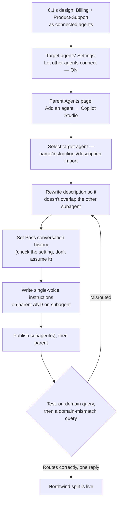

# Building Child and Connected Agents

6.1 designed Northwind's Billing/Product-Support split on paper and concluded, on all three criteria, that it should be built as two connected agents. Design and build turn out to be different skills — this session is where the "own governance," "own reuse," "check the setting, don't assume it" language from 6.1 becomes a specific checkbox you either tick or don't.


Two build paths exist because 6.1 named two shapes. A child agent is created from inside the parent's own Agents page — it has no separate existence. A connected agent already exists as its own published agent somewhere in the environment, and you're wiring the parent to reach it. The steps look superficially similar (both start at "Add an agent") and diverge almost immediately — which is exactly where a maker moving fast can build the wrong one.


## Building a child agent

A child agent is, in Microsoft's own phrasing, a "lightweight agent that exists within the context of your main agent" — built for "single use cases that respond to a single intent or complete a single task." It's created, not connected:



### Open Add on the Agents page

From the main agent's **Agents** page, select **Add**, then **New child agent**.



### Name it and set when it fires

Enter a distinctive name. Default trigger behavior is _"The agent chooses — Based on description,"_ using a short description you write — or expand **"When will this be used?"** to pick an explicit event instead: a message received, a custom client event, any activity, a conversation-update event, an invoke activity, being redirected to from a topic, user inactivity, the parent's plan completing, or right before the parent sends its AI-generated response.



### Write its instructions

Enter instructions the child agent follows once invoked, using `/` to reference tools, variables, or Power Fx formulas inline.



### Scope its knowledge and tools

Optionally attach knowledge and tools exclusive to this child agent — separate from whatever the parent already has.



### Enable and save

Toggle **Enabled** if it should be active immediately, then **Save**.



Left alone, a child agent's contract with its parent is deliberately loose: _"By default, a child agent receives a natural language task to accomplish from the main agent when the agent calls it. When it completes its task, it returns a natural language summary of what happened during its execution."_ No typed inputs or outputs are required — the parent just hands over a sentence and gets a sentence back.

Typed inputs and outputs are opt-in, configured separately from the creation steps above: from the parent's Agents page, open the child agent, scroll to **Inputs**, and **Add Input** — a display name, description, data type, and optionally **Make this input required**. The advanced settings go further than a simple required flag: **Should prompt user** makes the agent explicitly ask the end user for the value "if the agent can't find the value from available context," with up to two reprompts, a validity **Condition**, and an explicit fallback (escalate, set a specific value, or leave it empty) for when nothing satisfies it. Outputs are simpler — a display name, description, and data type under the child agent's **Outputs → Advanced** section.

What the parent does with those outputs is its own choice, set under **Outputs → After running**: **Don't respond** (default — just continue orchestrating), **Write the response with generative AI** (compose a message using the outputs as context), **Send specific response**, or **Send an adaptive card** — the same fourth Completion option 4.4 covered for tools, reused here for child agents.


**Why bother with a child agent at all**

Because it gets its own orchestration limits: _"child agents have their own orchestration, they have their own limits for the number of tools, separate from the limits of the parent agent... you can logically group tools and knowledge into smaller agents that focus on specific tasks, without impacting the overall limits of the main agent."_ The tradeoff is stated just as plainly: _"there's a tradeoff, however, in the latency added by the added layer of orchestration."_ This mechanism, like everything else in this section, requires the standard harness.


## Building a connected agent

A connected agent already exists — it's a separately published Copilot Studio agent somewhere in the same environment. Connecting to it is a two-sided setup: the target agent has to allow it, and the parent has to add it.



### Confirm the target agent is connectable

On the agent you want to connect _to_, open its **Settings** page and turn on **"Let other agents connect to and use this one"** if it isn't already.



### Check the remaining prerequisites

The target agent must sit in the same environment as the main agent, must already be published, and the maker adding it must either own it or have it shared with them.



### Add it from the parent

On the main agent's **Agents** page, select **Add an agent**, then under **Connect to an external agent** choose **Copilot Studio**, and pick the target from the list of available agents. Its name, instructions, and description populate automatically.



### Sharpen the description

_"Make the description more specific if you have other tools or agents where the descriptions might overlap. Update the description to ensure Copilot Studio can understand when to invoke the second agent."_ This is 6.1's "give the parent something to route on" practice, made concrete: a vague imported description is exactly the failure mode that practice warned about.



### Decide the context-inclusion setting

A checkbox, **"Pass conversation history to this agent,"** controls the data handoff 6.1's governance table named as its own obligation. Leave it checked to pass history along; clear it to limit "the information being passed to the agent to just the explicit task that the main agent wants the other agent to complete."




**The description doesn't stay in sync**

_"Once an agent is connected, you control its description locally. Any updates to the connected agent's description don't automatically sync with your main agent. You must update the local description manually if you want to reflect those changes."_ And the connection itself only ever uses what's published: _"If you make changes to a connected agent, be sure to publish those changes. Your main agent can only use the latest version of a connected agent after that agent is published."_ Two separate staleness risks, both silent — neither throws an error, both just quietly serve outdated behavior.


One more connection type is worth knowing exists, even without building one this session: a **Microsoft 365 Agents SDK agent (preview)** connects a custom-coded agent — built in C#/.NET, JavaScript, or Python outside Copilot Studio entirely — by pointing the parent at its messaging endpoint URL (typically ending `/api/messages`) and an authentication method, added the same way through **Add an agent → Connect to an external agent**. Northwind doesn't need one yet, but the option exists for a future subagent that's easier to write in code than to author in the canvas.

## Redirecting to an agent from a topic

Both child and connected agents can also be invoked explicitly, mid-topic, rather than left for the parent's own orchestration to discover. From the authoring canvas, select the add-node icon after the point where the redirect should happen, then choose the agent under the **Add an agent** submenu.

The conversation doesn't end there — it comes back: _"Once the agent is done, the originating topic where you redirected from resumes. You can insert more nodes after the agent redirect node as needed."_ And it's not a black box handoff: _"Some agents support passing input and retrieving output variables, such as when you configure inputs and outputs on a child agent. If inputs are available, you can add them via the node and set a value for each one. Each output for the agent automatically has a topic variable created where the values from the outputs are placed."_ The one documented gap: _"Redirecting to Fabric Data agents isn't currently supported."_

## Building Northwind's Billing/Product-Support split

6.1 concluded connected agents on all three criteria. This is that design, actually wired up — assuming Billing and Product-Support already exist as their own published Copilot Studio agents (Billing carrying 4.5's REST-API eligibility check and refund-approval flow; Product-Support carrying Group 3's knowledge sources), with a single Northwind agent as the parent that talks to the customer.



### Open both subagents up for connection

On Billing's Settings page, turn on **"Let other agents connect to and use this one."** Repeat on Product-Support's Settings page.



### Connect Billing to the parent

From the Northwind parent agent's Agents page, **Add an agent → Copilot Studio**, select **Billing**. Rewrite its imported description to something specific: handles order payment status, refund eligibility, and billing disputes — not general product questions.



### Connect Product-Support to the parent

Repeat for **Product-Support**, with a description that doesn't overlap Billing's: answers FAQs and product questions grounded in Northwind's knowledge sources — not billing or payment issues. Two non-overlapping descriptions are what let the parent's routing decision mean anything at all.



### Keep conversation history flowing to both

Leave **Pass conversation history to this agent** checked on both connections. A customer who already mentioned an order number to the parent shouldn't have to repeat it to Billing — but this is a deliberate choice, not the only correct one, and it's the kind of choice 6.1's governance table says to make on purpose rather than by default.



### Write the single-voice instructions, twice

On the parent: it alone replies, and must combine whatever each subagent returns into one response. On each subagent's own instructions: never reply to the user directly, only return findings — the same instruction 6.1 recommended repeating a second time inside the delegated task text itself, in MUST/NEVER language rather than "please try to."



### Publish everything and test the seam

Publish Billing, publish Product-Support, then publish the parent — the parent can only reach whatever version of each subagent is currently published. Test with an on-domain question for each ("why was I charged twice for order 4482" → Billing; "what's your return policy for damaged furniture" → Product-Support), then with a domain-mismatch question that matches neither, exactly as 6.1's ninth practice recommends.



## From design to a running handoff


**Key takeaway**

Building a connected agent is mostly wiring, not design — but two of those wires (the description, and the conversation-history checkbox) are exactly the two things 6.1 said to decide on purpose, and a build session is where "on purpose" either happens or quietly doesn't.


## Check your retrieval



By default, with no inputs or outputs configured, what does a parent agent send to a child agent, and what does it get back?

1. Structured JSON matching a fixed schema in both directions
2. A natural language task description in, a natural language summary of what happened back — typed inputs/outputs are opt-in, configured separately
3. Nothing — child agents require inputs and outputs to be configured before they can be called at all
4. The full conversation transcript in, and a full conversation transcript back



**A natural language task description in, a natural language summary of what happened back — typed inputs/outputs are opt-in, configured separately.** The documented default is loose on purpose: a natural-language task in, a natural-language summary out. Adding typed inputs and outputs — with prompting, reprompt limits, and conditions — is an explicit extra step, not the default contract.





Which of these is NOT one of the documented prerequisites for connecting to an existing Copilot Studio agent?

1. The target agent must be in the same environment as the main agent
2. The target agent must already be published
3. The target agent must be rebuilt using the standard harness specifically for this connection
4. The maker must own the target agent or have it shared with them



**The target agent must be rebuilt using the standard harness specifically for this connection.** Same environment, already published, and maker ownership/sharing are the three stated prerequisites, alongside the target having "Let other agents connect" turned on. No rebuild requirement is documented.





A maker updates the description of an agent that's already connected to three different parent agents elsewhere. What happens to those three parents' copies of that description?

1. All three update automatically the next time each parent is published
2. Nothing updates automatically — each parent controls its own local copy of the description, which must be edited manually to reflect the change
3. Only the parent that was published most recently picks up the change
4. The description can't be changed once an agent has any connections



**Nothing updates automatically — each parent controls its own local copy of the description, which must be edited manually to reflect the change.** The connected agent's description is copied locally at connection time and stays that way. A source-agent edit doesn't propagate — each parent's local description has to be updated by hand, which is exactly the kind of silent drift worth checking for during a build session.





What happens to the conversation when a topic node redirects to an agent, and what's the one documented redirect limitation?

1. The conversation ends permanently at the agent; Fabric Data agents are the only type that CAN be redirected to
2. The originating topic resumes once the agent finishes, with inputs and outputs wired as variables; redirecting to Fabric Data agents isn't currently supported
3. The agent takes over the whole conversation with no way back to the original topic; there are no documented redirect limitations
4. Redirect nodes can only target child agents, never connected agents



**The originating topic resumes once the agent finishes, with inputs and outputs wired as variables; redirecting to Fabric Data agents isn't currently supported.** The originating topic resumes after the agent completes, and configured inputs/outputs pass as topic variables in both directions. The one documented gap is that Fabric Data agents specifically can't be reached through a redirect node.



## Reflection

You published Billing and Product-Support as connected agents with conversation history passed to both. During testing, "is my order 4482 eligible for a refund?" gets answered by Product-Support instead of Billing. The parent's own instructions already say "route billing questions to Billing." What's the more likely fix — rewriting the parent's routing instructions, or something from this session's steps — and why?


**ONE REASONABLE ANSWER**

More likely the fix is Product-Support's own description, not the parent's instructions. The parent routes primarily off each connected agent's description — that's the whole point of "sharpen the description" in the build steps above — so if Product-Support's description is broad enough to plausibly cover "refund eligibility," the parent has a legitimate reason to consider it a match, no matter how explicit the parent-level routing instructions are. Tightening Product-Support's description to explicitly exclude billing and payment topics addresses the actual routing signal; rewriting the parent's instructions again just repeats an instruction that was never the weak link.


## Read next

[Add a child agent](https://learn.microsoft.com/en-us/microsoft-copilot-studio/add-agent-child-agent) — the full build reference this session's child-agent steps are drawn from, including every input/output advanced setting.

**Sources verified this session:**

1. [Add a child agent](https://learn.microsoft.com/en-us/microsoft-copilot-studio/add-agent-child-agent) — child agent definition, creation steps, default natural-language contract, input/output configuration, After-running options, own-orchestration tool limits and latency tradeoff, standard-harness requirement.
2. [Connect to an existing Copilot Studio agent](https://learn.microsoft.com/en-us/microsoft-copilot-studio/add-agent-copilot-studio-agent) — connected-agent prerequisites, the "Let other agents connect" setting, add-an-agent steps, description-overlap guidance, Pass conversation history checkbox, description-sync and publish-version gotchas.
3. [Connect to a Microsoft 365 Agents SDK agent](https://learn.microsoft.com/en-us/microsoft-copilot-studio/add-agent-microsoft-365-agents-sdk-agent) — code-built agent connection (preview), messaging endpoint URL, authentication.
4. [Add other agents overview — redirect to an agent from a topic](https://learn.microsoft.com/en-us/microsoft-copilot-studio/authoring-add-other-agents#redirect-to-an-agent-from-a-topic) — the redirect node, resumed-topic behavior, input/output variable wiring, the Fabric Data agent redirect limitation.
5. [Multi-agent orchestration patterns and best practices](https://learn.microsoft.com/en-us/microsoft-copilot-studio/guidance/multi-agent-patterns) — reused from 6.1 for the single-voice-reply instruction pattern applied to this session's build.
