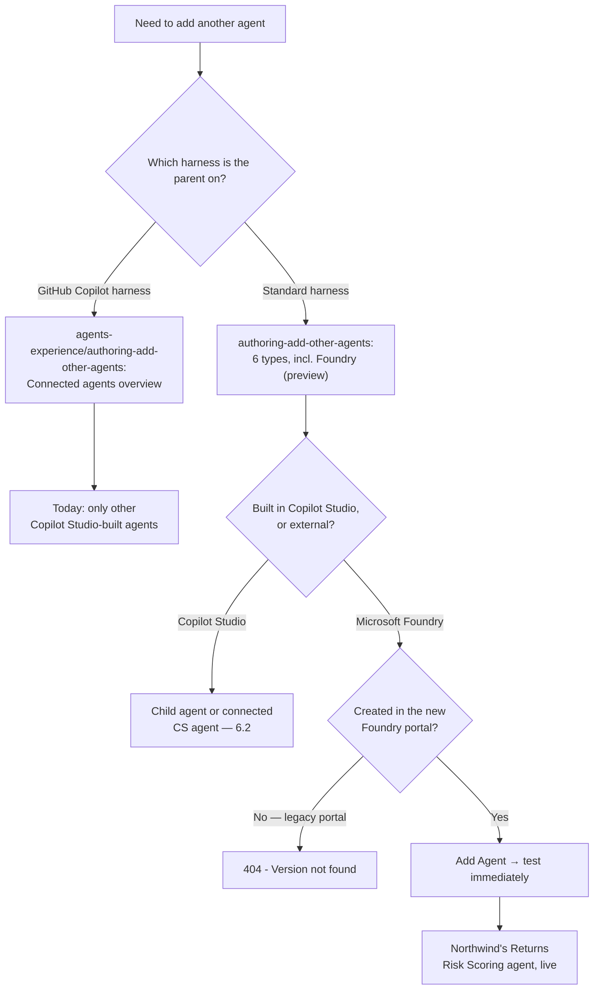

# Integrating a Foundry Agent

6.2 built two shapes of "another agent" — child and connected — and both live entirely inside Copilot Studio, published to the same environment as the parent. This session's agent doesn't. A Microsoft Foundry agent is built, hosted, and versioned somewhere else, and the Add-an-agent dialog you already know now has to reach across that boundary.


**Same dialog, different neighborhood.** Adding a Foundry agent starts at the identical place as 6.2's connected agent — the Agents page, **Add an agent** — but every step after that asks for something a Copilot Studio agent never needed: a project endpoint, an agent ID, and proof the source agent was built somewhere specific. Get that last part wrong and Copilot Studio doesn't quietly misroute — it throws an error.


## What a Foundry agent is, and what it isn't

A Microsoft Foundry agent is an agent authored and run inside a Microsoft Foundry project — Microsoft's platform for building and hosting agents with custom models, tools, and orchestration outside Copilot Studio's own canvas. Connecting one to a Copilot Studio agent is documented as a distinct, preview-stage connection type, separate from both the child agent and the connected-Copilot-Studio-agent mechanisms 6.2 built.

It requires the parent agent to be on the **standard harness** — the same harness every mechanism in this course has assumed since 1.2, and worth restating precisely here because it turns out not to be a given for every agent-connection feature (more on that below).

## Prerequisites — and the gotcha hiding in them

Three things have to be true before the Add-an-agent dialog will even take you anywhere useful: the target must be a Microsoft Foundry agent built in the **new Foundry portal**, and you need that Foundry project's endpoint URL plus the target agent's Agent ID in hand.


**Legacy-portal agents don't degrade — they error.** Point the connection at an agent created in Microsoft's previous (legacy) Foundry portal and Copilot Studio doesn't fall back to some partial behavior. It returns `404 - Version not found`. Unlike 6.2's staleness gotchas — a stale description or an unpublished change, both silent — this one refuses to connect at all, which is a kinder failure mode in one sense (you find out immediately) and a more confusing one in another (a maker who doesn't already know about the old-portal split has no obvious reason to guess that's the cause of a generic-looking version error).


## Connecting a Foundry agent



### Open Add an agent, choose the external path

From the parent's **Agents** page, select **Add an agent**, then under **Connect to an external agent** choose **Microsoft Foundry**.



### Create or select a connection

Pick an existing connection to the Foundry project, or create a new one — creating one asks for the project's endpoint URL.



### Enter the agent's details

Fill in a **Name**, a **Description** the parent will use to decide when to invoke this agent, and the target's **Agent ID**.



### Sharpen the description

The same discipline 6.1 named and 6.2 applied twice: make the description specific enough that it doesn't overlap whatever else the parent can already reach, so the routing decision has something real to key off of.



### Add the agent and test immediately

Select **Add Agent**, then test right away rather than waiting for a full publish cycle — the fastest way to find a legacy-portal 404 or a wrong Agent ID is to ask the parent a question that should route there.



The Agent ID isn't locked in after this — it can be edited later from the connected agent's own details page inside Copilot Studio if the Foundry-side agent changes.

## A same-named page that documents a different capability

Researching this session's prerequisites surfaced a genuine trap, the same shape as 5.3's activity-trace finding and 6.1's MCP scope correction: two Microsoft Learn pages share almost the same title. The one this course has cited since 6.1 — [`authoring-add-other-agents`](https://learn.microsoft.com/en-us/microsoft-copilot-studio/authoring-add-other-agents) — documents six addable agent types for the **standard harness**, Foundry among them. A second page at a different path, [`agents-experience/authoring-add-other-agents`](https://learn.microsoft.com/en-us/microsoft-copilot-studio/agents-experience/authoring-add-other-agents), is titled "Connected agents overview" and documents the **GitHub Copilot harness** instead — and as of this fetch it states plainly that in that harness, "you can currently only connect other agents built in Copilot Studio." No Foundry, no A2A, no Fabric, on that page, today.

These aren't two versions of the same content. They're two different harnesses with two different, currently-unequal capability sets, published under near-identical titles. Everything this session has covered assumes the standard-harness page; a maker who lands on the GitHub-Copilot-harness page while looking for Foundry instructions will find a real page that simply doesn't cover it.

## What's the same, what's different, from a connected Copilot Studio agent

| Aspect                                   | Connected Copilot Studio agent (6.2)                                     | Foundry agent, preview (6.3)                                                                            |
| ---------------------------------------- | ------------------------------------------------------------------------ | ------------------------------------------------------------------------------------------------------- |
| Where it lives                           | Another Copilot Studio agent in the same environment                     | A Microsoft Foundry project — outside Copilot Studio entirely                                           |
| What you supply to add it                | Pick the target from a list of agents already in the environment         | A project endpoint URL and the target's Agent ID, typed in by hand                                      |
| Target-side toggle required              | "Let other agents connect to and use this one" must be on for the target | No reciprocal toggle is documented — authorized through the endpoint and connection credentials instead |
| Description you write at connection time | Local copy, doesn't sync with the source's own description               | Also a local description — same routing role, same "sharpen it" discipline                              |
| Documented failure mode                  | Silent: stale description, or the parent using an unpublished version    | Explicit: `404 - Version not found` for a legacy-portal agent                                           |
| Harness requirement                      | Standard harness                                                         | Standard harness — and not yet documented on the GitHub Copilot harness's own connected-agents page     |

## The responsibility list gets a second owner

Microsoft's own guidance attaches a short checklist to connecting any external agent: verify the data flows, handling, and sharing involved are compliant; confirm the agent meets your own bar for quality, reliability, security, and trustworthiness; check permissions, boundaries, and approvals are set correctly; and make sure observability, identity, traceability, and human oversight are all in place before relying on it. None of that is new in substance — it's the same governance instinct 6.1's four-aspect table already asked of a connected Copilot Studio agent. What's new is that a Foundry agent puts half of that checklist on a second platform's own logging and access controls, not just Copilot Studio's — Purview's audit trail from 5.3 covers what happens inside Copilot Studio, but has no visibility into what the Foundry agent itself did once the request left the building.

## Northwind: a Returns Risk Scoring agent

6.2 gave the Northwind parent two connected Copilot Studio agents — Billing and Product-Support. This session adds a third connection, of a different kind: a Foundry agent that scores a return request for fraud-pattern risk using a model tuned specifically for that job, something that doesn't belong inside a Copilot Studio topic or a child agent's orchestration.



### Confirm the source agent

Verify the Returns Risk Scoring agent was built in the new Foundry portal, not an older project migrated from the legacy one — the one check this session's own gotcha makes worth doing explicitly before anything else.



### Gather the connection details

Get the Foundry project's endpoint URL and the Returns Risk Scoring agent's Agent ID from whoever owns that Foundry project.



### Add it as an external agent

From the Northwind parent's Agents page: **Add an agent → Connect to an external agent → Microsoft Foundry**, then create or select the connection.



### Name and describe it precisely

Name: _Returns Risk Scoring_. Description: evaluates a specific return request for fraud-pattern risk given order history — not for billing disputes (Billing's job) or product questions (Product-Support's job) — deliberately non-overlapping with both of 6.2's connected agents.



### Add, test, and apply the responsibility checklist

Add the agent, test it with a real return request, then walk the four-part responsibility checklist above with the Foundry project owner — this is the one connection in Northwind's build so far where "who else can see this data" has a real answer outside Copilot Studio's own boundary.



## Which page, which agent


**Key takeaway.** A Foundry agent isn't a bigger version of 6.2's connected agent — it's the same Add-an-agent dialog reaching across a real platform boundary, and every extra field it asks for (endpoint, Agent ID, portal version) exists because Copilot Studio can no longer take the target's identity, publish state, or governance for granted the way it can with something built in its own environment.


## Check your retrieval



You connect a Foundry agent that was created in Microsoft's previous (legacy) Foundry portal. What happens?

1. It connects normally — the portal version doesn't matter
2. Copilot Studio returns a 404 - Version not found error
3. It connects, but with reduced functionality and a warning banner
4. Copilot Studio silently falls back to a cached version of the agent



**Copilot Studio returns a `404 - Version not found` error.** Legacy-portal agents don't degrade gracefully — the documented result is an explicit error, not a silent fallback or partial connection.





Which harness must the parent agent use to connect a Microsoft Foundry agent?

1. Any harness — Foundry connections work the same everywhere
2. The GitHub Copilot harness specifically
3. The standard harness
4. A dedicated 'Foundry harness' that must be enabled first



**The standard harness.** The same harness every mechanism in this course has used since 1.2.





As of this session's research, what does the GitHub Copilot harness's own "Connected agents overview" page say you can currently connect?

1. Any of the six agent types, including Foundry agents
2. Only other agents built in Copilot Studio
3. Only Foundry and Fabric agents, not other Copilot Studio agents
4. The page doesn't mention any agent-connection capability



**Only other agents built in Copilot Studio.** A narrower, currently-unequal capability set compared to the standard-harness page this session's Foundry steps come from.





What two pieces of information do you need before starting the Add-an-agent flow for a Foundry agent, beyond confirming it's from the new Foundry portal?

1. The agent's system prompt and its model name
2. The Foundry project's endpoint URL and the target agent's Agent ID
3. The agent's publish date and its Copilot Studio environment ID
4. A support ticket number and an admin approval code



**The Foundry project's endpoint URL and the target agent's Agent ID.** No ticket, approval code, or model name is part of the documented flow.



## Reflection

Northwind's Returns Risk Scoring agent is a Foundry agent, not a child agent, even though "score this return for risk" sounds like exactly the kind of single-task job 6.2 said a child agent is for. What's the actual reason to reach for Foundry instead — and is it a Copilot Studio limitation, or something else?


**ONE REASONABLE ANSWER**

It's not a Copilot Studio limitation — a child agent could technically be given instructions to reason about fraud risk. The real reason is that the risk-scoring logic depends on a specific tuned model and infrastructure that already exists in Foundry, built and evaluated by whoever owns that project, and duplicating that inside a Copilot Studio child agent would mean rebuilding — and re-verifying — capability that already exists elsewhere. The choice isn't "which tool is more powerful," it's "where does this capability already live, and does it make sense to reach for it instead of rebuilding it."


## Read next

[Connect to a Microsoft Foundry agent (preview)](https://learn.microsoft.com/en-us/microsoft-copilot-studio/add-agent-foundry-agent) — the full setup reference this session's steps and gotcha are drawn from.

**Sources verified this session:**

1. [Connect to a Microsoft Foundry agent (preview)](https://learn.microsoft.com/en-us/microsoft-copilot-studio/add-agent-foundry-agent) — prerequisites, new-vs-legacy Foundry portal, connection steps, settings, the 404 error, the responsibilities checklist. Last updated 2026-08-03.
2. [Add other agents overview](https://learn.microsoft.com/en-us/microsoft-copilot-studio/authoring-add-other-agents) — the standard-harness six-type list (reused from 6.1/6.2), confirming Foundry's place among them. Last updated 2026-05-15.
3. [Connected agents overview](https://learn.microsoft.com/en-us/microsoft-copilot-studio/agents-experience/authoring-add-other-agents) — the same-titled page for the GitHub Copilot harness, fetched specifically to confirm it documents a different, currently narrower capability set (Copilot Studio agents only).
4. [Harnesses overview](https://learn.microsoft.com/en-us/microsoft-copilot-studio/harnesses-overview) — standard harness definition, reused from 1.2/5.1/6.1 to ground this session's harness requirement.
