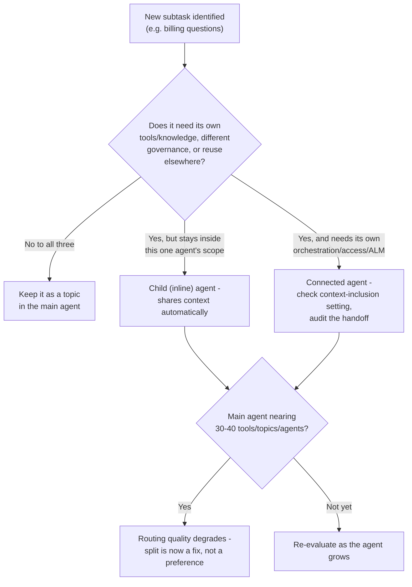

# Multi-Agent Design Patterns and Best Practices

Every session in Groups 2 through 5 made one agent smarter - better topics, better grounding, better tools, better autonomy. This session asks a different question: when does a smarter agent stop being the answer, and a second agent start being the answer instead?

4.1 taught a six-mechanism taxonomy of _tools_ - a connector, a flow, a prompt, a REST call, an MCP tool, computer use - things one agent reaches for. This group is about something structurally different: not what an agent can _do_, but who else it can _ask_. That's a delegation decision, not a tool decision, and it comes with its own failure modes - the main one being agents that step on each other's replies.

## Two shapes of "another agent"

Copilot Studio's own multi-agent guidance draws the line in one place: how much the second agent shares with the first.

An **inline agent** - usually just called a **child agent** - is, in the documentation's own words, "small, reusable workflows within the same agent. They're often just topics that the main agent uses as subroutines." It runs inside the same agent, inherits the same context automatically, and is built for a single narrow job. The stated best practice is almost an understatement: "keep inline agents focused on a single responsibility and test them well."

A **connected agent** is a different animal. It's "a separate agent with its own orchestration, tools, and knowledge. The main agent delegates part of a request to a connected agent." It can be built, published, and governed independently - which is exactly why it needs more care to use safely.

| Property                        | Child (inline) agent                 | Connected agent                                                       |
| ------------------------------- | ------------------------------------ | --------------------------------------------------------------------- |
| Orchestration, tools, knowledge | Shares the parent's                  | Its own, entirely separate                                            |
| Conversation history / context  | Always receives the parent's context | Has its own **context-inclusion setting** - check it, don't assume it |
| Publishing & governance         | Lives and dies with the parent       | Independent - can carry different access, different owners            |
| Reuse across agents             | Not reusable outside the parent      | Can be reused as a "service agent" for several main agents            |
| Cost of using it                | Low - it's a topic                   | Extra orchestration hop, extra thing to test and govern               |

## When a subtask actually earns its own agent

The temptation, once you know connected agents exist, is to reach for one whenever a topic gets long. The documentation pushes back on that directly. Split into a separate agent only when the subtask genuinely:

* **Carries its own domain of expertise** - "is complex enough to have its own suite of tools or knowledge"
* **Needs different governance** - "requires different governance rules or access controls than the main agent"
* **Is genuinely reusable** - "can be reused in many different main agents (so it's like a service agent)"

And the caution that comes with it is just as direct: "don't create a separate agent for every subtask. Separate agents introduce overhead to the system. There is a slightly longer execution time due to context switching, and complexity in maintaining multiple agents." The recommended default is almost anti-climactic - "start with one agent. Then only split into multiple agents when you clearly see a need for modularity or a boundary a single agent shouldn't cross."

There's also a quantified version of the same signal, not phrased as a criterion but as a symptom: routing quality itself degrades once a main agent is choosing between too many things. "This degradation in performance can happen when your main agent has more than 30-40 choices of action (tools, topics, and other agents)" - at which point splitting stops being an architecture preference and starts being the fix for a routing problem you can already see.

## What a connected agent owes its parent

Because a connected agent can have its own tools, its own knowledge, and its own access, handing it part of a conversation is a genuine trust decision, not just a routing decision. The guidance frames it as four separate obligations:

| Aspect             | Guidance                                                                                                                                                                                                                                                                  |
| ------------------ | ------------------------------------------------------------------------------------------------------------------------------------------------------------------------------------------------------------------------------------------------------------------------- |
| Orchestration      | "The parent orchestrator should have clear criteria for when to hand off to a connected agent. The orchestrator usually hands off when the user's intent matches the connected agent's domain. Treat the entire connected agent as an agentic 'tool' with a description." |
| Data handoff       | "A connected agent has a context-inclusion setting that controls whether it receives the conversation history, so confirm that setting rather than assuming the history is passed automatically."                                                                         |
| Security           | "The connected agent might have access to things the parent agent doesn't. Ensure that calling the connected agent doesn't inadvertently bypass restrictions."                                                                                                            |
| Audit & monitoring | "Log when a connected agent was invoked and what it did. It's important for debugging to correlate the parent and connected sessions."                                                                                                                                    |

That security line is worth sitting with. A connected agent isn't sandboxed by the act of being "connected" - if it can reach something the parent can't, routing a request to it is a privilege escalation, whether or not anyone designed it to be one.

## Nine habits for a parent that doesn't step on its own subagents

Splitting an agent solves the "who does this" problem. It creates a new one: two or more agents that can all technically produce a reply, in a channel where the user should only ever see one. The documentation's best-practices guidance is really a set of prompting disciplines for exactly that failure mode, and they group into three concerns.

**Make sure exactly one voice replies.** "Ensure only one agent talks to the user per turn. In a multi-agent setup, the parent agent is the only one that should deliver the final response. Subagents are researchers, not responders." That single sentence is the whole group's organizing idea, and three of the nine practices exist just to make it stick: tell the parent explicitly that it alone replies and must combine every subagent's findings into one response; tell every subagent explicitly that it is a subagent and must never reply to the user directly, only return findings; and repeat that same "don't reply directly" instruction a second time, inside the actual delegated task text the parent sends, as a safety net.

The wording matters more than it sounds like it should. The guidance is explicit that soft phrasing loses fights it shouldn't: "the platform injects system-level instructions by using strong language (MUST, DO NOT, NEVER). Instructions written with soft language ('please try to,' 'you should,' 'it would be good to') lose priority when they conflict." Compare the two directly - `"There must be exactly one final response per user question"` against `"Ideally, we want a single combined answer"` - and only one of those reads like an instruction the model can't quietly negotiate away.

**Give the parent something to route on.** A parent choosing between subagents is only as good as what it's choosing between. Two practices cover that: give each subagent a distinct, non-overlapping slice of knowledge - "if two subagents search the same knowledge base, one subagent finds the answer first. The second subagent either returns duplicate results or skips its search entirely, adding no value" - and write each subagent's description so the parent can actually tell them apart, since "the parent agent uses subagent descriptions to decide routing. If descriptions are vague, identical, or inaccurate, the parent can't make good routing decisions."

**Spell out the sequence, then test the seams.** The last three practices are about the parent's actual runtime behavior. Don't just tell it "use child agents" - write the literal sequence: invoke the relevant agents, wait for their results, combine the findings, deliver exactly one response. Get the ask-versus-inform framing right, so the parent knows when it's supposed to pause for a user's answer and when it's just supposed to state something and move on. And test with a query that matches none of the subagents' domains on purpose - "this testing reveals whether subagents gracefully return 'no information found' versus returning information that might be incorrect." A multi-agent build that's only ever been tested with on-domain questions hasn't been tested for the failure that actually shows up in production: someone asking something nobody was built to answer.


None of this is enforced by the platform. It's all instruction text - parent instructions, subagent instructions, delegated-task phrasing. That's exactly why the directive-language point isn't a style preference: in a system where the only real guardrail against a subagent replying directly to the user is a sentence you wrote, the sentence has to be one the model can't talk itself out of.


## One thing this session deliberately leaves for 6.3: MCP is not on this list

It would be easy to assume MCP belongs somewhere in "other agents" - Group 4 already put it on the tool taxonomy, and MCP servers do, in a loose sense, expose other systems' capabilities. But the documentation's actual list of things you can add as another agent is child agents, other Copilot Studio agents, agents reachable over the A2A protocol, Microsoft Foundry agents (preview), Fabric data agents (preview), and agents built with the Microsoft 365 Agents SDK (preview) - and MCP is not on it. Connecting to an MCP server is documented separately, as a way to add MCP-hosted _tools_ to an agent, not as a way to add another _agent_. Same protocol family Group 4 already introduced, different layer of the stack - worth keeping straight before 6.3 gets into Foundry agents and the MCP boundary in more detail.

## Designing Northwind's split - on paper, not yet built

The mission's practice scenario named this exercise from session one: a billing subagent and a product-support subagent, handed off from one main Northwind agent. This session designs that split; 6.2 builds it. Running the three separation criteria against it:

| Criterion                     | Applied to Billing vs. Product-Support                                                                                                                                                                                                                                |
| ----------------------------- | --------------------------------------------------------------------------------------------------------------------------------------------------------------------------------------------------------------------------------------------------------------------- |
| Own domain of expertise       | Yes - billing touches order/payment data and refund logic; product-support touches FAQs and the knowledge sources from Group 3. Different tools, different knowledge, little overlap.                                                                                 |
| Different governance / access | Yes, plausibly - refund and payment-adjacent actions are the kind of thing that reasonably carries tighter access than answering a product question. That's exactly the "might have access to things the parent doesn't" case the governance table above warns about. |
| Reusable elsewhere            | Plausible - a billing agent built once could plug into other Northwind-facing surfaces later, not just this one main agent.                                                                                                                                           |

All three criteria point the same direction, which is itself worth noticing - the framework isn't meant to produce a 2-out-of-3 judgment call every time. Here it does: Billing and Product-Support read as **connected agents**, not child agents, with the main Northwind agent as the single voice that talks to the customer and each subagent instructed, twice, never to reply directly. That design is what 6.2 will actually build.

## Which shape, for which subtask


**Key takeaway.** A second agent is a delegation decision, not a tool decision - reach for a child agent when the job just needs its own topic, a connected agent when it needs its own governance or reuse, and in either case write down, twice, who's allowed to actually reply to the user.


## Check your retrieval



A topic is getting long, so a maker considers splitting part of it into a connected agent. Per the documentation's guidance, what should happen first?



**Check whether the subtask genuinely needs its own domain of tools/knowledge, different governance, or reuse elsewhere - the recommended default is to start with one agent and only split when a real boundary appears.** The guidance explicitly warns against splitting by default; an unnecessary split just adds overhead.





What's the key difference in how child agents and connected agents handle conversation context?



**A child agent always receives the parent's context; a connected agent has its own context-inclusion setting that controls whether history is passed, so it should be confirmed rather than assumed.** Child agents inherit context automatically because they run inside the same agent - connected agents don't, by default.





Two subagents, Billing and Product-Support, are both given read access to the same general FAQ knowledge source. What does the documentation say is the likely result?



**One subagent finds the answer first, and the other either returns duplicate results or skips its search and adds no value.** Non-overlapping knowledge sources are the recommended practice instead - overlap produces redundant or wasted work, not better coverage.





A maker wants to add an MCP server's tools to their Copilot Studio agent, expecting it to show up as one more type of "other agent" alongside child agents and connected agents. Is that the right mental model?



**No.** The documented list of addable agent types (child, Copilot Studio, A2A, Foundry preview, Fabric preview, M365 Agents SDK preview) doesn't include MCP - connecting an MCP server is a separate, tool-level integration, not an agent-level one. MCP sits at the tool layer Group 4 already covered.



## Reflection

Northwind's parent agent is instructed "you're the only agent that replies to the user," and the Billing subagent is instructed "never reply directly, only return findings" - both in strong MUST/NEVER language. A tester asks a question about shipping insurance, which matches neither Billing's nor Product-Support's description. What should happen, and which of this session's practices is actually being tested?


**ONE REASONABLE ANSWER** Neither subagent should claim the question - a well-written subagent description should make it clear to the parent that shipping insurance isn't Billing's or Product-Support's domain, so the parent either handles it itself or tells the user honestly that it doesn't have an answer, still as the single voice replying. What's actually being exercised is the domain-mismatch testing practice: it's easy to test a multi-agent build only with on-domain questions and never notice that an off-domain question gets silently misrouted to whichever subagent's description happens to be vague enough to match. A subagent returning "no information found" for an unrelated question is the system working correctly; a subagent confidently answering outside its stated domain is the failure this test is designed to catch.


**Read next:** [Multi-agent orchestration patterns and best practices](https://learn.microsoft.com/en-us/microsoft-copilot-studio/guidance/multi-agent-patterns) - the full guidance this session is built on, including the complete nine-item checklist.

1. [Multi-agent orchestration patterns and best practices](https://learn.microsoft.com/en-us/microsoft-copilot-studio/guidance/multi-agent-patterns) - child vs. connected agent definitions, governance table, the nine best-practice disciplines, directive-language guidance.
2. [Add other agents overview](https://learn.microsoft.com/en-us/microsoft-copilot-studio/authoring-add-other-agents) - the full list of addable agent types, the three separation criteria, performance impact, licensing/preview caveats.
3. [Add other agents overview - when to use multiple agents](https://learn.microsoft.com/en-us/microsoft-copilot-studio/authoring-add-other-agents#when-to-use-multiple-agents) - the 30-40 tool/topic/agent routing-degradation threshold.
4. [Connect your agent to an existing MCP server](https://learn.microsoft.com/en-us/microsoft-copilot-studio/mcp-add-existing-server-to-agent) - confirms MCP is added as a tool source, not listed among the "add other agent" types above.
