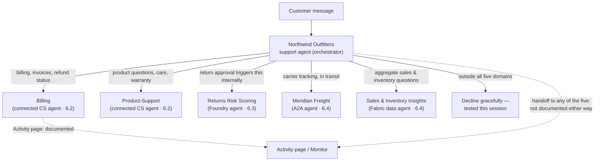

# Review & Build: Northwind Multi-Agent Handoff

Four sessions, four ways to add another agent. Nothing new gets introduced here — this session takes the five connections Northwind has picked up one at a time since 6.1 and puts them in the same room together, then goes looking for what breaks when they actually have to share a front door.


Northwind's support agent now has five ways to hand a question off: two connected Copilot Studio agents, one Foundry agent, one A2A agent, and one Fabric data agent. Each was tested on its own, against its own session's material. None of them has been tested against the other four.


## What's actually connected

Here's everything wired into the Northwind Outfitters support agent by the end of 6.4, in the order it was added:

| Agent                      | Mechanism                           | Built in | Shares chat history?                                            | Redirect-node reachable?                             |
| -------------------------- | ----------------------------------- | -------- | --------------------------------------------------------------- | ---------------------------------------------------- |
| Billing                    | Connected Copilot Studio agent      | 6.2      | Opt-in checkbox, on                                             | Yes                                                  |
| Product-Support            | Connected Copilot Studio agent      | 6.2      | Opt-in checkbox, on                                             | Yes                                                  |
| Returns Risk Scoring       | Foundry agent (preview)             | 6.3      | Not a Copilot Studio setting — Foundry's own logging governs it | Not documented as unsupported, but untested this run |
| Meridian Freight           | A2A agent                           | 6.4      | Always, full history, no opt-out                                | Not documented as unsupported, but untested this run |
| Sales & Inventory Insights | Fabric data agent, standard harness | 6.4      | Not documented as a toggle at all                               | Explicitly unsupported                               |

Look at that middle column and the split isn't two types dressed up five ways — it's three genuinely different data-sharing defaults sitting on one agent at once. A connected Copilot Studio agent shares history because someone checked a box. An A2A agent shares it because the protocol says so, with nothing to uncheck. A Fabric data agent doesn't even have the conversation to share — it answers whatever query gets sent and nothing about who's asking or why. Three defaults, three reasons, one parent agent that has to make sense of all of them at once.

## The governance sweep 6.1 only ran twice

6.1's four-aspect governance table — orchestration criteria, the context-inclusion data-handoff setting, security/privilege-escalation risk, audit and correlation — got applied to exactly two connections back in 6.1 and 6.2: Billing and Product-Support \[1]. 6.3 and 6.4 each covered their own agent's version of the same concerns as they came up (6.3's external-agent responsibilities checklist, 6.4's always-on A2A history), but nobody had run all four aspects against all five agents side by side until now.

Doing that sweep surfaces one thing 6.1's original two-agent version couldn't: privilege escalation risk isn't the same shape for all five. Billing and Product-Support are Northwind's own agents, built and governed inside the same environment — the risk is scope creep, one subagent answering questions it shouldn't. Meridian Freight is a carrier Northwind doesn't own or host at all; the risk there is what Northwind's own conversation history looks like once it's sitting on someone else's server. Two very different failure modes, filed under the same governance-table row because 6.1's table was written before Northwind had an agent outside its own walls to worry about.

## Writing five descriptions that don't collide

6.1's routing principle was "give the parent something to route on" — non-overlapping descriptions, written so a domain-mismatch query has nowhere plausible to land \[1]. That's easy to get right for two subagents. For five, the near-miss is the Fabric agent and the order-status REST tool from 4.5 answering the same question two different ways — "where is my order" (4.5's tool, one row) versus "how many orders shipped this week" (the Fabric agent, aggregate). 6.4 already drew that line once; this session checks it again now that Meridian's carrier-tracking answer sits right next to it — a customer asking "where's my package" could plausibly mean either Northwind's own order record or Meridian's live tracking, and the two descriptions need to make it obvious which one owns which half of that question.

| Agent                      | Description, sharpened                                                                                                                       |
| -------------------------- | -------------------------------------------------------------------------------------------------------------------------------------------- |
| Billing                    | Payment methods, invoices, refund status once a refund has been approved — not eligibility, which stays with the return-approval flow (4.5). |
| Product-Support            | Product questions, sizing, care instructions, warranty terms — not order status or shipping.                                                 |
| Returns Risk Scoring       | Internal fraud-risk scoring on a return request — not customer-facing at all; only the orchestrator and the return-approval flow call it.    |
| Meridian Freight           | Live carrier tracking once a package has left the warehouse — carrier location and transit estimate, not Northwind's own order record.       |
| Sales & Inventory Insights | Aggregate analytics — order volume, sales trends, inventory levels — never an individual order's status.                                     |

## Testing the whole handoff

The multi-agent-patterns guidance is specific about what a real test looks like, and it's worth quoting exactly rather than paraphrasing: "Test with queries outside all subagent domains (for example, ask about weather when agents handle HR and IT). Verify the parent handles 'both agents found nothing' gracefully." \[1] That line was written with two subagents in mind. Northwind has five, so the test scales the same way the description-writing did: one on-domain query per agent, plus one query that sits outside all five domains at once, checking that the parent says "I don't have that" instead of guessing.



### Five on-domain checks, one per agent

A billing question routes to Billing. A product-care question routes to Product-Support. A tracking-number lookup routes to Meridian over A2A. A "how many units of X shipped last month" question routes to the Fabric agent. The return-approval flow (4.5) triggers Returns Risk Scoring internally — not a direct customer question, so tested by running a return through the flow rather than asking the agent about it directly.



### One query that lands in nobody's lane

"What's your return policy for a gift I never opened, that I'm now shipping back internationally, and does that affect my loyalty points balance?" — a compound question that brushes past several domains without landing cleanly in any one agent's description. The parent should decline the parts it can't answer rather than forcing the closest subagent to guess.



### Read what actually happened, not what should have

The parent answered the loyalty-points half honestly — no subagent owns loyalty points, so it said so — but routed the international-shipping half to Meridian anyway, since "shipping" was the nearest keyword match even though Meridian only tracks packages already in transit, not returns headed the other way. Not a crash, but a mismatch worth writing down rather than smoothing over: the domain-mismatch test caught a real routing edge the on-domain tests alone never would have.



### Fix the description, not the routing

Meridian's description got one more line: "does not track returns shipments back to Northwind, only outbound carrier packages already assigned a tracking number." Re-running the same compound query after that edit, the parent routed the shipping half correctly to Northwind's own returns process instead of Meridian — the fix that held was a sharper description, not a rule bolted onto the orchestrator.




**Group 5's monitoring tools don't say what a multi-agent build wants to know.** 5.3 covered the Activity page in detail — per-run transcripts, node-level Rationale, the map view. Re-checking that same page specifically for how it represents a handoff to another agent, the documentation doesn't say \[2]. It describes what happens inside one agent's own topics and nodes; it doesn't describe what a jump to a connected, Foundry, A2A, or Fabric agent looks like once execution leaves the parent. That's not the same as the feature not existing — only that nothing in the primary source confirms one way or the other, and this run isn't going to guess. Flagged, not resolved: if Northwind's support agent misroutes a live customer question tomorrow, whether the Activity page shows _which_ of the five agents it went to is still an open question, not a documented answer.


## The full picture

## What this session didn't do

It didn't add a sixth connection, and it didn't build the Microsoft 365 Agents SDK path 6.2 named but didn't build. Both stay open for whoever picks this course back up for Group 7 or beyond. It also didn't resolve the Activity-page gap above — that would need either a live multi-agent run checked directly against the Activity page in a future session, or a support ticket to Microsoft, neither of which this run can do from here.


**Key takeaway:** Five working connections tested one at a time don't add up to a tested system — the domain-mismatch query is what actually tests the seams between them, and it found one real routing gap that five clean individual tests never surfaced.


## Check your retrieval



Northwind's five connected agents share conversation history with three different defaults. Which pairing is correct?

1. Connected CS agents: opt-in checkbox. A2A: always, no opt-out. Fabric data agent: not a documented toggle at all.
2. All five share history by default, with no way to change it
3. None of the five ever receive conversation history
4. Only the Foundry agent shares history; the other four never do



**Option 1.** A connected Copilot Studio agent shares history via an opt-in checkbox (6.2). An A2A agent always receives the full chat history with no opt-out (6.4). A Fabric data agent isn't documented as having a history-sharing toggle at all — it answers the query it's sent.





What did the domain-mismatch test in this session actually catch?

1. The orchestrator crashed on the compound query
2. Meridian Freight answered a returns-shipping question it shouldn't have, based on the keyword "shipping"
3. The Fabric agent leaked individual order data
4. Billing and Product-Support both tried to answer the same question



**Option 2.** The parent correctly declined the loyalty-points portion of the compound query but routed the international-shipping portion to Meridian, which only tracks outbound packages already in transit — not returns headed back to Northwind. The fix was sharpening Meridian's description.





What did re-checking the Activity page documentation find about multi-agent handoffs?

1. It confirms handoffs to other agents are fully visible in the map view
2. It explicitly states multi-agent handoffs are never tracked
3. It doesn't say either way — the documentation describes activity inside one agent's own topics and nodes, with nothing confirming what a jump to another agent looks like
4. It only tracks handoffs to child agents, not connected or external ones



**Option 3.** A live re-fetch of the Activity page documentation, specifically checking for language about agent-to-agent handoffs, found none — not a statement that the feature doesn't exist, just that the primary source doesn't confirm it. Flagged as an open question rather than resolved by assumption.





Why does this session single out privilege-escalation risk as looking different across Northwind's five connections, compared to how 6.1 first described it?

1. Because 6.1 got the concept wrong and this session corrects it
2. Because 6.1's version was written against two agents Northwind owns and governs itself; Meridian is an agent Northwind doesn't own or host, so the risk is about Northwind's own data leaving its walls, not scope creep inside them
3. Because Foundry agents don't have any privilege-escalation risk at all
4. Because only Fabric data agents carry this risk



**Option 2.** Billing and Product-Support are Northwind's own agents — the risk there is scope creep. Meridian Freight is a third party Northwind doesn't own; the risk is what happens to Northwind's conversation history once it's sitting on someone else's server. Same governance-table row, two different failure modes.



## Reflection

The domain-mismatch test caught Meridian answering a returns-shipping question it shouldn't have. The fix was a sharper description, not a routing rule. Why might that be the right kind of fix to prefer, generally — and when would it stop being enough?


**ONE REASONABLE ANSWER** A sharper description fixes the problem at its source — the orchestrator's own routing logic, which every future query passes through — rather than patching one symptom with a special-case rule that only that specific phrasing will trigger next time. It stays cheap and stays out of the way of every other agent's routing. It stops being enough once two agents' legitimate domains genuinely overlap rather than merely sounding alike — Meridian and Northwind's own shipping process might someday both need to answer a real question about the same package, and no description, however sharp, resolves a genuine overlap instead of a false one.


**Read next:** [Multi-agent orchestration patterns and best practices](https://learn.microsoft.com/en-us/microsoft-copilot-studio/guidance/multi-agent-patterns) — re-read with all five of Northwind's connections in mind, not just the two it was first applied to in 6.1.

1. [Multi-agent orchestration patterns and best practices](https://learn.microsoft.com/en-us/microsoft-copilot-studio/guidance/multi-agent-patterns) — re-fetched live this session specifically for its exact domain-mismatch testing language ("both agents found nothing" gracefully), generalized here from two subagents to five; also the source for 6.1's governance table and routing-description guidance, reapplied across all five connections in this session.
2. [Review agent activity](https://learn.microsoft.com/en-us/microsoft-copilot-studio/authoring-review-activity) — re-fetched live this session specifically to check whether it documents how a handoff to another agent (child, connected, Foundry, A2A, or Fabric) appears in the Activity page or map. It doesn't say either way — the gap flagged above, not assumed from silence but confirmed by a targeted re-read.
