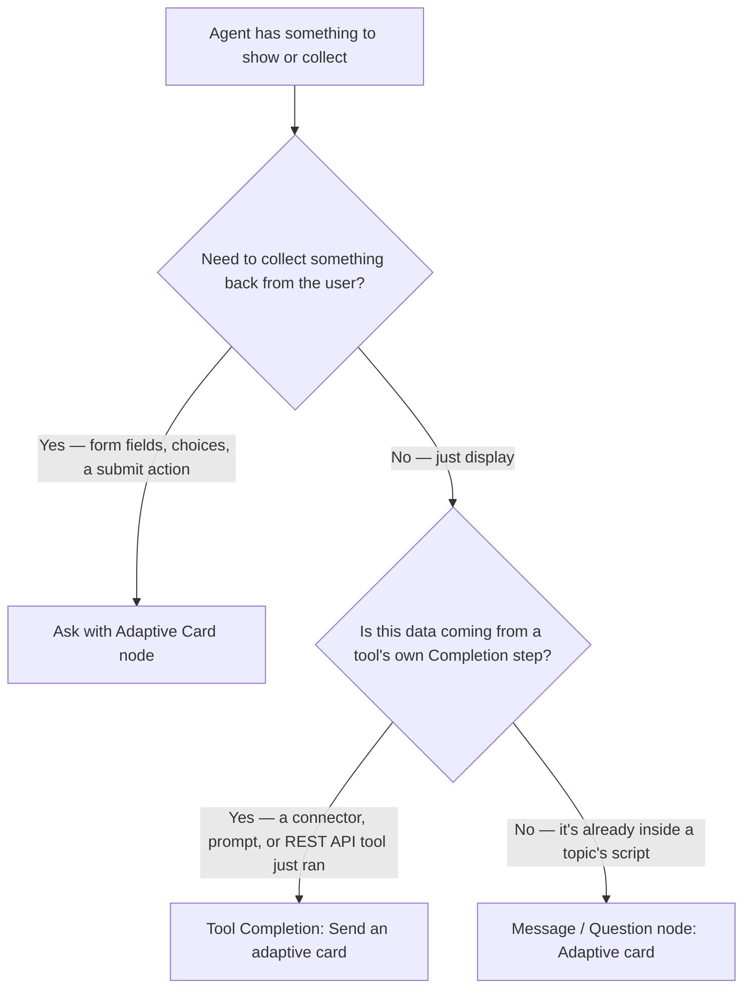

# Adaptive Cards and Response Formatting

Every tool this group has built so far ends its turn as a sentence — generative AI wrote it, or a template filled it in, but it's still just text. This session is about the cases where a sentence is the wrong shape for the answer, and the three separate places Copilot Studio lets you swap it for a card instead.


**Session 4.4 of Group 4 — Tools & Actions.** Fourth of five sessions, after 4.1's connectors, 4.2's agent flows, and 4.3's prompts and REST APIs. 4.5's closing Northwind build is next — no new group sizing needed.


## When a sentence is the wrong shape

4.3 ended with a worked example: an HTTP Request node calls Northwind's order API and gets back a status, a carrier, and a tracking number. Nothing in that session said what happens after — the agent could read those three fields into a sentence ("Your order shipped via UPS, tracking number 1Z...") and move on. That works. It's also the kind of information a person scans rather than reads, and a sentence forces scanning into parsing.

An **Adaptive Card** is Microsoft's answer to that mismatch: "platform-agnostic UI snippets written in JSON, which apps and services can openly exchange." A host app — Web Chat, Teams, the test chat pane — turns that JSON into native UI, adapted to whatever context it's rendered in, dark mode included.

Copilot Studio supports Adaptive Cards schema versions 1.6 and earlier — but which version actually renders depends on where the conversation is happening, and the three channels split unevenly:

| Host                                                | Schema support                    |
| --------------------------------------------------- | --------------------------------- |
| Web Chat (default website integration)              | 1.6, but without `Action.Execute` |
| Live chat widget (Omnichannel for Customer Service) | Limited to 1.5                    |
| Teams                                               | Limited to 1.5                    |

Even the test chat pane inside Copilot Studio itself only renders 1.6-schema cards there — the authoring canvas doesn't render them at all. A card that looks right while you're building it can still fail on the channel a real customer actually uses, which makes "what channel is this agent published to" a question worth asking before a card ships, not after. Copilot Studio ships a built-in Adaptive Card designer for authoring one — it covers the most useful features of the standalone Adaptive Cards Designer, so most cards don't need a separate tool.

## Three doors, one spectrum

"Add an adaptive card" isn't one feature in Copilot Studio — it's three, and they sit at different points on a spectrum from purely showing something to purely collecting something. Mixing them up is an easy mistake, because all three start from the same JSON.

|                    | Message / Question node                                                                | Ask with Adaptive Card node                                                                | Tool Completion option                                                                      |
| ------------------ | -------------------------------------------------------------------------------------- | ------------------------------------------------------------------------------------------ | ------------------------------------------------------------------------------------------- |
| **What it's for**  | Displaying rich content — the conversation continues on its own once the card is shown | Collecting a response — form fields and at least one submit button, required by definition | Formatting what a tool hands back once it finishes running                                  |
| **Where it lives** | Inside a topic, on a Message or Question node                                          | Its own dedicated node type on the canvas                                                  | A tool's "After running" setting, alongside 4.1's other Completion options                  |
| **Interactive?**   | No — no user input is collected from the card                                          | Yes — must contain a submit button                                                         | Described as interactive, "with buttons and actions," by Microsoft's own tool-taxonomy page |

The Message node's version is the plain case: in the node's menu bar, **Add → Adaptive card**, then **Edit adaptive card** opens the designer, and a JSON payload (or the designer's own controls) produces a preview right on the node. It sits alongside the node's other content types — text, images, videos, basic cards, quick replies — as one more way to shape a reply. Everything a Message node can do, a Question node can do too.

The **Ask with Adaptive Card** node is a different animal entirely — its own node type, added via **Add node → Ask with Adaptive Card**, and it's meant for interactive cards specifically: "your card must contain at least one submit button, as it must be an interactive card that allows a user to submit information back to the agent." Copilot Studio auto-generates output variables from whatever input fields the card defines, and if the guessed types are wrong, **Edit Schema** in the node's properties lets you correct them by hand. You can make the card's own content dynamic too, referencing topic or agent variables through a Power Fx formula instead of hardcoding the JSON. Two smaller settings round it out: how many times to reprompt if the user replies with plain text instead of submitting the card (default: repeat up to twice), and whether an off-script message is allowed to interrupt and switch topics at all.

One quirk is worth knowing before it bites: Adaptive Cards let their submit buttons be clicked more than once, by design. If a topic shows several cards in a row and a user taps a button on an earlier one after a newer card has already appeared, the agent has no built-in way to tell which card that click came from — unless each `Action.Submit` carries its own unique identifier in its data payload:

```json
{ "type": "Action.Submit", "title": "Confirm", "data": { "actionSubmitId": "booking_confirm_card_v3_confirm" } }
```

That identifier is what lets the agent — or a custom client — work out which card and which action a given response actually belongs to.

The third door is the one that closes the loop back to 4.1: a tool's **Completion** tab, under "After running," now has a fourth option next to Don't respond, Write the response with generative AI, and Send specific response — **Send an adaptive card**, described as a way to "create rich, interactive responses with buttons and actions."


**A genuine documentation gap, flagged rather than guessed at:** that's the entire description Microsoft's own tooling page gives the completion option. It says the resulting card is interactive, "with buttons and actions" — but it never states whether clicking a button on a tool-completion card actually round-trips into new output variables the way the dedicated Ask with Adaptive Card node's submit buttons do, or whether "interactive" here means something closer to a link or an external action outside the conversation entirely. Every other claim in this lesson is traceable to a specific, quoted sentence; this one isn't, because the sentence that would settle it doesn't exist yet in the page fetched for this session. Until Microsoft documents the mechanics, treat a tool-completion card as safest for display — status, confirmation, summary — and reach for the dedicated node whenever the goal is actually collecting something back.



**Three search results, one page:** three distinct guidance articles turned up while researching this session — "Summarize responses with Adaptive Cards," "Display Adaptive Card carousels," and "Ask with Adaptive Cards" via a separate "adaptive card ask questions" URL. Fetching all three, by URL, landed on the exact same page every time: the same H1 ("Ask with Adaptive Cards"), the same heading list, the same body text. Microsoft appears to have consolidated what were once separate guidance pages into the single canonical article this lesson cites throughout, without retiring the old titles from search results. It's a small thing, but worth knowing before you click a promising-looking title and assume it's promising new content — check the H1 you actually land on.


## Building the card itself

Underneath the designer, an Adaptive Card is built from two kinds of elements. **Layout elements** give it structure: a **Container** groups related pieces and applies shared spacing or a background style, a **ColumnSet** divides content into a horizontal row, and a **Column** holds one slice of that row. **Content elements** are what actually shows: a **TextBlock** renders text with its own size, weight, and wrapping, and an **Image** renders a photo or icon from a URL.

There's a design rule worth taking seriously rather than treating as a suggestion: **limit each card to three to five data points.** A card that tries to show everything stops being scannable — the exact problem a card was supposed to solve in the first place — and that failure shows up worse on a phone screen than it does while you're previewing on a laptop.

The trickier habit to build is how a card gets its actual values. The guidance is specific: compute whatever the card needs into a topic variable earlier in the flow, then reference that variable when setting the card's text — don't try to transform a value inline inside the card itself. If a number needs a unit label, or a status code needs to become a human-readable word, that conversion happens in a topic step before the card node, not inside the card's own properties. The designer exposes the common properties, but some styling — `"wrap": true` on a TextBlock, spacing, a Container's `"style": "emphasis"`, a `minHeight` — only exists in the raw JSON, so expect to drop into the JSON view at least once per card.

When a topic needs to show more than one card at once, the same carousel-versus-list choice from earlier sessions' multi-item displays applies here too: **Carousel** shows cards side by side with navigation arrows, and fits distinct items a user compares one at a time; **List** stacks every card vertically, and fits a set the user needs to see all at once.

## Worked example: Northwind's order-status card

Back to where this session started. 4.3's HTTP Request node in the "Track My Order" topic already produces a typed `Topic.OrderResult` variable with three fields — status, carrier, and tracking number — from a sample-JSON response schema. That's three data points, which sits right at the design rule's limit rather than over it, and it's exactly the shape a ColumnSet handles well.



### Confirm the values are already computed

Nothing new here — 4.3's HTTP Request node already stored `Topic.OrderResult.status`, `.carrier`, and `.trackingNumber` as typed fields. The compute-first rule from the previous section is already satisfied by the node that came before this one.



### Add the card to the Message node

Right after the HTTP Request node, on the Message node that used to just read the status back as a sentence: node menu bar → **Add → Adaptive card** → **Edit adaptive card**.



### Lay out a three-column ColumnSet

One **ColumnSet** with three **Columns**, each a small **Container**: a bolded **TextBlock** label ("Status," "Carrier," "Tracking") over a plain TextBlock bound to the matching field.



### Bind each value with Power Fx

Each data TextBlock's text is set to `Topic.OrderResult.status`, `Topic.OrderResult.carrier`, and `Topic.OrderResult.trackingNumber` — no inline formatting, just a direct reference to fields the earlier node already typed correctly.



### Leave the fallback sentence for the error path

4.3's Continue-on-error branch, which routes a failed lookup to a plain "contact support" message, stays exactly as it was. The card only replaces the success path — a failure doesn't have three clean data points to show, so a sentence is still the right shape there.



Nothing about this required the tool-completion door from the earlier section — the lookup happens inside a topic script at one fixed point, the same as 4.3 built it, so the informational card on the Message node is the correct fit. If Northwind's order lookup were rebuilt as an agent-level REST API tool instead (4.3's reflection question), the card would move to that tool's own Completion tab.

## Choosing a mechanism



All three doors produce the same JSON underneath. The question that actually picks one isn't "do I want a card" — it's whether anything needs to come back from the user, and if not, whether the data is sitting inside a topic's own flow or arriving from a tool that just finished running.

## Check your retrieval



Northwind's order-status lookup happens inline in a topic, and the result just needs to be shown — nothing needs to come back from the customer. Which of the three doors fits?



**An Adaptive Card on the Message (or Question) node.** This is informational display, not data collection, and the data is already sitting inside the topic's own script rather than arriving from a tool's Completion step — exactly the case the Message node's card option is built for.





What's the one hard requirement for a card added through the dedicated "Ask with Adaptive Card" node?



**At least one submit button.** Microsoft's own documentation states the card "must contain at least one submit button, as it must be an interactive card that allows a user to submit information back to the agent" — a purely informational card belongs on a Message node instead.





A maker wants one card to show six fields from an order record — status, carrier, tracking number, order date, item count, and total price. What does this session's design guidance say about that plan?



**Cut it down to three to five.** The stated design principle is to limit each card to three to five data points — a card that tries to show everything becomes unreadable, especially on mobile. Six fields is a sign to split the information or pick the most relevant subset, not to shrink the font.





An agent is published to both a website (Web Chat) and Microsoft Teams. Why might a card that looks right in the test chat still misbehave for the Teams audience?



**Schema-version support isn't uniform across channels.** Web Chat supports schema 1.6 (without `Action.Execute`), but Teams — like the Omnichannel live chat widget — is limited to 1.5. A card built and previewed against 1.6 features can fail or render incompletely once it reaches a Teams user.



<details>

<summary>Reflection: 4.2's Northwind return-approval flow still confirms a customer's approved return by plain email or message. Does this session's content change that?</summary>


**ONE REASONABLE ANSWER** Not directly, and it's worth being precise about why. 4.2's Request-information step runs through Outlook — that's a separate approval surface entirely, not the chat channel Adaptive Cards render in, so nothing in this session touches how that internal approval step looks. What this session does open up is the moment after approval, when the agent tells the customer the outcome. Right now that's a plain sentence; it could instead be an Adaptive Card on the Message node showing the same shape of data this session's Section 4 just built for order status — approved amount, refund method, expected timing — three or four fields, well inside the design limit. That's a genuine candidate for 4.5's closing build, not a change to make right now: the return-approval flow itself doesn't need touching, only the message that reports its result once it's done.


</details>

Single best primary source to read next: [**Ask with Adaptive Cards**](https://learn.microsoft.com/microsoft-copilot-studio/authoring-ask-with-adaptive-card) — the canonical page this lesson draws its interactive-node content from, now the single destination for what used to be several separately-titled guidance articles.


**Key takeaway:** Copilot Studio doesn't have one "adaptive card feature" — it has three, sitting on a spectrum from pure display to pure input collection, and the question that picks the right one isn't whether you want a card, but whether anything needs to come back from the user and whether the data is already inside a topic's script or just arrived from a tool that finished running.


***

**Primary sources verified this session**

1. [Adaptive Cards overview](https://learn.microsoft.com/microsoft-copilot-studio/adaptive-cards-overview) — what an Adaptive Card is, schema version 1.6 support, per-channel version limits, the built-in designer, submit-button uniqueness guidance
2. [Send a message](https://learn.microsoft.com/microsoft-copilot-studio/authoring-send-message) — the Message/Question node's content types, adding an informational Adaptive Card, carousel vs. list display for multiple cards
3. [Ask with Adaptive Cards](https://learn.microsoft.com/microsoft-copilot-studio/authoring-ask-with-adaptive-card) — the dedicated interactive node, the submit-button requirement, output-variable auto-generation and Edit Schema, Power Fx dynamic binding, reprompt settings (also reached, this session, via three now-redirected guidance URLs — see the flagged consolidation callout above)
4. [Add tools to custom agents](https://learn.microsoft.com/microsoft-copilot-studio/add-tools-custom-agent) — the tool Completion tab's "Send an adaptive card" option among the four "After running" choices (previously verified in 4.1 and 4.3 for other sections of this same page)
5. [Deliver rich agent responses using Adaptive Cards](https://learn.microsoft.com/en-us/training/modules/deliver-rich-agent-responses-adaptive-cards-copilot-studio/) (training module, Unit 3) — layout vs. content elements, the three-to-five data point design principle, the compute-then-reference variable-binding pattern
