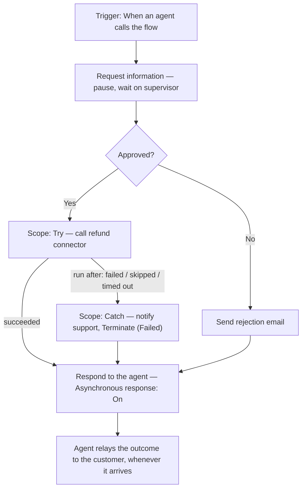

# Agent Flows: Human-in-the-Loop and Error Handling


**Session 4.2 of Group 4 — Tools & Actions.** Second session after 4.1's connectors and the shared tool-configuration lifecycle (Details / Inputs / Completion). No new group sizing needed — Group 4 was sized at 5 sessions in 4.1's run.


A connector is one call, out and back. An agent flow is a sequence — and a sequence can do two things a single call can't: stop and wait for a person, and keep running after part of it breaks.

## From one call to a sequence

4.1 ended with a connector: pick an operation, fill its inputs, get a result back, done. An agent flow starts from the same trigger-and-action shape but doesn't stop at one action. It's a defined sequence — a trigger, then one or more actions run in order, with branching and looping available along the way. Microsoft's own framing is worth taking at face value: agent flows are **deterministic**. Given the same input, the same flow produces the same output every time — exactly the property a connector alone can't promise once more than one step has to happen in a guaranteed order. ([flows-overview](https://learn.microsoft.com/microsoft-copilot-studio/flows-overview))

That extra structure buys two things this session is built around. First, a flow can pause mid-sequence and wait on a person — not just call an API and move on. Second, a flow can fail partway through and still behave sensibly, instead of leaving the agent holding a half-finished result. Neither is really possible with a bare connector call; both come from the same underlying idea, a sequence with more than one link in it.

## Request information: pausing a flow for a person

The simplest human-in-the-loop action is **Request information** (RFI), found under _Human review_ in the action picker. It does three things: pauses the flow, emails a request to one or more people through Outlook, and resumes once someone replies — with their answers available as dynamic content to every action after it. ([flows-request-for-information](https://learn.microsoft.com/microsoft-copilot-studio/flows-request-for-information))

Setting one up means filling in a **Title** (the email subject), a **Message** (why they're being asked), an **Assigned to** list, and one or more inputs. Five input types are supported — Text, Yes/No, Email, Number, Date — and each can be made optional, given placeholder text, or, for Text inputs specifically, turned into a single- or multi-select list instead of free entry.

Two behaviors are worth knowing before relying on this in production. If more than one person is assigned, **only the first response counts** — everyone else's answer is silently discarded, not merged or averaged. And requests only go to people inside your own tenant; there's no way to route an RFI to an external reviewer.


Documented rough edge: input names containing spaces can come back wrapped in double braces (`{{ }}`) when referenced downstream. Microsoft's own fix is simply to avoid spaces in input names.


## Approvals: from yes/no to a multistage, AI-assisted process

Where RFI collects information, an **approval** collects a decision. Copilot Studio's _multistage and AI approvals_ — currently a preview feature, flagged as such throughout Microsoft's own documentation — extend Power Automate's standard approvals connector with something genuinely new: stages that don't have to be human. ([flows-advanced-approvals](https://learn.microsoft.com/microsoft-copilot-studio/flows-advanced-approvals))

A multistage approval is built from ordered stages, each one of two kinds:

* **Manual stages** — a human decision, configured much like a standard approval: approval type (first-to-respond or everyone-must-approve), title, assignees, and the details they need to decide.
* **AI stages** — a chosen model reads written instructions plus supplied evidence (text, documents, images) and returns Approve or Reject with a rationale attached. When the instructions are ambiguous or the evidence doesn't clearly support either outcome, the stage returns **"Analysis failed"** rather than guessing — and by default that routes on to the next stage instead of silently stalling.

**Conditions** sit between stages and route the flow further — approve automatically, reject automatically, skip ahead, or send it back — based on whatever criteria you define. The default with no condition is the obvious one: approve moves to the next stage, reject ends the approval.

Two of Microsoft's own instruction-writing rules are worth repeating, because they're specific and testable rather than vague advice: pick either approval criteria _or_ rejection criteria for an AI stage, not both mixed together ("reject if the amount exceeds $500" — not "approve under $500 but reject over $500 unless it's travel"), and set exact numeric thresholds rather than words like "reasonable" or "high" that a model has to interpret fresh each run.


**This is a preview feature with real gaps, not a rounding error.** No application-lifecycle-management support (a flow imported with a multistage approval has to be rebuilt by hand), no sharing (a colleague who receives a shared flow has to recreate the approval themselves), file attachments aren't supported, only base64-encoded file inputs work for AI stages, and the same person can't be assigned to two different stages in one approval — doing so fails the flow. None of this rules out using it; it does mean treating it as what Microsoft calls it, a preview, not a finished feature to build a critical process on unreviewed.


For anything genuinely sensitive — financial transactions, legal decisions, personnel actions — Microsoft's own guidance is direct: keep a human stage in the path so people, not the model, hold final authority. An AI stage that pre-screens the obvious cases and hands the rest to a person is a reasonable design; an AI stage that's the _only_ gate on something expensive to get wrong isn't what this feature is meant for.

## The waiting problem

Here's a question worth asking before building either action into a flow an agent calls as a tool: a person might not answer for hours. What happens to the flow — and the conversation — while it waits?

The answer is a setting most people would miss: on a flow's **Respond to the agent** action (available once the flow uses the **When an agent calls the flow** trigger), there's an **Asynchronous response** toggle. Turned on, the flow can run past its normal synchronous window and call back to the agent whenever it actually finishes — exactly what a Request information or Approval step needs, since neither one runs on a schedule you control. ([flow-asynchronous-response](https://learn.microsoft.com/microsoft-copilot-studio/flow-asynchronous-response))

Two conditions worth knowing: it only works in environments on Power Automate's newer infrastructure, and callback delivery is fully supported in Microsoft Teams specifically — other channels may work but aren't formally tested, and Microsoft 365 Copilot and telephony channels don't support it at all. If the environment doesn't support asynchronous response and the flow still runs long, the agent can end up telling the user the flow "completed" while it's actually still working in the background — worth testing for directly rather than assuming either way.


**Two different numbers, not reconciled here on purpose.** The error-code reference (see Error handling, below) states that a synchronous flow call times out at **100 seconds**. The asynchronous-response documentation describes the same synchronous ceiling as a **2-minute limit**. Both are live Microsoft Learn pages as of this session. That's a genuine discrepancy between two official sources describing what reads as the same boundary — flagged rather than silently picking one, the same way 4.1 flagged the three-way credentials-naming mismatch.


## Error handling, three layers deep

"Error handling" in an agent flow actually means three separate things, each catching a different kind of failure at a different point in the flow's life.

### Layer 1 — before you can even publish

The flow designer flags errors in red directly on the action where they occur, and the **Flow checker** panel lists every error in the whole flow at once. This isn't optional: **a flow with any unresolved error can't be published at all.** ([flow-designer](https://learn.microsoft.com/microsoft-copilot-studio/flow-designer))

### Layer 2 — patterns you build into the flow itself

A worthwhile flag before this part: the guidance below is written for Power Automate cloud flows generally, not agent flows by name — there's no agent-flow-specific version of this page to check it against. It applies here because agent flows share the same designer, the same searchable action catalog, and — as 4.1's flows-overview page confirmed — an existing Power Automate cloud flow can be converted into an agent flow directly, keeping its actions intact. That's a reasonable basis for saying the same actions are available, even without an agent-flow-only source to cite instead.

| Pattern                       | What it does                                                                                                                                                                                               |
| ----------------------------- | ---------------------------------------------------------------------------------------------------------------------------------------------------------------------------------------------------------- |
| **Configure run after**       | Per-action setting: choose which outcomes of the _previous_ action — succeeded, failed, skipped, timed out — let this action run. The building block everything else here is made from.                    |
| **Scope (try/catch/finally)** | Group related actions into a container with its own overall status. Pair a "Try" scope with a "Catch" scope configured to run after Try fails, is skipped, or times out, and you have a try/catch pattern. |
| **Terminate**                 | Stop the flow immediately and set an explicit status plus message — placed at the end of a Catch scope so a caught error doesn't let the flow quietly report success anyway.                               |
| **Retry policy**              | Rerun a failed action automatically, fixed or exponential interval, up to a configured max count. Exponential is the better default for transient faults like a momentary rate limit.                      |

([error-handling](https://learn.microsoft.com/power-automate/guidance/coding-guidelines/error-handling))

### Layer 3 — what the agent actually sees when a flow fails mid-conversation

This layer is Copilot Studio–specific, and it's the one that matters most for a flow attached as a tool: when a called flow fails, the agent gets back one of a documented set of error codes, several of them specific to flow actions. ([error-codes](https://learn.microsoft.com/troubleshoot/power-platform/copilot-studio/authoring/error-codes))

| Error code                   | What actually happened                                                                                                                                                                                                 |
| ---------------------------- | ---------------------------------------------------------------------------------------------------------------------------------------------------------------------------------------------------------------------- |
| `FlowActionBadRequest`       | An input's type doesn't match what the flow expects (only Text, Boolean, and Number are supported when invoking the flow), or a required parameter is missing entirely.                                                |
| `FlowActionException`        | The flow ran but didn't return an output the agent's definition said to expect — usually fixed by refreshing the flow's action so the schemas realign.                                                                 |
| `FlowActionTimedOut`         | The flow took longer than its synchronous limit to return (100 seconds per this reference — see the flagged discrepancy above). Worth reaching for asynchronous response, not just a faster query, once this shows up. |
| `FlowMakerConnectionBlocked` | An administrator has disallowed maker credentials in the connection this flow invokes. The fix is sharing the underlying cloud flow with run-only permissions, not switching authentication modes.                     |

## Worked example: Northwind's return-approval flow

4.1 left a gap on purpose: its return-confirmation email assumed the return had _already_ been approved. Here's the step that was missing — the approval itself, as a real agent flow, with both this session's ideas built in.



### Trigger and pause for a decision

The flow starts on **When an agent calls the flow**, so it can be attached as a tool the same way 4.1's connector was. The first action is **Request information**: Title _"Approve return over $200 — Order {OrderId}"_, assigned to the returns-supervisor shared mailbox, with two inputs — `Approved` (Yes/No, required) and `Notes` (Text, optional).



### Branch on the answer

A **Condition** action checks `Approved`. If **No**, the flow sends a plain rejection email to the customer and skips straight to the last step. If **Yes**, it continues into the refund attempt below.



### Try: process the refund

A **Scope** named "Try" contains the connector call that actually issues the refund through Northwind's payment connector — the same kind of action 4.1 built, just for a different operation.



### Catch: don't let a failure disappear

A second **Scope**, "Catch," is configured to **run after** Try has failed, is skipped, or has timed out. Inside it: an email to the support team with the order ID and whatever error detail is available, followed by a **Terminate** action set to status _Failed_ — so a refund that didn't go through never gets reported to the customer as though it had.



### Respond to the agent — asynchronously

The final action is **Respond to the agent**, with **Asynchronous response** turned on. A supervisor might approve this in five minutes or five hours; without that setting, the flow (and the conversation waiting on it) would be fighting the synchronous timeout from earlier in this lesson the whole time.



## Check your retrieval



A Request information action is assigned to three people. All three reply, at different times, with different answers. Which answer does the flow use?



**Whichever one arrives first.** Only the first response resumes the flow — the other two are ignored entirely, not merged, averaged, or logged as a conflict.





Why does a flow with a Request information or Approval step, called as an agent's tool, specifically need Asynchronous response turned on?



**Because a human reply can take far longer than the flow's synchronous window** (100 seconds per the error-code reference, 2 minutes per the async-response doc — either way, well short of "however long a person takes to check their email"). Without it, the flow risks a timeout error, or in an environment that doesn't support the setting, the agent may report the flow "completed" while it's still actually waiting.





You build a Catch scope containing a Terminate action, meant to run whenever the preceding Try scope fails. What "Configure run after" setting does the Catch scope itself need?



**Run after the Try scope has failed** (and, for full coverage, is skipped and has timed out too). Leaving it on the default "is successful" means the Catch scope — and its Terminate action — never fires when it's actually needed.





An agent flow throws `FlowMakerConnectionBlocked`. What's the actual problem, and what fixes it?



**An administrator has blocked maker credentials from being used in the connection the flow invokes.** The fix is to open the underlying cloud flow in Power Automate and share it with run-only permissions — not to change which authentication mode the tool uses.



## Reflection

Northwind's supervisor-approval step above is entirely manual. A colleague suggests replacing it with an AI stage that auto-approves returns under $200 and routes everything else to a person. Worth doing?


**ONE REASONABLE ANSWER** It's a defensible design, but only with the details right. An AI stage pre-screening low-value, low-risk returns and handing anything above a clear, numeric threshold to a human matches exactly what this lesson recommends — automate the routine cases, keep a person on anything expensive to get wrong. What would make it a bad idea is skipping the threshold specificity: an instruction like "approve small, reasonable-looking returns" invites the "Analysis failed" outcome described above, or worse, an inconsistent one. It's also worth remembering this is still a preview feature — file attachments and ALM aren't supported yet, which matters if Northwind's returns process needs receipt images reviewed as evidence, not just a dollar amount.


Single best primary source to read next: [**Request information from human review in agent flows**](https://learn.microsoft.com/microsoft-copilot-studio/flows-request-for-information) — the full walkthrough this lesson draws the second section from, including the designer screenshots for building and testing an RFI action end to end.

***

**Key takeaway:** A flow that can pause for a person and survive its own failures is what turns "the agent can call an API" into "the agent can be trusted to run something that actually matters" — the gap between a demo and a process a business would let run unattended.

***

#### Primary sources verified this session

1. [Agent flows overview](https://learn.microsoft.com/microsoft-copilot-studio/flows-overview) — deterministic execution, trigger/action taxonomy
2. [Request information from human review in agent flows](https://learn.microsoft.com/microsoft-copilot-studio/flows-request-for-information) — RFI setup, input types, first-response-wins, known issues
3. [Multistage and AI approvals in agent flows (preview)](https://learn.microsoft.com/microsoft-copilot-studio/flows-advanced-approvals) — manual/AI stages, conditions, instruction-writing guidance, known limitations
4. [Asynchronous response support for agent flows](https://learn.microsoft.com/microsoft-copilot-studio/flow-asynchronous-response) — the async toggle, channel support, no-support fallback behavior
5. [Edit and manage your agent flow in the designer](https://learn.microsoft.com/microsoft-copilot-studio/flow-designer) — Flow checker, publish-blocking errors
6. [Employ robust error handling](https://learn.microsoft.com/power-automate/guidance/coding-guidelines/error-handling) — Configure run after, Scope try/catch, Terminate, retry policy
7. [Understand error codes](https://learn.microsoft.com/troubleshoot/power-platform/copilot-studio/authoring/error-codes) — FlowActionBadRequest, FlowActionException, FlowActionTimedOut, FlowMakerConnectionBlocked
