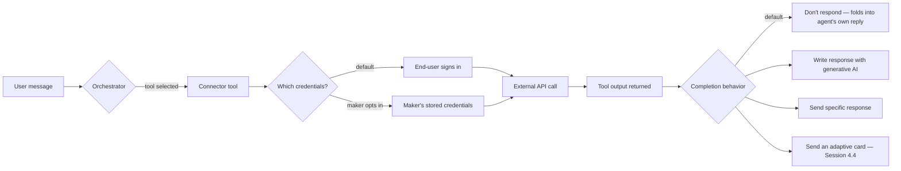

# Connectors and Power Platform Actions

Everything since Group 1 has been about what the agent is allowed to read, or say, or notice. This session is the pivot: what the agent is allowed to _do_.


**Where this sits:** first session of Group 4 — Tools & Actions. Group 4 was sized at 5 sessions (up from the original 4) in the same run that produced this lesson, per the standing sizing-engine rule that already fired before Groups 2 and 3 — see the Mission page's session-sizing log for the full reasoning.


Groups 1 through 3 all lived on one side of a line: an agent that decides what to say, and knows where it's allowed to look for the answer. Topics, entities, generative answers, knowledge sources, grounding — every one of those governs the agent's _response_. None of them let the agent reach outside the conversation and change something in the world.

That's the line this session crosses. A **tool** is what lets an agent stop describing a state and start changing one — checking a real order, sending a real email, creating a real ticket. It's the mechanical version of the argument this course's own mission opened with: knowledge tells you what's true, but it takes acting on the world, and having that action hold up, to call it a skill. An agent that can only answer questions is, in the mission's own words, a library. Tools are the first piece of what makes it something else.

## Six ways to hand an agent a tool

Before drilling into connectors specifically, it's worth seeing the whole shelf. Microsoft's own docs list six formal mechanisms for adding a tool to an agent, plus two more that behave like tools without formally being one:

| Mechanism                    | What it connects to                                                            | Where it's covered         |
| ---------------------------- | ------------------------------------------------------------------------------ | -------------------------- |
| **Connector**                | A proprietary API or service, wrapped by Power Platform — prebuilt or custom   | **Today (4.1)**            |
| Agent flow                   | A defined sequence of actions, including human-in-the-loop steps               | 4.2                        |
| Prompt                       | A single-turn, model-based call that can reference knowledge and generate code | 4.3                        |
| REST API                     | A connection to a REST API, with endpoints/methods added as tools              | 4.3                        |
| Model Context Protocol (MCP) | An MCP server's tools and resources                                            | Group 6 (multi-agent)      |
| Computer use                 | Any system with a GUI — clicking, choosing menus, typing into fields           | Not yet scheduled          |
| _Azure Bot Service skills_   | A container of related tools exposed through Azure Bot Service                 | Not on this course's spine |
| _Client tools_               | An event sent to the client app, which acts and returns a result               | Not on this course's spine |

Connectors are the oldest and most common of the six — Power Platform had them years before Copilot Studio existed — so they're the natural place to start, and they set up the shared configuration pattern (Details / Inputs / Completion, below) that every other tool type reuses.

## What a connector actually is

A Power Platform connector is a proxy — a wrapper around an API that lets Copilot Studio, Power Automate, Power Apps, and Azure Logic Apps all talk to the same outside service through one consistent interface, instead of each product implementing that API's quirks separately.

They come in two flavors:

* **Prebuilt connectors** — ready-made connections to popular services, split into **standard connectors** (included in every Copilot Studio plan) and **premium connectors** (available only in select plans).
* **Custom connectors** — a connection you define yourself, for a publicly available API with no existing prebuilt connector.

Both flavors show up the same way once attached: as a tool the agent can call, with defined inputs and outputs, same as any other tool type.

## Two places to attach one

Exactly like knowledge sources back in 3.1, a connector tool can live at two different scopes, and the mechanics are nearly identical at both:

* **Agent level** — _Tools_ page → _Add a tool_ → _Connector_ → pick the service → pick the specific operation → create or reuse a connection → _Add and configure_. Available for automatic selection wherever generative orchestration runs.
* **Topic level** — inside a topic's canvas, _Add node_ → _Add a tool_ → _Connector_ → search and configure the same way. Scoped to that one topic; called explicitly as a node in the chain.

Both default to asking the _end user_ for their own credentials the first time the tool runs — more on that below.

## The life of a tool, once it's added

Every tool — connector or otherwise — gets configured through the same three sections. Worth learning properly now, since 4.2 through 4.4 all lean on it rather than re-explaining it.

**Details** — Name and Description (generative orchestration reads the description to decide _when_ to use the tool, so a vague one produces a tool the agent quietly never calls); **Allow agent to decide dynamically when to use the tool** (on by default); **Ask the end user before running** (off by default); **Authentication** (end-user vs. maker-provided, see below).

**Inputs** — each input defaults to **Dynamically fill with AI**: the agent tries to pull the value from the conversation, and generates a question to ask for it if it can't. Selecting **Customize** exposes finer controls (display name/description, how the response is identified, retry logic, validation), or you can override an input entirely with a **Custom value** — fixed, a variable, or a Power Fx formula — which skips asking the user altogether.

**Completion** — what happens once the tool finishes, under **After running**:

| Option                                    | Behavior                                                                                                 |
| ----------------------------------------- | -------------------------------------------------------------------------------------------------------- |
| **Don't respond** (default)               | The agent folds the tool's output into whatever it says next — no separate message from the tool itself. |
| **Write the response with generative AI** | Let the model craft a contextual reply from the tool's output.                                           |
| **Send specific response**                | A templated message you author, with output variables inserted (Power Fx supported).                     |
| **Send an adaptive card**                 | A rich, interactive response with buttons and actions — the whole subject of Session 4.4.                |

## Who's signing in: end-user vs. maker credentials

Connectors need valid credentials to call anything. By default, the person _talking to the agent_ is asked to sign in — the tool runs with their access, and they only see or change what their own account allows. That's **end-user credentials**, the safer default: Copilot Studio doesn't store what they enter, and a user can revisit the connections page later to refresh or revoke access.

The alternative is **maker-provided credentials** — the tool runs as whoever built and published the agent, regardless of who's chatting with it. Right for shared resources nobody should need individual access to (a general FAQ mailbox, a public status API); wrong for anything that should only show a user their own data. Switching to it takes two deliberate steps: the agent's channel has to be authenticated, and then, on the tool's own configuration page, _Credentials to use_ has to be set to _Maker-provided credentials_ explicitly.


**Documentation gotcha, flagged rather than smoothed over.** Microsoft's own docs name this same binary setting three different ways depending on which page you're reading. The tool configuration page (per `add-tools-custom-agent`) labels it **End user** / **Maker-provided**. The connectors doc (`advanced-connectors`) talks about "user credentials" vs. "the maker's credentials." The dedicated authentication doc (`configure-enduser-authentication`) uses yet another pair of names for the same choice: **User authentication** vs. **Agent author authentication**. Three vocabularies, one underlying decision — worth knowing going in, so a different page's wording doesn't read as a different setting.


## The other "connector" — a naming collision worth resolving

Search "Copilot connector" and you'll find a second, entirely different feature that happens to share half its name. **Copilot connectors** (formerly Microsoft Graph connectors) are not what this session covers — worth separating clearly, because the overlap in naming is a real, documented source of confusion, not something invented for teaching purposes:

| Dimension                  | Copilot connectors                                | Power Platform connectors (today's topic)                  |
| -------------------------- | ------------------------------------------------- | ---------------------------------------------------------- |
| What it does               | **Indexes** external content into Microsoft Graph | **Calls APIs live**, at runtime                            |
| Data movement              | Yes — content is copied into Microsoft 365        | No — calls run under the user's connection at request time |
| Used for                   | Broad, searchable knowledge with citations        | Up-to-date facts and transactions (tools/actions)          |
| How Copilot Studio uses it | Added as a knowledge source                       | Added as a tool or action — this session's subject         |

The mental-model version, straight from Microsoft's own comparison: think of a Copilot connector as a search index, and a Power Platform connector as a live API bridge. Both can ground the same agent — one for what it knows, one for what it can go do — and plenty of production agents use both.

## Limits worth knowing before you hit them

* Under generative orchestration, the orchestrator can manage a maximum of **128 tools per agent** — but Microsoft's own recommendation for good results is to stay under **25–30**.
* In a multi-agent setup (Group 6), **child agents get their own separate 128-tool budget** — the parent's tool count and a child's don't share the same ceiling.
* Single sign-on isn't supported for connectors when an agent uses custom Microsoft Entra authentication _and_ is deployed to Microsoft Teams — in that specific combination, every user has to sign in to each connector by hand.

## Worked example: giving Northwind Outfitters a real tool

Northwind's agent has, so far, only ever _talked about_ orders and returns — everything since Group 2 has been conversation, entities, and knowledge lookups. Here's the first step where it actually does something: an agent-level connector tool that sends a return-confirmation email once a customer's return request is approved.



### Add the tool

On the agent's **Tools** page, select **Add a tool → Connector**, then search for and select the **Office 365 Outlook** connector's **Send an email (V2)** operation.



### Create the connection

No existing connection yet, so select **Create new connection**. Because this mailbox is a shared support inbox — not any individual customer's — this is exactly the shared-resource case above: set **Credentials to use** to **Maker-provided credentials** once the agent's channel is authenticated, rather than leaving it on the end-user default.



### Configure Details

Name it something the orchestrator can act on: _"Send return confirmation email."_ Description: _"Sends a confirmation email once a return request has been approved. Use only after the return is confirmed, not before."_ Leave **Allow agent to decide dynamically** on, and turn **Ask the end user before running** on too — this sends an email on the customer's behalf, so a confirmation step first is the safer default.



### Configure Inputs

Three inputs come from the connector's own schema: `To`, `Subject`, `Body`. Leave `To` on **Dynamically fill with AI** so the agent pulls it from whatever email the customer already gave earlier in the conversation. Override `Subject` with a **Custom value** — a fixed line like `"Your Northwind Outfitters return is confirmed"` — so it isn't left to the model to phrase fresh each time.



### Configure Completion

Set **After running** to **Write the response with generative AI**, so the agent tells the customer, in its own words, that the confirmation is on its way — rather than staying silent (the default) or reciting a fixed template.



## Check your retrieval



By default, whose credentials does a newly added connector tool use to authenticate?



**The end user's.** Copilot Studio prompts the person talking to the agent to sign in, so the tool only accesses what that person's own account is allowed to see. Maker-provided credentials have to be turned on deliberately.





You want your agent to look up a customer's account balance — data only that customer should see. Which authentication mode belongs on that tool?



**End-user credentials** (the default). Maker-provided credentials would mean every customer's lookup runs as the agent's author — exactly the oversharing risk this data is supposed to avoid.





Your agent has a "Reset password" Copilot connector configured in Microsoft 365 admin center, indexing IT help-desk articles into Microsoft Graph. Does that count toward the 128-tool limit discussed in this session?



**No.** That's a Copilot connector (formerly Graph connector) — a knowledge source that indexes content, not a Power Platform connector tool. The 128-tool ceiling applies to tools/actions the orchestrator selects from, a completely different mechanism under a confusingly similar name.





You leave a connector tool's Completion setting on its default. What does the agent do with the tool's output?



**It folds the output into its own next reply.** "Don't respond" is the default, and despite the name, it doesn't mean the agent says nothing — it means the tool itself doesn't generate a separate message; the agent still responds, using that output as part of its normal answer.



## Reflection

Your Northwind return-confirmation tool needs a second look. A colleague argues it should use end-user credentials instead of maker-provided, since Outlook already supports per-user sign-in. Is that a better design?


**ONE REASONABLE ANSWER**

It depends on which mailbox should send the email. If each customer's confirmation should come from _their own_ Outlook account, end-user credentials would be right — but that's not the scenario here: Northwind wants every return confirmation to come from one shared support inbox, regardless of which customer triggered it. Forcing end-user credentials would mean each customer has to sign in to their own personal Outlook just to let the agent send a message from a mailbox that isn't even theirs — a worse experience, for no security benefit, since the email being sent isn't sensitive per-customer data anyway. Maker-provided credentials are the correct call precisely because this is a shared resource.



**Key takeaway:** a connector doesn't teach an agent anything new to say — it gives the agent something new to _do_, and every choice you make configuring one (dynamic vs. explicit, end-user vs. maker credentials, which Completion option) is really a question of how much of that doing you trust the agent to handle on its own.


## Read next

The single best next read: [Use Power Platform connectors as tools](https://learn.microsoft.com/en-us/microsoft-copilot-studio/advanced-connectors) — the full connectors doc this lesson draws from, including the connection-sharing walkthrough this session only summarized.

***

**Primary sources verified this session**

1. [learn.microsoft.com/microsoft-copilot-studio/advanced-connectors](https://learn.microsoft.com/en-us/microsoft-copilot-studio/advanced-connectors) — Use Power Platform connectors as tools (connector types, agent/topic-level attachment, maker-provided credentials, sharing, SSO limitation)
2. [learn.microsoft.com/microsoft-copilot-studio/add-tools-custom-agent](https://learn.microsoft.com/en-us/microsoft-copilot-studio/add-tools-custom-agent) — Add tools to custom agents (the full six-mechanism taxonomy, Details/Inputs/Completion, tool selection factors, 128-tool limit)
3. [learn.microsoft.com/microsoft-copilot-studio/configure-enduser-authentication](https://learn.microsoft.com/en-us/microsoft-copilot-studio/configure-enduser-authentication) — Configure user authentication for tools (agent-author vs. user authentication, no credential storage, supported channels)
4. [learn.microsoft.com/microsoft-copilot-studio/knowledge-graph-vs-power-platform-connectors](https://learn.microsoft.com/microsoft-copilot-studio/knowledge-graph-vs-power-platform-connectors) — Copilot connectors versus Power Platform connectors as knowledge sources (resolves the naming collision above)
