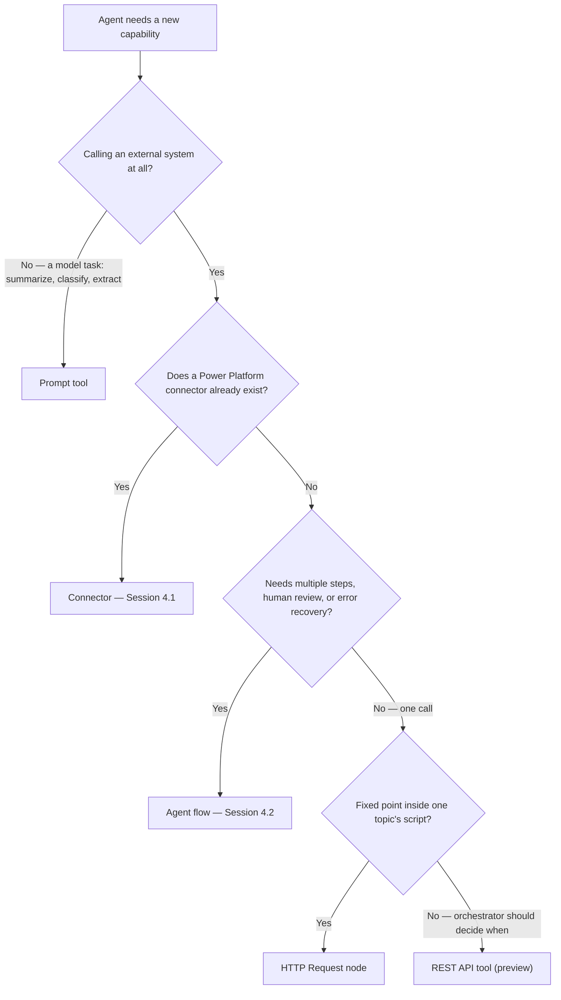

# Prompts and REST APIs: Off the Connector Path


**Session 4.3 of Group 4 — Tools & Actions.** Third of five sessions, after 4.1's connectors and 4.2's agent flows. No new group sizing needed — Group 4 was sized at 5 sessions back in 4.1's run.


A connector is someone else's wrapper around an API. This session is about what's left once nobody's built that wrapper — a prompt for tasks the model can just do on its own, and two genuinely different ways to call a raw REST API yourself.

## What's left after the wrapper is gone

4.1 and 4.2 both leaned on something doing work behind the scenes. A connector is a Power Platform proxy — somebody already described the API's shape, its authentication, its inputs and outputs. An agent flow adds a sequence on top, but the individual actions inside it are still mostly connector calls. Take the proxy away entirely and Copilot Studio's own six-mechanism tool taxonomy has exactly two things left: a **prompt**, which isn't calling an external system at all, and a **REST API**, which calls one with nothing standing between the agent and the raw HTTP request. ([add-tools-custom-agent](https://learn.microsoft.com/microsoft-copilot-studio/add-tools-custom-agent))

REST APIs turn out to have two distinct doors in Copilot Studio, not one — an older, topic-level node that's been there since before the current "tool" taxonomy existed, and a newer, agent-level tool still in preview. Both call the same kind of thing; they disagree about who decides when. That's the spine of this session: a task the model just does, and a raw API call handled two different ways.

## The prompt tool: a task, not a conversation

Strip away the Copilot Studio framing and a prompt is simple: "a task or a goal you give to the large language model." **Prompt builder** is where you write, test, and save one — with input variables that carry runtime values in, and, at the agent level, an optional connection to Dataverse data so a prompt's answers can draw on your organization's own records. ([prompts-overview](https://learn.microsoft.com/microsoft-copilot-studio/prompts-overview))

What makes a prompt worth a separate mechanism from everything else in this group is that it isn't calling anything external. It's a single, self-contained instruction to a model — summarize this, classify this, extract these fields, translate this, judge the sentiment of this — and Microsoft's own tool-taxonomy description adds one more capability worth noting: a prompt "can reference knowledge you provide and generate code to analyze data," which is more than a plain chat completion. ([add-tools-custom-agent](https://learn.microsoft.com/microsoft-copilot-studio/add-tools-custom-agent))

### One prompt, three places to call it from

A saved prompt isn't locked to wherever it was created. There are three distinct attachment points, and a prompt built through the third one is reusable across every agent and topic that wants it:

* **Agent-level tool** — Tools tab → New tool → Prompt. Available to generative orchestration, the same automatic-selection behavior 4.1's connectors and 4.2's agent flows get once added as tools.
* **Topic node** — inside a topic, Add node → Add a tool → New prompt. Runs at one fixed point in that topic's script.
* **Agent-flow node** — inside a flow, Insert new action → AI capabilities → Run a prompt. Callable at any point in a sequence, alongside the human-review and error-handling actions 4.2 covered.

Build it through the standalone Tools page rather than embedding a fresh one in each location, and one prompt serves all three. ([create-custom-prompt](https://learn.microsoft.com/microsoft-copilot-studio/create-custom-prompt), [nlu-prompt-node](https://learn.microsoft.com/microsoft-copilot-studio/nlu-prompt-node))

### What you configure

The prompt editor exposes more than a text box: which chat model runs the prompt and its temperature, knowledge-retrieval settings, whether to include links in the response, code interpreter and reasoning toggles, the input parameters (text or image/document, each needing a sample value to test against), Dataverse-table knowledge to ground answers in your own data, and formatting to apply to the output. ([nlu-prompt-node](https://learn.microsoft.com/microsoft-copilot-studio/nlu-prompt-node))


**One access-model gap worth knowing before you rely on it:** an agent configured to allow anonymous, unauthenticated users can't use Dataverse tables as knowledge inside a prompt — that grounding path needs a signed-in identity. Inputs, model choice, and temperature still work fine for an anonymous agent; only the Dataverse-knowledge piece is gated. ([nlu-prompt-node](https://learn.microsoft.com/microsoft-copilot-studio/nlu-prompt-node))


Microsoft's own instruction-writing guidance for prompts reads like a shorter version of 2.3's rules for agent instructions: be specific, use examples, keep it simple, keep it brief (long instructions risk latency, timeouts, or mishandling), give the model an explicit way out for when it can't complete the task ("respond with 'not found' if the answer isn't present"), and test and refine rather than trusting the first draft. And because this is still a GPT model generating content, Microsoft is direct about the same thing Group 3's grounding lessons implied: a human should review AI-generated output before it goes to a customer or informs a business decision — prompt builder doesn't remove that responsibility, it just makes the output faster to produce. ([nlu-prompt-node](https://learn.microsoft.com/microsoft-copilot-studio/nlu-prompt-node), [prompts-overview](https://learn.microsoft.com/microsoft-copilot-studio/prompts-overview))

## Not the same thing as generative answers

2.3 already covered a node that reads knowledge sources and writes an answer — it's tempting to file a prompt tool under the same mental folder. They're built for different jobs, and mixing them up leads to reaching for the wrong one.

|                              | Generative answers node (2.3)                                                                                   | Prompt tool (4.3)                                                                                                 |
| ---------------------------- | --------------------------------------------------------------------------------------------------------------- | ----------------------------------------------------------------------------------------------------------------- |
| **What it's for**            | Answering a user's question by searching the agent's connected knowledge sources and composing a grounded reply | Running a defined task — summarize, classify, extract, translate, judge sentiment — on whatever input you hand it |
| **Where it lives**           | A canvas node inside a topic (or the built-in fallback when no topic matches)                                   | Agent-level tool, topic node, _or_ agent-flow node — one saved prompt, three possible homes                       |
| **Grounding**                | The agent's knowledge sources (3.1–3.3) — files, SharePoint, websites, Azure AI Search, custom sources          | Optional Dataverse knowledge object, plus whatever text/image input you pass in directly                          |
| **Orchestrator-selectable?** | Triggered as a fallback or from inside a topic's own logic, not picked from the agent's tool list               | Yes, when added as an agent-level tool — the orchestrator can choose to run it like any other tool                |

The shape underneath is similar — both are, ultimately, a model producing text from context — but a generative answers node is specifically about knowledge-source retrieval, and a prompt tool is a general-purpose task the orchestrator can reach for whenever the situation calls for it.

### Worked example: classifying a Northwind return reason

Northwind's return flow, first sketched in 2.4, has always taken a free-text reason from the customer without doing anything with it beyond storing it. A prompt tool is a natural fit for turning that text into something the rest of the flow can branch on:

**Prompt: Classify return reason**

* **Input:** `ReturnReasonText` (Text) — the customer's own words, e.g. "the sweater arrived with a tear near the collar."
* **Instruction:** "Classify the customer's stated reason for a return into exactly one of: Defective, Wrong Item, Changed Mind, Other. Respond with only the category name. If the text doesn't clearly indicate a reason, respond with Other — don't guess."
* **Output:** a single category string, consumed by a Condition node downstream — a defective-item return might auto-approve a prepaid label, where a changed-mind return routes to Group 4.5's return-approval flow.

Notice the instruction follows the "give it a way out" rule directly: an ambiguous reason falls to _Other_ instead of the model inventing a confident-sounding but wrong category.

## The HTTP Request node: one deterministic call

The older of the two REST paths lives inside a topic. **Add node → Advanced → Send HTTP request** adds an HTTP Request node that calls an external API directly, deterministically, at one fixed point in that topic's script. ([authoring-http-node](https://learn.microsoft.com/microsoft-copilot-studio/authoring-http-node))

Setting one up means providing a URL and a method (GET, POST, PATCH, PUT, and DELETE are all supported), then optionally configuring headers — the natural place to pass an `Authorization: Bearer` token or a content-type header — and a request body. Body defaults to **No Content** (the normal choice for a GET), or you can select **JSON Content** (editable directly, or as a Power Fx formula so the body can reference variables) or **Raw content** (any string, built with Power Fx).

The response side is where the node earns the "deterministic" description: choosing **From Sample Data** and pasting a sample JSON response generates a typed Power Fx variable — with full intellisense — that the rest of the topic's canvas can reference by field name, rather than working with an untyped blob. The response is saved into a new or existing variable of your choosing.

Error handling is a deliberate choice, not an afterthought: the default is **Raise an error**, which stops the topic and hands off to the **On Error** system topic (the same built-in system topic 2.1 introduced). The alternative is **Continue on error**, which stores the HTTP status code and the error response body — typed `Any`, parseable into a proper Power Fx record with a Parse value node — into variables you specify, and lets the topic keep running past the failure. The request itself times out after 30 seconds by default, also configurable. ([authoring-http-node](https://learn.microsoft.com/microsoft-copilot-studio/authoring-http-node))

## The REST API tool: handing the whole API to the orchestrator

The newer path skips the topic entirely. A **REST API tool**, added at the agent level, connects the agent to an external REST API as one or more orchestrator-selectable tools — built not by hand-filling a URL, but by uploading the API's own **OpenAPI specification**. ([agent-extend-action-rest-api](https://learn.microsoft.com/microsoft-copilot-studio/agent-extend-action-rest-api))


**This is explicitly preview documentation:** Microsoft's own note reads "This article contains Microsoft Copilot Studio preview documentation and is subject to change," with the standard caveat that "Preview features aren't meant for production use and may have restricted functionality." Worth weighing against the HTTP Request node's much longer track record before betting a production capability on it. ([agent-extend-action-rest-api](https://learn.microsoft.com/microsoft-copilot-studio/agent-extend-action-rest-api))


The setup, from Tools → Add a tool → New tool → REST API:



### Upload the spec

The OpenAPI specification must be JSON, v2 format — a v3 spec is automatically translated on upload. This one document is the source of every tool the next steps generate.



### Describe the API

The description field seeds from the spec but is worth rewriting by hand: it's what generative orchestration reads to decide when this tool is worth calling at all, the same principle 4.1 established for connector and tool descriptions generally.



### Set authentication — once, for the whole API

Three options: **None**, **API key** (a parameter label, name, and whether it travels in the header or the query string), or **OAuth 2.0** (client ID and secret, authorization/token/refresh URLs, scope, and which Microsoft 365 organizations and client apps may use it). Configured once here, it applies to every tool this spec produces.



### Pick a subset of operations

A spec might describe get, update, and delete on the same resource; you choose which endpoint-and-method combinations actually become tools the agent can use. An API that supports deleting records doesn't have to become a tool that lets your agent delete anything.



### Review, publish, connect

Input and output values are fixed by the spec — you can edit their descriptions but not their shape — then the tool publishes, and each generated tool needs its own connection (a credential, created or selected) before it's usable on the agent.




**A documentation copy-paste artifact, flagged rather than silently worked around:** the REST API tool's own OAuth 2.0 field descriptions read, verbatim, "Select this option if _your MCP server_ uses OAuth 2.0 for authentication." This is the REST API tool's authentication page, not the MCP tool's — the wording is almost certainly reused from Copilot Studio's separate MCP-connection documentation without being updated for this context. It doesn't change how OAuth 2.0 actually works here (the fields are the standard client ID/secret/authorization/token/refresh set any OAuth 2.0 API needs), but it's a genuine inconsistency in a current, live Microsoft Learn page — the same kind of thing 4.1 flagged for the three-way credentials-naming mismatch and 4.2 flagged for the two conflicting timeout figures. ([agent-extend-action-rest-api](https://learn.microsoft.com/microsoft-copilot-studio/agent-extend-action-rest-api))


## Two doors, one capability

Both paths end at "the agent calls an external REST API." What differs is who's in the driver's seat, how mature the mechanism is, and how much of it you build by hand versus hand over to a spec file.

|                              | HTTP Request node                                                                       | REST API tool                                                                                                      |
| ---------------------------- | --------------------------------------------------------------------------------------- | ------------------------------------------------------------------------------------------------------------------ |
| **Scope**                    | Topic-level — one node, one fixed point in one topic's script                           | Agent-level — available for orchestration everywhere, like a connector or agent flow                               |
| **Maturity**                 | Generally available                                                                     | Preview — prerelease documentation, subject to change                                                              |
| **Built from**               | A URL, method, headers, and body you fill in by hand, one call at a time                | An uploaded OpenAPI v2 specification — one upload can generate many tools                                          |
| **Who decides when it runs** | You — it fires exactly where you placed it on the canvas, every time that path is taken | The orchestrator — generative orchestration picks it when it judges the tool's description matches the user's need |
| **Best fit**                 | A single, predictable call inside an otherwise scripted conversation path               | Exposing a whole API's worth of capability for the agent to reach for on its own                                   |

### Worked example: Northwind's order-lookup call

Every Northwind lesson so far has used prebuilt Power Platform connectors for anything that touches an external system. Order lookup is the first genuinely custom case — a proprietary Northwind API with no existing connector — and it's exactly the gap 4.2's forward-looking note flagged. Here it's built the deterministic way, inside the "Track My Order" topic 2.4 first built:

**HTTP Request node: Get order status**

* **Method / URL:** `GET` `https://api.northwindoutfitters.com/v1/orders/{OrderId}`, with `OrderId` filled from the topic's existing slot-filled variable.
* **Headers:** `Authorization: Bearer {Global.NorthwindApiToken}`, sourced from a maker-provided credential per 4.1's authentication pattern.
* **Response data type:** built from a sample response — `{"status": "Shipped", "carrier": "UPS", "trackingNumber": "1Z..."}` — producing a typed `Topic.OrderResult` variable the rest of the topic can reference field by field.
* **Error handling:** Continue on error, storing the status code in `Topic.StatusCode`. A Condition node checks it: `200` proceeds to the normal status message; anything else routes to a fallback message asking the customer to contact support, rather than showing a raw failure.

Building the same capability as a REST API tool instead is possible in principle — upload an OpenAPI spec for Northwind's order API, expose only the GET-by-ID operation, authenticate once — and it would let the orchestrator decide on its own when a customer's message warrants an order lookup, rather than only firing inside this one topic's fixed path. Whether that trade is worth making today is exactly what this session's reflection asks.

## Choosing a mechanism

Group 4 now has four ways to give an agent a new capability plus one non-capability (a task the model just performs). Laid out as one decision, using every mechanism this group has covered:

Prompt and REST API aren't really competitors to connectors and agent flows — they're what's left for the cases those two don't cover: a task with no external system involved, and an external system with no wrapper yet built for it.

## Check your retrieval



A maker wants the agent to turn a long customer complaint into a three-bullet summary before replying. Which of this session's mechanisms fits, and why not the others?



**The prompt tool.** This is a single-turn model task with no external system involved — exactly what a prompt is for. The HTTP Request node and REST API tool both call external APIs, which isn't what summarizing text requires at all.





Can the same saved prompt be used as an agent-level tool, inside a topic node, _and_ inside an agent flow — or does each surface need its own copy?



**The same prompt, all three ways.** A prompt created through the Tools page can be reused in any agent or topic, and referenced from an agent-flow's "Run a prompt" node too — one saved prompt, three possible attachment points.





Why is it worth hesitating before shipping a production-facing capability, like Northwind's order lookup, purely on the REST API tool today?



**Because it's explicitly preview, prerelease documentation.** Microsoft's own note states preview features "aren't meant for production use and may have restricted functionality" and are "subject to change" — a real caveat for something customers depend on, distinct from the HTTP Request node's much longer, generally-available track record.





An HTTP Request node's call fails. What's the practical difference between leaving Error handling on **Raise an error** versus switching it to **Continue on error**?



**Raise an error stops the topic and hands off to the On Error system topic** — the failure becomes a dead end for that path. **Continue on error stores the status code and error body in variables you specify** (typed `Any`, parseable with a Parse value node) and lets the topic keep running — the pattern the Northwind order-lookup example used to fall back to a support message instead of a raw failure.



Reflection: Northwind's engineering team proposes rebuilding order lookup as a REST API tool instead of the HTTP Request node, so the orchestrator can decide on its own when to check an order's status. Worth doing now?


**ONE REASONABLE ANSWER** The upside is real — an orchestrator-selectable tool means the agent can check order status the moment it's relevant, without a maker having wired that exact path into a topic in advance, which is genuinely more flexible than a fixed node. The catch is the preview caveat above: this is documented, current, prerelease functionality that Microsoft itself says isn't meant for production use. Order status is precisely the kind of customer-facing, trust-sensitive capability where "restricted functionality, subject to change" is a cost worth taking seriously, not a footnote. A defensible middle path: keep the HTTP Request node (or, per 4.1, wrap the API as a custom connector) as the mechanism customers actually depend on today, and prototype the REST API tool version in a non-production agent to learn its behavior — then reconsider once it leaves preview. Treating a preview feature as equivalent to a generally-available one is the mistake to avoid here, not the idea of eventually adopting it.


Single best primary source to read next: [**Extend your agent with tools from a REST API (preview)**](https://learn.microsoft.com/microsoft-copilot-studio/agent-extend-action-rest-api) — the full walkthrough this lesson draws the REST API tool sections from, including every screenshot of the OpenAPI-spec upload and authentication flow.

***

**Key takeaway:** A connector is somebody else's finished wrapper around an API. When nobody's built one yet, Copilot Studio hands you the raw material two ways — one call you wire by hand and control completely, or a whole spec you hand to the orchestrator and let it decide — and the right choice depends on whether you or the model should be the one deciding when it fires.

***

#### Primary sources verified this session

1. [Overview of prompts](https://learn.microsoft.com/microsoft-copilot-studio/prompts-overview) — what a prompt is, prompt builder, human-oversight guidance
2. [Create a prompt](https://learn.microsoft.com/microsoft-copilot-studio/create-custom-prompt) — the three ways to create a prompt in Copilot Studio, prompt engineering guidance
3. [Use prompts to make your agent or agent flow perform specific tasks](https://learn.microsoft.com/microsoft-copilot-studio/nlu-prompt-node) — agent-level/topic/flow attachment points, prompt editor configuration, anonymous-agent Dataverse restriction, best practices
4. [Make HTTP requests](https://learn.microsoft.com/microsoft-copilot-studio/authoring-http-node) — the HTTP Request node: methods, headers, body, response data type, error handling, timeout
5. [Extend your agent with tools from a REST API (preview)](https://learn.microsoft.com/microsoft-copilot-studio/agent-extend-action-rest-api) — REST API tool setup, OpenAPI spec requirements, authentication options, preview status
6. [Add tools to custom agents](https://learn.microsoft.com/microsoft-copilot-studio/add-tools-custom-agent) — the six-mechanism tool taxonomy definitions for Prompt and REST API (previously verified in 4.1, reused here for the taxonomy's own wording)
