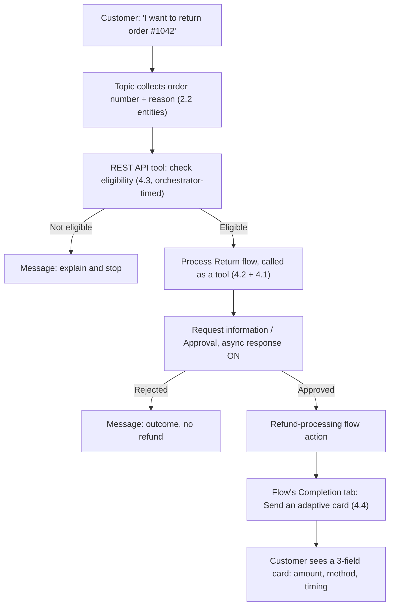

# Review & Build: Northwind Tool Chain

Four sessions built four separate mechanisms one at a time. This one wires three of them into a single Northwind flow — an orchestrator-timed API check, a human approval that survives a multi-hour wait, and a card that finally puts 4.4's own unanswered question to a real, deliberately cautious test.


**Session 4.5 of Group 4 — Tools & Actions.** Fifth and last session, after 4.1's connectors, 4.2's agent flows, 4.3's prompts and REST APIs, and 4.4's adaptive cards. **Group 4 is complete as of this page.** A Group 5 sizing pass runs next, before 5.1.


## Why this session doesn't teach anything new

2.4 closed out Group 2 by combining three sessions' worth of building blocks into one Northwind topic. 3.3 closed Group 3 the same way, folding a decision flowchart across every knowledge-source type the group had covered. This session follows the same shape on purpose: nothing below is a mechanism you haven't already verified in 4.1 through 4.4. What's new is putting three of those mechanisms into the same flow and watching where they actually touch.

The scenario is Northwind's return-and-refund process, and the honest reason it's a good fit isn't that it's exciting — it's that every piece it needs already exists somewhere in this group. A customer wants to return an order. Before anyone gets involved, the system should be able to check, on its own, whether the order even qualifies. If it does, a person on the returns team still has to sign off — Northwind isn't handing out refunds on an API response alone. And once that sign-off lands, the customer deserves something better than a wall of text to tell them what happened.

## The three pieces, recapped in one line each

| Session | Mechanism                                              | What it contributes to this build                                                                                                         |
| ------- | ------------------------------------------------------ | ----------------------------------------------------------------------------------------------------------------------------------------- |
| **4.3** | REST API tool (preview)                                | Agent-level and orchestrator-selectable — the eligibility check can fire on its own, without a topic hard-wiring exactly when to call it. |
| **4.2** | Request information / Approval + Asynchronous response | Lets the flow pause for a human reply that might take hours, without the flow itself timing out.                                          |
| **4.4** | Tool Completion: Send an adaptive card                 | Turns the flow's own result into a scannable card instead of the plain-text confirmation 4.2 shipped with.                                |

None of the three needs re-explaining — 4.2's and 4.3's own pages cover the mechanics in full, and this lesson's footer links back to every source that verified them. What follows is the part that's actually new to this session: two details about how the Completion tab's card option gets its data, verified live rather than assumed from 4.4's own honest gap.

## What 4.4 left open, and what's actually documented

4.4 flagged a real gap: Microsoft's tool-taxonomy page describes "Send an adaptive card" in one sentence and never says whether a button click on that card produces new output variables. That gap is still open — nothing fetched this session closes it. But a narrower, related question turned out to have an answer sitting on the same page, unread until this session went back to check it directly: how does a card on the Completion tab actually get filled with a tool's own result?

The answer is the same variable-binding idea 4.4 already taught for the dedicated Ask with Adaptive Card node, extended to the Completion tab: **"You can insert references to output variables from the tool using the variable picker. You can also use Power Fx formulas to format the response."** That's confirmation, not an assumption inherited from the dedicated node — a tool's Completion-tab response, card included, can reference that same tool's own output fields directly, the same compute-then-reference discipline 4.4 taught, just at the tool level instead of the topic level.

A second, more specific source confirms the same mechanism from the card side: **"You can use a Power Fx formula to include dynamic information on your card by referencing variables from your topic or agent."** — with an example as plain as substituting `text: Topic.Title` for a hardcoded string.


**A real one-way door, worth knowing before you commit to it:** the same source is direct about a cost: **"Once you begin editing in the formula panel, you can't go back to the original JSON code."** Binding a card's fields to Power Fx formulas is a one-time trade — reasonable for a finished card like the one this build produces, worth pausing over if you're still iterating on the card's raw JSON.


What's still genuinely unresolved — carried forward from 4.4, not solved here — is whether a button on a Completion-tab card round-trips into new variables. This build sidesteps that question rather than guessing at it: see the section below on what this build deliberately doesn't do.

## The build: Northwind return & refund



### Collect the return request

A "Process My Return" topic asks for the order number (a regex entity, per 2.2) and a return reason. Nothing new — this is 2.2's slot-filling doing exactly what it always does.



### Check eligibility with a REST API tool

Rather than a topic-hardwired HTTP Request node, the eligibility check is built as an agent-level **REST API tool** (4.3) — a small, closed, read-only call, exactly the shape 4.3's worked example warned belongs behind an orchestrator's own judgment rather than a fixed script position. Its description tells the orchestrator when it's relevant; the order number and return reason flow in as inputs.



### Route to the return-approval flow as a tool

An eligible result redirects into **Process Return** — the same agent flow 4.2 built, exposed as a tool with its own Details/Inputs/Completion configuration (4.1's shared tool lifecycle applies to a flow exactly as it does to a connector or REST API tool). Inside the flow, a **Request information** action routes the case to the returns team via Outlook.



### Keep Asynchronous response switched on

The flow's "Respond to the agent" action has **Asynchronous response** enabled, exactly as 4.2 specified. A returns-team reply can take hours; without this setting, the flow would fight the same synchronous ceiling 4.2 flagged as unreconciled between two Microsoft Learn pages (100 seconds per the error-code reference, 2 minutes per the asynchronous-response page) — and lose, regardless of which figure is the real one.



### Process the refund and complete with a card

Once approved, the flow calls Northwind's refund-processing action (using the same shared Power Automate action catalog 4.2 described) and produces three fields: approved amount, refund method, and estimated timing — three data points, sitting right at 4.4's design limit rather than over it. The flow-as-tool's own **Completion** tab is set to **Send an adaptive card**, with each field bound through the variable picker described above, replacing the plain-text confirmation 4.2 shipped with and 4.4's own reflection question flagged as unfinished.



## What this build deliberately doesn't do

Two restraint calls are worth being explicit about, because both trace directly back to gaps this course flagged rather than smoothed over.

**The confirmation card has no buttons.** The earlier section confirmed that a Completion-tab card can be filled with a tool's own output — but not what happens if that card is interactive. Until Microsoft's own documentation says otherwise, this build treats the card exactly the way 4.4 recommended treating an undocumented mechanism: for display only. If Northwind later needs the customer to confirm or dispute the refund from that same card, that's a job for the dedicated Ask with Adaptive Card node inside a topic — the mechanism 4.4 verified does produce new output variables — not for stretching an unverified Completion-tab behavior past what's actually been checked.

**The REST API tool is still a preview feature carrying real weight.** 4.3 flagged, and this build doesn't walk back, that Microsoft's own documentation calls the REST API tool prerelease and states plainly that "preview features aren't meant for production use." Using it for an eligibility check — read-only, reversible if wrong — is a narrower bet than using it for the refund transaction itself, which is exactly why the refund action stays inside the agent flow's own action catalog rather than becoming a second REST API tool. That's a deliberate design choice this session is making, not a gap being glossed over — see the reflection question below.

## Check your retrieval



The return-approval flow already uses Request information to pause for a human. Why does it also need Asynchronous response turned on?



**Because a human reply can take far longer than a synchronous call is allowed to wait.** Without Asynchronous response, the flow would be bound by the same synchronous ceiling 4.2 flagged (100 seconds per one Microsoft Learn page, 2 minutes per another) — and a returns-team reply measured in hours blows past either figure. Asynchronous response lets the flow run past that limit and call back to the agent when it's actually done.





Why does this build use a REST API tool for the eligibility check instead of 4.3's HTTP Request node?



**Governance, not capability.** Both mechanisms can make the same call. The HTTP Request node is topic-level — a maker decides exactly where in the script it fires. The REST API tool is agent-level and orchestrator-selectable — the orchestrator decides on its own when the check is relevant, which fits a check the agent should be free to run without a maker hardwiring its position.





The refund confirmation card in this build has no submit buttons, even though Adaptive Cards can be interactive. Why?



**Because whether a Completion-tab card's buttons produce new output variables is still undocumented.** 4.4 flagged this gap and it's still open. This build follows 4.4's own recommended fallback: treat an unverified mechanism as display-only, and reach for the dedicated Ask with Adaptive Card node — verified to produce new variables — whenever the goal is actually collecting something back.





Where do the three values on the refund confirmation card — amount, method, timing — actually come from, mechanically?



**The flow-as-tool's own output variables, bound through the Completion tab's variable picker (or a Power Fx formula).** Microsoft's tool-taxonomy page confirms this directly: "You can insert references to output variables from the tool using the variable picker" — the same compute-then-reference discipline 4.4 taught for topic variables, applied here to a tool's own output.



Reflection: this build puts a preview REST API tool into a live customer-facing process. 4.3 flagged that preview features "aren't meant for production use." Does using it only for a read-only eligibility check — not the refund transaction itself — actually resolve that tension, or just narrow it?


**ONE REASONABLE ANSWER** It narrows the tension without resolving it. A failed eligibility check is recoverable — worst case, a customer gets told to contact support and a human sorts it out, which is exactly the fallback 4.3's own worked example already builds in for a failed HTTP call. That's a meaningfully smaller blast radius than a preview feature touching the refund transaction itself, where a bug could mean money moving incorrectly. But "smaller blast radius" isn't the same claim as "safe for production" — Microsoft's own preview language doesn't carve out exceptions for low-risk use cases, and a maker who ships this design is still accepting whatever preview-stability risk the REST API tool carries, just for a narrower slice of the process. The honest position is that this is a defensible bet for a teaching scenario, not a substitute for reading the REST API tool's release notes before a real Northwind shipped it.


Single best primary source to read next: [**Add tools to custom agents**](https://learn.microsoft.com/microsoft-copilot-studio/add-tools-custom-agent) — the one page every session in this group has returned to, and the page that will eventually confirm (or rule out) whether a Completion-tab card's buttons produce new output variables.


**Key takeaway:** Group 4's four mechanisms were never really separate choices — they're four dials on the same underlying question of who decides when something happens and how the answer gets shown, and a real build almost always turns more than one of them at once.


***

**Primary sources verified this session**

1. [Add tools to custom agents](https://learn.microsoft.com/microsoft-copilot-studio/add-tools-custom-agent) — re-fetched live this session specifically for the Completion tab's variable-picker/Power Fx sentence, resolving part of 4.4's flagged gap (previously verified in 4.1, 4.3, and 4.4 for other sections of the same page)
2. [Display data from arrays](https://learn.microsoft.com/en-us/microsoft-copilot-studio/guidance/adaptive-cards-display-data-from-arrays) — fetched new this session; the Power Fx dynamic-binding formula and the formula-panel one-way-door warning
3. 4.1's, 4.2's, 4.3's, and 4.4's own verified sources — reused for this build without re-fetching, since nothing here changes what they established. See each session's own page for the full citation list.
