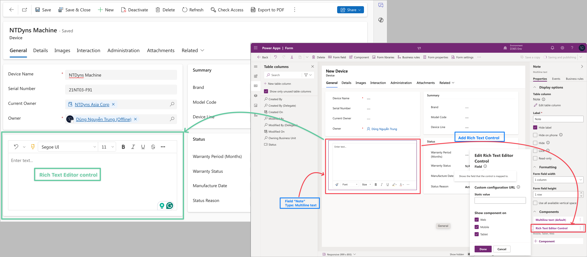
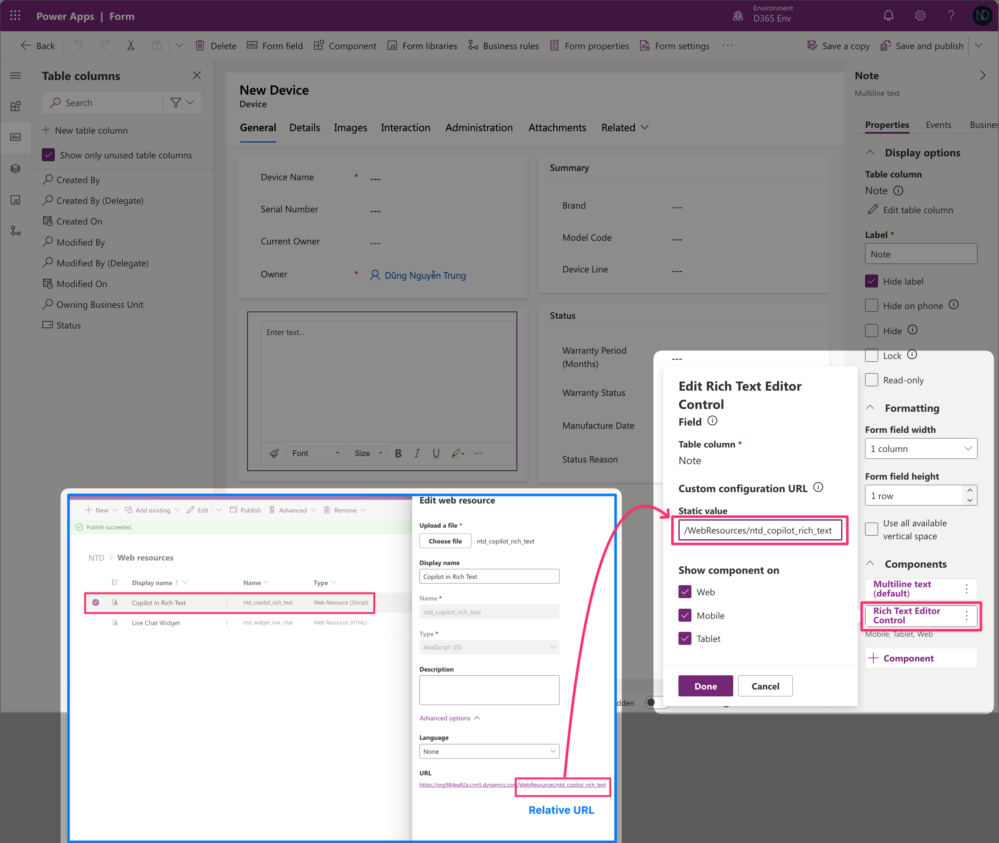
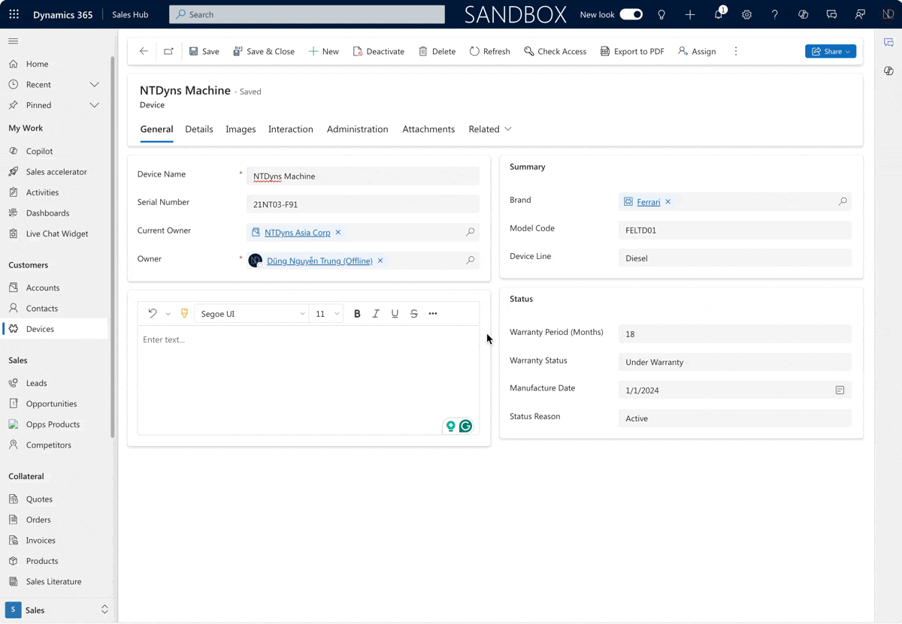

# 🥐 Add Copilot into Rich Text Control

Hello, my friends,

Did you use the Copilot on Email form?

<figure><figcaption><p>Copilot in the Email</p></figcaption></figure>

Both my client and I have tested this solution and found it effective. Copilot can enhance these suggestions by making them clearer, more concise, and more engaging.

Subsequently, I discovered that **this Copilot functionality** can be **integrated** with the **Rich Text Editor control** for **any desired entity**, enhancing its functionality.

## 1. How to add the Rich Text Editor control?


**Reference link:** [https://learn.microsoft.com/en-us/power-apps/maker/model-driven-apps/copilot-control](https://learn.microsoft.com/en-us/power-apps/maker/model-driven-apps/copilot-control)


I created a custom entity called "**Devices"** in my Sales Hub app.\
After that, I created a field "<mark style="color:red;">**Note**</mark>" - with type: _<mark style="color:red;">**Multiple lines of text**</mark>_

Okay.. firstly, I will add the _Rich Text Editor control_ for the field "Note" on the Device's main form without any customizations.

<figure><figcaption><p>Origin Rich Text Editor Control - on Device form</p></figcaption></figure>

The original Rich Text Editor control (green box) has no **Copilot** butto&#x6E;**.**&#x20;

## 2. Customize Rich Text Editor Control - Add Copilot button

### 2.1 Create Web Resource - add Copilot to rich text editor control

Now, I will create the Web Resource to add the Copilot button in the Rich Text Editor control on the Device Main form.

In my solution, I created a web resource as below. You can find the sample code from [MS Link.](https://learn.microsoft.com/en-us/power-apps/maker/model-driven-apps/copilot-control)

<figure><figcaption><p>Web Resource to add "Copilot" button in the Rich Text Editor control</p></figcaption></figure>

My sample code as below:

```javascript
// JavaScript
{"defaultSupportedProps": {
    "extraPlugins": "copilotrefinement",
    "toolbarLocation": "bottom",
    "toolbar":[{ "items": ["CopyFormatting","FontSize", "Bold", "Italic", "Underline", "BGColor", "CopilotRefinement"]}]
}
}
```


For more Rich Text Editor control customization, you can find the [**Link**](https://learn.microsoft.com/en-us/power-apps/maker/model-driven-apps/rich-text-editor-control)**.**


### 2.2 Add Web Resource into Rich Text Editor control on the form

Finally, we need to add this web resource for the Rich Text Editor control on entity Form - as my sample is **Device form.** Then **Save and Publish** the form.

<figure><figcaption><p>Add Relative URL (of Web Resource) in the Static Value of the Rich Text Editor control</p></figcaption></figure>


As Microsoft Recommendation:&#x20;

_"If you want to_ [_customize the editor_](https://learn.microsoft.com/en-us/power-apps/maker/model-driven-apps/rich-text-editor-control#customize-the-rich-text-editor-control)_, enter the <mark style="color:red;">relative URL</mark> of its configuration file, a JavaScript web resource that contains the properties you want to change, in the <mark style="color:red;">**Static value**</mark> box. If you leave this field empty, the editor uses its default configuration"._


### Testing now...

Check the result now... :relaxed:

<figure><figcaption><p>Testing - Copilot in Rich Text Editor</p></figcaption></figure>

**At present,** the Copilot feature for Rich Text Editor control is limited to refining paragraphs, but there is hope that this functionality will become more robust soon.

Thank you for reading & Hoping well. :tada: :goal:\
**\[NTD]yns.asia**
