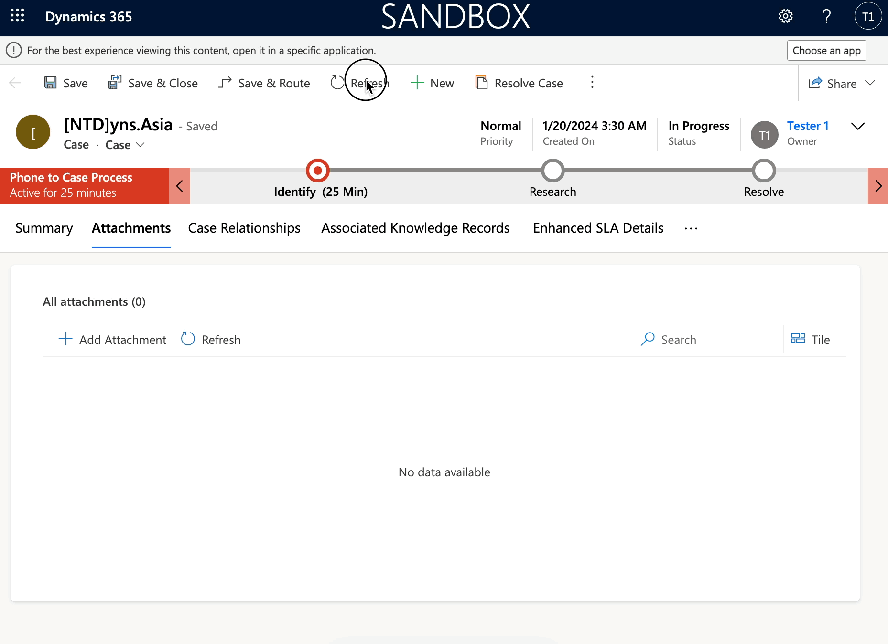

# Attachment Control

## Add Attachment Control for a custom entity

The **Attachment Control** is a PCF control in D365 Customer Service.&#x20;

This control is set on **Case** forms as default so that you can upload and view attachments. Moreover, you can use this PCF on other entities: **Account** or **Contact**, **but this was not possible for custom entities until now.**


Note: You must have at least 1 D365 Customer Service Enterprise or Professional license.


Now, I will add the Attachment Control for the **Case** main form

Opening the solution, select the **Case** entity, and open the specific main form. Then select the existing or add a new _**Single Line of Text**_ field to the form and add the **Attachment Control** over that field as below. Then Save & Publish the form.

<figure><figcaption>
Add control on Main form for text field
</figcaption></figure>

Checking... and the attachment control has been shown on **Case's main form.**

<figure><figcaption>
Attachment control on Case form
</figcaption></figure>

## Security Role - Permission

When I display this control on the form, I encounter a permission issue when I click the button **<+Add attachment>** to attach the file to Case.

<figure><figcaption>
Permission Issue
</figcaption></figure>

**Working around and found some things:**

* Firstly, you must enable security on the Attachment entity in _**Settings> Product > Features**_

<figure><figcaption>
Enable security on Attachment entity
</figcaption></figure>

* Second, you must set permission of entity **"Entity Attachment"** for the Security Role that was assigned to the User.

<figure><figcaption>
Set permission for Entity Attachment
</figcaption></figure>

... and re-checking now

<figure><figcaption>
Check attachment control
</figcaption></figure>

And the entity "Entity Attachment" is not counted in "Dataverse" capacity, this entity is counted in **"File"** capacity.

<figure><figcaption>
Entity Attachment is counted in "File" capacity
</figcaption></figure>

For more details, please check the Microsoft [link](https://learn.microsoft.com/en-us/dynamics365/customer-service/administer/add-attachment-control).

Thank you and hoping well.\
**\[NTD]yns.asia**\
<mark style="color:red;">...</mark>[<mark style="color:red;">invite me a cup.</mark>](https://ko-fi.com/ntdyns/?ref=qr\&amp;v=2) :coffee: Thank you. :heart:
