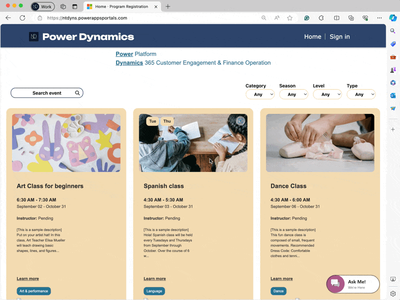

# 📢 Add Chat Widget to Power Pages - Proactive Chat

In exploring the Chat channel in OmniChannel functionality, as in this article, I will note how to add the Chat Widget to Power Pages and enable Proactive Chat for this page.

<figure><figcaption></figcaption></figure>

## Add "Chat Widget" to Power Pages

Firstly, You must create the [Power Pages](https://learn.microsoft.com/en-us/power-pages/getting-started/create-manage) site.&#x20;

After that, open the Power Page Management application to begin configuration.

| Open Power Page Management Apps                                                                          | Path                                                                                          |
| -------------------------------------------------------------------------------------------------------- | --------------------------------------------------------------------------------------------- |
|  | In Power Apps Studio > select Apps > then click open **Power Pages Management** application   |
|  | In the Power Pages site editor > select **<...>** icon then click **Power Pages Management.** |

In the Power Pages Management application >> go to the **Content** subarea >> select the **Code Snippets** under for configuration.

After that, you just copy the [Chat Widget's code snippet](https://dyns.ntd.asia/power-dynamics/d365-ce/customer-experience/omnichannel/internal-live-chat-in-mda#create-a-live-chat-channel) and then paste it to the **Value (HTML)** as below.

<figure><figcaption><p>Add HTML of Chat Widget snippet code</p></figcaption></figure>

Now testing...

<figure><figcaption><p>Chat Widget - Testing</p></figcaption></figure>

## Proactive Chat

The D365 Omnichannel for Customer Service allows showing the Live Chat widgets to customers. A chat channel allows your customers to engage with customer service agents using the chat widget on a website. However, You have thought that instead of waiting for them to initiate, we can invite them to a chat conversation proactively.&#x20;

<mark style="color:blue;">**For instance,**</mark> <mark style="color:blue;"></mark><mark style="color:blue;">identifying when a</mark> <mark style="color:blue;"></mark><mark style="color:blue;">**customer has lingered on a specific page**</mark> <mark style="color:blue;"></mark><mark style="color:blue;">for an extended period could be a prime opportunity to prompt engagement with agents via web chat</mark><mark style="color:blue;">**.**</mark>

Okay... now I will drop my configuration as below.

### 1. Enable the Proactive Chat feature for "Chat" channel

Open **Customer Service Admin** > select **Channel** > select **Chat** and click manage. Then open the live chat channel, and enable **Proactive chat** at the **Chat widget** tab as below.

<figure><figcaption><p>Enabling Proactive Chat for Chat channel</p></figcaption></figure>


### 2. Inject the HTML code for Proactive Chat configuration on your page

First, we must access this Microsoft [Link](https://learn.microsoft.com/en-gb/dynamics365/customer-service/develop/start-proactive-chat) to get the sample code for the **Proactive Chat** configuration.

For my instance, I will use the sample code of [**Scenario 1: Customer wait time**](https://learn.microsoft.com/en-gb/dynamics365/customer-service/develop/start-proactive-chat#scenario-1-customer-wait-time)**.**


```html
// Scenario 1: Customer wait time
<!-- Code to show proactive chat invite after visitor has spend given time on the webpage -->
<script id="Proactivechattrigger">
	// Wait for Chat widget to load completely
    window.addEventListener("lcw:ready", function handleLivechatReadyEvent(){
		var timeToWaitBeforeOfferingProactiveChatInMilliseconds = 20000;
		     //time to wait before Offering proactive chat to webpage visitor
		// Setting context variables
        Microsoft.Omnichannel.LiveChatWidget.SDK.setContextProvider(function contextProvider(){
            return {
                'Proactive Chat':{'value':'True','isDisplayable':true},
                'Time On Page':{'value': timeToWaitBeforeOfferingProactiveChatInMilliseconds ,'isDisplayable':true},
                'Page URL':{'value': window.location.href,'isDisplayable':true},
            };
        });
		
		//Display proactive chat invite after 'timeToWaitBeforeOfferingProactiveChatInMilliseconds' milliseconds
        setTimeout(function(){
            Microsoft.Omnichannel.LiveChatWidget.SDK.startProactiveChat({message: "Hi! Just checking in to see if I can help answer any questions you may have."}, false)
        },timeToWaitBeforeOfferingProactiveChatInMilliseconds);
    });
</script>
```


**Follow the steps:**

Now, in the Power Pages Studio, on your **Page** on which **you had configured the "Live Chat Widget"** >> click the **\<Edit code>.**  The Power Pages code will be loaded in the Visual Studio Code on the web in the new tab.

My sample: I configured the Live Chat Widget on the **Home page**. So, I will input the proactive chat code for this page.&#x20;

<figure><figcaption><p>Edit cod on Visual Studio Code</p></figcaption></figure>

... then input the sample code on the page's HTML file and Save. (using browser shortcut to save file).

<figure><figcaption><p>Input the proactive chat sample code</p></figcaption></figure>

After input, back to the Power Page Studio then click the <**Sync>** button to synchronize the code from Visual Studio code.

<figure><figcaption><p>Sync latest code for Power Page</p></figcaption></figure>

### 3. Testing Proactive chat...

I will open my Power Page and test now...

<figure><figcaption><p>Proactive Chat - Testing</p></figcaption></figure>

Thank you for watching and Hoping well! :tada:\
**\[NTD]yns.asia**
