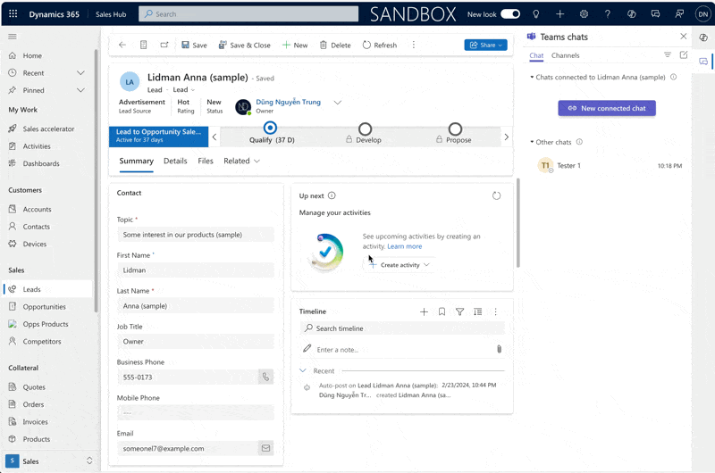
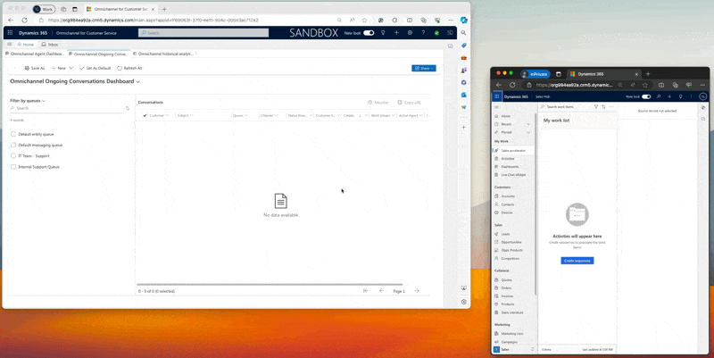
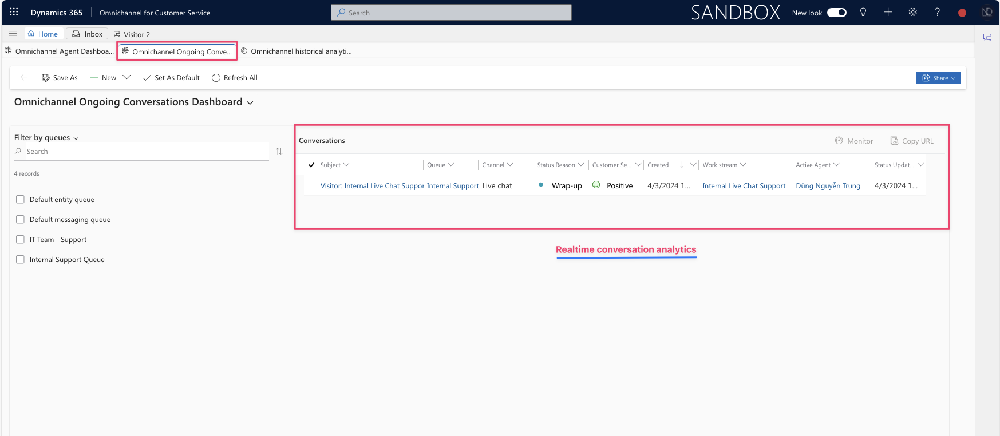

# 🐚 Internal Live Chat in MDA

Hi, my Friends,

Today, I'll discuss repurposing the **Live Chat** in **Omnichannel**, typically used for external clients on websites/portals, for internal support like IT Helpdesk. Let's explore how to adapt this channel for internal teams efficiently.

You can imagine that: <mark style="color:blue;">If a Sales user encounters issues while using the Sales Hub, they can quickly seek assistance by using the Live Chat widget. This feature enables them to open a chat box directly within the system and communicate with the IT support team or another agent for immediate help.</mark>

## Using Teams Chat within the Sales Hub

At this point, May you think we use the **Teams chats inside D365CE?** It's a great solution.\
In this way, you can link the current record to the chat. However, you must select a specific user that will help you.&#x20;

<figure><figcaption><p>Team Chats - inside app</p></figcaption></figure>

So, let's think with me about using the Routing feature for our internal users.\
Picture this: the user hits up the Live Chat widget with a question, and the system will send it to the right person who's best suited to answer. That's why, I think this case might be useful to leverage **Omnichannel's Live Chat.**

## Using Live Chat in Sales Hub App

I will scribe some simple steps to add the Live Chat widget to the **Sales Hub** app.

<figure><figcaption><p>Involve steps for configuration</p></figcaption></figure>

**Configure Work Stream and Live Chat channel**

Begin adding the Live Chat widget to the Model Driven app (**Sales Hub app**), we must configure 2 essential components - **Work Stream** and **Live Chat channel**

### Create Work Stream

In this article, I do not explain in detail about the Work Stream and how to use the Routing Rules. I just input this step for the necessary configuration.

<figure><figcaption><p>Work stream - Live chat channel</p></figcaption></figure>

### Create a Live Chat Channel

In this article, I do not explain in detail the Live Chat configuration. And see you in another session for discussion later.

<figure><figcaption><p>Live Chat channel</p></figcaption></figure>

After completing the configurations, I can now integrate the **Live Chat widget** into the Sales Hub app using the provided **Live Chat channel** code snippet.

### Add Live Chat widget to Sales Hub app

Step to add the Live Chat widget in the Sales Hub.

<figure><figcaption><p>02 steps for the configurations</p></figcaption></figure>



Create the **Web resource** with the type **HTML.**

First of all, we must create the HTML file based on the **Code snippet** of the **Live Chat channel.**&#x20;

<mark style="color:red;">**Note**</mark>: _Using the code snippet of the Live Chat channel, you should input the addition tag \<html> for this code._


```html
<html>
 <script 
  id="Microsoft_Omnichannel_LCWidget" 
  src="https://oc-cdn-public-apj.azureedge.net/livechatwidget/scripts/LiveChatBootstrapper.js" 
  data-app-id="1794611e-c5fa-4814-8573-36f4539d31ce" 
  data-lcw-version="prod" 
  data-org-id="8d84ab65-62a4-ee11-be33-002248586499" 
  data-org-url="https://unq8d84ab6562a4ee11be33002248586-crm5.omnichannelengagementhub.com">
 </script>
</html>
```


Create the HTML web resource component - **"Live Chat Widget".**

<figure><figcaption><p>Create html web resource</p></figcaption></figure>



Once the Web resource for the live chat widget is completed, then you edit the **Sales Hub** **app** and add **\[+New Page]** >> select **Web Resource.**

<figure><figcaption><p>Add New Page >> select Web Resource</p></figcaption></figure>

... after that, check the Sales Hub app designer mode:

<figure><figcaption><p>Sales Hub app Designer mode</p></figcaption></figure>

Okay... I finished the configuration. :tada: I will check on the Sales Hub app now. :relaxed:



## Checking now

I will run testing now. In my testing, I have login two apps with two users.

* **Omnichannel for customer service:** login by my user "Dũng Nguyễn Trung" - I'm an **Agent** and received the live chat conversation from internal users.
* **Sales Hub:** login by internal user **"Tester 1" - who will submit the live chat.**

<figure><figcaption><p>Internal Live Chat Testing</p></figcaption></figure>

... Omnichannel Ongoing Conversation analytics

<figure><figcaption><p>Omnichannel Ongoign Conversation</p></figcaption></figure>

Bingo. :tada:

Thank you for your reading & Hoping well.\
**\[NTD]yns.asia**\
...[invite me a cup.](https://ko-fi.com/ntdyns/?ref=qr\&amp;v=2) :coffee: <mark style="color:blue;">Thank you</mark> :heart\_hands:

