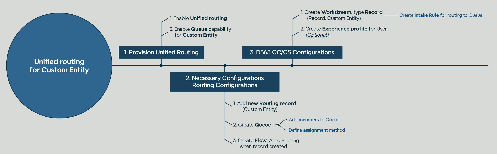
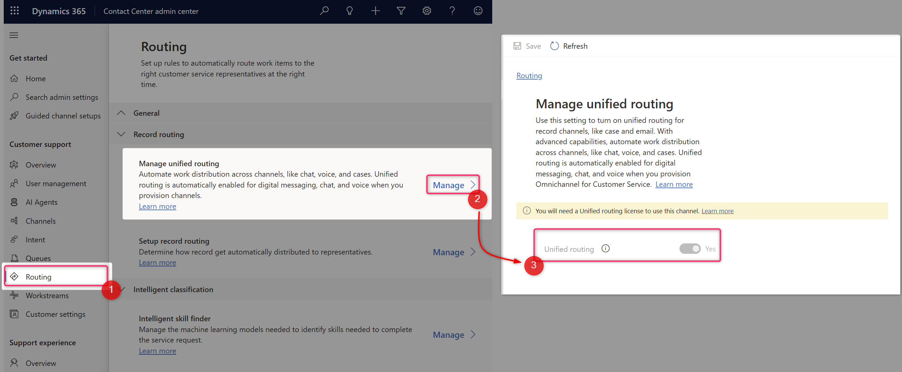
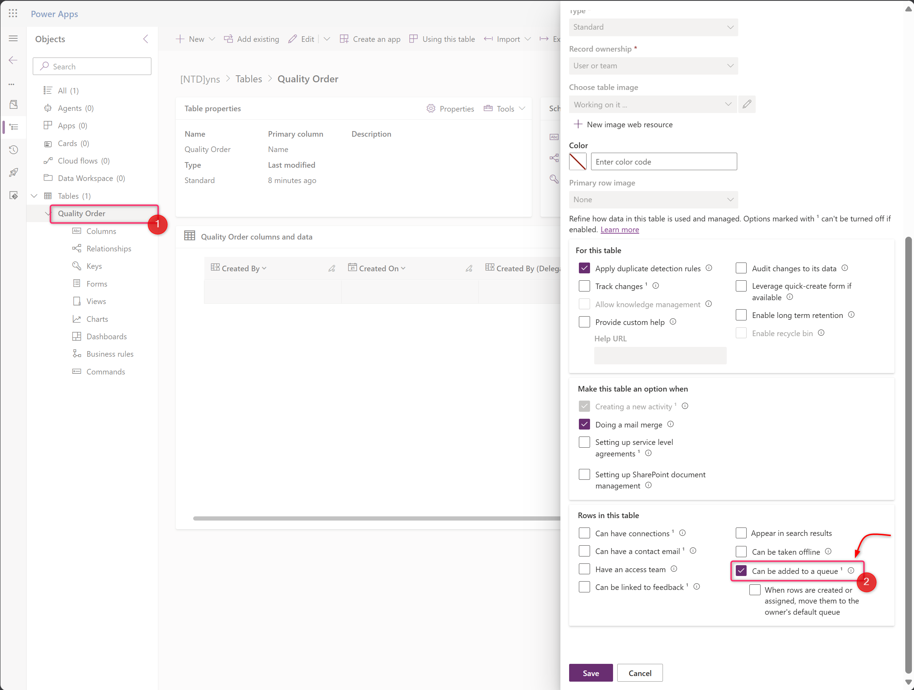
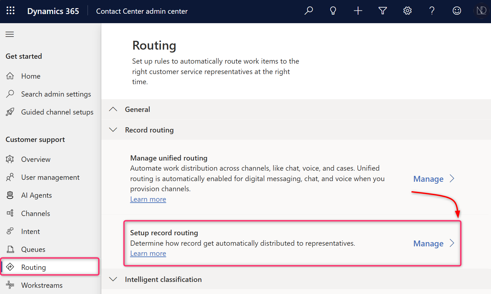
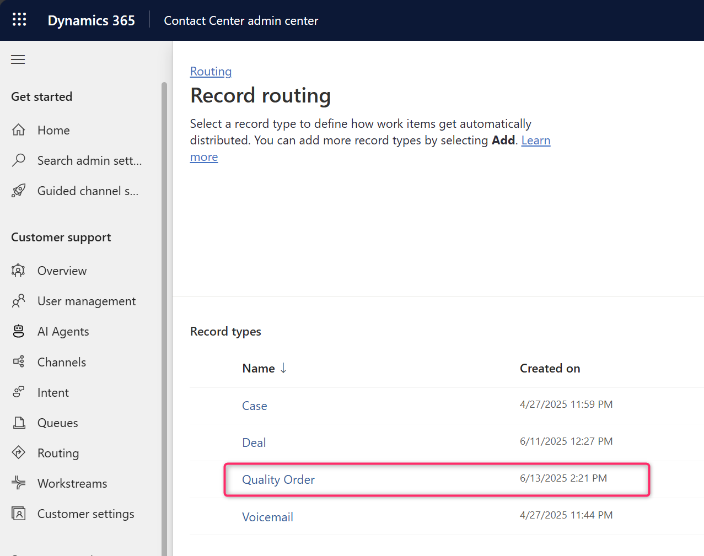
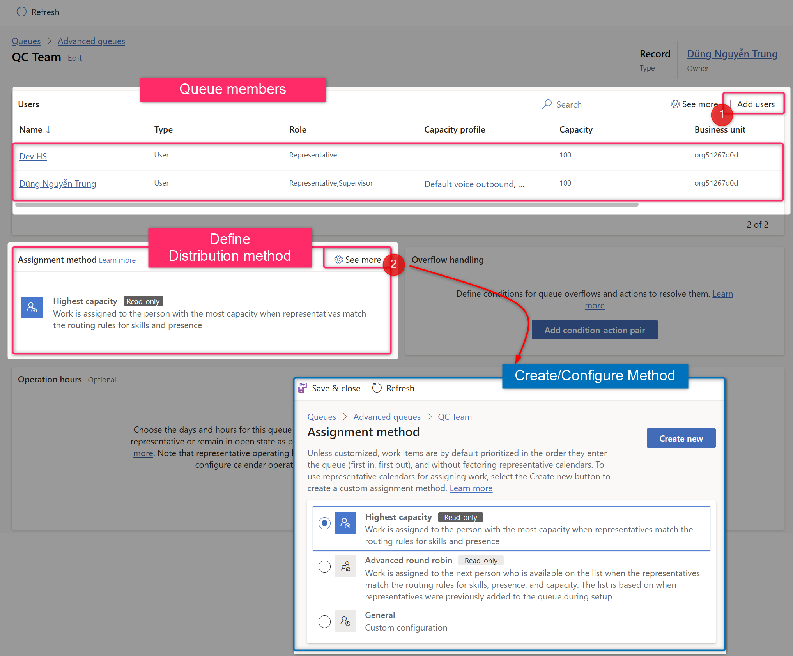
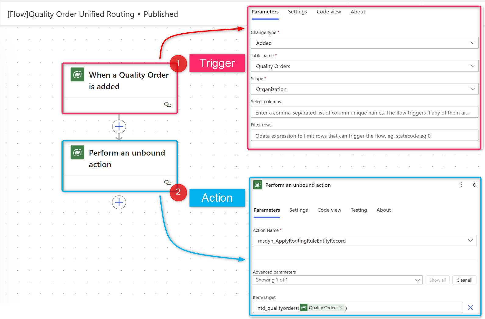
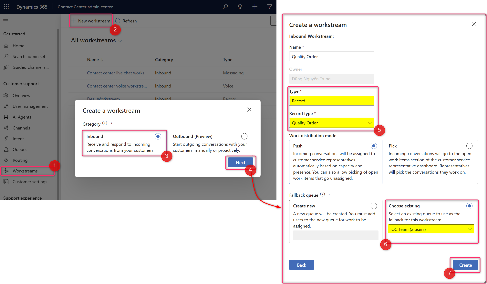
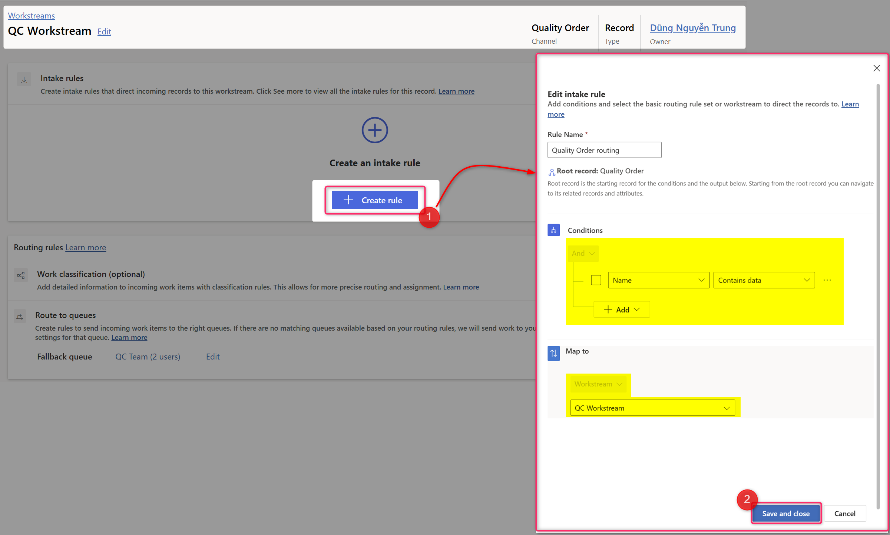
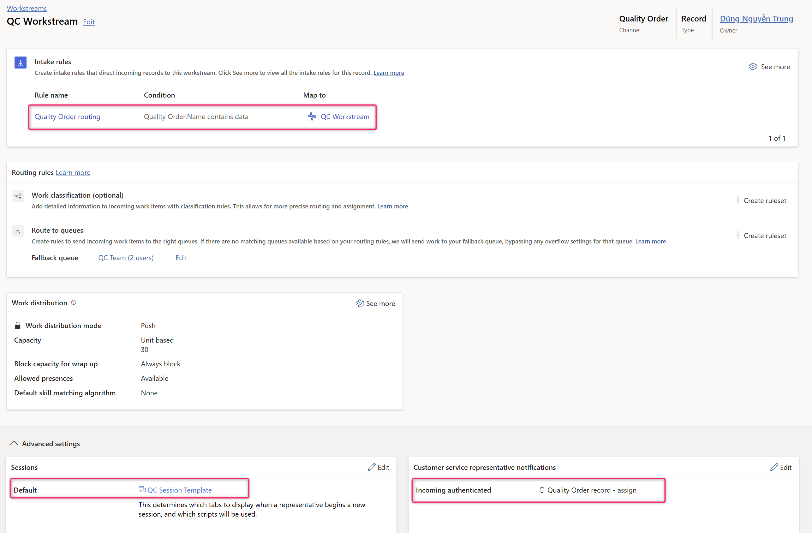

# Unified Routing for custom entity

Ciao friends, how are you? :relaxed:

In this blog post, we'll explore how to activate **Unified Routing** for a **Custom Entity.**

## **My idea**

<mark style="background-color:green;">Utilize the Unified Routing feature to efficiently distribute work items to team members.</mark>&#x20;


**Scenario**

The client has a QC team with multiple members. A Quality Order is created daily and should be assigned to the QC team members accordingly, based on the capacity of each member.

My client is using the D365 Customer Service and Contact Center. And the QC Team is going to these apps.

To address this requirement, I aim to leverage the **Unified Routing** capability to **distribute Quality Orders** to QC team members.&#x20;

\--

These are just my thoughts, and I believe there are many approaches:bulb:to this case. :heart\_eyes:


&#x20;     Now, let's explore how to enable **Unified Routing** for the custom entity **Quality Order** in the D365 Contact Center/ Customer Service.

## How to set up Unified Routing for Custom Entity?


I'm using the D365 Contact Center trial environment for this blog post&#x20;


To implement my solution, I need to enable **Unified Routing** and create a custom entity called **Quality Order**. This entity serves as a request item that will be distributed to a QC team for work.

### Overall step

<figure><figcaption>
Overall Steps
</figcaption></figure>

### Detail step



**Provision unified routing in the D365 Customer Service/ D365 Contact Center**



In the apps **Contact Center Admin center,** go to the **Routing** menu.

Ensure the **Unified routing** capacity was enabled by default. If not, please turn it on.

<figure><figcaption>
Enable unified routing
</figcaption></figure>



Go to the solution, then turn on the **Queue** capability for the Quality Order entity.

<figure><figcaption>
Enable Queue capability for Entity
</figcaption></figure>


As the OOB functionalities, only the Case entity was applied to the Unified Routing capacity.

So, for another entity, you must enable **Queue** capability to use this feature.&#x20;






**Necessary Unified Routing Configurations**



In the **Routing** page, go to the **Setup record routing**

<figure><figcaption>
Setup record routing
</figcaption></figure>

After that, click **<+Add>** button and select the **Quality Order** entity to use the unified routing feature.

<figure><figcaption>
Add Quality Order in the record routing
</figcaption></figure>

... after validation, the system will add the Quality Order entity into this list

<figure><figcaption></figcaption></figure>



Move on, creating a **Queue** for the QC Team, and add the Member for this queue.

The **Queue** is used in the Workstream Record of the Quality Order. Furthermore, in the Queue, we also define the distribution method, which is the engine that distributes the Work Item (Quality Order) to the queue members.

In the **Queue** page, open the **Advanced queues.** Then, click **<+New>** to create QC Team queue as below.&#x20;

<figure><figcaption>
Create QC Team Queue
</figcaption></figure>

After creating the QC Queue, we must add the member to the Queue and define the distribution method.

<figure><figcaption>
Queue configuration.
</figcaption></figure>


For the testing, I used the standard method provided by the system - **Highest capacity.**

For more information, you can check the [link](https://learn.microsoft.com/en-us/dynamics365/customer-service/administer/assignment-methods?wt.mc_id=d365cs_inproduct_page)**.**




For the Custom entity, we need to create a Flow to trigger the Unified Routing action to route the record to the Queue automatically.

In my approach, I must create a Flow to **unified-routing** the **Quality Order** automatically.

My flow configuration:

<figure><figcaption>
Flow configuration
</figcaption></figure>

Details of Step 2:

* Action step: **Perform an unbound action**
* Action name: **msdyn\_ApplyRoutingRuleEntityRecord**
* Item/Target: _**entitynames (\<entityRecordId>)**_ \
  My example entity: ntd\_qualityorders , the recordId was obtained from **Step 1**





**D365 Contact Center Configurations**

As an assumption, the QC team member will use the D365 Contact Center and use Contact Center Workspace apps (OOB apps). Therefore, we need to do at least the configurations for this app.

Therefore, after completing these necessary configurations above, we will move on to the configurations for the D365 Contact Center.



Create **Record** Workstream for the **Quality Order** entity.

<figure><figcaption>
Create QC Workstream - type Record - entity Quality Order
</figcaption></figure>

After that, we need to **create** the **unified routing rule** for this workstream. By this configuration, the Quality Order record will be auto-routed to the QC Team queue.

<figure><figcaption>
Create intake rule for Workstreams
</figcaption></figure>

... And then, we configure (optional) the **Session** and **Customer service representative notifications.** For more details, you can find them in the link: [Session template](https://learn.microsoft.com/en-us/dynamics365/customer-service/administer/session-templates) and [Notification](https://learn.microsoft.com/en-us/dynamics365/customer-service/administer/notification-templates).


By default, the system will set **"Entity records session - default"** and **"Entity record - assign - default"** for the Workstream that has type **Record.**


<figure><figcaption>
Configure Session and Notification for Workstream.
</figcaption></figure>



Experience profiles enable you to create targeted app experiences for customer service representatives (service representatives or representatives) and supervisors, and are an alternative to building and maintaining custom apps. With the experience profiles, administrators can create custom profiles with specific session templates, conversation channels, and productivity tools. These profiles can then be assigned to users... [more details.](https://learn.microsoft.com/en-us/dynamics365/customer-service/administer/overview?wt.mc_id=d365cs_inproduct_page)

And in my solution, I would like to create a new **QC Team profile** and just apply it to the QC Team members.

To configure, you navigate to **Workspaces,** then open the **Experience profiles,** click **<+New>** to create a profile

<figure><figcaption>
Create QC  Team Profile
</figcaption></figure>

After that, we need to do some configurations on this profile:&#x20;

1. Add user to profile
2. Select Entity session template: I created the Quality order session entity.
3. Configure Inbox view: My Work Items, Open Work Items, Closed Work Items view.

<figure><figcaption>
Profile configuration
</figcaption></figure>



Tada... :tada: I completed my necessary configurations for my approach. Now I will try to **create a new Quality Order record,** and my expectation is that the Quality Order record will be auto-routed to workstreams **QC Workstream.**



### Checking...!

My demo instance, I have 2 QC Members: **NguyễnTrung Dũng** (it's me :innocent:) and **HS DEV.** For the quick checking, I login to the **Customer Service Hub** then create **a Quality Order** record directly, and Owner of these records I will change to another user.&#x20;

Now, let's check the result video.  And thank you for your patient reading. :heart\_eyes\_cat:


Checking Result


***

<figure><figcaption>
GIF of the checking result
</figcaption></figure>



Hoping well! :herb:\
**\[NTD]yns.asia** 
