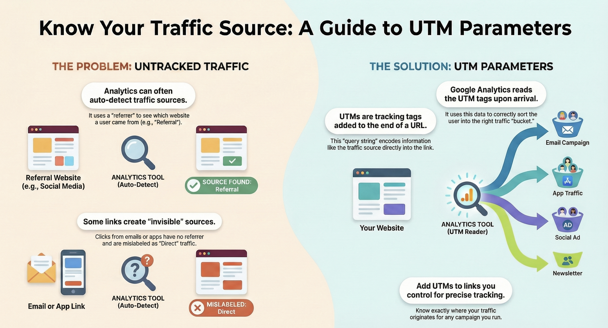
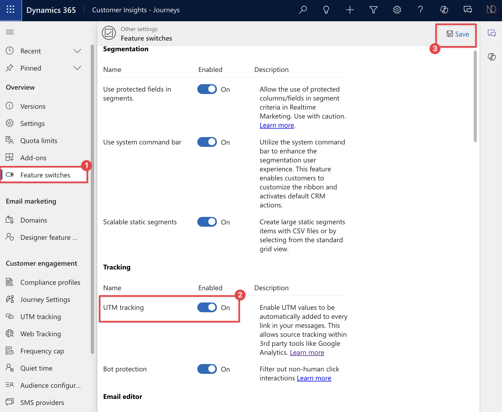
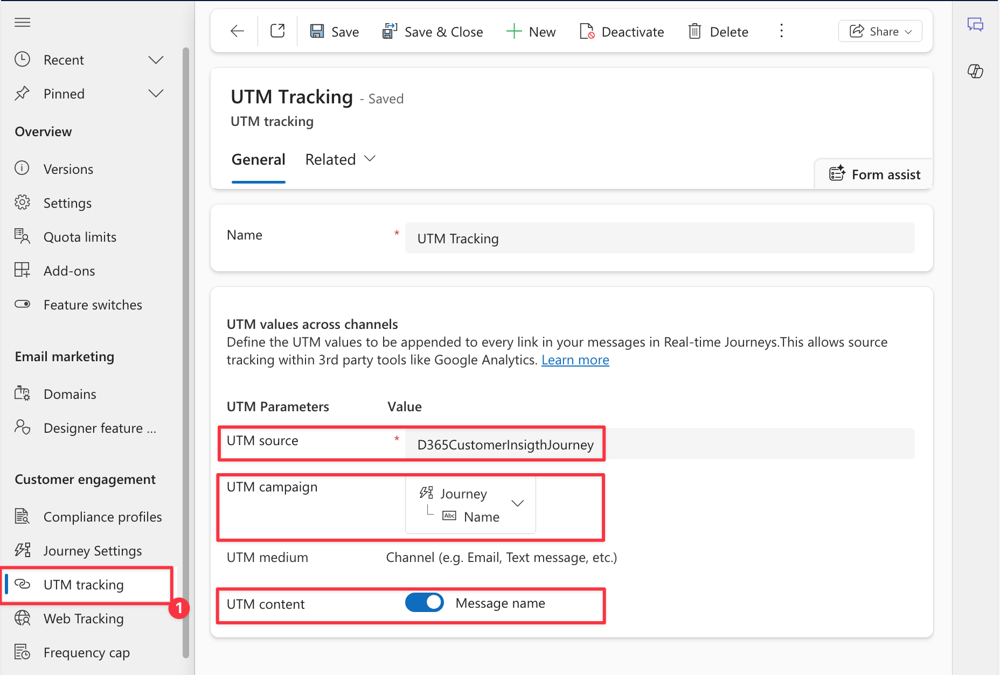
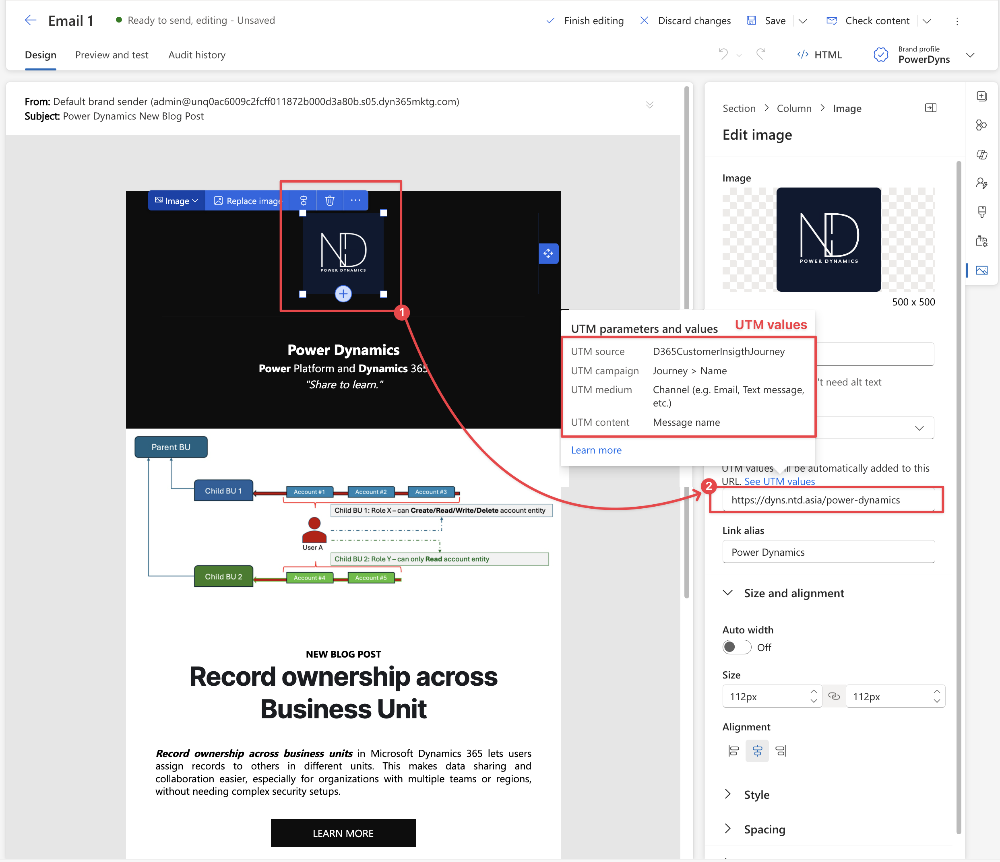
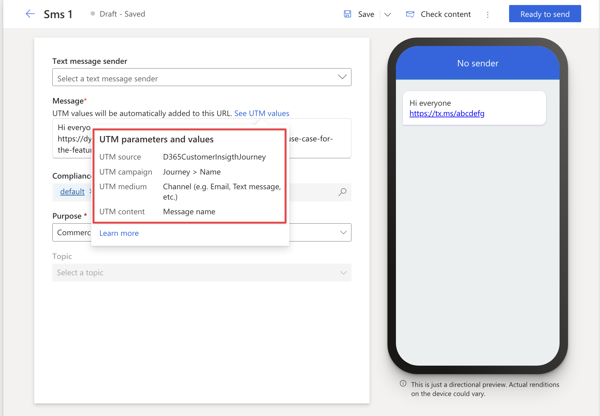
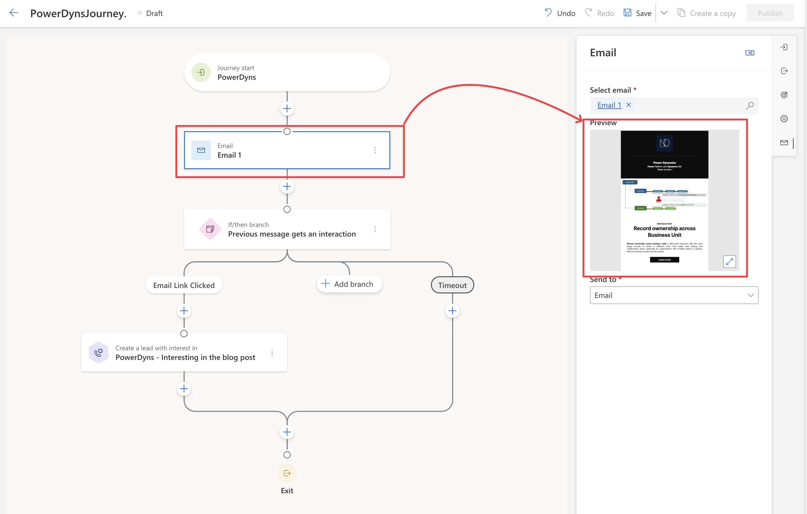
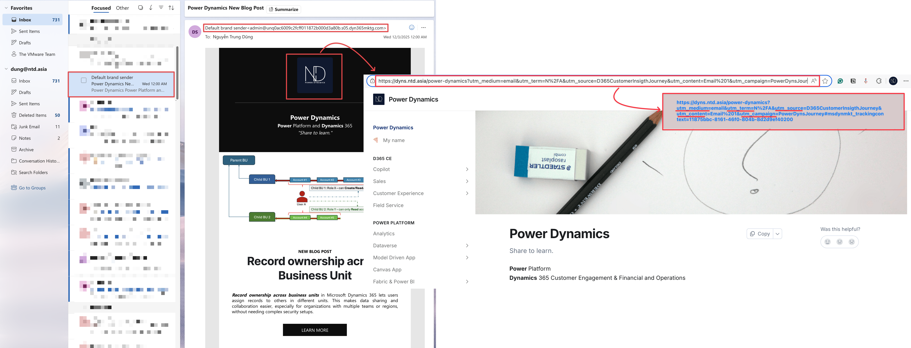
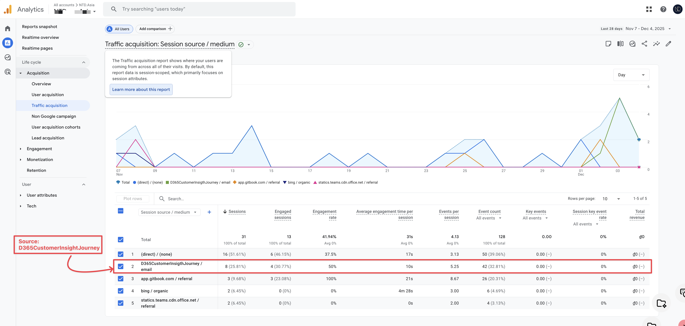
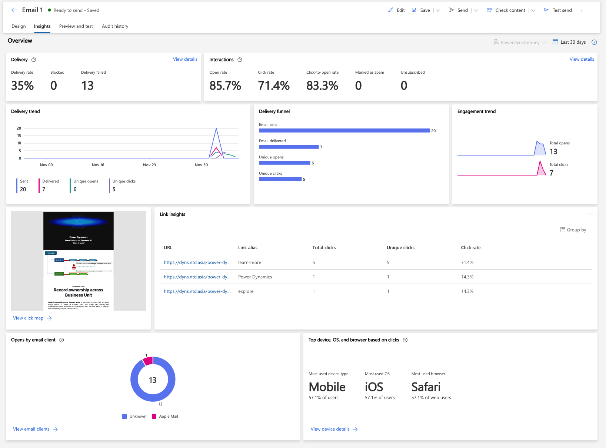
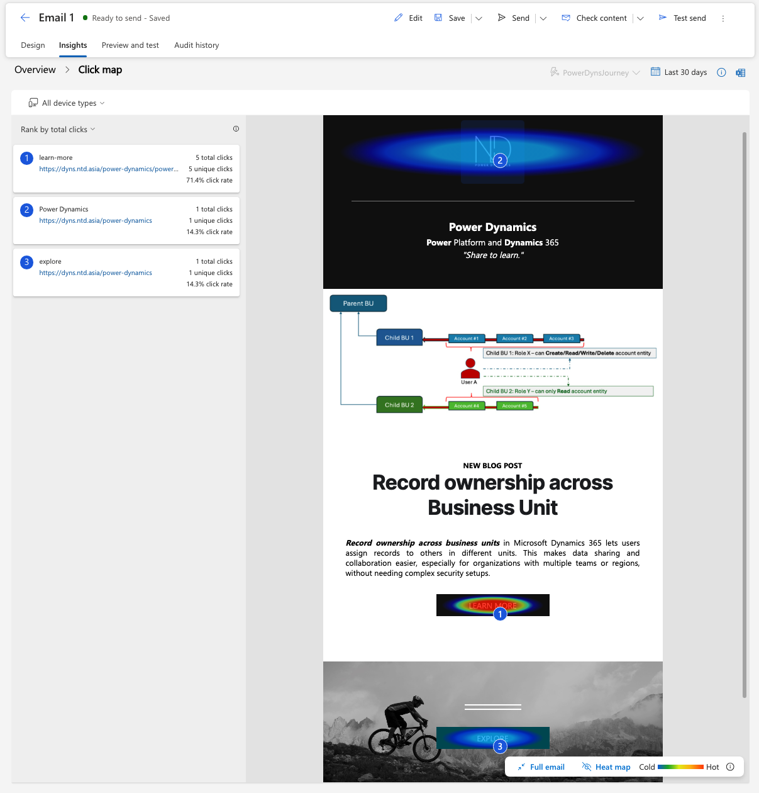

# Using UTM Tracking in D365 Customer Insight - Journey

&#x20;  **Merry Xmas!** :tada:

&#x20;  **In today’s** data-driven marketing landscape, accurately tracking campaign performance and customer journeys is more critical than ever.&#x20;

&#x20;  **UTM Tracking** empowers us to gain precise insights into how audiences interact with our brand across different channels. When combined with the robust capabilities of Dynamics 365 Customer Insights – Journeys, UTM tracking unlocks transformative opportunities for personalization, segmentation, and ROI measurement.

:rocket: Now, let's unlock the full potential of your marketing campaigns with **UTM tracking** in **Dynamics 365 Customer Insights – Journeys.**

<figure><figcaption></figcaption></figure>

## What is UTM?

_Source from Wikipedia_

Urchin Tracking Module (UTM) parameters are **five** **variants** of [**URL parameters**](https://en.wikipedia.org/wiki/Query_string) used by marketers to track the effectiveness of online [marketing campaigns](https://en.wikipedia.org/wiki/Marketing_campaign) across traffic sources and publishing media. They were introduced by [Google Analytics](https://en.wikipedia.org/wiki/Google_Analytics)' predecessor [Urchin](https://en.wikipedia.org/wiki/Urchin_\(software\)) and, consequently, are supported [out of the box](https://en.wikipedia.org/wiki/Out_of_the_box_\(feature\)) by Google Analytics. The UTM parameters in a URL identify the campaign that refers traffic to a specific website, and attribute the browser's website session and the sessions after that until the campaign attribution window expires to it. The parameters can be parsed by analytics tools and used to populate reports.

> <mark style="color:green;">This example URL has four of the five UTM parameters highlighted:</mark>
>
> https://www.example.com/page?**utm\_content**=buffercf3b2&**utm\_medium**=social&**utm\_source**=snapchat.com&**utm\_campaign**=buffer

There are five different UTM parameters, which may be used in any order: \
_&#x53;ource from Wikipedia_

<table><thead><tr><th width="153.3203125">Parameter</th><th width="359.33984375">Purpose</th><th>Example</th></tr></thead><tbody><tr><td>utm_source</td><td>Identifies which site sent the traffic, and is a required parameter.</td><td>utm_source=google</td></tr><tr><td>utm_medium</td><td>Identifies what type of link was used, such as email or <a href="https://en.wikipedia.org/wiki/Pay-per-click">pay-per-click</a> advertising.</td><td>utm_medium=ppc</td></tr><tr><td>utm_campaign</td><td>Identifies a specific product promotion or strategic campaign.</td><td>utm_campaign=spring_sale</td></tr><tr><td>utm_term</td><td>Identifies search terms.</td><td>utm_term=running+shoes</td></tr><tr><td>utm_content</td><td>Identifies what specifically was clicked to bring the user to the site, such as a <a href="https://en.wikipedia.org/wiki/Banner_ad">banner ad</a> or a <a href="https://en.wikipedia.org/wiki/Hyperlink">text link</a>. It is often used for <a href="https://en.wikipedia.org/wiki/A/B_testing">A/B testing</a> and <a href="https://en.wikipedia.org/wiki/Contextual_advertising">content-targeted ads</a>.</td><td>utm_content=logolink or utm_content=textlink</td></tr></tbody></table>

### Purpose and function:&#x20;

&#x20;  **UTM parameters** are used to communicate important information about where audiences came from to analytical tools such as Google Analytics. They are essential for answering the question, "<mark style="color:green;">Where did my audiences come from?</mark>". And, when an audience clicks a link containing UTMs and lands on the corresponding landing page, **Google Analytics** reads the parameters from the URL and sorts the traffic into the appropriate classification or "bucket".

So, how to configure the UTM Tracking in D365 Customer Insight Journey? Let's move on to the next section.

## UTM Tracking in D365 Customer Insight - Journey

This section includes 2 parts:

* **Enable UTM Tracking**
* **Run Journey and Tracking on Google Analytics**. This part requires that your landing page/ website must be tracked by Google Analytics before.\
  And, in my post, I've used my Blog and was also tracked by Google Analytics.

### Enable UTM Tracking

**This is the 1st part.**

In the Customer Insight - Journeys app, in the **Settings** area, select the **Feature switches,** then turn on the **UTM Tracking** by following the pictures

<figure><figcaption>
Enable UTM Tracking
</figcaption></figure>

After that, you need to create a UTM Tracking mapping record.

* <mark style="color:green;">UTM source</mark>: input the marketing source according to your convention.\
  _**E.g:**_ I input the source name _**"D365CustomerInsightJourney".**_&#x20;
* <mark style="color:green;">UTM campaign</mark>: this utm\_campaign was mapped with the field **Name** in the table **Journey** by default.\
  _**Note**_: You can create a custom field in the table **Journey (msdynmkt\_journey)**, then use this field to map with the UTM campaign parameter.
* <mark style="color:green;">UTM medium</mark>: The channel that the UTM record is used on.
* <mark style="color:green;">UTM content</mark>: Captures UTM content as message name. \
  _**Note:**_ If you turn it off, UTM content won't be added to the URL link.

<figure><figcaption>
UTM Tracking record
</figcaption></figure>

### How to use UTM Parameters?

When you **enable UTM tracking**, you see the default values for **each UTM parameter**. These are the values that are **added to all URLs** that you **add to your emails** or **text messages**, or a **custom message channel.**

For example, I configured email marketing as below: \
I just input the URL of my blog: [https://dyns.ntd.asia/power-dynamics](https://dyns.ntd.asia/power-dynamics)

<figure><figcaption>
Configure UTM in email
</figcaption></figure>

For another, we can configure UTM in the text message:

<figure><figcaption>
UTM in the Text Message
</figcaption></figure>

### Run Journey and send Email marketing to the audience

After completing the Email configuration, I will create a sample **Journey** to send **Email marketing** (above step) to the audience for testing.&#x20;

<figure><figcaption>
Sample Journe - Send Email Marketing
</figcaption></figure>

## Checking now...

This is the 2nd part: **Run Journey and Tracking on Google Analytics**

### Email Marketing and URL

Once I clicked on my blog logo, the URL was populated with some UTM parameters, although my original URL is [https://dyns.ntd.asia/power-dynamics](https://dyns.ntd.asia/power-dynamics).

* utm\_medium=email
* utm\_term=N%2FA
* utm\_source=D365CustomerInsigthJourney
* utm\_content=Email%201 (**email name:** "Email 1")
* utm\_campaign=PowerDynsJourney

<figure><figcaption>
Check the URL once user click the URL.
</figcaption></figure>

### Check on my tool: Google Analytics

I was using the Traffic Acquisition report.

My campaign source **"D365CustomerInsightJourney"** was tracked by Google Analytics as below, and this report also displays that the utm\_medium is **Email (**&#x62;ecause I've used the email channel).

<figure><figcaption>
Traffic Acquisision report
</figcaption></figure>

### Email insight from the D365 Customer Insight Journey:

And I would like to share some Email Insight dashboard from D365 Customer Insight

<figure><figcaption>
Email Insight - Overview
</figcaption></figure>

Heatmap report

<figure><figcaption>
Heatmap
</figcaption></figure>

Ya.. That's all from my side. :rocket:

Thank you and Hopping well. \
**\[NTD]yns.Asia**
