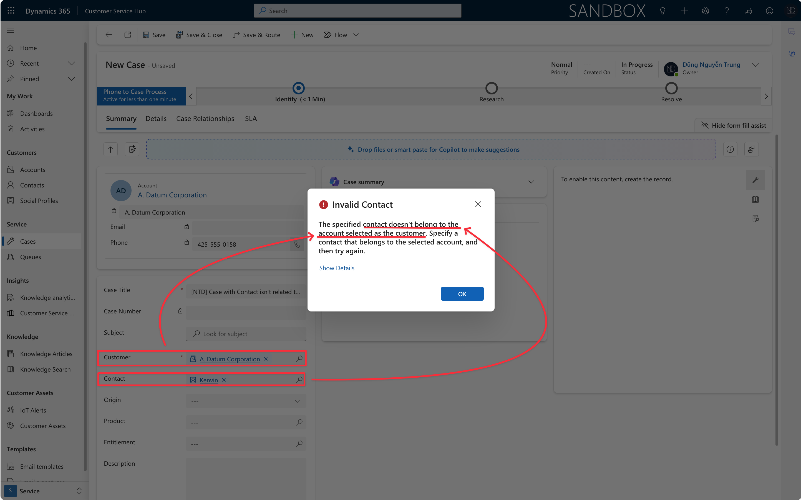
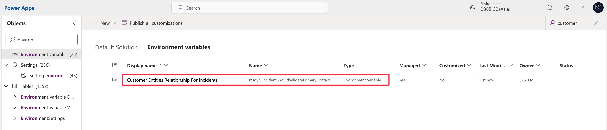
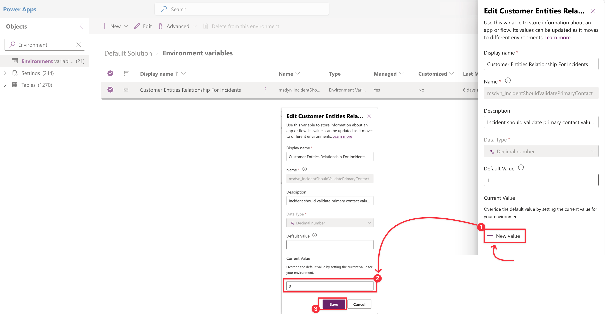
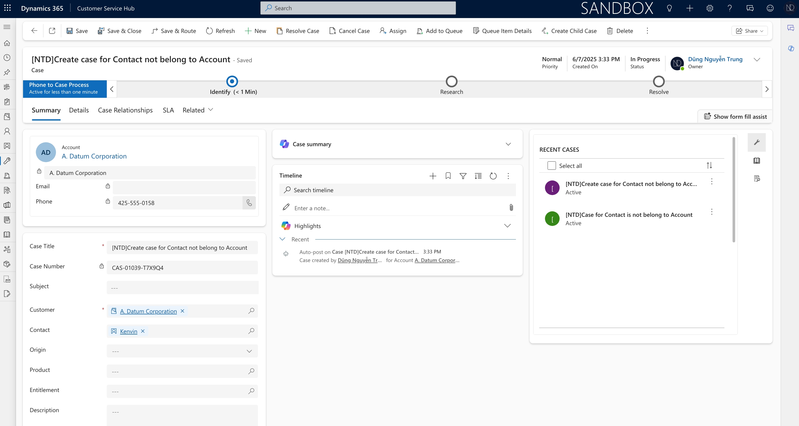
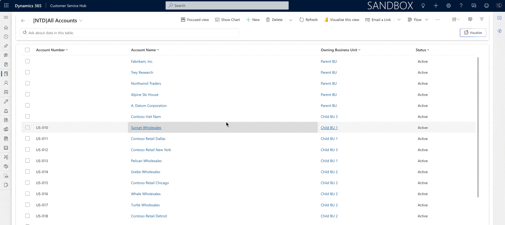

# ✂️ Removing the Account & Contact validation on the Case form

<figure><figcaption>
Invalid Contact - error dialog
</figcaption></figure>


**Invalid Contact**\
The specified contact doesn't belong to the account selected as the customer. Specify a contact that belongs to the selected account, and then try again.


Ciao friends,&#x20;

Nowadays, I'm working on the D365 Customer Service for the new project. I've provided the client with case lifecycle management, as well as case creation from multiple channels.

I encountered a Contact and Account validation feature, as shown in the image above. \
<mark style="background-color:green;">**In my situation**</mark>, the user needs to create a case for a new account and a new contact. At this point, the account and contact do not have any relationship since they are both new entries in the D365 Customer Service system.

I wonder why Microsoft requires this relationship validation and how I can disable this <mark style="background-color:blue;">**"functionality"**</mark>.

Okay... ignore the reason why, and I just want to disable this functionality. :smirk:



### Find the variable "Customer Entities Relationship For Incidents"

Go to the **Default solution**, then select the component **Environment Variables.** Using the Search box to find the variable **"Customer Entities  Relationshi\[ For Incidents"** easily.

<figure><figcaption>
Customer Entities Relationship For Incidents
</figcaption></figure>



### Edit the Value for the variable

After finding the variable, click to open then click to button **<+New Value>** to override the default value of this environment variable.

<figure><figcaption>
Add New value
</figcaption></figure>

Then click **Save** to update the new value <mark style="background-color:green;">**(value = 0)**</mark>



### Testing...

I go to my D365 Customer Service Hub and succeed in creating a Case for Account (**A. Datum Corporation**) and Contact (**Kenvin**) as the initial feature image.

<figure><figcaption>
Case record
</figcaption></figure>

Checking with the GIF image...

<figure><figcaption></figcaption></figure>



My client has the same question as me. The reason why... :smile: I just smile and configure to bypass the validation. Funny. :man\_running:

Okay... Hoping well! and Thank you for your reading. \
**\[NTD]yns.Asia**

