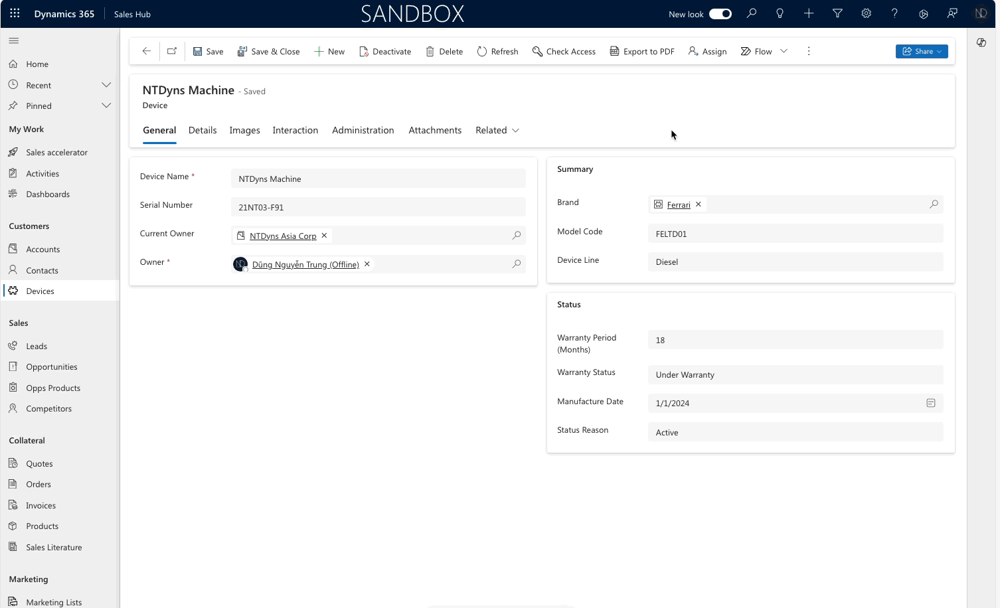
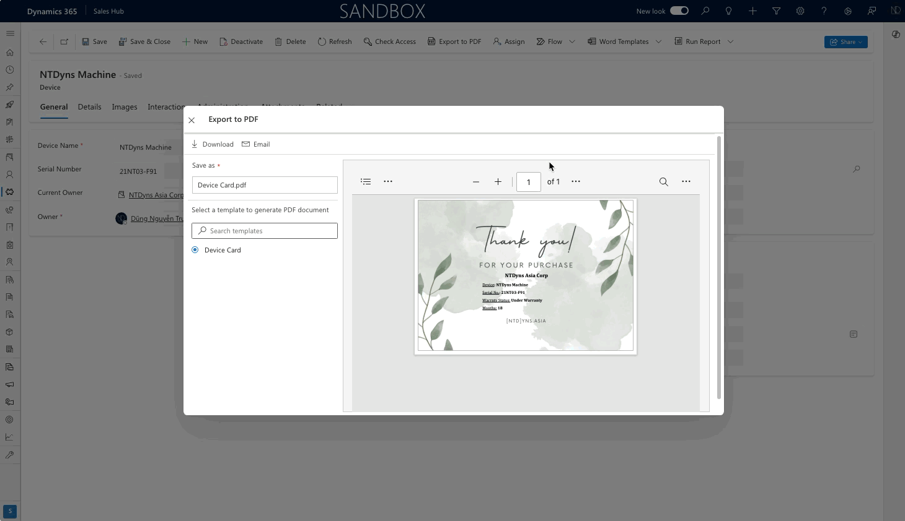

# Export record to PDF

Today, I came back to the old functionality - <mark style="color:purple;">**Export to PDF**</mark>.

Previously, this feature only supported out-of-the-box entities like **Account**, **Contact**, **Lead**, **Opportunity**, **Quote**, **Order**, and **Invoice** but did not extend to <mark style="color:green;">**Custom entities**</mark><mark style="color:purple;">**.**</mark>

It's gratifying to see that this functionality has <mark style="color:green;">**now**</mark> been <mark style="color:green;">**implemented**</mark> for the <mark style="color:green;">**Custom Entity**</mark>**.**

<figure><figcaption>
Configure "Export to PDF" for entities
</figcaption></figure>


The **Export to PDF** functionality is available on D365 for Sales.

For configuration, Open the **Sales Hub >** move to **App Setting** area > **Productivity tools.** Then choose the **"Conver to PDF"** and configure these entities to apply this functionality.


## Scenario: Create a Device Card

My case: I must create a Device Card to show Device information. The user will export it to PDF and send it to the customer.

I have a custom entity called **Device** that stores the device information of customers.

**Involve Steps**

<figure><figcaption>
Configure Export to PDF
</figcaption></figure>

### 1. Configure Word Template - "Device Card"

My sample Word Template "Device Card" is below.

<figure><figcaption>
Sample "Device Card" - Thank you
</figcaption></figure>

### 2. Enable "Export to PDF" for entity Device

Configure in **Sales Hub > App Setting >** under **Productivity Tools**, click menu **"Convert to PDF"** then **select entity Device** > click **Save** to enable.

<figure><figcaption>
Enable function for entity "Device"
</figcaption></figure>

### **3. Check the "Export to PDF" button on the Device entity:**

<figure><figcaption>
Button "Export to PDF" is visible
</figcaption></figure>

Ya.. here, I completed enabling the functionality "Export to PDF" for the custom entity "Device". :tada:

<figure><figcaption>
Screenshot - Export to PDF
</figcaption></figure>

<mark style="background-color:green;">**Live Testing on Sales Hub:**</mark>

<figure><figcaption>
Live check - Export to PDF
</figcaption></figure>

## Send email "Device Card.pdf" to customer

In "Export to PDF" screen > click on **\[Email]** icon to send this Device Card.pdf file to the customer via email.

* The Email record will be created
* This Email will be shown on the Timeline are of the customer.

<figure><figcaption>
Send email on "Export to PDF"
</figcaption></figure>

Check **Email** record on Timeline area of **Contact - John John**

<figure><figcaption>
Email Record on Contact
</figcaption></figure>

Hoping well. :heart\_hands:

Thank you for your reading.\
**\[NTD]yns.Asia**\
<mark style="color:red;">...</mark>[<mark style="color:red;">invite me a cup.</mark>](https://ko-fi.com/ntdyns/?ref=qr\&amp;v=2) :coffee: Thank you. :heart:
