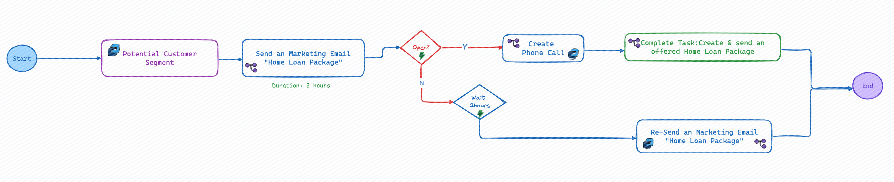
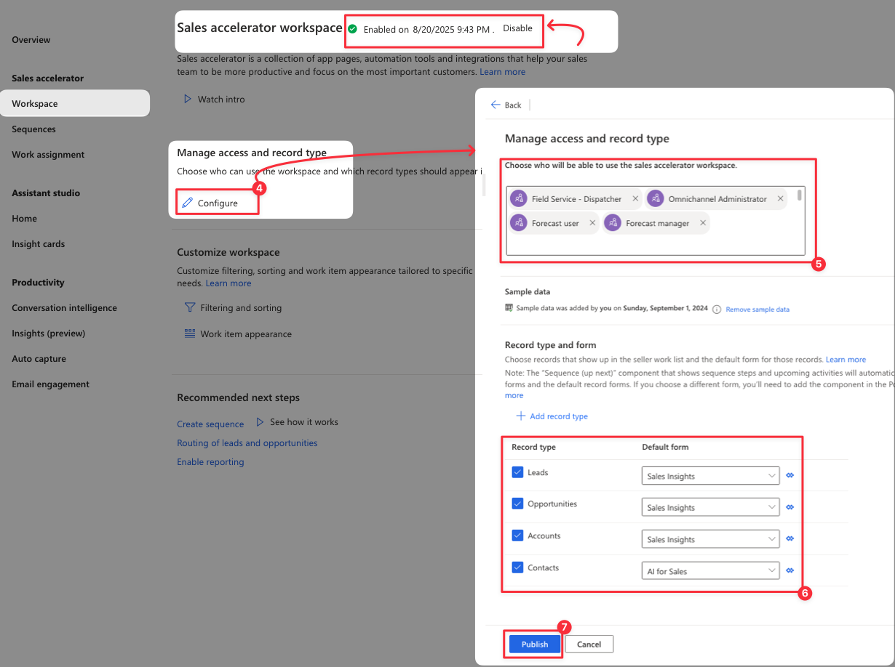
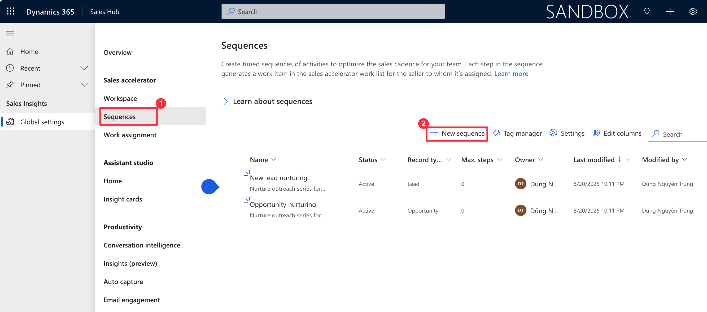
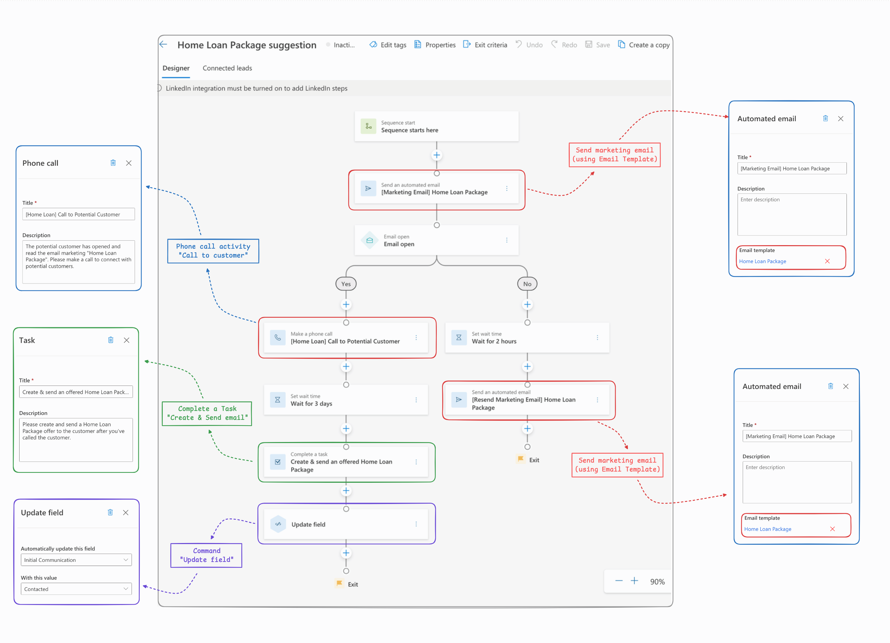
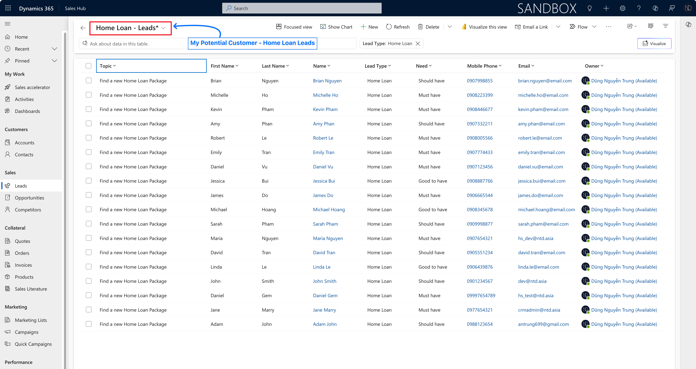
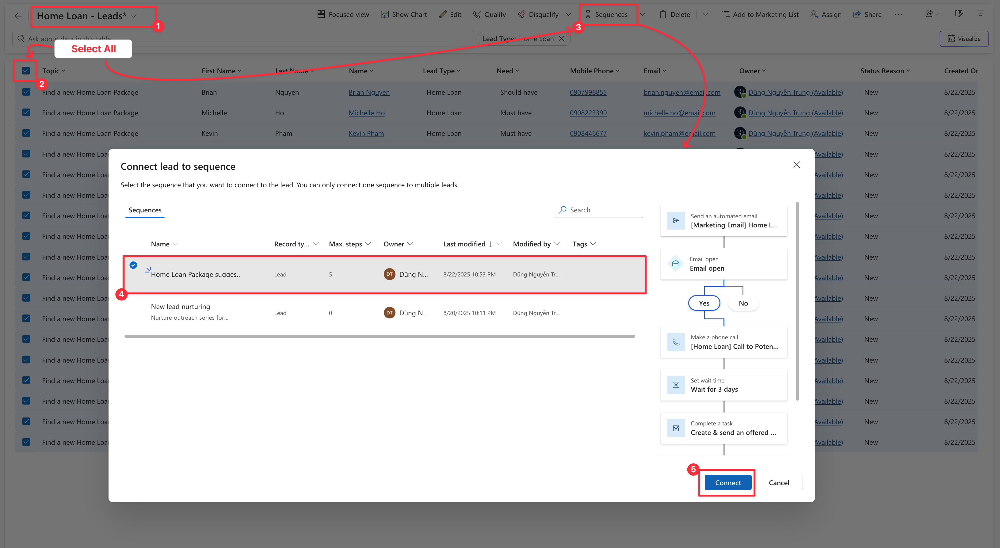
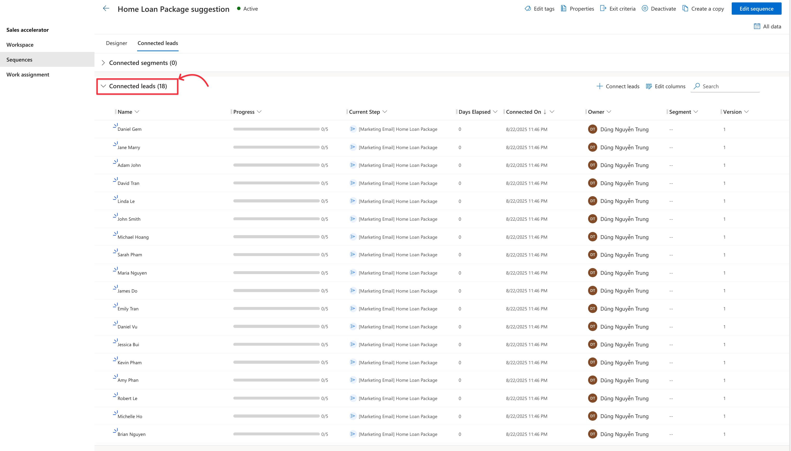
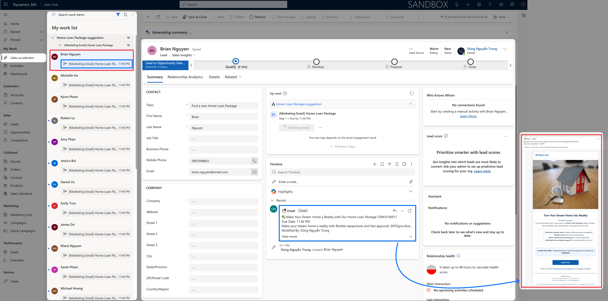
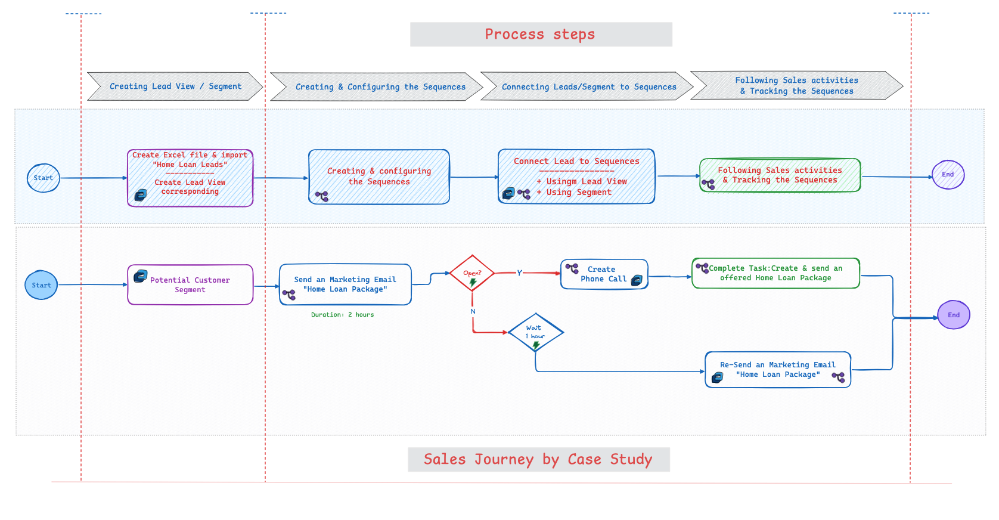

# Sequences - The Sales Journey in D365

Ciao Friends,&#x20;

Today, I would like to write about the **Sequences** feature. Although it's not new, a scenario from my teammate prompts me to explore its adaptation within D365 Sales.

## Case study

The client operates in the financial and banking industry, offering home loan packages that make it easier for customers to achieve their dream of owning a home.&#x20;

The client is using Dynamics 365 Sales across both the Sales and Collections departments. The Sales department is responsible for acquiring new customers and guiding them through the home loan process, while the Collections department manages ongoing customer engagement by reminding and supporting clients with timely loan repayments.

Now, let's walk through the sales journey first.&#x20;

<figure><figcaption>
Sales Flow
</figcaption></figure>


:paperclip: <mark style="color:$info;">The Sales Dept. wants to send a marketing email "Home Loan Package" to potential customers that they have collected themselves. Once a potential customer opens the email, the system will create a Phone Call task to remind sales to contact the customer. Furthermore, they should complete the task "Create & send an offered Home Loan Package" to the potential customer three days after the completed Phone Call. In case the potential customer hasn't opened the marketing email, the system will resend this email after 2 hours.</mark>&#x20;


## Approach: Using Sequences tool.

I know that you will have a few solutions for my case study. We can create a Power Automate for that, or we can develop some plugins to do that. Now, I choose the **Sequences** feature as my approach. &#x20;

Let's explore this feature together.

## How to use it?

### Prerequisites

Please ensure your license matches as shown below before using the **Sequences**.

**Sequences** is a feature of **Dynamics 365 Sales Insights Premium**.&#x20;

Further, if you set up the sales accelerator with the Dynamics 365 Sales Enterprise license, you get 1,500 sequence-connected records per month.

### Process Steps

Based on the sample sales journey, I will create a **Sequences - "**&#x48;ome Loan Package suggestion"



### Initial setup&#x20;

Configuring the **Sales accelerator** first. By default, I think this feature was enabled, and we need to do some essential configurations.

In the _**Sales Hub**_ app, navigate to the _**Sales Insight setting**_ option. In here, we can check that the sales accelerator was enabled and get started with Workspace configuration quickly.

<figure><figcaption>
Sales accelerator setup
</figcaption></figure>

In the _**Workspace**_ page, check that the Sales accelerator was enabled and then click to _**Configure**_ the Workspace:

* Manage access: by Security roles
* Record type: _**Lead, Opportunity, Account, Contact**_ - This record type was included by default. You can add another record type also.
* Form used for each record type: selected in the _**Default form**_ column.

<figure><figcaption>
Initial Setup - Sales Accelerator Workspace
</figcaption></figure>

Click **Publish** to confirm and complete the setup.



### Create a Sequence based on the sample sales journey

Now, move on to the Sequences creation.

At the _**Sales Insight setting,**_ under _**Sales accelerator,**_ navigate to _**Sequences**_ menu and click _**<+New Sequence>**_ button to create.

<figure><figcaption>
+ New Sequence
</figcaption></figure>

Then, I will create my sequence **"Home Loan Package suggestion"** based on the sale journey outlined above.&#x20;

<figure><figcaption>
Home Loan Package suggestion - Sequences
</figcaption></figure>

After you finish the sequences, please click the **"Activate"** button to activate them, allowing them to be used.


**Addition** :handshake:

After Sales man has created and sent the Home Loan Package to a potential customer, the system should automatically update the "_**Initial Communication**_" field in the Lead record to "_**Contacted**_." This indicates that the lead has received the Home Loan Package offer.

&#x20;:paperclip:: Demonstrate the capabilities of what the sequence can do, also.




### Connect Sequences to records/segment

As my scenario, the Sales man will send a marketing email "Home Loan Package" to the list of potential customers collected by themselves. So, I suggest they import this list to the **Lead** entity, then they create a **Segment "**_<mark style="color:blue;">**Potential Home Loan Customer**</mark>**"**_ from the **Lead** entity.

My view on the Lead - **"**_<mark style="color:blue;">**Home Loan - Leads**</mark>_**" || Segment "**_<mark style="color:blue;">**Potential Home Loan Customers**</mark>_**"**

<figure><figcaption>
View/ Segment - Home Loan Leads (18 records) / Potential Home Loan Customer
</figcaption></figure>


The list of potential Home Loan customers was collected by the Salesperson. Then, they can create an Excel template and import it to D365 Sales easily.


After that, they will connect **Sequences** to the list **"**_<mark style="color:blue;">**Potential Home Loan Customers**</mark>_**".** And we have 2 ways to connect.



On the Lead entity, select the _**"Home Loan - Leads"**_ view, then bulk select all Leads of this view. After that, click the **Sequences** button on the Command Bar.&#x20;

The List of Sequence will be shown, and select a specific sequence for connecting. My Sequences is _**"Home Loan Package suggestion"**_

<figure><figcaption>
Connect from Lead view
</figcaption></figure>

After selecting a Sequence, click the **"Connect"** button.

Once connected, we can check the list of connected Leads from the Sequence

<figure><figcaption>
Connected Leads (18 records)
</figcaption></figure>



At the _**Sales Insight setting,**_ under _**Sales accelerator,**_ navigate to _**Sequences**_ menu and select a specific Sequences.&#x20;

Click to the tab "**Connected leads"**, at the sub-grid **"Connected segments"**, please click the button _**<+Connect segments>**_ and select a specific segement for connecting.

<figure><figcaption>
Connect to Segment
</figcaption></figure>


Please create the segment first, then connect it to the sequences.

:paperclip: Apologies, my instance doesn't support Segment capability, so I'm unable to demonstrate this connection. I'll update in the near future.






### Checking the results

For the checking results, I will move on to the **Sales Accelerator** workspace. The list of Sequence's activities will be shown, and the first Marketing Email "Home Loan Package" will be sent to the client.

<figure><figcaption>
Checking - Email Marketing was sent to Potential customer.
</figcaption></figure>


:pushpin: I'll provide more results after the sequence has run and data collection is complete. :pushpin:


For the tracking, we can use Sequences analytics.

<figure><figcaption>
Sequences tracking &#x26; analytics
</figcaption></figure>

## Conclusion

&#x20;   **Sequences** in Dynamics 365 Sales are powerful tools that help streamline sales processes, improve productivity, and ensure that sales teams adhere to best practices. By automating routine activities (sending email, making calls, scheduling tasks) and providing a structured approach, **Sequences** enable sales representatives to focus on what they do best—selling.&#x20;

## My Overall Process for Case Study

As a recap, it's my case study journey and system process steps.&#x20;

<figure><figcaption>
Recap - Overall Process Diagram
</figcaption></figure>

Hoping well, and thank you for your walkthrough. :handshake: :rocket:\
**\[NTD]yns.Asia**
