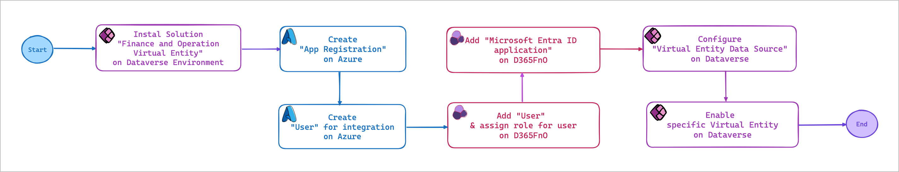
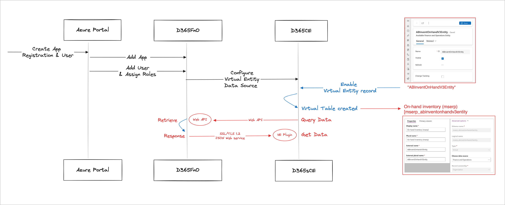

# 🇻🇳 D365 FnO - Virtual entities: Use case

Hello friends,

Did you try/work on the Dual-Write solution to integrate D365FnO with D365CE?

You know that [**Dual-write** ](https://learn.microsoft.com/en-us/dynamics365/fin-ops-core/dev-itpro/data-entities/dual-write/dual-write-overview)**is an out-of-box infrastructure** that provides **near-real-time interaction** between customer engagement apps (D365CE) and finance and operations apps (D365FnO). _Dual-write provides tightly coupled, bidirectional integration between finance and operations apps and Dataverse_. Any data change in finance and operations apps causes writes to Dataverse, and any data change in Dataverse causes writes to finance and operations apps.

That's why the data seem to be replicated on Dataverse and counted to the Capacity of the Dataverse environment.

In scenarios where clients prefer querying directly from D365FnO without storing data on Dataverse, capacity can be optimized by avoiding data replication again. And I found the functionality - [Virtual entities for finance and operations apps](https://learn.microsoft.com/en-us/dynamics365/fin-ops-core/dev-itpro/power-platform/virtual-entities-overview).

> **The Virtual entities for Finance and Operation apps:**
>
> Finance and operations apps are a virtual data source in Dataverse, and enable full create, read, update, and delete (CRUD) operations from Dataverse and Microsoft Power Platform.&#x20;
>
> By definition, _**the data for virtual entities doesn't reside in Dataverse**_. Instead, it continues to reside in the app where it belongs.&#x20;
>
> Before CRUD operations can be performed on finance and operations entities from Dataverse, the entities must be made available as virtual entities in Dataverse. CRUD operations can then be performed from Dataverse and Microsoft Power Platform on _**data that resides in finance and operations apps.**_

## For my instance&#x20;

The client is running the D365Sales and D365FnO apps.&#x20;

Now, the salesman wants to query the inventory on hand from D365FnO directly within their D365Sales environment.

Okay... My proposal is to use the Virtual entity to do this requirement. And I will note the involved steps below.

* On D365FnO: We have the table **Inventory On-hand.** Based on that, my dev team created a custom Data Entity called **"ABInventOnHandV3Entity"** from the table Inventory On-hand.&#x20;
* On D365Sales: After enabling Virtual Entity functionality, I will enable this data entity **"ABInventOnHandV3Entity".** The system will create the virtual table and columns same as the data entity on D365FnO. \
  ... then we just wait and check the data :relaxed: :tada:

## Involved Steps

<figure><figcaption>
Involved steps - Configuration
</figcaption></figure>

I will scribe details now.

**Summary of the sequence configurations of my scenarios as below:**

<figure><figcaption></figcaption></figure>

### 1. Install "Finance and Operation Virtual Entity"

Initially, We must install the Solution on the Power Platform Admin Center as below:

**Solution:&#x20;**_**Finance and Operations Virtual Entity.**_

<figure><figcaption>
Intall "Finance and Operation Virtual Entity" solution
</figcaption></figure>

### 2. Create an "App Registration" on Azure Portal

We must register an application used to integrate between D365FnO and D365CE.&#x20;

My application: **CDS-VirtualEntity.** \
Remember that: you must create the Certificate & Client secrets for the app also. :)

<figure><figcaption>
App Registation - "CDS-VirtualEntity"
</figcaption></figure>

### 3. Create a User for integration.

This user will be associated with the Microsoft Entra ID application on D365FnO (next step).\
My use&#x72;**:** **Dataverse integration**

<figure><figcaption>
Create User used to configure integration
</figcaption></figure>

### 4. Add user to D365FnO and assign role

After creating App Registration and User, we will back to the D365FnO and begin to configure.

Path: **System administration > Users.** Then click **Import** to add a new user (we created as [**step 3**](https://app.gitbook.com/o/S0sTFMnXSWzNgJ3jxQ65/s/jhtQupP7ACZVtv3cCNCr/~/changes/99/d365-finance-and-operation/general/d365-fno-virtual-entities-use-case#id-3.-create-a-user-for-integration)) and assign the role **"Dataverse Virtual entity integration app".**

My userid: **dataverseintegration**

<figure><figcaption>
Add user &#x26; Assign role "Dataverse Virtual entity integration app"
</figcaption></figure>

### 5. Add Microsoft Entra ID application on D365FnO

After finished add the user and assigning role, we need to add the Microsoft Entra ID application for D365FnO. This is an app created at [**step 2**](https://app.gitbook.com/o/S0sTFMnXSWzNgJ3jxQ65/s/jhtQupP7ACZVtv3cCNCr/~/changes/99/d365-finance-and-operation/general/d365-fno-virtual-entities-use-case#id-2.-create-an-app-registration-on-azure-portal)**.**

<figure><figcaption>
Add Microsoft Entra ID application
</figcaption></figure>


**Note:** You must select the user used to run integration between D365FnO and D365CE.&#x20;

My user in **step 4:** userid = **dataverseintegration**


Until now, we already completed the necessary configurations on D365FnO.

### 6. Configure "Virtual Entity Data Source" on D365CE

The next, we need to configure the **Virtual Entity Data Source** on D365CE for all completing.

Path: **Advance Setting > Administration > Virtual Entity Data Source.**

<figure><figcaption>
Virtual Entity Data Source
</figcaption></figure>


**Note**: The AAD Application ID & AAD Application Secret of the app created in [**step 2**](https://app.gitbook.com/o/S0sTFMnXSWzNgJ3jxQ65/s/jhtQupP7ACZVtv3cCNCr/~/changes/99/d365-finance-and-operation/general/d365-fno-virtual-entities-use-case#id-2.-create-an-app-registration-on-azure-portal)


### 7. Enable specific Virtual Entity

Okay... we already completed all setup for Virtual Entity functionality. Now, the final step: Enabling the  Virtual Entity needs to get data on D365CE.

My entity: **ABInventOnHandV3Entity -** used to get inventory on hand from D365FnO.&#x20;

To enable this, I used **Advance Find** and found the record on entity **"Available Finance and Operation Entities" -** this table stored all available data entities on D365FnO.&#x20;

<figure><figcaption>
Enable Virutal Entity
</figcaption></figure>

After that, I find my record "**ABInventOnHandV3Entity"** > then click **Visible = Yes** > and **Save.** \
**->** Waiting 5-10mins, the system will create the Virtual Table **for this data entity.**

<figure><figcaption>
The Virtual Table - created auto by system
</figcaption></figure>

Yup.. we have done all the steps for Virtual Entity configuration. :goal: :rocket: And... testing now..

## Testing now...

*   On D365 Finance and Operation, I will open the On-hand List and filter **Item number = 100200002** 

    <figure><figcaption>
On-hand of Item Number = 100200002
</figcaption></figure>

*   On the D365Sales, I will use the Advance Find and find on the Virtual Tabe **On-hand Inventory (mserp)** and filter **Item Number = 100200002** also.\
     

    <figure><figcaption>
Virtual Table "On-hand inventory" - Item number = 100200002
</figcaption></figure>

    Yeah.. the On-hand data was streamlined with the D365FnO. Great, cool right???!!!  :rocket::tada:

## Key Takeaway of the Virtual Entity&#x20;

* **Real-Time Data Access:** Virtual Entities provide real-time access data from D365FnO.
* **No Data Duplication**: Since data is read directly from D365FnO, there's no need to replicate data in D365CE, reducing storage requirements and eliminating data inconsistencies.&#x20;
* **Seamless Integration:** Virtual Entities make the integration between D365CE and D365FnO seamless, enhancing operational efficiency and user experience.

Thank you & Hoping well! :heart\_hands:\
**\[NTD]yns.asia**
