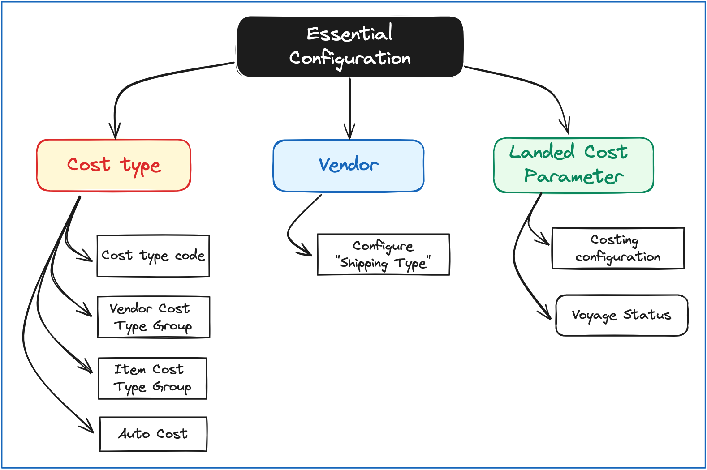
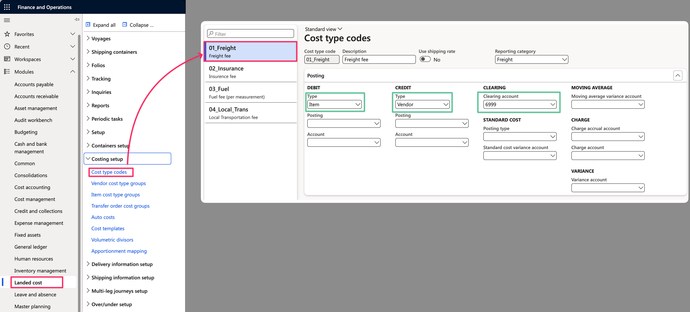

# Landed Cost- Essential Configuration

## Introduce

The **Landed Cost** module is a part of the D365 Supply Chain. This module helps an enterprise track the final cost of products after all logistics expenses.

This module empowers businesses to streamline inbound shipping, managing financial and logistical aspects from manufacturer to warehouse.&#x20;

* Enabling users to estimate costs during voyage creation, allocate them across items/orders
* Supporting goods transfer between physical locations by recognizing landed costs.
* Providing precise estimates for overhead landed costs enhances visibility into the extended supply chain
* Reducing administrative workload, and minimizing costing errors.

## Basic & essential configuration

From my end, I will describe some configurations I think are necessary for running the Landed Cost as simple.

<figure><figcaption>
Essential configuration for Landed Cost
</figcaption></figure>

Details of the configuration:



**Cost Type codes -** It's the main configuration for this Landed Cost module

<figure><figcaption>
Cost Type Code setup
</figcaption></figure>

* Reporting category: using to classify the cost type
* **DEBIT:** set posting **Type** = "Item" -> The cost value will be allocated for the **Item**  and posted to the Inventory main account
* **CREDIT:** set posting **Type** = "Vendor" -> The offset account will be posted to Vendor's main account
* **CLEARING** accoun&#x74;**:** select the clearing account for the cost type.

<mark style="color:green;">**Note:**</mark> The _**Standard Cost & Moving Average variance account**_ - should be configured If your product was configured, the Model Type is Standard Cost and Moving Average corresponding. This variance account will be posted to Ledger if the Item cost differs between actual and estimated costs.



Vendor cost type groups help determine how _auto cost_ charges are found and applied to a voyage.

To configure the Vendor cost type group, navigate through the following path:&#x20;

<figure><figcaption>
Vendor cost type group
</figcaption></figure>

After creation, these groups can be associated with **Vendors**. (FastTab **Miscellaneous details -** field **Cost Type Group)**



Item cost type groups help determine how _auto cost_ charges are found and applied to a voyage. _For example, all items that have a duty rate of 5 percent might belong to a specific cost type group._

To configure the Vendor cost type group, navigate through the following path:&#x20;

<figure><figcaption>
Item cost type group
</figcaption></figure>

After creation, these groups can be associated with the **Release Product**. (FastTab **Purchase** - field **Cost type group**)

















## Simple Process for Landed Cost

<figure><figcaption>
Simple Process - Landed Cost
</figcaption></figure>

* Create the Voyage and input Purchase Orders which you want to track and control landed cost.
* Input and edit the estimated cost for the Voyage.
* Receive actual transportation billing then post an invoice for Purchase Order and increase Good In Transit (GIT).
* Receive GIT into your warehouse.
* Finally, update & check the landed cost and inventory value of the Item.

Above is my scribble for the basic configuration and simple process for the Landed Cost module in the D365 Finance & Operation.&#x20;

Please follow me for the next [Use Case](landed-cost-scenarios-1.md).

Thank you & hope well.\
**\[NTD]yns.asia**\
<mark style="color:red;">...</mark>[<mark style="color:red;">invite me a cup.</mark>](https://ko-fi.com/ntdyns/?ref=qr\&amp;v=2) :coffee: Thank you. :heart:
