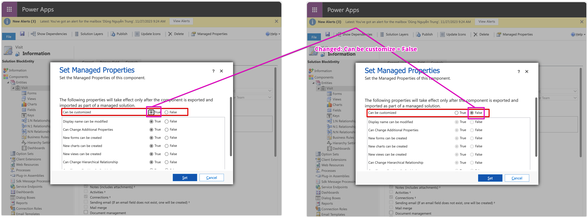
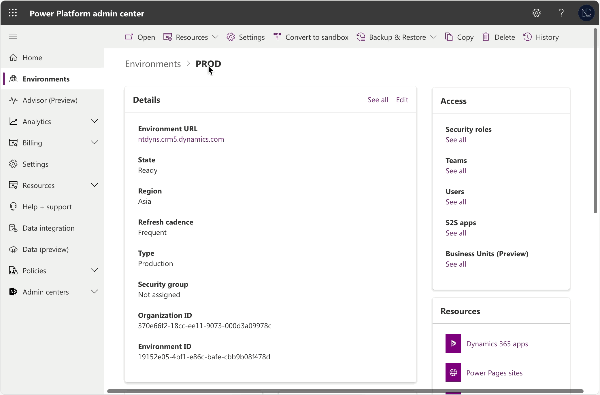
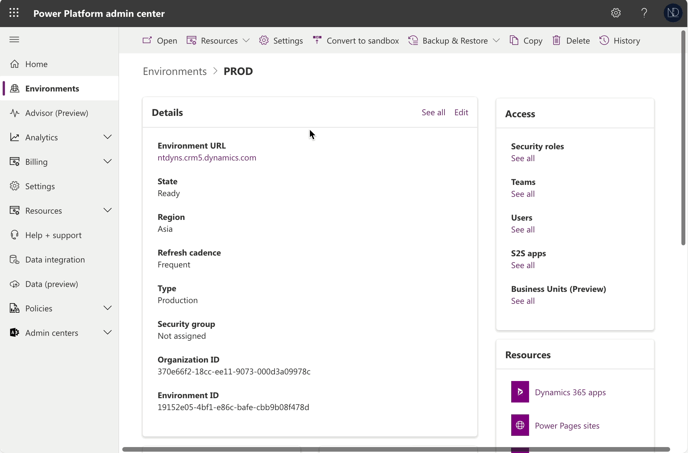

# Block Unmanaged Customizations

Hello, my friends,

&#x20;  Recently, Microsoft has introduced a new feature allowing Power Platform system administrators to [**block unmanaged customizations**](https://powerapps.microsoft.com/en-us/blog/announcing-public-preview-of-capability-to-block-unmanaged-customizations/) in Dataverse environments. This feature is currently in public preview and can be enabled as an environment setting in the _**Power Platform Admin Center.**_

## The reason WHY...

&#x20;  In the **Production environment**, managed solution components are not directly customizable, but you can add an **unmanaged layer** to them through the **Default Solution**. This way, you can modify the managed components as you wish. \
&#x20;  An unmanaged layer is created when you make changes and customizations within the application without any limitations. And with the unmanaged layer lets you alter components such as tables, fields, forms, views, business rules, workflows, ... without locking them.\
&#x20;  However, in some cases, _<mark style="color:red;">you must prevent any unmanaged customizations in the Production environment to avoid unexpected issues or bugs.</mark>_

That's a great update from Microsoft. In last my project, I remember that the client's BA Team was involved in developing the solution within our team. My Team and me so very very tired and hard to track and find why those managed components have been updated and who made this change. :joy: :cry:

## Managed Properties: Block customization

&#x20;  This feature lets me link to the **Managed Properties** is "**Can be customized"** property which is configured for each entity. \
&#x20;  If you set this property for an entity, you cannot modify the entity in another environment when you import a managed solution (and of course, this entity must be part of this managed solution :relaxed:)

<figure><figcaption>
Managed properties: "Can be customized"
</figcaption></figure>


This property will take effect only after the component is exported and imported as part of a managed solution.


Okay... after enabled, I will export my solution as a managed solution and import it to the **PROD environment.**

<figure><figcaption>
My managed solution was be imported
</figcaption></figure>

<figure><figcaption>
The "Visit" entity: "Can be customized = False"
</figcaption></figure>

Now, check with me.\
&#x20;  In my **PROD environment:** I haven't enabled the **Block unmanaged customizations (Preview)** feature yet and my managed solution "BlockEntity" - is used to block any customize for the entity **Visit.**

Results: Just only the entity "**Visit**" cannot be customized, and you can customize the remaining entities (for instance: the "**Account**" entity). :tada:

<figure><figcaption>
Check "Visit" entity: Can be customized = False
</figcaption></figure>


This feature allows you to disable customization for individual entities. You can also choose which customization actions to block.

**For more details, you can find** [**here**](https://learn.microsoft.com/en-us/power-platform/alm/managed-properties-alm)**.**


## Try New feature: Block unmanaged customizations (Preview)

Configure: <mark style="color:purple;">**Environment >**</mark> <mark style="color:purple;"></mark><mark style="color:purple;">select specific environment</mark> <mark style="color:purple;"></mark><mark style="color:purple;">**> Setting > Feature.**</mark>\ <mark style="color:purple;">**--**</mark>\
Opening the **Default Solution** and checking now...

<figure><figcaption>
Check after enabled new feature
</figcaption></figure>


Once you enable this feature for the environment, you will lose the ability to customize any entities in the **Default Solution.**


Thank you and hoping well. :relaxed::star:\
**\[NTD]yns.asia**\
<mark style="color:red;">...</mark>[<mark style="color:red;">invite me a cup.</mark>](https://ko-fi.com/ntdyns/?ref=qr\&amp;v=2) :coffee: Thank you. :heart:
