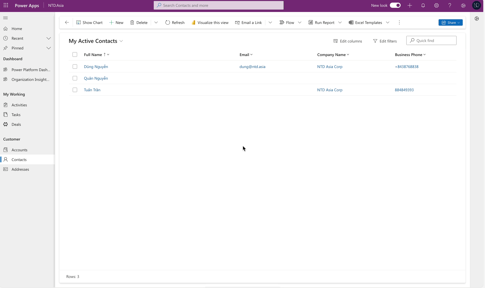
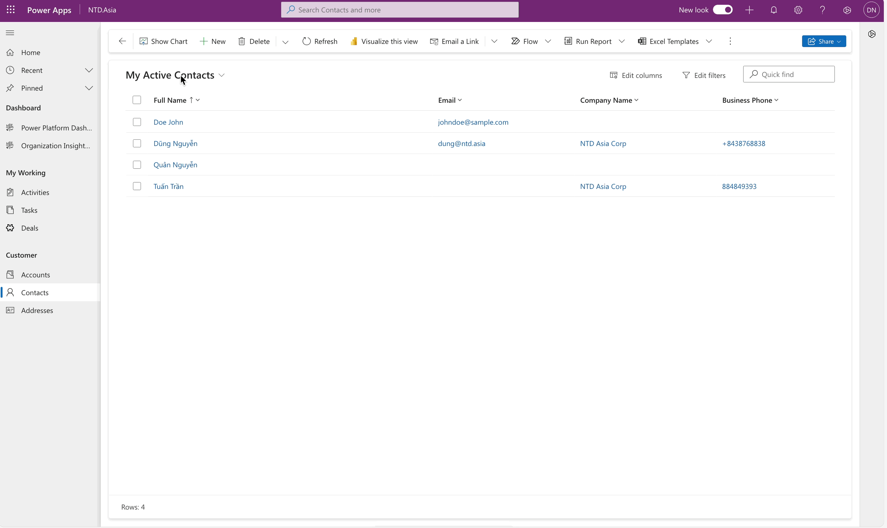

# Disable Empty Address record

Hi guys,

Nowadays, I did a walkthrough in the Power Platform Admin Center and saw the new feature setting for **Customer Address (Address)**.&#x20;

The feature setting: _**Disable Empty Address Record Creation.**_ This setting prevents the system from creating empty Address records. If the create payload does not contain any address information, the system will ignore it.


**NOTE:** Just only takes effect on 3 entities: Account, Contact, Lead, and will NOT affect any other entities address table behavior.


<figure><figcaption>
Disable empty address record creation
</figcaption></figure>

## Lookback: the previous functionality

The previous time, if have no this setting...

Behind the scenes, when you create an **Account/Contact/Lead** record and input or do not input any value into the OOB address fields (includes:  Address 1, Address2, Address3), the system will create 3 corresponding Empty Address records automatically and store them in the table **Address (customeraddress).**&#x20;

<figure><figcaption>
Before enable setting: 3 address records created
</figcaption></figure>

## Enable setting: "Disable empty address record creation"

After enabling the setting...

<figure><figcaption>
Enable setting
</figcaption></figure>

Now checking... -> Have no empty address records created. :tada:

<figure><figcaption>
After enable setting: Have no empty record created
</figcaption></figure>

Thank you and hoping well... :innocent:\
**\[NTD]yns.asia**\
<mark style="color:red;">...</mark>[<mark style="color:red;">invite me a cup.</mark>](https://ko-fi.com/ntdyns/?ref=qr\&amp;v=2) :coffee: Thank you. :heart:
