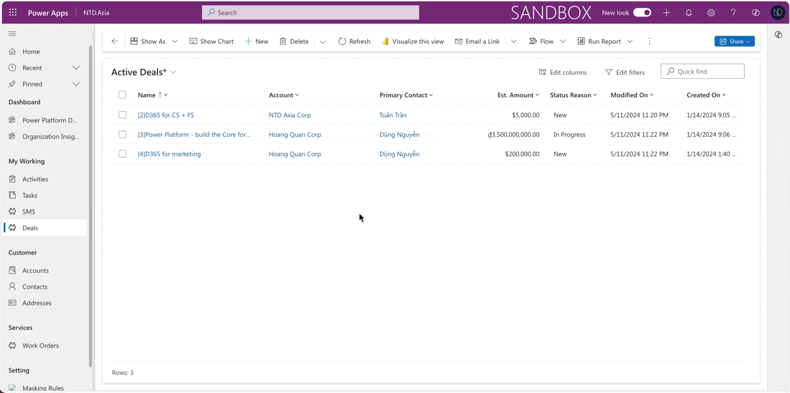

# 🪃 Recycle Bin on Dataverse (Preview)

## Recovering Deleted Data in Microsoft Dataverse

In Microsoft Dataverse, records or transactions can be deleted through various means - manually by users, automatically by system processes, or through bulk deletion actions. These deletions can occur intentionally or accidentally

The challenge lies in the recovery of deleted data. Historically, **restoring records in Dataverse** could be difficult, with some data potentially being permanently lost. To mitigate this issue, Microsoft provides a solution: the **Recycle bin.**

The **Recycle bin in Microsoft Dataverse** is designed to recover table record data regardless of how it was deleted—covering all deletion scenarios. This feature operates within a flexible, configurable timeframe, ensuring that users have a window in which they can retrieve their lost data.

Okay.. now.. let's try this preview feature with me! :thumbsup:

## Enabling the "Recycle Bin" for an environment

In the Power Platform Admin Center > Setting > under the Feature setting: _**Enable Recycle bin for Dataverse table**_ and specify the _**Time interval**_ as below.

<figure><figcaption>
Enabling the Recycle bin for Dataverse tables
</figcaption></figure>

Next, wait at least 10 minutes for the configuration process to complete.

## How to restore deleted records?

<mark style="color:red;">**Restore deleted records:**</mark>

To restore deleted records, you go back to the Power Platform Admin Center > Select the environment and click **Setting**. After that, under **Data Managemen**t > click **"View Deleted Record (Preview).**&#x20;

<figure><figcaption>
View Deleted Record (Preview)
</figcaption></figure>

The system will show all deleted records and you can select one or multiple records that need to be restored. After that, click the button **Restore** to **recall data.**

<figure><figcaption>
Restoring selected record
</figcaption></figure>

and then, checking the record after restoring.

## Testing now...

I will test my environment (without D365 Applications). I will separate the test case for data checking after restoring deleted records.

For instance, I will check on 2 entities:

* Parent entity: **Account**
* Child entity: **Deal**
* &#x20;The relationship: **Account&#x20;**<mark style="color:red;">**(1:n)**</mark>**&#x20;Deal**

<mark style="color:red;">Test Case 1:</mark> Delete the child entity "Deal" with the lookup field "Account" containing data.

Expectation after **restoring** **deleted** **Deal** record: The _**Account**_ field will be restored with the original data

<mark style="color:green;">**Before deleting:**</mark> Deal record - the Account field contains value "NTD Asia Corp"

<mark style="color:green;">**After Restoring:**</mark> The testing passed. The Deal record has been restored successfully with the original Account field value.

<mark style="color:red;">Test Case 2:</mark> Delete the parent entity "Account" associated with the Deal records.

I have 2 Deal records associated with the Account **"Hoang Quan Corp."** -> After deleting the Account "Hoang Quan Corp.", this value has been removed from 2 related Deal records before.

Now, after **restoring the Account "Hoang Quan Corp."**, I hope that this value will be associated with Deal records before.

<mark style="color:green;">**After restoring:**</mark> The Account "Hoang Quan Corp." has been restored and associated with 2 Deal records before. -> The testing passed.

Thank you for reading & Hoping well! :tada:\
**\[NTD]yns.asia**
