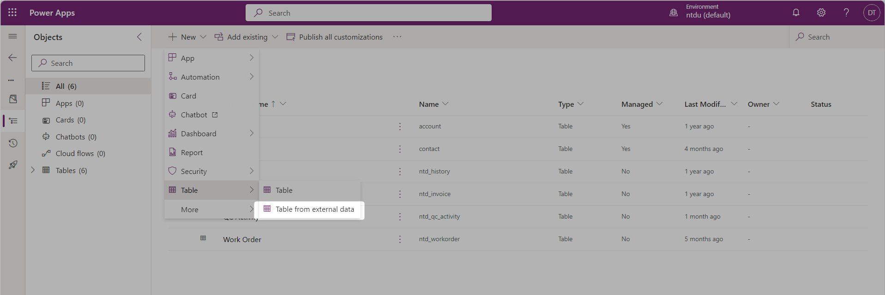

# Using a Virtual Entity to store historical log (sample)

Hi, my friends,

Today, I will talk about the **Table from external data** _( Virtual Entity)._ How to create and configure the virtual table as my sample to store the history of the business process stage.

Firstly, let's quickly discuss [**Virtual Entity**](https://learn.microsoft.com/en-us/power-apps/maker/data-platform/create-virtual-tables-using-connectors?tabs=sql). In short, it can be understood as a 'virtual data table' created within Dataverse with the capability to seamlessly integrate with external data systems. What's even more surprising is that Virtual Entities possess almost all the functionalities of a Standard Entity, except for Rollup, Auditing, and Workflow capabilities.

As of now, Virtual Entity allows us to connect to two main sources: SQL DB and Sharepoint (**Sharepoint list**)**.**

Now, let's proceed with trying to create a Virtual Entity on Dataverse. And I will create the Virtual Entity from an external source - **SharePoint.**

## 1. Create Connection

Firstly, I need to set up a connection to link to an external data source beforehand. I recommend doing this, although, during the Virtual Entity creation process, everyone can add the connection directly.

I will create a new SharePoint connection.

<figure><figcaption>
New Connection
</figcaption></figure>

Next, select the **Source** you want to connect to as SharePoint >> select the option '**Connect directly (cloud-service)**' - I choose this option as my SharePoint Site is created in the Cloud. \
Then click **Create** >> enter the user/pass information to establish the SharePoint Site connection.

<figure><figcaption>
Authentication
</figcaption></figure>

If successfully created, I'll have a connection like the one shown below.

<figure><figcaption>
Valid Connection
</figcaption></figure>

## 2. Create Connection Reference

After establishing the connection, the next step is to create a Connection Reference.&#x20;

_Initially, the connection was successfully created, meaning it has stored the authentication details. Creating a Reference Connection for various environments that point to the same connection eliminates the request for additional authentication._

<figure><figcaption>
Connection and Connection References
</figcaption></figure>

However, the primary purpose of using Connection Reference instead of direct Connection is to deploy solutions across different environments without encountering authentication errors.&#x20;

_When deploying solutions across different environments, if the solution contains components utilizing connections such as Flows, Canvas Apps, etc., ensuring authentication for the connection is a prerequisite for preventing errors in these components._ \
&#x20;   _If errors occur, the resolution involves entering each environment and re-authenticating each connection. This process is time-consuming and can sometimes be wrong."_

To create a **Reference Connection**, I go back into the Solution:

<figure><figcaption>
New Reference Connection
</figcaption></figure>

Then, fill in the necessary information for the Connection Reference and click **Create**.

<figure><figcaption>
Configure Reference Connection
</figcaption></figure>


_It's advisable to name the Connection Reference the same on each environment.  Because, when deploying solutions across different environments, the system relies on the 'Name' field of this Connection Reference for mapping purposes._


The Connection Reference had been created:

<figure><figcaption>
Valid Reference Connection
</figcaption></figure>

## 3. Sample & Create Virtual Entity

First, I prepare a SharePoint List table as shown below:

<figure><figcaption>
SharePoint List
</figcaption></figure>

**The challenge** here is that:\
&#x20;My clients, using D365 CE and the Power Platform, are facing constraints with Dataverse capacity. They wish to track the history of Lead stage transitions without burdening Dataverse's capacity with a vast number of these records. Due to the substantial quantity of Lead records, tracking records become extensive.

As a solution, my team and I proposed using **Virtual Entities** to connect to an Azure SQL DB, storing these tracking records there instead of within Dataverse. This approach effectively reduces the load on capacity. Additionally, leveraging Virtual Entities proves to be swift and convenient, as it's an out-of-the-box solution without requiring excessive coding.

To demonstrate this, I utilized a **SharePoint List (as a substitute for SQL DB)** to create columns for recording Lead stage transition history (as shown in the image above). This SharePoint List is connected to a Virtual Entity in Dataverse, named: "**Lead Tracking table".**


To create Lead tracking records, I utilize a **Flow** applied to the **Lead entity's Business Process Flow (BPF)** and **triggered** by the **'Added or Modified'** event, **filtered** by the '**Active Stage'.** However, the **data** will be **generated** on a **SharePoint List.**


<figure><figcaption>
Flow: Creating Item on SharePoint List - Lead tracking
</figcaption></figure>

**Let's go back to creating a Virtual Entity.** \
I navigate to **Solution >** The&#x6E;**, click New > Table > Table from external data.**

<figure><figcaption>
Table form external data
</figcaption></figure>

Then, select the required integration **Connection**, and I choose SharePoint. Everyone should use **Connection Reference** for this (as image below).

<figure><figcaption>
Configure Conection &#x26; Reference Connection
</figcaption></figure>

When choosing the SharePoint connection, the system will prompt me to select the _**SharePoint Site**_ or enter the _**URL of the SharePoint Site**_.

<figure><figcaption>
Select SharePoint Site
</figcaption></figure>

Under the '**Data**' section, I select the _**SharePoint List**_ that I want to create as a Virtual Entity on Dataverse

<figure><figcaption>
Select Data Soure on SharePoint.
</figcaption></figure>

Next is the **column mapping for the Virtual Entity**. Initially, the system will automatically map and suggest the Virtual Entity name as well as the column names on Dataverse."

<figure><figcaption>
Mapping column for Virtual Entity
</figcaption></figure>

_Many might notice more columns than those captured in the SharePoint List I've shown, as these additional fields are OOB (out-of-the-box) and hidden._


It would be great if everyone could name columns on the external source using a **clear convention**. This way, the system will suggest table and column names on Dataverse that are also clear.


Finally, click on **Next** > Proceed through the _**Review and Finish**_ steps, then click on the **Finish** button to complete the process.

<figure><figcaption>
Configuration finish
</figcaption></figure>

At this point, we wait for the system to create the Virtual Entity. Once the creation is finished, we'll have a 'beautiful' table like this.

<figure><figcaption>
Virtual Table - Lead Tracking
</figcaption></figure>

## 4. Customize Virtual Entity

Once we have the Virtual Entity, the next step is to drag the fields in Forms, Views, and potentially create new Fields on the Virtual Entity to map with columns from the External Source, in this case, the SharePoint List


Here's a tip: to **create columns** on the Virtual Entity, everyone needs to switch to the **Classic interface**. You won't find it on the new UI at make.powerapps.com. :D


<figure><figcaption>
Tips: Create new field on Virtual Entity
</figcaption></figure>

I use this hidden functionality to create the Lookup field in Dataverse. Please try it! :tada:

## 5. Checking

Once the Virtual Entity is created and the Flow trigger on the BPF Lead Process record is set up, now let's try changing the stage and see the results.

**Lead -** I have a Lead record that has gone through 2 stages: Lead > Deal

<figure><figcaption>
Lead record
</figcaption></figure>

**SharePoint List -** now tracks 2 records when the Lead transitions stages. \
_&#x4E;ote:_ I adjusted the display of columns on the SharePoint List to make the data presentation more visually appealing, as shown below.

<figure><figcaption>
SharePoint List
</figcaption></figure>

**Virtual entity** - Lead Tracking

<figure><figcaption>
Virtual entity - Lead Tracking
</figcaption></figure>

Thank you and hopping help.\
**\[NTD]yns.asia**\
<mark style="color:red;">...</mark>[<mark style="color:red;">invite me a cup.</mark>](https://ko-fi.com/ntdyns/?ref=qr\&amp;v=2) :coffee: Thank you. :heart:
