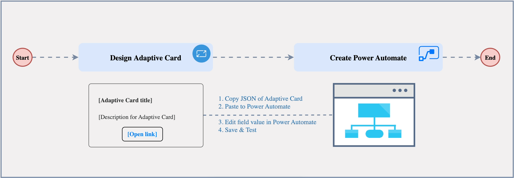
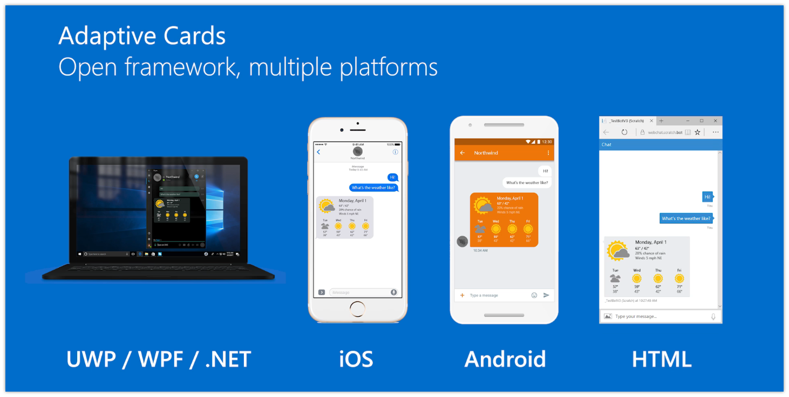
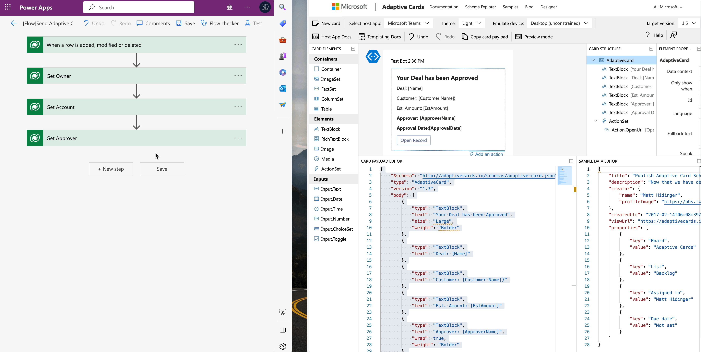
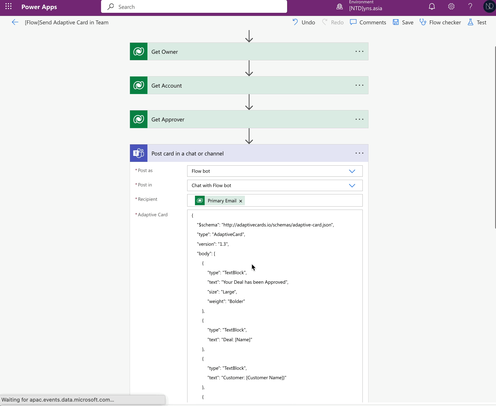
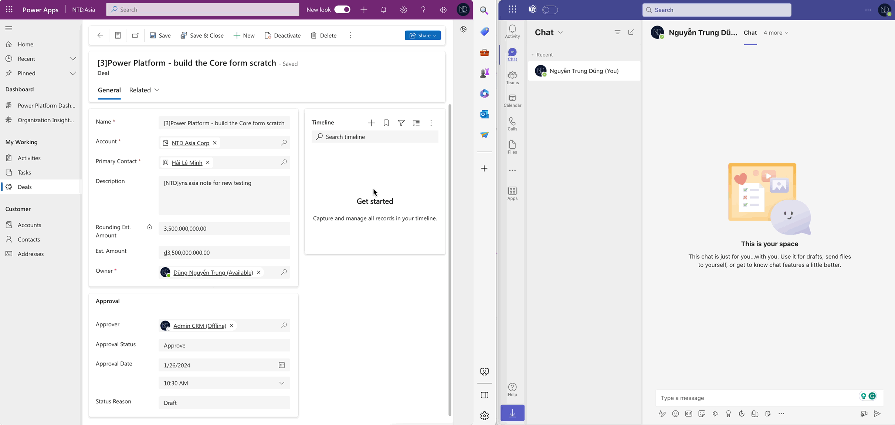
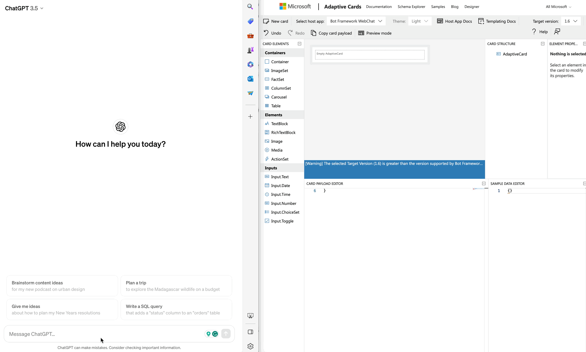

# Using Adaptive card

Greetings everyone,&#x20;

Following a conversation with my client regarding Approval Notifications, it has been determined that they would like to receive notifications in their MS Teams chat whenever a record is approved.&#x20;

In my case, the client has a **Deal** entity and it has been configured as the Approval Flow. The user requested that: When their **Deal** has been approved, they will receive a notification about this event in the Team chat.

... and I propose to use **Power Automate** to send an <mark style="background-color:green;">**Adaptive Card**</mark> to the record owner once it is approved in MS Teams.

## My propose

<figure><figcaption><p>Simple Steps</p></figcaption></figure>

<figure><figcaption><p>Adaptive Card supporting framework</p></figcaption></figure>

## 1. Building an Adaptive Card

For building an Adaptive card that shows messages in MS Teams, I used the tool - [**Adaptive Cards designer**](https://adaptivecards.io/designer/)**.**  And my sample:

<figure><figcaption><p>My adaptive card design</p></figcaption></figure>

I will not talk in detail about the components of this tool today, but I believe you can grasp and comprehend it swiftly... :innocent: That is my promise. :heart\_eyes:

Okay ... I have attached the JSON code for this card below. You can try it out.

<details>

<summary><mark style="color:orange;">My sample card - JSON</mark></summary>


```json
{
    "$schema": "http://adaptivecards.io/schemas/adaptive-card.json",
    "type": "AdaptiveCard",
    "version": "1.3",
    "body": [
        {
            "type": "TextBlock",
            "text": "Your Deal has been Approved",
            "size": "Large",
            "weight": "Bolder"
        },
        {
            "type": "TextBlock",
            "text": "Deal: [Name]"
        },
        {
            "type": "TextBlock",
            "text": "Customer: [Customer Name]}"
        },
        {
            "type": "TextBlock",
            "text": "Est. Amount: [EstAmount]"
        },
        {
            "type": "TextBlock",
            "text": "Approver: [ApproverName]",
            "wrap": true,
            "weight": "Bolder"
        },
        {
            "type": "TextBlock",
            "text": "Approval Date:[ApprovalDate]",
            "wrap": true,
            "weight": "Bolder"
        },
        {
            "type": "ActionSet",
            "actions": [
                {
                    "type": "Action.OpenUrl",
                    "title": "Open Record",
                    "url": "[Link]"
                }
            ]
        }
    ]
}
```


</details>


For more details, you can find the [Designing Adaptive Cards for your Microsoft Teams app](https://learn.microsoft.com/en-us/microsoftteams/platform/task-modules-and-cards/cards/design-effective-cards?tabs=design#adaptive-cards-designer)


## 2. Creating the Power Automate

After finishing the Adaptive Card, I jumped to my solution and created a **Cloud flow** to send the Adaptive card to **Deal Owner** once it is approved in MS Teams.

### 2.1 Create Power Automate with the action "Post card in a chat..."&#x20;

The action name: **Post card in a chat or channel.** Following the configure:

* _Post as: **Flow bot**_
* _Post in: **Chat with Flow chat**_
* _Recipient: **Owner** of record who receive the notification_
* _Adaptive Card: input the **JSON code** of the **card** which was built from the Adaptive Carder designer tool._

<figure><figcaption><p>Create flow and action</p></figcaption></figure>

### 2.2 Edit the Adaptive Card's JSON code&#x20;

After entering the JSON code into the Flow, I will modify the JSON's Placeholder with the Dynamics value from the record in the Flow.

<figure><figcaption></figcaption></figure>

### 2.3 My sample Flow:

<figure><figcaption><p>Edit Adaptive Card's JSON code</p></figcaption></figure>

## 3. Check-now

I will change the Status Reason of the Deal record to "Approved". Then, the Adaptive Card is sent to the Owner of the Deal in MS Teams.

<figure><figcaption><p>Testing Adaptive Card posted in MS Teams chat</p></figcaption></figure>

***

## Tips: Use ChatGPT to gen the JSON code for the Adaptive Card

Besides using the Adaptive Card Designer, I requested help from the ChatGPT to generate the JSON code for a sample Adaptive card.

Let's try it yourself...

<figure><figcaption><p>Use ChatGPT to generate Adaptive Card - Json code</p></figcaption></figure>

Thank you and hoping well... :tada:\
**\[NTD]yns.asia**\
<mark style="color:red;">...</mark>[<mark style="color:red;">invite me a cup.</mark>](https://ko-fi.com/ntdyns/?ref=qr\&amp;v=2) :coffee: Thank you. :heart:

