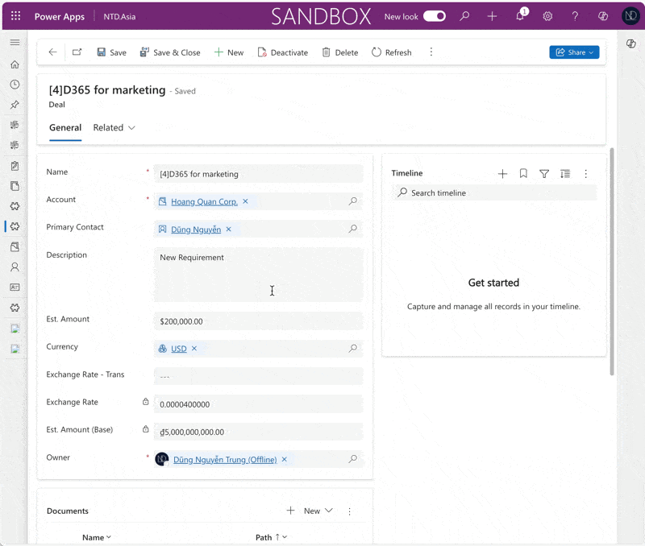

# 💡 Workaround: Change the OOB "Exchange Rate" of a record

Hi, my friends,\
The client asked me how to change the **Exchange Rate** of the record in Dataverse. You know that the column **Exchange Rate** is unable to edit. And, the Exchange rate field will be populated when you choose the transaction currency for the record (as sample below).

<figure><figcaption>
The Exchange auto populate from Currency table
</figcaption></figure>

## Using API to update Base Currency

This solution from [Temmy Wahyu Raharjo](https://temmyraharjo.wordpress.com/).

First of all, I would like to thank [Temmy](https://www.linkedin.com/in/temmy-wahyu-raharjo/)'s support and for giving me a great solution to update the Exchange rate - [<mark style="color:red;">Dataverse: Create an API to update Base Currency</mark>](https://temmyraharjo.wordpress.com/2024/03/23/dataverse-create-an-api-to-update-base-currency/)<mark style="color:red;">.</mark>

The next day, the client wants to update the actual exchange rate for each record without updating the Exchange Rate in the table Currency. It means they want to update the transaction currency exchange rate on the record.

## Workaround with Business Rule

For instance, I will try to update the **Exchange Rate  (OOB)** and recalculate the field **Est. Amount (Base)** for the entity **Deal.**

My workaround solution:&#x20;

1.  Create a custom field: **Exchange Rate - Trans** with the same configuration as the OOB field "Exchange Rate". \
    _&#x54;he user will input the actual exchange rate value into this field then the system will trigger an update to the OOB field "Exchange Rate" and recalculate the field "Est. Amount (Base)"._ 

    <figure><figcaption>
Custom field: Exchange Rate - Trans
</figcaption></figure>

2.  Then use the **Business Rule** to update the OOB field "_**Exchange Rate**_" and recalculate the field  "_**Est. Amount (Base)".**_ 

    <figure><figcaption>
Business Rule
</figcaption></figure>

    In my Business Rule, I use 2 actions "**Set field value**":

    * Set field value: \
      &#x20;    <mark style="color:green;">`Exchange Rate (OOB)`</mark>` `<mark style="color:red;">`=`</mark><mark style="color:red;">` `</mark><mark style="color:red;">**`Field`**</mark><mark style="color:red;">`(`</mark><mark style="color:green;">`Exchange Rate - Trans`</mark><mark style="color:red;">`)`</mark>
    * Set field value: \
      &#x20;    <mark style="color:green;">`Est. Amount (Base)`</mark>` `<mark style="color:red;">`=`</mark><mark style="color:red;">` `</mark><mark style="color:red;">**`Formula`**</mark><mark style="color:red;">`(`</mark><mark style="color:green;">`Est. Amount / Exchange Rate (OOB)`</mark><mark style="color:red;">`)`</mark>


The "Exchange Rate (OOB)" field cannot be updated through Workflow or Power Automate due to system restrictions. To bypass this limitation, we utilize a Business Rule.

By default, updating the "Exchange Rate (OOB)" field does not trigger an automatic recalculation of the "Amount (Base)" field. To ensure the field is updated, I use the "Recalculate Est. Amount (Base)" action to update


## Checking...

<figure><figcaption>
Final Testing - How to change "Exchange Rate (OOB)" field
</figcaption></figure>

Thank you for reading & Hoping well.\
**\[NTD]yns.asia**\
<mark style="color:red;">...</mark>[<mark style="color:red;">invite me a cup.</mark>](https://ko-fi.com/ntdyns/?ref=qr\&amp;v=2) :coffee: Thank you. :heart:
