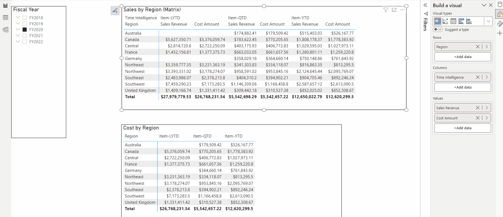

# Calculation Group for Time Intelligence

Today, I would like to share about the **Calculation Group** functionality in Power BI in my current report.

In the Power BI report, I built the Visualization to show **Sales Revenue** and **Cost Amount** in some measures such as **QTD, YTD, and LYTD.** I created 6 measures: 3 for Sales Revenue and 3 for Cost Amount, so take time.

Then I am using the **Calculation Group** to do it. This function is helping me save time save effort.


Calculation groups are a simple way to reduce the number of measures in a model by grouping common measure expressions. Calculation groups work with existing explicit DAX measures by automating repetitive patterns.


So, how I can do ... :smirk:

## DAX: `SELECTEDMEASURE`()&#x20;

Supporting the Calculation Group function, the new DAX function has been released - [**`SELECTEDMEASURE`**](https://learn.microsoft.com/en-us/dax/selectedmeasure-function-dax)**.**


They are used by expressions for calculation items or dynamic format strings to reference the measure that is in context. Returns the measure that is currently being evaluated.

Syntax: **SELECTEDMEASURE()** - without parameter.


## Not Using Calculation Group

In my Power BI report, I have the Sales Data with Sales Revenue and Cost Amount.&#x20;

I created 2 based measures: **\[Sales Revenue]** and **\[Cost Amount]** for my report.

```dax
-- Based Measure
Sales Revenue = SUM(Sales[Sales Revenue])
Cost Amount = SUM(Sales[Cost Amount])
```

Initially, I have 6 Time Intelligence Measures: 3 for Sales Revenue and 3 for Cost Amount as below.

```dax
YTD Sales Revenue = CALCULATE([Sales Revenue],DATESYTD('Date'[Date]))
YTD Cost Amount = CALCULATE([Cost Amount],DATESYTD('Date'[Date]))

LYTD Sales Revenue = CALCULATE([Sales Revenue],SAMEPERIODLASTYEAR('Date'[Date]))
LYTD Cost Amount = CALCULATE([Cost Amount],SAMEPERIODLASTYEAR('Date'[Date]))

QTD Sales Revenue = CALCULATE([Sales Revenue],DATESQTD('Date'[Date]))
QTD Cost Amount = CALCULATE([Cost Amount],DATESQTD('Date'[Date]))
```

Sample Visualization: **Sales by Region** and **Cost by Region**

*   **Sales by Region:** using 3 Time Intelligence measures.<br>

    <figure><figcaption><p>Sales by Region</p></figcaption></figure>
*   **Cost by Region:** using 3 Time Intelligence measures.<br>

    <figure><figcaption><p>Cost by Region</p></figcaption></figure>

## Using Calculation Group

Now, I will use this report and using Calculation Group to introduce to you.

The first thing is to make sure you already turned on this feature in _**Option Setting**_.

<figure><figcaption><p>Turn on Calculation Group authoring.</p></figcaption></figure>

When using the **Calculation Group** functionality, I will create a Calculation Group called "_**Cal-Time Intelligence"**_ with corresponding Calculation Items: _**"Item-QTD", "Item-YTD",** and **"Item-LYTD"** for Sales Revenue and Cost Amount._ \
Based on the visualization, the Calculation Group functionality will show related measures for the current measure that is being used.

```dax
 CALCULATION GROUP "Cal-Time Intelligence"
--   CALCULATION ITEMS
        Item-QTD = CALCULATE(SELECTEDMEASURE(), DATESYTD('Date'[Date]))
        Item-YTD = CALCULATE(SELECTEDMEASURE(), DATESQTD('Date'[Date]))
        Item-LYTD = CALCULATE(SELECTEDMEASURE(), SAMEPERIODLASTYEAR ('Date'[Date]))
    
```

Based on that, open the Power BI report and create...&#x20;

In the **Model View >>** click **Calculation Group.** The new Calculation Group will be created automatically as below.

In the next step, we just create a Calculation Item for each measure **QTD, YTD, and LTYD** using **`SELECTEDMEASURE`**&#x44;AX functionality.

<figure><figcaption><p>Create Calculation Group</p></figcaption></figure>

Create **Calculation Items**:

<figure><figcaption><p>Calculation Group &#x26; Items</p></figcaption></figure>

That's here, I did finish creating Calculation Items.&#x20;

Now I will show you how this function is running... :chart:

## Checking now ...

Back to my report, I used the Matrix Table visualization

**Sales by Region (Matrix):**&#x20;

* Column: using Calculation Group Column "_**Time Intelligence"**_
* Value: using based measure "_**Sales Revenue"**_

<figure><figcaption><p>Sales by Region (Matrix): using Calculation Group and Base Measure "Sales Revenue"</p></figcaption></figure>

You can see, the showing column which is _**Calculation Items** -_ you don't need to drag & drop many measures for this visualization as initially. When using Calculation Group, the Power BI engine will calculate and show these Calculation Item columns automatically.

**Cost by Region (Matrix):**&#x20;

* Column: using Calculation Group Column "_**Time Intelligence"**_
* Value: using based measure "_**Cost  Amount"**_

<figure><figcaption><p>Cost by Region: using Calculation Group and Base Measure "Cost Amount"</p></figcaption></figure>

For each visualization, we will show another insight by another measure. So, the **Calculation Group** with Dax **`SELECTEDMEASURE`** that helps bulk calculate and show measures is in context. Moreover, it's helped me reduce many measures I need to create and maintain for my report.

<figure><figcaption><p>Calculation Group sample: Time Intelligence</p></figcaption></figure>

Hoping well... :apple:

**\[NTD]yns.asia**\
<mark style="color:red;">...</mark>[<mark style="color:red;">invite me a cup.</mark>](https://ko-fi.com/ntdyns/?ref=qr\&amp;v=2) :coffee: Thank you. :heart:
