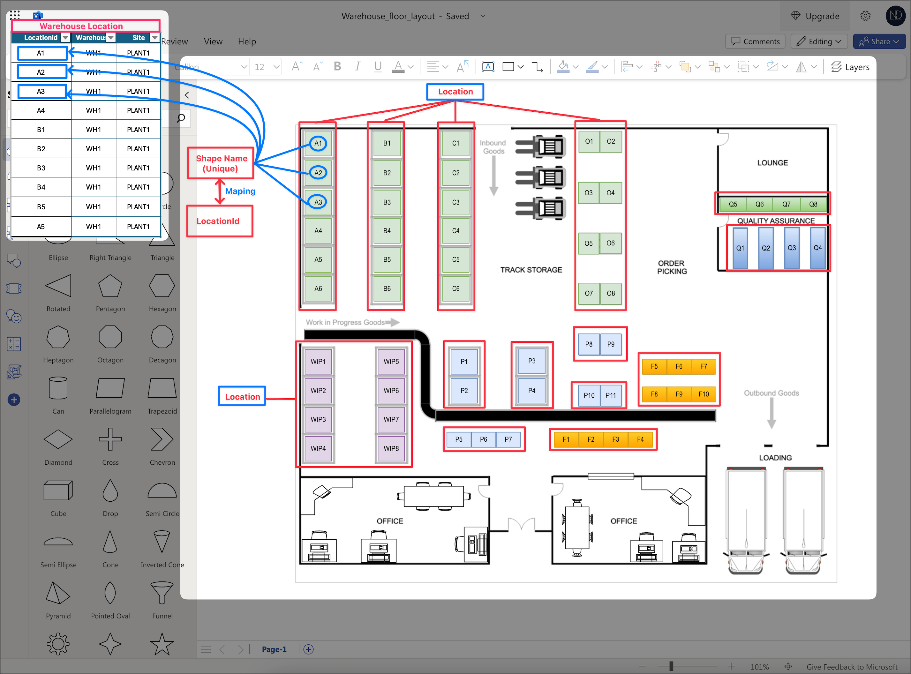
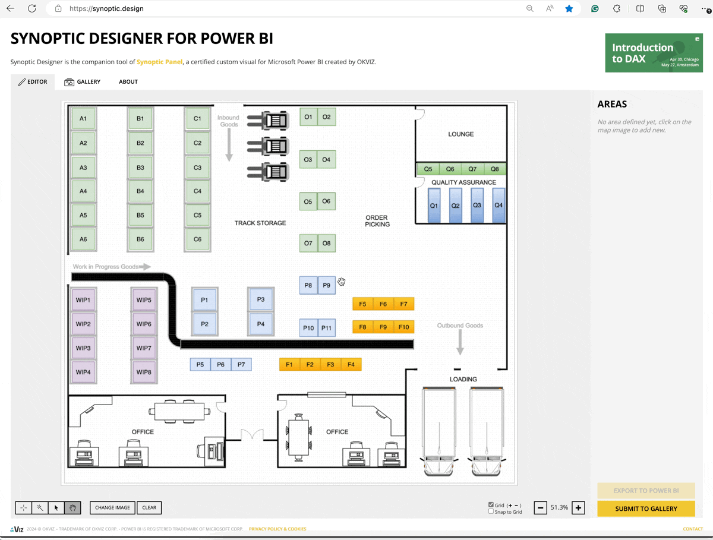

# 💡 Leveraging Interactive Warehouse Floor Maps in Power BI

Recently, when I worked with my wife to draw her company's Warehouse Floor Map, it was exciting to me. Then, I think about how to show the Warehouse Floor Map as a visualization in the Power BI. That can help my wife track & analyze inventory on hand, finding items by Warehouse Location easily.

Using the Warehouse Floor maps in Power BI can greatly enhance data visualization and analysis for inventory management. Here's a brief outline of my article.

## 1. Source Files

I created a sample Warehouse Floor Map and Sample Dataset which is being used for my instance.

<table><thead><tr><th>File name</th><th data-type="files"></th></tr></thead><tbody><tr><td>Sample Inventory On-hand Data</td><td><a href="../../.gitbook/assets/Sample_DS.xlsx">Sample_DS.xlsx</a></td></tr><tr><td>Sample Warehouse Floor Maps (Visio)</td><td><a href="../../.gitbook/assets/Warehouse_floor_layout.vsdx">Warehouse_floor_layout.vsdx</a></td></tr><tr><td>Sample Warehouse Floor Maps (SVG) - <mark style="color:red;">Synoptic Designer</mark></td><td><a href="../../.gitbook/assets/Synoptic_WH_Floor_Map.svg">Synoptic_WH_Floor_Map.svg</a></td></tr><tr><td>Sample - Power BI report file</td><td><a href="../../.gitbook/assets/sample_power_bi_warehouse.pbix">sample_power_bi_warehouse.pbix</a></td></tr></tbody></table>

Now, I will describe my data sample - file "**Sampe\_DS.xlsx"**

<figure><figcaption>
Overview - Sample Data
</figcaption></figure>

Data Model in Power BI:

<figure><figcaption>
Power BI - Data Model
</figcaption></figure>

## 2. Make a Warehouse Floor Map design for Power BI

In the Power BI, I found and used 2 visuals to make it.

*   [Visio Visual](https://appsource.microsoft.com/en-us/product/power-bi-visuals/WA104381132): You must create the Warehouse Floor Map Visio file\
    Sample Visio file for "Warehouse Floor Map" - each warehouse location is a <mark style="color:red;">**Shape with a unique Name.**</mark> This Shape Name will be used to map with the Warehouse Location in the data source file _**"Sample\_DS.xlsx"**_ 

    <figure><figcaption>
Visio Design - Warehouse Floor Map
</figcaption></figure>

    \
    _<mark style="color:red;">**Important:**</mark>_ _Ensure that the **Visio shapes** that you want to link to Power BI data within your diagram have **unique text.**_

*   [Synoptic Visual](https://appsource.microsoft.com/en-us/product/power-bi-visuals/WA104380873): You must make some areas for the Warehouse Floor Map image by using the Synoptic Designer at the link [https://synoptic.design/](https://synoptic.design/).\
    \
    <mark style="color:red;background-color:green;">**How to make an area for any image by Synoptic Designer?**</mark> 

    <figure><figcaption>
Make Area for Warehouse Location by Synoptic Designer
</figcaption></figure>

    \
    _<mark style="color:red;">**Important:**</mark>_ _Ensure that the **Area name** that you want to link to Power BI data within your image has **unique value.**_

## 3. Create a Power BI report

## 3.1 Using Visio Visual

You must get Visio Visual first _**( ... > Get more visuals > Visio Visual).**_ After that, we add this Viso Visual to the Report page and configure it as the image below.

<figure><figcaption>
Add Visio Visual in Power BI
</figcaption></figure>


Due to the Visio Visual connecting exclusively through URL, it's necessary to upload the completed Visio File to a cloud service (e.g., SharePoint, OneDrive) upon design completion.


**Configuration:**


Add - Visio Visual


### 3.2 Add Synoptic Panel visual

Now we move to configure on another Visual - **Synoptic Panel.**

**Configuration:**


Add - Synoptic Visual


That's all for my ideas.&#x20;

Thank you for watching & Hoping well! ... :goal::tada:\
**\[NTD]yns.asia**
