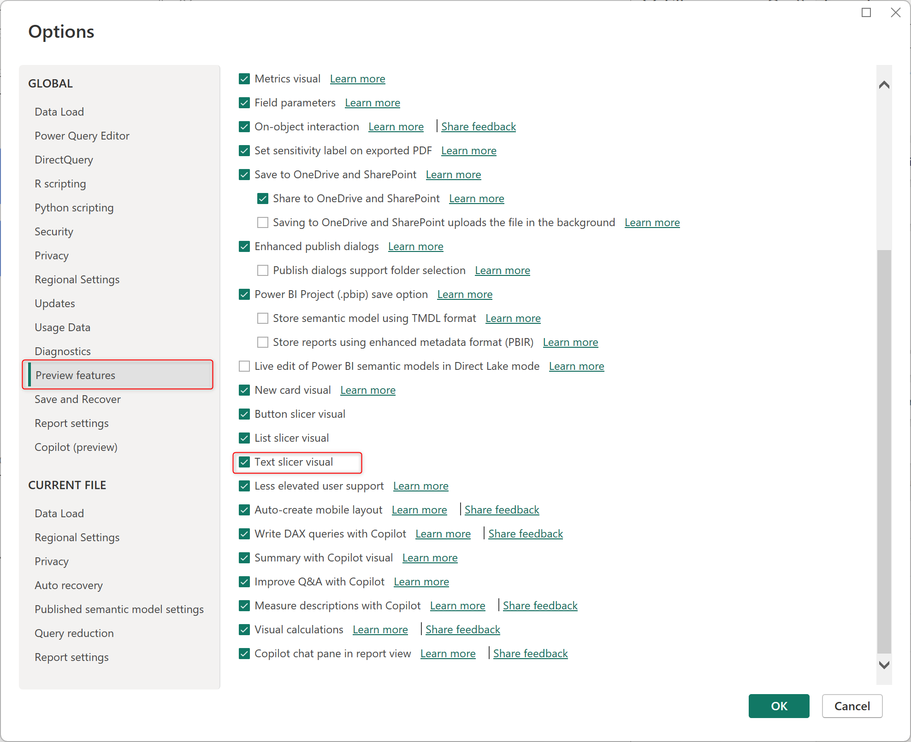

# New Text slicer

Ciao, friends!&#x20;

I now have time to work on Power BI reporting and am excited about new features.

Today, I'm excited to introduce a new feature - the <mark style="color:green;">**Text Slicer**</mark>. It enhances data slicing by allowing visual filtering based on text input.

## Enabling

In the Power BI desktop, access the **Options** setting > then select **Preview features,** and enable the **Text slicer visual** by ticking the check box. OK and try.

<figure><figcaption>
Enable Text Slicer visual
</figcaption></figure>

## Checking

I am using my sample data to implement a **Text slicer** that will allow me to identify the promotion code and calculate the total amount.

<figure><figcaption>
Add Text slicer visual
</figcaption></figure>

... and the result

<figure><figcaption>
Text slicer checking
</figcaption></figure>

Thank you & hoping well.\
**\[NTD]yns.asia**
