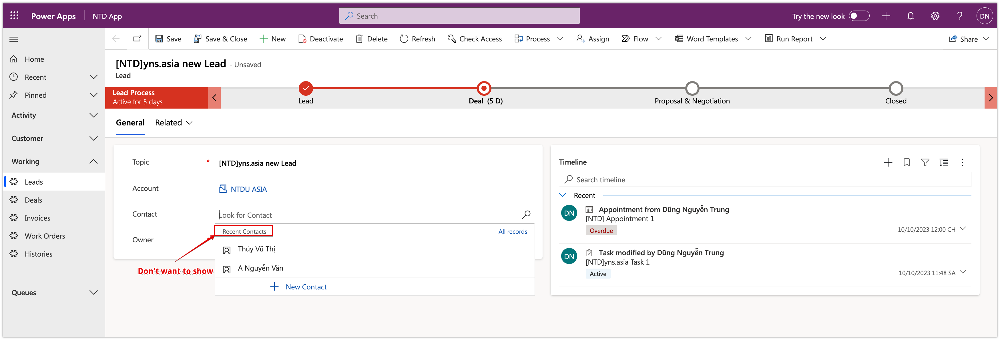
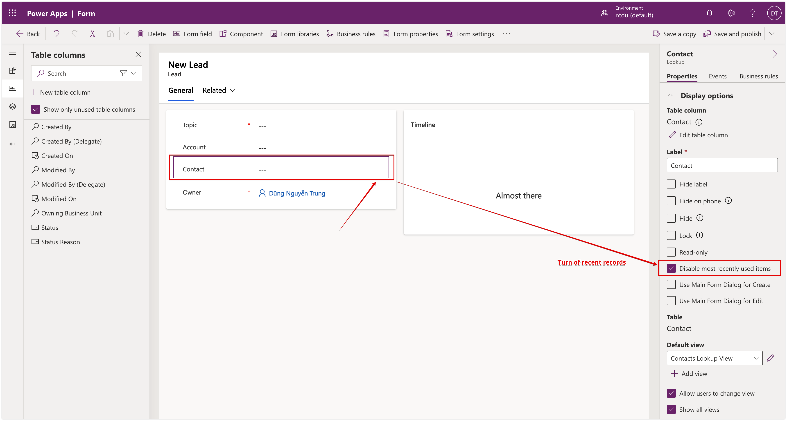
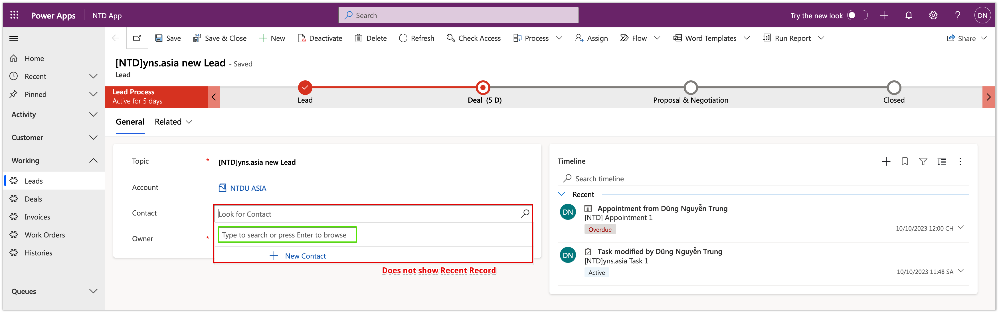
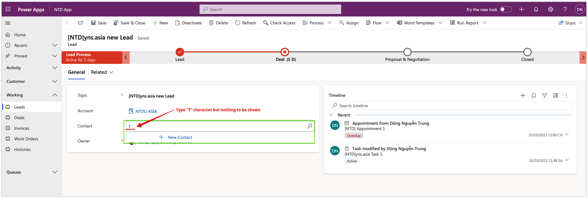
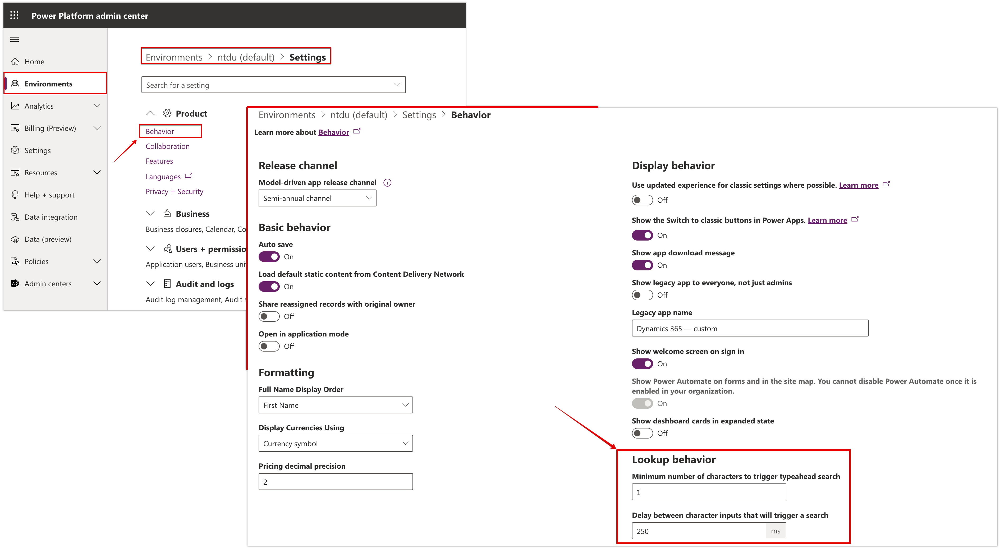
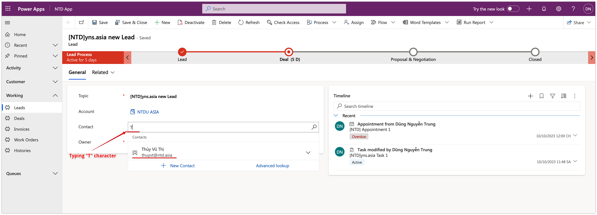

# Auto search on the Lookup field

Hi all, \
How are you? :heart\_eyes:

This week, my client asked me about the data searching on a **Lookup field.** \
The system's current behavior is so confusing when they press on the area lookup fields which show almost recent records first, then they click on the icon  and can get an available record list.

<figure><figcaption>
Example: Contact field whit recent records
</figcaption></figure>

## Turn off recent record

So, I already disabled showing recent records on this lookup field as below.

<figure><figcaption>
Disable recent record on "Contact" lookup field
</figcaption></figure>

And return to my app and check...&#x20;

<figure><figcaption>
Recent record have been disabled
</figcaption></figure>

The recent records have been disabled. However, my client is still facing another confusing behavior with nothing to be shown when pressing on on lookup field (as about the image).\
Even, though they did type a character into this field but nothing to be shown either.

<figure><figcaption>
Nothing with a charater
</figcaption></figure>

Very very confused... :disappointed\_relieved:

## Configure Lookup field behavior

... And I found one configuration in the **Power Platform Admin Center: &#x20;**_**Environment > Setting > Behavior.**_

<figure><figcaption>
Lookup Behavior Configuration
</figcaption></figure>

You should input 2 values and I did input minimum value also:

* _Minimum number of characters to trigger typeahead search: **1**_
* _Delay between character inputs that will trigger a search: **250**_

## Checking after configuring

On my Lead form, at the **Contact** lookup field, I type the **"T"** character and check...

<figure><figcaption>
Typing "T" character and auto searching
</figcaption></figure>

<figure><figcaption>
Typing "H" character and auto searching
</figcaption></figure>

Happy and happy... :tada::clap:

**\[NTD]yns.asia**\
<mark style="color:red;">...</mark>[<mark style="color:red;">invite me a cup.</mark>](https://ko-fi.com/ntdyns/?ref=qr\&amp;v=2) :coffee: Thank you. :heart:
