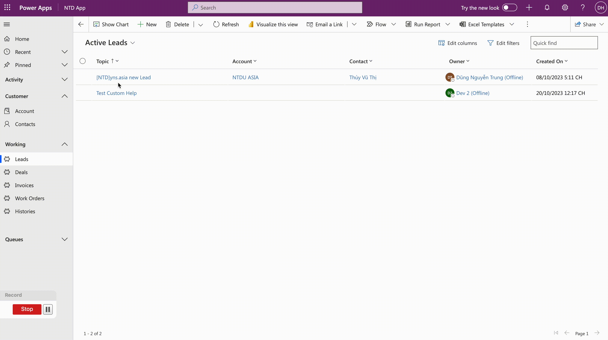

# "Custom Help" - Is it help?

Hola.. :relaxed:

My friends!

Last month, my client announced the system run GO-LIVE. My client is using Power Platform to build their core system.&#x20;

The PM had asked me how we could create a document to guide or support the user use the system. The user will interact with the system to get support while still using the system seamlessly.

I found the **Custom Help** functionality on D365 and Power Platform and then tried using this.

## Enable "Help" functionality

We must enable Custom Help Pane and Guided Task in the System Admin setting as below.

<figure><figcaption>
Enable Custom Help Pane and Guided Task
</figcaption></figure>

If the option is disabled, please make sure the option **Custom help for customizable entities** has been turned off. (_Path: Power Platform Admin Center > Feature > under Help features)._

<figure><figcaption>
Custom help for customizable entities: Turn Off
</figcaption></figure>


You can enable custom help panes or customizable help, but not both at the same time.


After enabling, click on the "help" icon >> The **Custom Help** pane will be opened.

<figure><figcaption>
Open Custom Help pane
</figcaption></figure>

## Creating "Custom Help" form App

Now, we can create a new custom help to guide the user using Lead Processing.

On the Application, you open the **Entity** and click on the "help" icon. The Custom Help pane will be shown that's mean, you are creating Custom Help for this entity. \
As my sample, I will create Custom Help to entity **Lead.**


The Custom Help is available for **View** and **Form.** If you want to show Custom help on view, you should open the main list view of a specific entity and then click icon to begin creating content.


After that, on the Custom Help Pane >> click on the icon <...> and then click **Edit**

<figure><figcaption>
Edit Custom Help
</figcaption></figure>

On Custom Help, you can input the content by yourself with many components and functionalities:

* Free form text
* Add a bulleted list and a numbered list
* Can insert Link, Image, Video
* Add a section to group the content

After clicking **Edit  >** the new pane will be opened. Then, you can input the content on that >> And click **Save** after finishing.

<figure><figcaption>
Creating Custom Help on Lead entity
</figcaption></figure>

## Security & Privilege

The Custom Help is an entity in Dataverse, that why you can set _**global permission (4/4 or Organization)**_ for the user: create, read, write, delete, append and append to privileges on the **Help Page** entity.

<figure><figcaption>
Security role for Help Page entity
</figcaption></figure>

## How to deploy to another?

After creating the necessary Custom Help on the DEV environment, you just add these custom help records to your solution and prepare to deploy for another environment.

<figure><figcaption>
Help page component in solution
</figcaption></figure>

After adding to the solution, you can click open the Help page record and edit as below.

<figure><figcaption>
Help page record
</figcaption></figure>

## Check the result...

Now, I will log in with a different user will open the Lead form then use the custom help.

<figure><figcaption>
Using Custom Help on Lead form
</figcaption></figure>

<figure><figcaption>
Help 1
</figcaption></figure>

<figure><figcaption>
Help 2
</figcaption></figure>

Hoping well...  :tada:

For more details from Microsoft as the [link](https://learn.microsoft.com/en-us/power-apps/maker/data-platform/create-custom-help-pages).

Thank you.\
**\[NTD]yns.asia**\
<mark style="color:red;">...</mark>[<mark style="color:red;">invite me a cup.</mark>](https://ko-fi.com/ntdyns/?ref=qr\&amp;v=2) :coffee: Thank you. :heart:
