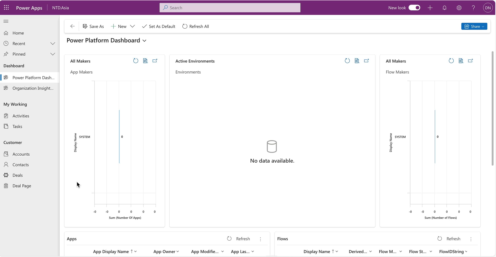
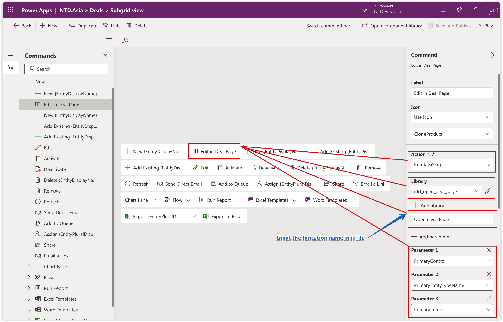
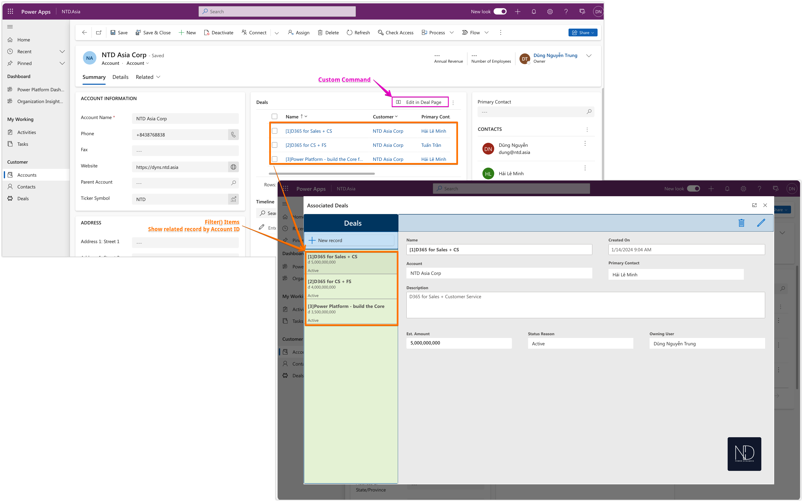
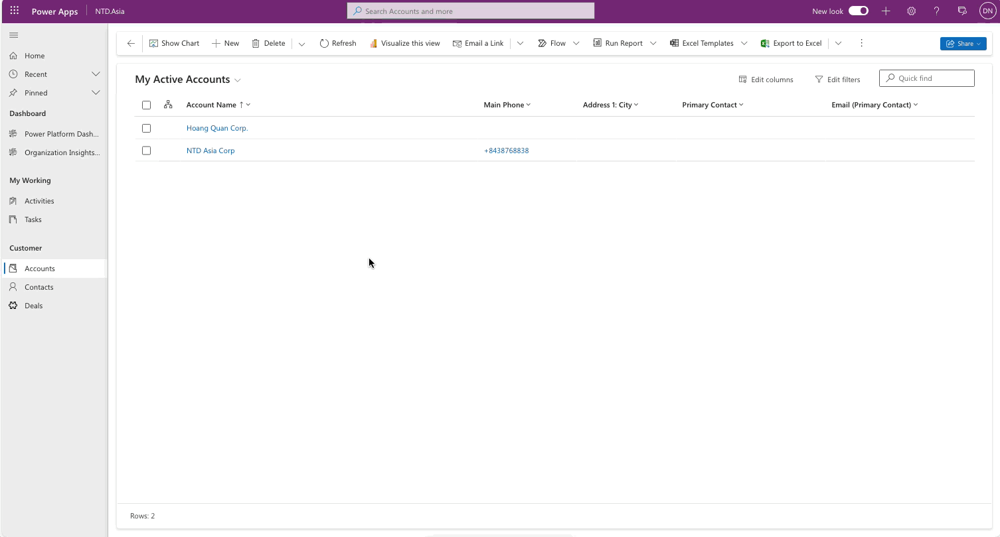

# Custom Page - Why not?

Today, I want to share something about using the Custom Page in the Model Driven app.

## Custom Page vs Embedded Canvas App

Firstly, I would like to share my thoughts outlining the differences between Custom Pages and Embedded Canvas Apps in terms as shown in the table below:

<table><thead><tr><th width="253">Aspect</th><th width="241">Custom Page</th><th>Embedded Canvas App</th></tr></thead><tbody><tr><td><strong>Standalone Usage</strong></td><td>Yes, as a navigation item in the Model-App menu.</td><td>Yes, as a standalone app on various platforms.</td></tr><tr><td><strong>Embedding Capabilities</strong></td><td>Popup, flyout, and side pane integration.</td><td>Integration in Model-driven forms, Teams, SharePoint, and Power BI Reports.</td></tr><tr><td><strong>Record Context</strong></td><td>Yes, can access Model App context.</td><td>Yes, operates within the record context in Model App.</td></tr><tr><td><strong>Standalone App Execution</strong></td><td>No, cannot run independently.</td><td>Yes, can run as a standalone app.</td></tr><tr><td><strong>Licensing Considerations</strong></td><td>No additional licensing required.</td><td>Potentially requires additional licensing for paid/custom connectors.</td></tr><tr><td><strong>Sharing Requirement</strong></td><td>No need to be explicitly shared; inherited from Model-Driven App.</td><td>Requires sharing with users for app execution.</td></tr><tr><td><strong>Ideal for Use Cases</strong></td><td>Extending functionality within existing processes.</td><td>Involving connectors beyond Model Apps/Dataverse functionalities.</td></tr></tbody></table>

Hopefully, it can help :relaxed:

Okay... now I will create a custom page and seamlessly integrate it into the Model-Driven App.&#x20;

This is a practical example, showcasing the steps involved in developing and incorporating a custom page within the Model-Driven App environment.

## Create Custom Page

Go back to the Solution and click _**New > App > Page**._\
Following that, I crafted a Custom Page titled "**Deal Page**" This particular page is designed to display the associated Deals of the current Account on which you are currently positioned.

<figure><figcaption><p>New Custom page - named: "Deal Page"</p></figcaption></figure>

## Add Custom Page in MDA

After finishing my custom page, I will add this page to my Model Driven-App.

**Edit** App with **New Designer >** click **Add Page** > choose **Custom page** and click **Next**  &#x20;

<figure><figcaption><p>Add Page into MDA</p></figcaption></figure>

Next, select "Using existing custom page" and select my page - **"Deal Page"** >> Click **Add**

<figure><figcaption><p>Select "Deal Page" and Add to MDA</p></figcaption></figure>

Finally, click **Save** and **Publish App**


**"Show in navigation"** - choose this option If you want to show your page on the app navigation.


Now, check my custom page in MDA

<figure><figcaption><p>Check my custom page on Navigation</p></figcaption></figure>

## Tip: Run CustomPage by PowerFx

I plan to create a new button on the subgrid "Deal" on the main form of Account. This button will open the "Deal Page". This page will only display the deals that are associated with the current Account.

Reference: [New Modern Command Bar](https://dyns.ntd.asia/power-dynamics/power-platform/model-driven-app/new-modern-command-bar) to show some steps to create a custom button.

I choose to create the Command by Power Fx.

<figure><figcaption><p>Create command by Power Fx</p></figcaption></figure>

My button is called **"Edit in Deal Page".**

<figure><figcaption><p>"Edit in Deal Page" command</p></figcaption></figure>

My command will run the action **Java Script** as an image. The button will call the js and open my page as Centered Dialog.

<figure><figcaption><p>Configure command to open the custom page "Deal Page"</p></figcaption></figure>

Note: Your custom page should add the **filter()** for items that you want to show records associated with the current parent item.


**Note:** Your custom page should add the **filter()** for items that you want to show records associated with the current parent item.&#x20;

In my scenario is **Account Id** _(primaryItemId) - input for my custom page._


Below is my sample. In my sample, I used 3 parameters:

* **PrimaryControl**: so we can refresh the page after the Dialog closes.
* &#x20;**PrimaryItemId**: used in the Custom Page Dialog to relate the Deal record to the Account.
* **PrimaryEntityTypeName**: used to check if the Dialog is bound to the Account.

```javascript
// my js sample
function OpenInDealPage(primaryControl,primaryEntityTypeName,primaryItemId)
{// Centered Dialog
var pageInput = {
    pageType: "custom",
    name: "ntd_dealpage_4a9fd",
    primaryEntityName: primaryEntityTypeName,
    primaryItemId: primaryItemId,
};
var navigationOptions = {
    target: 2, 
    position: 1,
    width: {value: 800, unit:"%"},
    title: "Associated Deals"
};  
Xrm.Navigation.navigateTo(pageInput, navigationOptions)
    .then(
        function () {
            primaryControl.data.refresh()
        }
    ).catch(
        function (error) {
            // Handle error
        }
    );
}
```

## Checking my result

Open the Account main form:

<figure><figcaption><p>Test the custom command - open Custom Page</p></figcaption></figure>

Testing...

<figure><figcaption><p>Custom command and Custom Page</p></figcaption></figure>

For the details of navigating of custom page, you can check from the [Microsoft Link.](https://learn.microsoft.com/en-us/power-apps/developer/model-driven-apps/clientapi/navigate-to-custom-page-examples)

Hopping well. Thank you... :tada:\
**\[NTD]yns.asia**\
<mark style="color:red;">...</mark>[<mark style="color:red;">invite me a cup.</mark>](https://ko-fi.com/ntdyns/?ref=qr\&amp;v=2) :coffee: Thank you. :heart:
