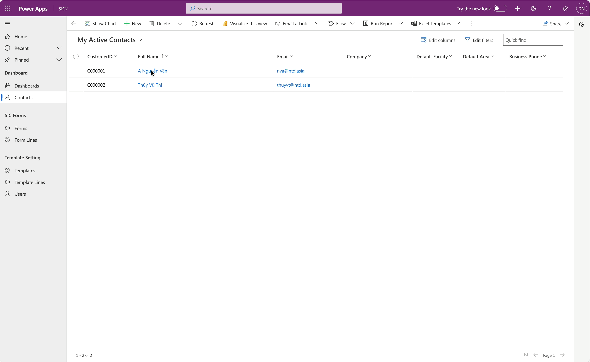

# Embedded Power BI - Form

## Use Case

Hi, How are you?

Thank you for your reading. Yesterday, I got a reporting requirement from the client.

&#x20;  I was thrilled when they wanted to know **how we could make the 360 Customer view more insightful**. And I told them we could make the Power BI tool with more data visualization, more analytics to create a comprehensive and engaging report that would reveal the customer's 360 view.&#x20;

&#x20;  So, I designed a sample Power BI report that displays the customer's demographics, loan and contract details, and customer care data. Then, I embedded this Power BI in the main form of the table. The Power BI report will be set as the filter by the current customer.\
&#x20;   Creating and displaying a visualization in the Main form using OOB components in Dataverse is very challenging. That's why I opted for the Embedded Power BI solution. :relaxed:

## Embedded Power BI report on Form


Microsoft reference link: [Embed a Power BI report in a model-driven app main form](https://learn.microsoft.com/en-us/power-apps/maker/model-driven-apps/embed-powerbi-report-in-system-form)   &#x20;


My steps below and I used the app [**Power BI Embedder**](https://www.xrmtoolbox.com/plugins/Fic.XTB.PowerBiEmbedder/) in XrmToolbox to embed the Power BI report in the Main form.

<figure><figcaption>
Involved Steps
</figcaption></figure>

&#x20;  For instance, I have a report called **"FE\_Poc" -** that displays the customer's demographics, loan and contract details, and customer care data. I will embed this report in the Main form of the **Contact** table. The report will be **filtered** by **CustomerID** (a field on the Contact table).

### 1.1 Add filtering for the Power BI report

In the report, expand the **Filter** **>>** then add the field **CustomerID** under the section **"Filter on all pages" >>** then Save and Public report to Power BI Service.


With this filtering, all pages of this report will be filtered by **CustomerID.**


<figure><figcaption>
Add filtering for PwBI report
</figcaption></figure>

The next step, I opened my **Solution** >> opened main form **Contact:**

* I added a new tab called **Power BI**&#x20;
* Then, I added a new section **FE\_Poc** in this tab.

I will embed the Power BI report into the section **FE\_Poc** under the **Power BI** tab.

<figure><figcaption>
Tab &#x26; Section for embedded Power BI
</figcaption></figure>

### 1.2 Using XrmToolbox to embed the Power BI report

Now, open the [**XrmToolbox**](https://www.xrmtoolbox.com/) >> then use the app [**Power BI Embedder**](https://www.xrmtoolbox.com/plugins/Fic.XTB.PowerBiEmbedder/)**.**

Firstly, I need to find the **Group ID** and **Report ID** of the Power BI report **"FE\_Poc"** for the configuration in the XrmToolBox

<figure><figcaption>
How to find Group ID and Report ID
</figcaption></figure>

Configuration on the app **Power BI Embedder:**

1. **Target** section:
   * _Entity_: choose entity **Contact**
   * _Form_: choose the main form needed to embed the Power BI report
   * _Tab_: choose the tab on the main form
   * _Section_: chose section on the main form
2. **Power BI Config** section:
   * _Method:_ set default value - _**Manual**_
   * _Group ID:_ input the Group ID value of the Power BI report (above)\
     My sample: _<mark style="color:red;">52b0871f-948e-41d8-97cb-0375566b7dd5</mark>_
   * _Report ID:_ input the Group ID value of  the Power BI report (about)\
     My sample: _<mark style="color:red;">6781e570-7f4d-400a-8231-c5ab898621a7</mark>_
   * _Page_: input the value [https://app.powerbi.com/reportEmbed?reportId=](https://app.powerbi.com/reportEmbed?reportId=6781e570-7f4d-400a-8231-c5ab898621a7)_**\[\[ReportID]]**_\
     Sample: My Report ID = _<mark style="color:red;">6781e570-7f4d-400a-8231-c5ab898621a7</mark>_\
     _**-> Page:**_ [https://app.powerbi.com/reportEmbed?reportId=](https://app.powerbi.com/reportEmbed?reportId=6781e570-7f4d-400a-8231-c5ab898621a7)_<mark style="color:red;">6781e570-7f4d-400a-8231-c5ab898621a7</mark>_
   * _URL_: input the value [_https://app.powerbi.com_](https://app.powerbi.com)\
     _---_
   * Tick the field **Filter** -> to enable pre-filtering for the Power BI report. \
     The filtering configuration is below:
     * _<mark style="color:green;">PBI Table:</mark>_ select Power BI Dataset which contains the field **"Customer ID"&#x20;**_**(used for pre-filtering).**_
     * _<mark style="color:green;">PBI Column</mark>_: select a column in the Power BI Dataset used for filtering (in Filter Pane).
     * _<mark style="color:green;">CDS Field:</mark>_ select a column of the table **Contact** in Dataverse. This column will be used to filter the Power BI report.

<figure><figcaption>
Configuration - Power BI Embedder - Publish
</figcaption></figure>

Finally, just click **Publish Report** to finish and wait.... :tada:

## Checking now...

Open a Contact - **A Nguyễn Văn (CustomerID = C000001)** -> The Customer ID auto filterred.

<figure><figcaption>
Check first contact
</figcaption></figure>

... and I check for another contact...

<figure><figcaption>
Live check
</figcaption></figure>

Yeah... with XrmToolbox, embedded the Power BI report so easily. \
Thank **XrmToolbox**, thanks **Ivan Ficko** author of Power BI Embedder app.&#x20;

Thank you and hoping well... :tada:\
**\[NTD]yns.asia**                                                                                                                         &#x20;
