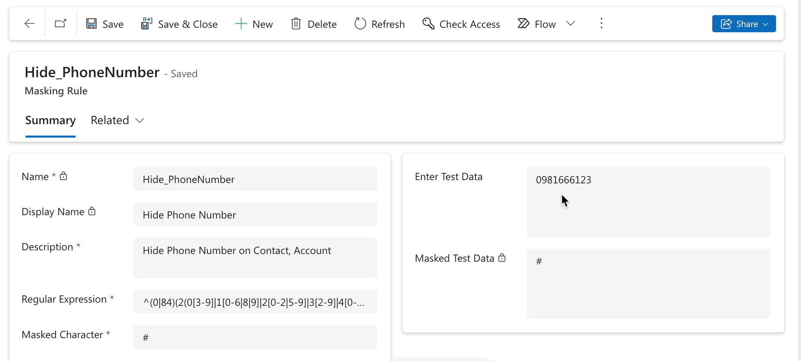
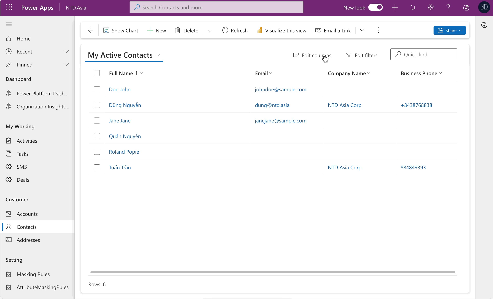

# Hiding sensitive column data

Hello guys,

Have you got the requirement on how to hide the sensitive column data when implementing the Power Platform or D365 CE for the client?

Hiding or showing sensitive columns is very useful and necessary. It helps protect information and prevents unauthorized access to sensitive data.

Today, we will talk about some ways you can hide sensitive columns.

## Using data masking rule

Data masking rules provide a robust method to secure sensitive information in Power Platform or D365 CE, such as IDs, credit card numbers, and personal information,... Implementing these rules ensures that this type of data appears in a concealed format, safeguarding it from unauthorized viewing.

**My case:** The client asked me to hide the **Phone Number (format: Vietnam) on entity Contact.**


1.  **Enable column security** for the column you need to mask.\
    In my case, I **enable** the column **Mobilephone** on the **Contact** entity.<br>

    <figure><figcaption><p>Enable column security</p></figcaption></figure>
2. **Create "Secured masking rule":** Create this component in the Solution.

<figure><figcaption><p>Create "Secured masking rule"</p></figcaption></figure>

* **Name**: The name of the masking rule.
* **Description**: An optional description of the masking rule.
* **Regular expression**: A regular expression to identify the data to be masked. \
  Define Regex rule in C# is designed to mask Vietnam phone numbers as below.

<pre class="language-csharp" data-overflow="wrap" data-line-numbers><code class="lang-csharp">// I used the sample Regex from this GitHub <a data-footnote-ref href="#user-content-fn-1">Links</a>: 
Regex = ^(0|84)(2(0[3-9]|1[0-6|8|9]|2[0-2|5-9]|3[2-9]|4[0-9]|5[1|2|4-9]|6[0-3|9]|7[0-7]|8[0-9]|9[0-4|6|7|9])|3[2-9]|5[5|6|8|9]|7[0|6-9]|8[0-6|8|9]|9[0-4|6-9])([0-9]{7})$
</code></pre>

Run testing firstly:

<figure><figcaption><p><strong>Masked Test Data - Vietnam Phone Number</strong></p></figcaption></figure>

3. **Create "Attribute Masking Rule":** Create this component in the Solution.

<figure><figcaption><p>Apply masking rule for entity &#x26; column</p></figcaption></figure>

* **Entity:** Apply a masking rule to the table. \
  My case is the "**Contact"** entity
* **Attribute**: The column applied the masking rule of the Entity. \
  My case is the "**Mobiphone**" column of the **Contact** entity
* **Masking Rule**: select the specific making rule that has been created in **Step 2**

<mark style="background-color:green;">**That's finished the configuration. Now, we run testing.**</mark>\
If you input a valid Vietnam Phone number -> This value will be masked after saving.

<figure><figcaption><p>Test Mask Phone Number on the Contact record.</p></figcaption></figure>

## How to show after hiding...

:innocent: You imagine that you just hide this information for some users and the remaining can see it. So...

* By utilizing the **Field Security Profile** alone, without the **Masking Rule**, managing access becomes more straightforward. You can rapidly adjust user permissions by adding or removing users from the field security profile.
* However, the **Masking Rule** operates on the uppermost layer, overriding the functionality of the Field Security Profile. This feature effectively bypasses the Field Security Profile mechanisms.

So **How to do that ???**

See you again in the next section. :heart\_hands:\
Thank you and hoping well.\
**\[NTD]yns.Asia**\
<mark style="color:red;">...</mark>[<mark style="color:red;">invite me a cup.</mark>](https://ko-fi.com/ntdyns/?ref=qr\&amp;v=2) :coffee: Thank you. :heart:

[^1]: ```
    https://github.com/tuangt12/vietnam_phone_regex
    ```
