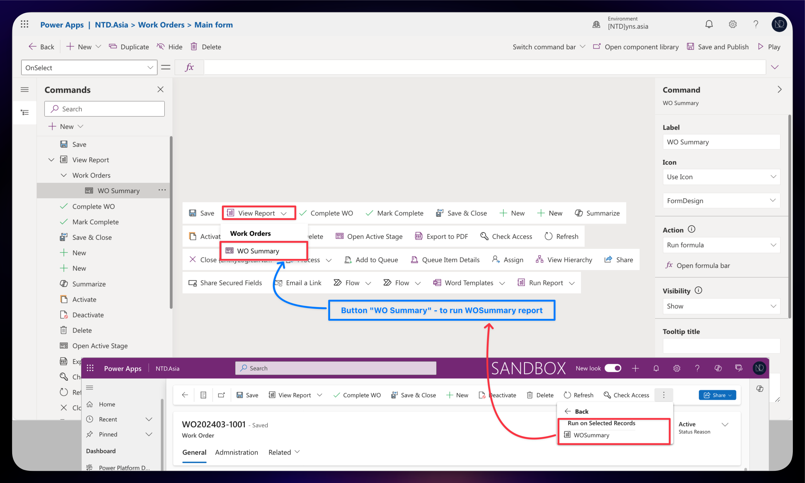
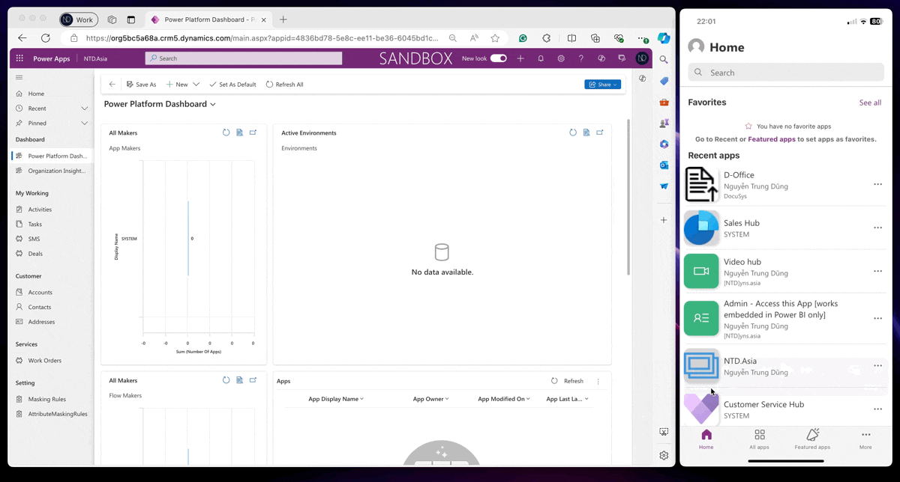

# 💡 Run SSRS report on MDA mobile

Hello friends,&#x20;

Today, I want to share my thoughts on running SSRS reports on Power App Mobile for Model Driven Apps. A key challenge is the absence of the "Run Report" button in the Power Apps Mobile for Model Driven Apps, which means users are unable to generate reports when needed.&#x20;

For example, in my case: a worker using Power Apps Mobile to manage Work Orders on the field. Once a Work Order is completed, the worker needs to run the "**WOSummary**" report to display the Work Order information and confirm it with the client. Without the ability to run this report on the mobile app, the worker faces significant inconvenience and inefficiency.

Here, we can see the difference when opening MDA on the Web/Browser and on Power Apps Mobile.

* **MDA on Web/Browser:** Open the Work Order form, and the "Run Report" button is visible.

<figure><figcaption><p>The "Run Report" button is visible on Web/Browser</p></figcaption></figure>

* **MDA on Power Apps Mobile:** Open the Work Order form, and the "Run Report" button is invisible.

<figure><figcaption><p>The "Run Report" button is invisible on the Power Apps Mobile</p></figcaption></figure>

## My thoughts...

Considering this restriction, my first thought is to implement a new "View Report" button on the main Work Order form.


You can check my blog post about  [new-modern-command-bar.md](new-modern-command-bar.md "mention")


Okay, I will proceed with my solution and implement it. I'll bypass the step of creating a new command, which you can find in the reference link mentioned earlier.

I will create a new command on the **Work Order main form** for running the "_**WOSummary"**_ report on the Selected record. You can see as below.

<figure><figcaption><p>New command: View Report > WO Summary</p></figcaption></figure>

After creating a button, I modify the **PowerFx** formula in the **OnSelect** event: _<mark style="color:red;">Clicking the "WO Summary" button triggers the system to run a report for the selected Work Order.</mark>_


Reference link to run an SSRS report by URL:  [Opening a Report by using a URL](https://learn.microsoft.com/en-us/dynamics365/customerengagement/on-premises/developer/open-forms-views-dialogs-reports-url?view=op-9-1#opening-a-report-by-using-a-url)


By following the link above, I have tried and edited a URL structure as below.


```java
//URL Structure
[organization url]/crmreports/viewer/viewer.aspx?action=run&helpID=[[ReportFileName]]&id=%7b[[ReportGUID]]%7d&context=records&recordstype=[[EntityTypeCode]]&records={[[RecordGUID]]]
```


My sample: Running report "WOSummary" on Work Order entity.

* \[\[<mark style="color:red;">ReportFileName</mark>]]: WOSummary.rdl
* \[\[<mark style="color:red;">ReportGUID</mark>]]: 99211b9c-8cde-ee11-904c-0022485a170d
* \[\[<mark style="color:red;">EntityTypeCode</mark>]]: Work Order (10327)\
  You can find the entity type code by used FetchXML Builder

<figure><figcaption><p>How to find entity type code</p></figcaption></figure>

* \[\[<mark style="color:red;">RecordGUID</mark>]]: Work Order record GUID

Yeah... :tada:, we already found all the components for URL Structure. Now I will put these to my PowerFx formula.


```javascript
// PowerFx
Launch(
    Concatenate("https://org5bc5a68a.crm5.dynamics.com/crmreports/viewer/viewer.aspx?action=run&helpID=WOSummary.rdl&id=%7b99211b9c-8cde-ee11-904c-0022485a170d%7d&context=records&recordstype=10327&records={",Self.Selected.Item.'Work Order',"}"));
```


<figure><figcaption><p>Button with PowerFx fomular: Run report "WOSummary"</p></figcaption></figure>

After that, just **Save and Publish** this command and test it now...

## Checking now...

On my phone, I opened the Power Apps mobile and ran my testing app **"NTDyns.Asia"** > navigate to **Work Orders** > and open specific a Work Order record.

<figure><figcaption><p>Testing - Web on right - Mobile on left</p></figcaption></figure>

Hoping well with my thoughts.&#x20;


About my command, as my Functional role, I used PowerFx language. But you can use JavaScript to call the action for run reports also.


Thank you for your reading! :relaxed:\
**\[NTD]yns.asia**
