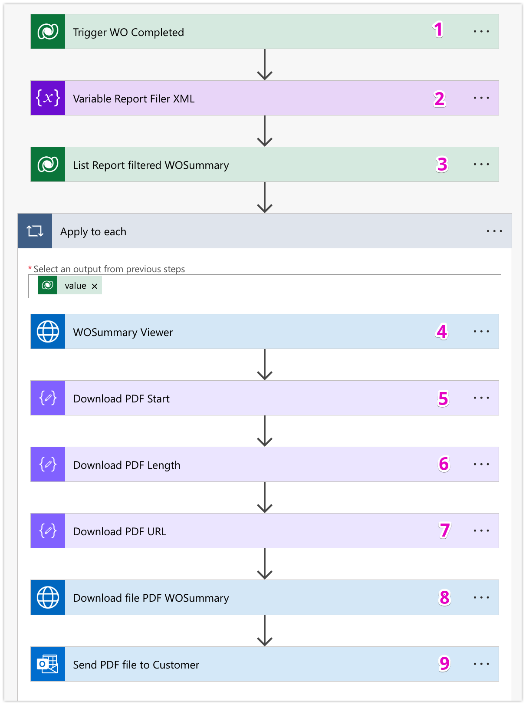
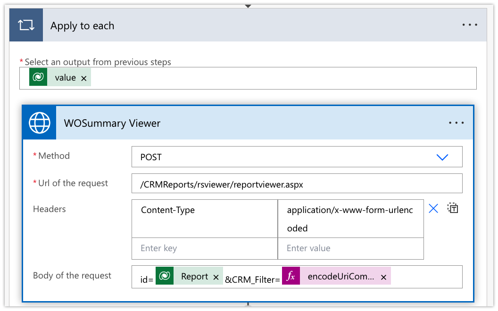

# Dowload SSRS Report and Send email

Have a nice day, my friends!

Today, I noted how to use Power Auotomate download SSRS Report, and send it via email.&#x20;

This is a question from my teammate and I feel it's very exciting because I have faced this requirement from many clients before. Last time, my dev team did the C# code to generate the report and attached this report to the email for sending. Now, after researching & learning, I try to use the Power Automate with action **HTTP Request** to do that.

## **My scenario**

The customer is using the Work Order process:

* Engineers use a Work Order to log inspection and work results at customer sites.
* After work completion, the customer signs the Work Order mobile form.
* The engineer marks the Work Order as complete, triggering an immediate Work Order Summary report (of the current Work Order) to be sent to the customer.

## My proposal

I'm using the Power Automate to configure this scenario:

<table><thead><tr><th width="400">Components</th><th>Flow summary</th></tr></thead><tbody><tr><td><ul><li><em><strong>Trigger</strong></em>: WO completed</li><li><em><strong>Initialize Variables</strong></em>: create a <strong>Variable</strong> for Report pre-filtering<br></li><li><em><strong>List rows</strong></em>: Table <strong>Report</strong> - filter Report Name "<strong>WOSummary</strong>"<br></li><li><em><strong>Invoke an HTTP request:</strong></em> using to configure step: <em>Report Viewer (POST)</em> and <em>Download report file (GET)</em> <br></li><li><em><strong>Compose (JSON)</strong></em>: using to configure step: Download PDF Start - Length - URL<br></li><li><em><strong>Send an email (V2)</strong></em>: using to send the attached report to the Customer<br></li></ul></td><td></td></tr></tbody></table>

## Details of configuration.

For instance, I already created the report called WOSummary report, and runs on the Work Order main form.

<figure><figcaption><p>Sample Report - "WOSummary"</p></figcaption></figure>

When a Work Order is completed, the Power Automate will be triggered -> then download the WOSummary report and send it to the customer.

The configuration details are as below:



<figure><figcaption><p>Trigger WO</p></figcaption></figure>

* Trigger: Work Order **Modified** on field _"Status Reason"_
* Filter: Status Reason = Completed  <--> statuscode eq 2



<figure><figcaption><p>Variable: Report Filter</p></figcaption></figure>

* This step uses the action _**Initialize Variable**_ to set report pre-filtering when calling HTTP request - Report Viewer at _**Step(4)**_
* We using the XML format

<mark style="background-color:green;">How to find the report filter code?</mark>

<figure><figcaption><p>Report filter - sample report</p></figcaption></figure>

My sample report "WOSummary" was enabled pre-filtering so we need this step to set the Pre-filtering for a report when running the HTTP Request (apply for current Work Order triggered).

After converting the XML format, then copy it to Power Automate and replace the attribute with **Dynamic Values** at **Step(1).**&#x20;

* **uiname**: <mark style="color:red;">\[\[WO Number]]</mark>
* **guid**: <mark style="color:red;">\[\[Work Order]] guid</mark>


```xml
// Sample XML - report filter
<ReportFilter>
 <ReportEntity paramname="CRM_Filteredntd_WorkOrder" donotconvert="1" displayname="Work Orders">
  <fetch version="0" output-format="xml-platform" mapping="logical" distinct="false">
   <entity name="ntd_workorder">
    <filter type="and">
      <condition attribute="ntd_workorderid" operator="in">
        <value uiname="WO202403-1002" uitype="10327">
          edf341b8-14e0-ee11-904c-0022485a170d
        </value>
      </condition>
     </filter>
     <all-attributes />
   </entity>
  </fetch>
 </ReportEntity>
</ReportFilter>
```




<figure><figcaption><p>List rows: Reports table</p></figcaption></figure>

* List rows: get a List of report records on the table **"Reports"**
* Filter rows: Report Name = "**WOSummary**"    <-->    name eq "WOSummary"



<figure><figcaption><p>Step: WOSummary View</p></figcaption></figure>

This step is to call an HTTP request to view the WOSummary report of the current Work Order. And scope is run on **Apply to each (value):** The report in **Step (2)**

* _Method_: <mark style="color:purple;">`POST`</mark>
* _Url of the request_: <mark style="color:purple;">`/CRMReports/rsviewer/reportviewer.aspx`</mark>
* _Header_: `Content-Type:`<mark style="color:purple;">`application/x-www-form-urlencoded`</mark>
* _Body of the request_: \
  `id =`` `<mark style="color:green;">`[[Report]]`</mark>`&CRM_Filter=`<mark style="color:red;">`encodeUriComponent(`</mark><mark style="color:purple;">`[Report Filter XML]`</mark><mark style="color:red;">`)`</mark>\
  **with:**\
  &#x20;  \+ <mark style="color:green;">\[\[Report]]</mark>: this is Report GUID in **Step (3)**\
  &#x20;  \+ Expression: <mark style="color:red;">`encodeUriComponent(`</mark><mark style="color:purple;">`[[Report Fitler XML]]`</mark><mark style="color:red;">`)`</mark> \
  &#x20;                 with <mark style="color:purple;">\[Report Filter XML]</mark> at **Step(2)**

_**Note:** We must authenticate first_

<figure><figcaption><p>Authenticate for HTTP with Microsoft Entra ID (preauthorized)</p></figcaption></figure>

* _Base resource URL_: this is your environment URL (Power Platform/ CE environment)
* _Microsoft Entra ID Resource URL (Application ID URI):_ this is your environment URL (Power Platform/ CE environment)



<figure><figcaption></figcaption></figure>

Using code block:

* Using expression with **Dynamics Value**: <mark style="color:blue;">**Body**</mark> of step <mark style="color:blue;">**WOSummary Viewer**</mark>**&#x20;step(4)**

```javascript
// add string PdfDownloadUrl starts
add(indexOf([Body-"WOSummary View"],'"PdfDownloadUrl":"'),18)
```



<figure><figcaption><p>Download PDF Lenght</p></figcaption></figure>

Using code block:

* Using expression with **Dynamics Value**: <mark style="color:blue;">**Body**</mark> of step <mark style="color:blue;">**WOSummary Viewer**</mark>**&#x20;step(4)**
* Using expression with **Dynamics Value**: <mark style="color:blue;">**Output**</mark> of step <mark style="color:blue;">**Download PDF Start**</mark>**&#x20;step(5)**


```javascript
// add the length of PdfDownloadUrl 
sub(indexOf([Body-"WOSummary Viewer"],'","PdfPreviewUrl"'),
                                [Output-"Download PDF Start"])

```




<figure><figcaption><p>Download PDF URL</p></figcaption></figure>

Now, we need to replace the string "_\u0026_" with "_&_" to match the final URL format for the HTTP Request.

Using code block:

* Using expression with **Dynamics Value**: <mark style="color:blue;">**Body**</mark> of step <mark style="color:blue;">**WOSummary Viewer**</mark>**&#x20;step(4)**
* Using expression with **Dynamics Value**: <mark style="color:blue;">**Output**</mark> of step <mark style="color:blue;">**Download PDF Start**</mark>**&#x20;step(5)**
* Using expression with **Dynamics Value**: <mark style="color:blue;">**Output**</mark> of step <mark style="color:blue;">**Download PDF Length**</mark>**&#x20;step(6)**

```javascript
// replace string
replace(substring([Body-"WOSummary Viewer",
                  [Output-"Download PDF Start"],
                  [Output-"Download PDF Length"),'\u0026','&')
```



<figure><figcaption><p>HTTP Request - GET - Download PDF Report file</p></figcaption></figure>


This step is to call an HTTP request to download the Report PDF File of the "WOSummary" report.

* Method: <mark style="color:purple;">`GET`</mark>
* Url of the request: <mark style="color:purple;">`[Output-"Download PDF URL"]`</mark>



<figure><figcaption><p>Send email to customer</p></figcaption></figure>

Finally, we will configure the action "Send email (V2)" to send the PDF report file to the customer.

I notice in the attached file:

* _Attachments Name:_ the label name of the attached file
* _Attachments Content:_ <mark style="color:purple;">`[Body-"Download file PDF WOSummary"]`</mark> at **Step(8)**



Yeah... I have finished the Power Automate configuration for my scenarios.

Now, I will run the testing.

## Testing...


Final Testing - Complete WO - Check Power Automate - Check Email


Thank you & Hoping well.

**\[NTD]yns.Asia**\
<mark style="color:red;">...</mark>[<mark style="color:red;">invite me a cup.</mark>](https://ko-fi.com/ntdyns/?ref=qr\&amp;v=2) :coffee: Thank you. :heart:
