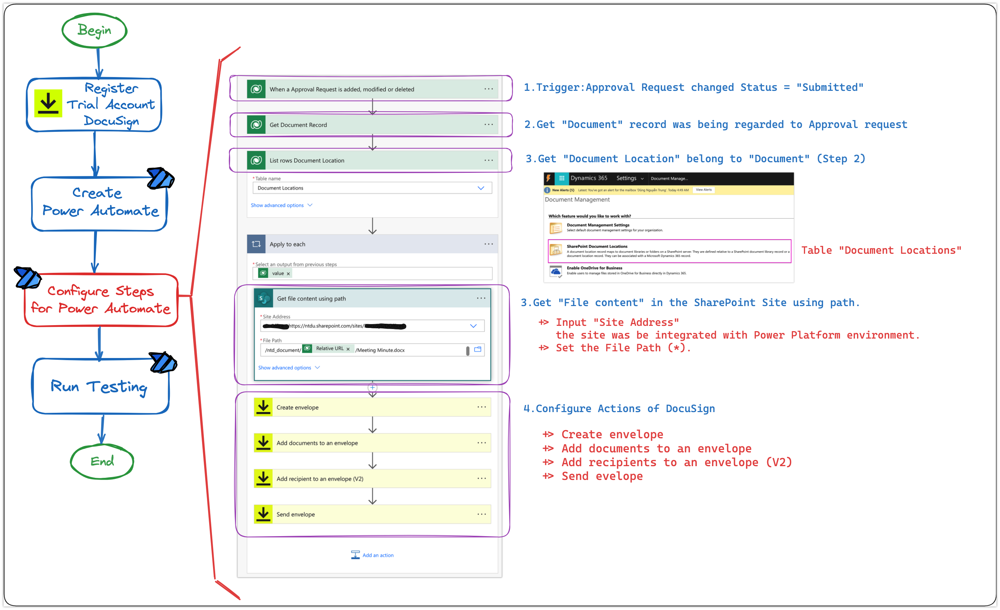
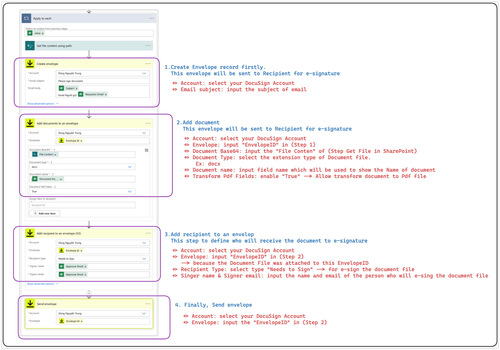

# E-sign: Power Automate & DocuSign

Good days, my friends!

Recently, I had the chance to discuss integrating electronic signatures into the approval workflow for document submissions.

This got me thinking about the efficiency gains of **e-signature** solutions when using Power Automate and **DocuSign**.&#x20;

Today, let's dive into this topic and see how these tools can revolutionize your document approval workflows!

## Approval Solution Components

<figure><figcaption>
Propose Component
</figcaption></figure>

My components:

* Create a **Document** table to manage and store document record
* Create an **Approval** **Request** table to submit an approval request to e-sign the document file
* Enable **SharePoint integration** to store the attached file&#x20;
* Using Power Automate to configure the Approval Flow
* Using Power Automate & DocuSign to send files to the approver for e-signing

## Configuring Power Automate with DocuSign for E-Sign Workflows

Today, my focus is on the seamless integration of DocuSign into your e-signature workflows using Power Automate. We'll be dedicating our attention specifically to this setup, temporarily setting aside the configuration of approval flows.&#x20;

Let's simplify the process and get started!

### 1. Summary Steps in Power Automate

<figure><figcaption>
Power Automate Steps
</figcaption></figure>

In my proposal, I set up integration between SharePoint and my Power Platform environment. Consequently, I need to access the **`Document Location`** table to retrieve the **Relative URL** of the attached file.

And my sample File Path: `/ntd_document/[RelativeURL]/Meeting Minute.docx`


"Meeting Minute.docx" is the template file name I'm going to use to send for E-signature.


<figure><figcaption>
Sample Document Site
</figcaption></figure>

### 2. Detail of DocuSign's Steps

For E-sign, I'm trying the DocuSign for demo.

<figure><figcaption>
Details for DocuSign Steps
</figcaption></figure>


In Step 2, in the field "Document Base64".\
IF facing an issue with the File Content, you should use an expression **`base64()`** to convert file content to Base64 format.


## Checking

Okay... That's all for my configuration. Now, checking...


Run Testing


Thank you for your watching.\
**\[NTD]yns.Asia**\
<mark style="color:red;">...</mark>[<mark style="color:red;">invite me a cup.</mark>](https://ko-fi.com/ntdyns/?ref=qr\&amp;v=2) :coffee: Thank you. :heart:
