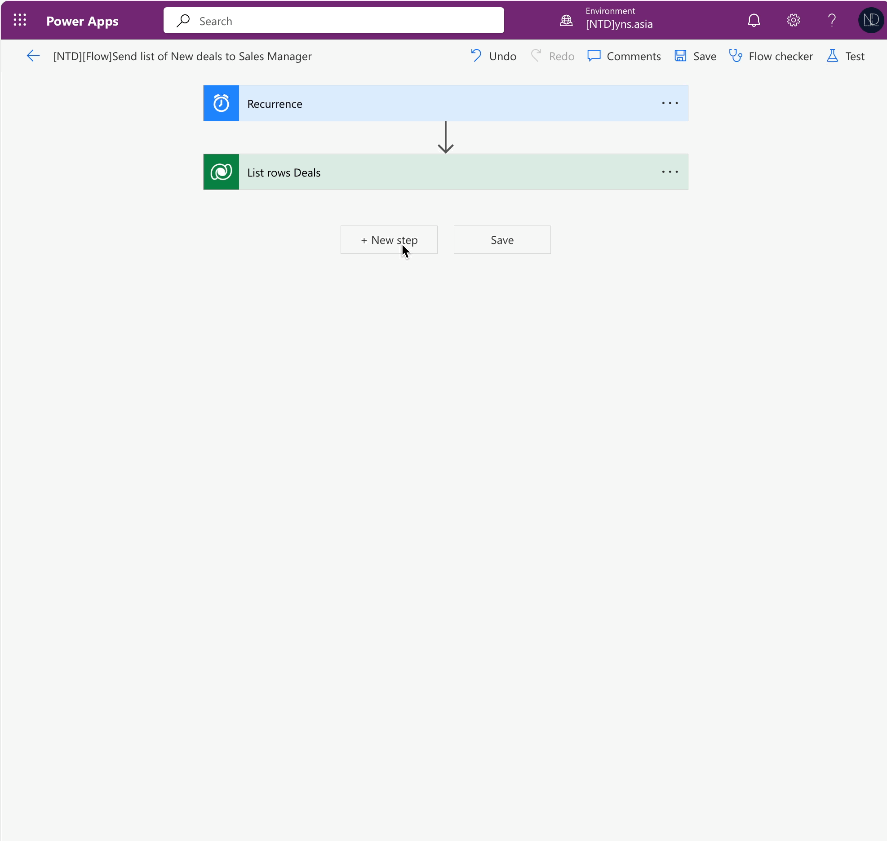

# Power Automate: Add a table in Email

Hi guys, \
Last week, my client approached me with a request: **they wanted the system to be capable of sending email notifications to the sales manager, containing a list of new Deals daily.** (It means the list of Deals has "New" status)

...and I said, "Yes, sure".  -> Now, we will do that.

## My propose: Using Power Automate

The details of my Power Automate:

* Type of Power Automate: **Scheduled.**
* Frequency: **Daily** at 00:05 am
* The flow will filter all **Deal records** that have the **status reason** "**New**"
* Then send this list to the Sales Manager. \
  _&#x46;or instance, I will send it to a specific email: **"dung@ntd.asia"**_
* Using the **Create HTML table {}** action of **Data Operation** is to generate a table from Dataverse records.


My steps:\
_<mark style="color:green;">**Schedule Flow -> Get List rows (from Dataverse) -> Create HTML Table -> Send Email (V2)**</mark>_


First of all, I have the list of _**Active Deals**_ below and I expect the system will send 2 Deals with the **New** Status to my email **"dung@ntd.asia".**

<figure><figcaption><p>List of dealss</p></figcaption></figure>

## Creating Power Automate

In my solution, choose **Cloud Flow** > click **New** to create

<figure><figcaption><p>Scheduled Cloud Flow</p></figcaption></figure>

After creating, I added new step **"List rows"** from "Dataverse" > select my table **Deal** and set **Filter** for this step.

<figure><figcaption><p>List Rows: Deals has New status</p></figcaption></figure>


My sample, I filter Deals has Status Reason = "New"' ==> _<mark style="background-color:orange;">**statuscode eq**</mark>_<mark style="background-color:orange;">**&#x20;**</mark><mark style="background-color:orange;">**1**</mark>


## **\*\*Action: Create HTML Table {}**

In the 3rd step, I added an action <mark style="background-color:green;">**Create HTML Table {}**</mark> in **"Data Operation"**

<figure><figcaption><p>Action: Create HTML table from "List rows Deals" step</p></figcaption></figure>

Run testing and check the Output of step **"Create HTML table".** \
Because I selected the option <mark style="background-color:orange;">**Automatic**</mark> of _**Columns,**_ so all columns of the **Deal** entity will be shown below.

<figure><figcaption><p>The output of step "Create HTML table"</p></figcaption></figure>

Then I edit the option **Column** to <mark style="background-color:orange;">**Custom**</mark>**&#x20;->** and create the custom mapping for the table

<figure><figcaption><p>Custom mapping</p></figcaption></figure>

After using custom mapping, we have the result:

<figure><figcaption><p>The output of step "Create HTML table": Using Custom Mapping</p></figcaption></figure>

## Add step Send Email (V2)

I added the **Send Email (V2)** to the final step. In this step, I used the **Output** of action **"Create HTM table {}"** and added it to the email's body.

<figure><figcaption><p>Final Power Automate</p></figcaption></figure>

## First Testing...

After finishing the first version, I tested and saw the table has no border:

<figure><figcaption><p>1st version -Default table has no border</p></figcaption></figure>

## \*\*Using Compose {} action & Final Flow

Then, I edit my Power Automate and use the action **Compose {}** of **Data Operation.** This action I used this to add **a border** for the table.


I used the expression _**Replace()**_ to take the table and replace the reference to the table object to include a format style.&#x20;


My expression:

```html
replace(body('Create_HTML_table'),'<table>','<table border=”1″>')
```

And the latest version of Power Automate, in the email body, I used the Output of step **"Compose".**

<figure><figcaption><p>Latest version - using "Compose {}" and "Replace ()"</p></figcaption></figure>

-> Running Test and check the result: The table has a border :)

<figure><figcaption><p>The table with border.</p></figcaption></figure>

Thank you and hoping well. :tada:\
**\[NTD]yns.asia**\
<mark style="color:red;">...</mark>[<mark style="color:red;">invite me a cup.</mark>](https://ko-fi.com/ntdyns/?ref=qr\&amp;v=2) :coffee: Thank you. :heart:
