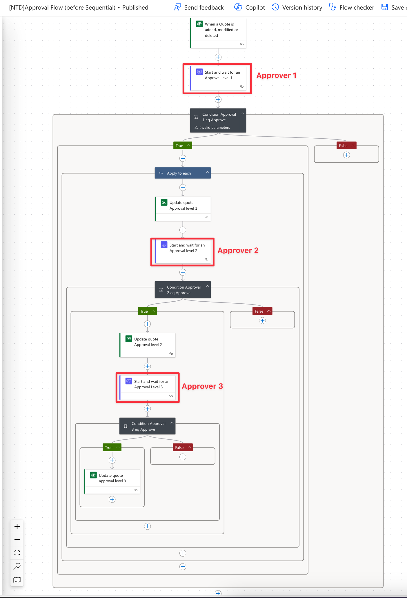
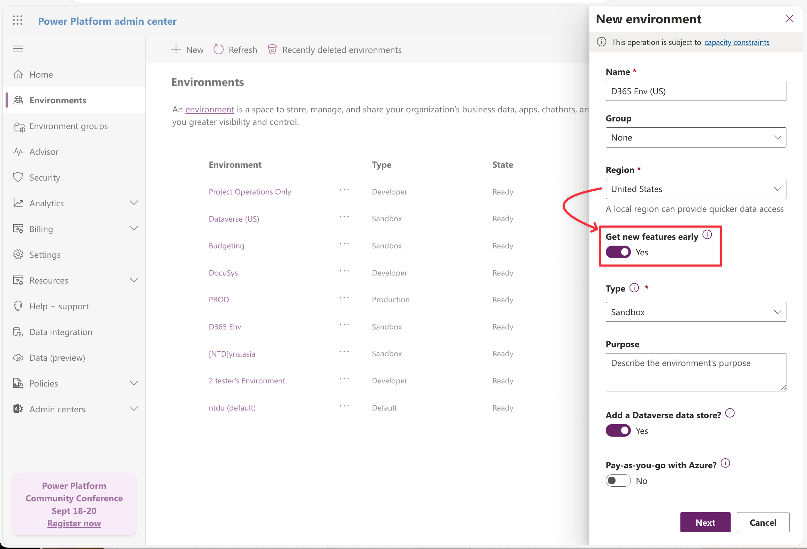
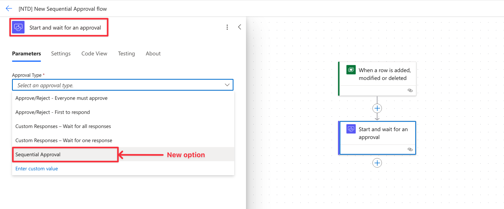
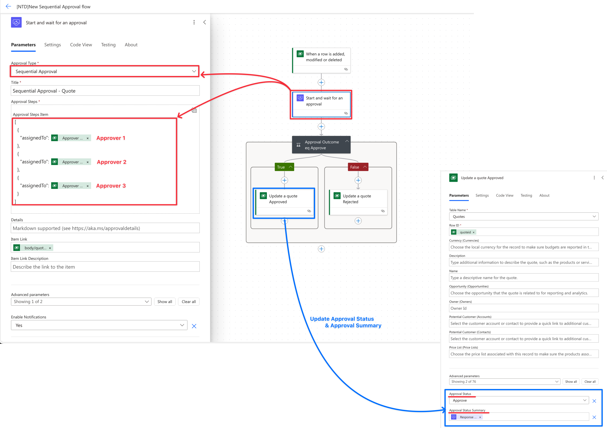
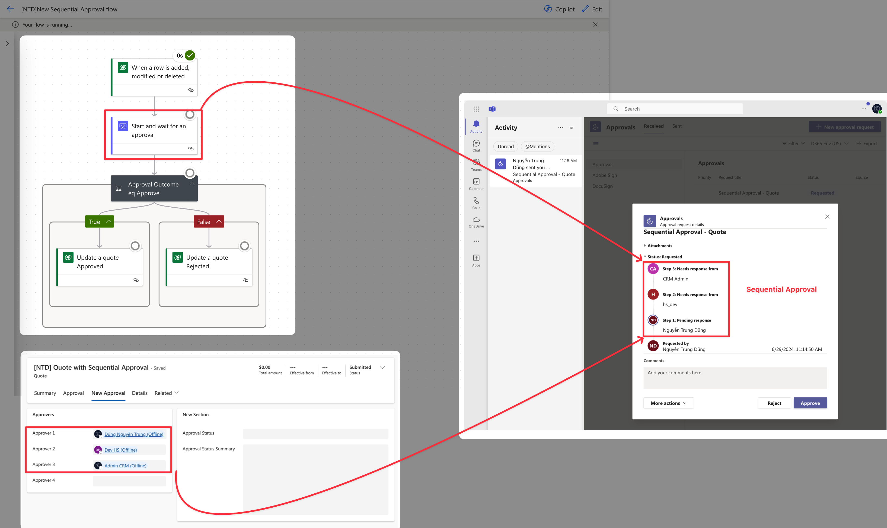
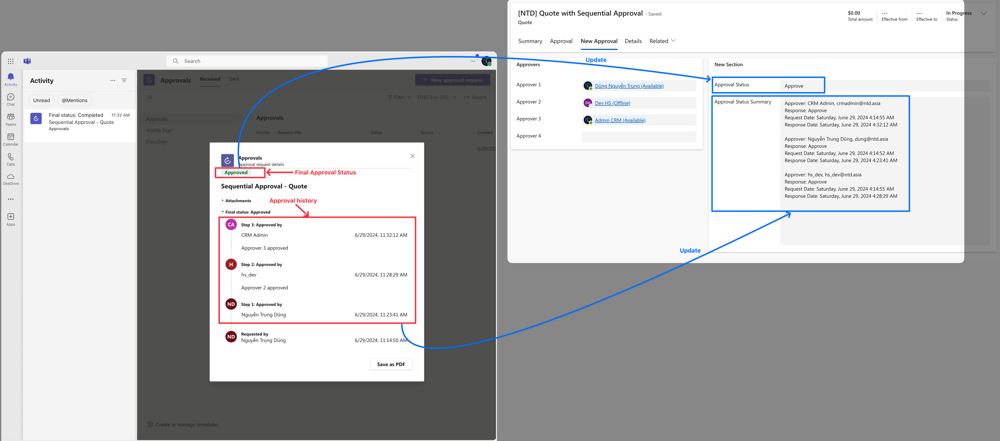

# ✅ Sequential Approval

While browsing the internet, I recently learned about a new approval feature in Power Automate, **Sequential Approval**.

Previously, managing sequential approval in Power Automate required creating numerous action steps, each representing a level of approval. Modifying the approval process necessitated altering every step.

Let's try the Sequential Approval process to see if we can gather some useful ideas for our project.

## Business Case&#x20;

My business case: Quote approval flow.

* The Quote approval level: **3 levels**
* Approval sequence: **Approver 1 -> Approver 2 -> Approver 3**

For the first solution, within the Quote entity, I established three fields: _<mark style="color:blue;">Approver 1, Approver 2</mark>_, and _<mark style="color:blue;">Approver 3</mark>_. Additionally, I created three corresponding fields for each approver: _<mark style="color:blue;">Approval Status, Approval Comment</mark>,_ and _<mark style="color:blue;">Approval Date.</mark>_

<figure><figcaption>
Quote entity - Approval Tab
</figcaption></figure>

## 1. Power Automate: Before the Sequential Approval feature

Before the Sequential Approval feature, I created the power automat for the approval process as below.

<figure><figcaption>
Sequential Approval Flow - before new feature.
</figcaption></figure>

Before this feature, I set up three Approval actions, each corresponding to a different Approver. It takes time and is difficult to control.

## 2. Power Automate: After the Sequential Approval feature

Now, I tried the new early feature **Sequential Approval** in the Approval flow. And the flow is shorter and easy to control.

### _<mark style="color:blue;">2.1 Enable get early feature to get sequential approval feature</mark>_

Currently, this feature is just applied to the Environment which enabled the _**Get new features early**_ option. This option is only enabled when creating a new environment.

<figure><figcaption>
Enable "Get new features early" - It's mean "Release Cyle" of environment.
</figcaption></figure>

Okay... now, back to the Power Automate Maker and try to create a new Sequential Approval Power Automate. In the **Approval action,** you will see the new _Sequential Approval_ option as below.

<figure><figcaption>
New "Sequential Approval" option of "Start and wait for an approval" action step.
</figcaption></figure>

### _<mark style="color:blue;">2.2 My Solution for Sequential Approval Flow</mark>_

#### 2.2.1 Changing on Quote entity:

With the new feature, I have changed the design of the Quote entity:

* I created 2 new fields: _**Approval Status,** and **Approval Summary**_ to update the approval status & history of each Approver.
* Not using fields: Approver 1/2/3 status, Approver 1/2/3 comment, Approval 1/2/3/ date.

And my approval flow also changed as below.

<figure><figcaption>
Changing of Quote entiy
</figcaption></figure>

#### 2.2.2 Sequential Approval Flow

<figure><figcaption>
New Sequential Approval flow
</figcaption></figure>

#### 2.2.3 **Testing**

My Quote record:

<figure><figcaption>
My Quote record - 3 approver
</figcaption></figure>

Testing new sequential flow:

The quote was changed status to **Submitted** and the flow will be triggered to running.

<figure><figcaption>
The Sequential Approval notification on Teams.
</figcaption></figure>

Now I will log in to Teams and update the Approval Status and we will see the final result below.

<figure><figcaption>
Final Approval result
</figcaption></figure>

This feature is so cool. I love that. How about you? Let's try it.. :tada::heart\_eyes:

Thank you & Hoping well!\
**\[NTD]yns.asia**
